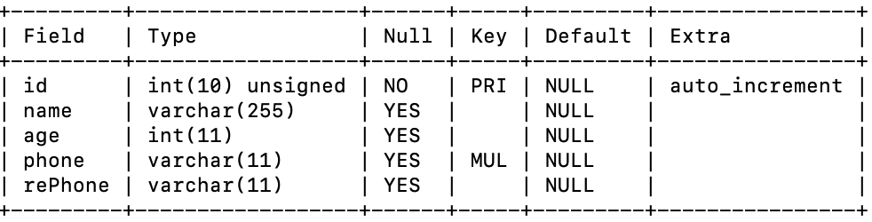
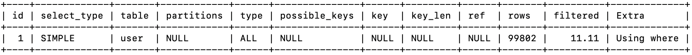
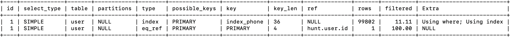
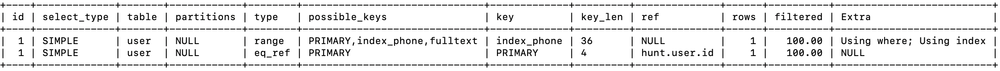
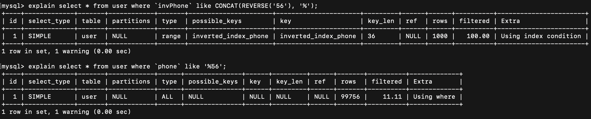

MySQL 模糊搜索 `LIKE` 非常常用，通常可以利用索引和 `‘xxx%’` 配合使用来提高查询的效率（最左前缀原则）。但是对于 `'%xxx%'` 这样的模式匹配却无法利用索引来提高效率。

# 左右 % 导致索引失效

假设我们已经有这样一张表：



我们使用模糊搜索查询手机号中包含 ‘56’ 的字段：

```mysql
explain select * from user where `phone` like '%56%';
```



很明显，MySQL 并不会使用到索引来进行查询。那有没有办法让 MySQL 利用索引查询呢？

# 索引覆盖

这时我们可以使用索引覆盖来让数据库使用索引查询。

```mysql
explain select * from user where id IN (select id from user where `phone` like '%56%');
```



这样，由于我们在第一次查询中只查询了 id 字段，因此会触发索引覆盖，MySQL 则会使用索引进行查询。

但是可以注意到，这里虽然使用了索引进行查询，但是查询的行数并没有变化，还是那么多。而且虽然 key 显示的是 `index_phone` 但是 `possible_keys` 竟然并不包含该索引。

<p style="background-color: #fff5eb; color: black; border-radius: 5px; border: 1px solid #fed4a4;">📍通常 <code>possible_keys</code> 为可能使用的索引，而 <code>key</code> 是实际使用的索引；正常情况下 <code>key</code> 的索引，必然会包含在 <code>possible_keys</code> 中。</p>

我们来看正常情况下，利用索引查询的情况：

```mysql
explain select * from user join (select id from user where `phone` like '56%') as tmp where user.id=tmp.id;
```



可以看到 `possible_keys` 包括很多不同的索引，而实际使用的是 `index_phone`。而这里可以看到搜索的行数也降低了一倍。

<div style="background-color: #fff5eb; color: black; border-radius: 5px; border: 1px solid #fed4a4;"><p>📌因此我们可以得知：</p><p>对于 “%x%” 类型的查询，虽然我们通过索引覆盖使用了索引查询，但是实际上都是使用了顺序扫描的方式查找了数据。</p><p>其不同点可能在于：一个使用主键索引全表扫描，另一个使用普通索引全表扫描；但是两者都没使用树形查找，即没有使用 B+ 树的特性来提升查询性能。</p></div>

通常来说，在对模糊查询的结果准确性要求不是非常高时，可以使用全文索引。

# 反向索引

<u>*反向索引*</u> 通常用于需要快速查找以某个字符串结尾的记录，或者需要快速查找以某个字符串开头的记录的情况。

它并不能解决 ‘%xxx%’ 导致的索引失效问题，但是他可以用来解决一些 ‘%xxx’ 的问题。由于我们建立索引后的查询需要遵循“最左前缀原则”，但是 “%x” 的模式显然不遵循。这时候可能就需要使用反向索引了。

在 MySQL 中创建反向索引（reverse index）的方法是将索引列的值反转，然后再创建索引（创建索引后更新值可能带来索引的维护开销）。

- 首先添加新列用于反向索引，该列的值与原索引列的值方向相反，如果原列为 ‘abcd’，则新列为 ‘dcba’；
- 然后为新列创建索引；
- 在查询时就应该先反转查询的值进行比较

```mysql
alter table user add column `invPhone` varchar(11);	# 创建新的用于反向索引的列
update user set `invPhone`=REVERSE(phone);	# 将新列中的值设置为原索引列的反转值
create index `inverted_index_phone` on user(`invPhone`);	# 创建反向索引
select * from user where `invPhone` like CONCAT(REVERSE('56'), '%');	# 先反转带查询值，然后查询
```



通过 MySQL 语句解释也可以看出，反向索引只需要读取 1000 行记录而普通二级索引则需要全表扫描。这样对于特定邮箱（如“xxx@163.com”）的搜索就可以非常快了，而且由于反向索引的值就是原索引值的反转值，所以当只需要索引列信息和 id 时，可以使用 REVERSE 函数，利用索引覆盖实现更快的查询而不用回表。
