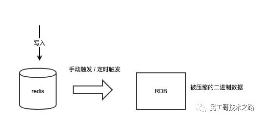
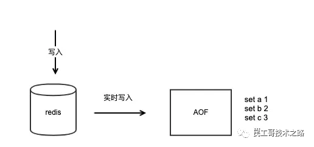

# Redis 入门

本文章参考自[最详细的Redis总结](https://segmentfault.com/a/1190000039832613)及其中相关文章👏

*Redis* 是 C 语言编写的，开源高性能非关系（NoSQL）型键值对数据库。

Redis 可以存储“键”到五种不同类型“值”之间的映射。「键」的类型只能为字符串，「值」可以是字符串、列表、集合、散列表和有序集合。

Redis 是内存数据库，读写速度非常快；因此 Redis 被广泛应用于 *缓存* 方向，每秒可以处理超过 10 万次读写操作，是已知最快的 Key-Value DB。此外，Redis 也经常用来做「分布式锁」，它支持事务、持久化、LUA 脚本、LRU 驱动事件、多种集群方案。

## 1. 优缺点

### 优点 😊

- 读写性能优异，Redis 能够达到读速 110k 次/秒，写速 81k 次/秒；
- 支持数据持久化，支持 AOF 和 RDB 两种持久化方式；
- 支持事务，所有操作都是原子性的，同时支持对几个操作合并后的原子性执行；
- 数据机构丰富，支持 string、Hash、set、list 等数据结构；
- 支持主从复制，主机自动将数据同步到从机，可以读写分离

### 缺点 🙃

- 容量收到物理内存的限制，不能用做海量数据的高性能读写，适合的场景局限在较小数据量的高性能运算上；
- 不具备自动容错和恢复功能，主从宕机都会导致前端部分读写请求失败，需要等待机器重启或手动切换前端IP；
- 主机宕机前如果有部分数据未能及时同步到从机，切换 IP 后会导致「数据不一致」的问题；
- Redis 难以支持在线扩容，在集群容量达到上限时，在线扩容会变的非常复杂；因此运维人员在系统上线时必须保证有足够的空间，但对资源造成了很大的浪费

## 2. 使用场景

- 计数器
  - 对 string 进行自增自减运算，从而实现计数功能；
  - 内存型数据库读写性能非常高，适合频繁读写的计数量
- 缓存
  - 将热点数据放到内存中，设置内存的最大使用量以及淘汰策略来保证缓存的命中率
- 会话缓存
  - 可以统一存储多台应用服务器的会话信息；
  - 当应用服务器不再存储用户的会话信息就不再具有状态，一个用户可以请求任意一个应用服务器，从而更容易实现高可用性以及可伸缩性
- 全页缓存（FPC, Full Page Cache）
  - 除基本会话 token 之外，Redis 还提供简便的 FPC 平台；
  - 如：Magento 提供一个插件使用 Redis 作为全页缓存后段；对 WordPress 用户，Pantheon 支持 wp-redis 插件可以高速加载浏览过的页面
- 查找表
  - 如 DNS 记录就很适合使用 Redis 存储；
  - 与缓存类似，也利用 Redis 的快速查找特性；但是查找表的内容不能失效，而缓存的内容可以失效，因此<mark>缓存不作为可靠的数据来源</mark>
- 消息队列（订阅/发布）
  - list 双向链表，可以通过 lpush/rpush 和 lpop/rpop 写入和读取消息；
  - 最好使用 Kafka/RabbitMQ 等消息中间件
- 分布式锁实现
  - 在分布式场景下，无法使用单机环境环境下的锁对多个节点上的进程进行同步；
  - 可以使用 Redis 自带的 `setnx` 命令实现分布式锁，或者官方提供的 RedLock 分布式锁
- 其他
  - set 可以实现交集、并集等操作，从而实现共同好友等功能；
  - zset 可以实现有序性操作，从而实现排行榜等功能

## 3. 数据类型

[Redis 的 8 大数据类型，写得非常好！](https://mp.weixin.qq.com/s?__biz=MzI0MDQ4MTM5NQ==&mid=2247504617&idx=2&sn=8ab5b6e42a944d86257119b1eb295378&chksm=e918b7f5de6f3ee31d717d19e97c9233ce7094c85450ca3c649087fe37e0840fd2a8b63b89fe&token=1728755471&lang=zh_CN#rd)

## 4. 持久化

Redis 的高可用性主要由「数据持久化」、「主从复制」、「自动故障恢复」和「集群化」来保证。Redis 的主从复制和自动故障恢复都依赖 Redis 持久化相关技术，此外，数据持久化也可以用来做数据备份来保障数据的安全性。

Redis 是内存数据库，为了重用数据（如重启机器、机器故障恢复），或防止系统故障而将数据备份到远程位置，需要将内存数据「持久化」到硬盘上。

Redis 提供了 RDB 和 AOF 两种持久化方法，默认只开启 RDB，当重启时它会优先使用 AOF 文件还原数据集。

- RDB：产生一个数据快照文件；
- AOF：实时追加命令的日志文件

### 4.1. RDB

*RDB* (Redis Database Backup file)，即 Redis 数据备份文件，也称 Redis 数据快照。可以通过执行 `save/bgsave` 命令让 Redis 在本地生成RDB 快照文件，该文件包含整个实例接近完整的数据内容。

<div align="center">
  
</div>
优点 😃

- RDB 文件数据是被压缩写入的，因此文件体积比实例内存更小；
- 当机器宕机恢复时，加载 RDB 文件的速度很快，可以在短时间内恢复文件中的数据

缺点 🙃

- 由于是某时刻的数据快照，因此它的数据并不全；
- 生成 RDB 文件的代价是较大的，它会消耗大量的 CPU 和内存资源

因此，RDB 比较适用于以下场景：

- 主从全量同步数据；
- 数据库备份；
- 对于丢失数据不敏感的业务场景，机器宕机后快速恢复数据

Redis 主从全量同步就是适用 RDB 文件进行的

#### 定时生成 RDB

```python
# 最近15分钟内 至少产生1次写入
save 900 1
# 最近5分钟内 至少产生10次写入
save 300 10
# 最近1分钟内 至少产生10000次写入
save 60 10000
```

如果达到以上任意条件，Redis 就会自动生成新的 RDB 文件，降低 RDB 文件内容于实例数据的差异。

#### Copy On Write

在 Redis 上执行 `save` 和 `bgsave` 命令都可以生成 RDB 文件。但前者是在前台执行的，也就是说在生成 RDB 文件时，**会阻塞整个实例**，在 RDB 未生成之前，任何请求都是无法处理的，对于内存很大的实例，生成 RDB 文件非常耗时，显然这是我们不能接受的。

所以通常我们会选择执行 `bgsave` 让 Redis 在后台生成 RDB 文件，这样 Redis 依旧可以处理客户端请求，不会阻塞整个实例。

但不是说后台生成 RDB 就是没有代价的，Redis 为了实现后台把内存数据的快照写入文件，采用了操作系统提供的 [Copy On Write](../OperatingSystem/写时复制机制.md) 技术。

虽然子进程与父进程共享同一块内存地址空间，但在 fork 子进程时，操作系统需要拷贝父进程的内存页表给子进程，如果整个 Redis 实例内存占用很大，那么它的内存页表也会很大，在拷贝时就会比较耗时，同时这个过程**会消耗大量的 CPU 资源**。在完成拷贝之前父进程也处于阻塞状态，无法处理客户端请求。

fork 执行完之后，子进程就可以扫描自身所有的内存数据，然后把全部数据写入到 RDB 文件中。

之后父进程依旧处理客户端的请求，当在处理写命令时，父进程会重新分配新的内存地址空间，从操作系统申请新的内存使用，不再与子进程共享。这样父子进程的内存就**会逐渐分离**，父进程申请新的内存空间并更改内存数据，子进程的内存数据不受影响。

由此可以看出，在生成 RDB 文件时，不仅消耗 CPU 资源，还有需要占用**最多一倍的内存空间**。

我们在 Redis 执行 info 命令，可以看到 fork 子进程的耗时，可以通过这个耗时来评估 fork 时间是否符合预期。同时我们应该保证 Redis 机器拥有足够的 CPU 和内存资源，并合理设置生成 RDB 的时机。

### 4.2. AOF

AOF 全称为 Append Only File，即「追加日志文件」。与 RDB 不同的是，AOF 中记录的是每个命令的详细信息，包括完整的命令类型、参数等。只要产生写命令就会实时写入到 AOF 文件中。<mark>Redis 会将「命令」转为「协议文本」写入 AOF 文件而非直接将命令写入</mark>。

<div align="center">
  
</div>

``` python
# 开启AOF
appendonly yes
# AOF文件名
appendfilename "appendonly.aof"
# 文件刷盘方式
appendfsync everysec
```

#### 刷盘方式

开启 AOF 后，Redis 将每个写命令记录到文件并持久化，为保证数据文件的安全性，Redis 还提供文件刷盘的时机：

- always：每次写入都刷盘，性能影响最大，占用磁盘 IO 最高，数据安全性最高；
- everysec：每秒刷盘一次，对性能影响较小，节点宕机最多丢失 1s 的数据；
- no：按照操作系统的机制刷盘，对性能影响最小，安全性低，节点宕机丢失的数据量取决于操作系统刷盘机制

AOF 的优点是，文件更新较为及时，比 RDB 保存更完整的数据。在数据恢复时可以恢复尽量完整的数据，降低数据丢失风险。如果同时存在 RDB 和 AOF 文件，Redis 会优先使用 AOF 文件进行数据恢复。

缺点是随着时间推移，AOF 文件越来越大，AOF 文件刷盘会增加磁盘 IO 负担，可能影响性能。

#### AOF 重写

Redis 可以设置在 AOF 文件很大时，自动触发「AOF 重写」。Redis 会扫描整个实例数据，<mark>将数据转为「协议文本」</mark>来重新生成一个 AOF 文件达到瘦身的效果，重写后的大小一定小于等于旧 AOF 文件。但是这个重写过程也需要消耗大量的 CPU 资源。

``` python
# AOF文件距离上次文件增长超过多少百分比则触发重写
auto-aof-rewrite-percentage 100
# AOF文件体积最小多大以上才触发重写
auto-aof-rewrite-min-size 64mb
```

由于 AOF 尽可能降低数据丢失的风险，因此适用于对数据丢失敏感的业务场景，如金钱交易等。

#### 性能影响

如果 AOF 刷盘时机设置为每次写入都刷盘，则每次写命令都要写入文件并刷到磁盘才返回，因此在写入量很大时，会增加 IO 负担。性能与安全不能兼得，虽然 Redis 提供了实时刷盘的机制，但是在真正的场景中使用并不多。

通常来说，运维者会选择“每秒刷盘”这种方式，即能保证良好的写入性能，又能尽可能少的丢失数据（最多 1s 内的数据），做到性能和安全的平衡。

通常，我们需要针对不同的业务场景选择合适的持久化方式，也可以根据 RDB 和 AOF 的优点配合使用。

## 5. 过期键的删除策略

Redis 中有设置时间过期的功能，即对存储在 Redis 的值设置过期时间。Redis 中有三种不同的删除策略：

- 立即删除：为 key 设置过期时间时创建回调事件，过期时自动执行删除 key 的操作；
- 惰性删除：过期后不做处理，每次取值时先检查 key 是否过期，如果过期则删除并返回 nil；否则返回对应值；
- 定时删除：每隔一段时间检查 expires 字典，删除过期的 key

### 立即删除

*立即删除* 能保证内存中数据的最大新鲜度，过期键值将被立即删除，所占内存也随即释放。但「立即删除」对 CPU 不友好，因为删除操作占用 CPU 时间。如果 CPU 恰巧繁忙，这时删除就会给 CPU 造成额外的压力。

Redis 事件处理器对时间时间的保存方式是无序列表，查找下一个 key 的时间复杂度为 O(n)，不适合处理大量的时间事件。

### 惰性删除

*惰性删除* 在数据过期后不会立即删除，而是等下次被使用时被检查到过期并删除。因此惰性删除会浪费内存，数据字典和 expires 字典都要保存该键值对的信息。如日志文件，过期后会在很长时间内访问不到，那么这样就会导致这部分空间的长期浪费。而对于内存数据库来说，这是非常致命的。

### 定时删除

*定时删除* 会每隔一段时间执行一次删除操作。它一方面通过限制删除操作的执行时长和频率来减少对 CPU 的影响；另一方面也有效地减少了因惰性删除带来的内存浪费。

Redis 使用的策略是：惰性删除+定期删除，两者配合使用。

## 6. 数据淘汰策略

Redis 支持设置内存最大使用量，当内存使用超量时，则会实施淘汰策略。它提供了 6 种淘汰策略：

| 策略            | 描述                                                         | 应用场景                                                     |
| --------------- | ------------------------------------------------------------ | ------------------------------------------------------------ |
| volatile-lru    | 从已设置过期时间的数据集中挑选最近最少使用的数据淘汰         | 如果设置了过期时间，且区分冷热数据，推荐使用                 |
| volatile-ttl    | 从已设置过期时间的数据集中挑选将要过期的数据淘汰             | 如果让 Redis 根据 TTL 筛选需要删除的 key，推荐使用           |
| volatile-random | 从已设置过期时间的数据集中任意选择数据淘汰                   | 很少使用                                                     |
| allkeys-lru     | 从所有数据集中挑选最近最少使用的数据淘汰                     | 使用 Redis 缓存数据时，为了提高缓存命中率，需要保存的都是热点数据；将内存最大使用量设置为热点数据占用的内存量，然后启用本策略；<mark>expires 会消耗额外的内存，使用本策略可以高效地利用内存而不再设置过期时间</mark> |
| allkeys-random  | 从所有数据集中任意选择数据进行淘汰                           | 如需要循环读写所有 key，或者各 key 的访问频率差不多，可以使用 |
| noeviction      | 不删除，到达内存最大限制时，如有更多内存需求直接返回错误信息；大多数写命令都会导致更多的内存 | 很少使用                                                     |

作为内存数据库，出于对性能和内存消耗的考虑，<mark>Redis 的淘汰算法实际上并非针对所有 key，而是抽样一小部分并从中选出淘汰 key</mark>。

Redis 4.0 引入了 volatile-lfu 和 allkeys-lfu 淘汰策略，LFU 策略通过统计访问频率，将访问频率最少的键值对淘汰。

我们需要根据系统特征选择合适的淘汰策略，也可以通过命令动态设置淘汰策略，并通过 INFO 命令监控缓存的 miss 和 hit 来进行调优。

淘汰策略内部实现：

1. 客户端执行命令导致 Redis 数据增加，占用更多内存；
2. Redis 检查内存使用量，如果超出限制，根据策略删除部分 key；
3. 继续执行下一条命令，以此类推

## 7. 事务

Redis 通过 `multi, exec, watch` 等命令来实现事务功能。*事务* 提供了一种将多个命令请求打包，然后一次性、按顺序地执行多个命令的机制，并且在事务执行期间，服务器不会中断事务改去执行其他客户端的命令请求。

事务中的多个命令被一次性发送给服务器，而不是一条条发送，可以减少客户端与服务器之间的网络通信次数从而提升性能。

传统关系数据库中，常用 ACID 来检验事务的可靠性和安全性。在 Redis 中，「事务」总是具有原子性（Atomicity）、一致性（Consistency）和隔离性（Isolation）；当 Redis 运行在某种特定的持久化模式下时，事务也具有持久性（Durability）。

Redis 是一个事件驱动的服务。

### 文件事件

服务器通过套接字与客户端或其他服务器进行通信，*文件事件* 就是对套接字操作的抽象。

Redis 基于 Reactor 模式开发了自己的网络事件处理器，使用 IO [多路复用](../OperatingSystem/IO%20多路复用.md)程序来同时监听多个套接字，将到达的事件传送给「文件事件分配器」，分配器会根据套接字产生的事件类型调用相应的事件处理器。

### 时间事件

服务器有一些操作需要在给定时间点执行，时间事件是对这类操作的抽象。

时间事件又分为：

- 定时事件：让一段程序在指定时间内执行一次；
- 周期性时间：让一段程序每隔指定时间就执行一次

目前 Redis 只使用周期性事件，而没有使用定时事件。一个时间事件主要由三个属性组成：

- id：服务器为时间事件创建全局唯一 ID；
- when：毫秒精度的 UNIX 时间戳，记录了事件到达的时间；
- timeProc：时间事件处理器，回调函数

服务器将所有时间事件都放在一个<mark>无序链表</mark>中，每当时间事件执行器运行时，遍历整个链表，查找所有已到达的时间事件并调用相应的事件处理器。

### 事件的调度与执行

服务器需要不断监听文件事件的套接字才能得到待处理的文件事件，但是不能一直监听，否则时间事件无法在规定时间内完成，因此监听时间应该根据距离现在最近的时间事件来决定。

## 8. 哨兵

哨兵💂（Sentinel）可以监听集群中的服务器，并在主服务器进入下线状态时自动从从服务器中选出新的主服务器。

## 9. 分片

分片是将数据划分为多个部分的方法，可以将数据存储到多台机器里面，这种方法在解决某些问题时可以获得线性级别的性能提升。

假设有 4 个 Redis 实例 R0，R1，R2，R3，还有很多表示用户的键 {user:1，user:2，…}，有不同的方式来选择一个指定的键存储在哪个实例中。

最简单的方式是范围分片，例如用户 id 从 0~1000 的存储到实例 R0 中，用户 id 从 1001~2000 的存储到实例 R1 中，等等。但是这样需要维护一张映射范围表，维护操作代价很高。

还有一种方式是哈希分片，使用 CRC32 哈希函数将键转换为一个数字，再对实例数量求模就能知道应该存储的实例。

根据执行分片的位置，可以分为三种分片方式：

- 客户端分片：客户端使用一致性哈希等算法决定键应当分布到哪个节点；
- 代理分片：将客户端请求发送到代理上，由代理转发请求到正确的节点上；
- 服务器分片：Redis Cluster

## 10. 复制

通过使用 `slaveof host port` 命令让一个服务器成为另一个服务器的从服务器。一个从服务器只能有一个主服务器，并且不支持“主主复制”。

链接过程大致如下：

- 主服务器创建快照文件，发送给从服务器，并在发送期间使用缓冲区记录执行的写命令；
- 快找发送完毕后，向从服务器发送存储在缓冲区中的写命令；
- 从服务器丢弃所有旧数据，并载入主服务器发送的快照文件；
- 接受主服务器发送的写命令并执行

随着负载的上升，主服务器可能无法很快地更新所有从服务器，或者重新连接和重新同步从服务器将导致系统超载，这时可以创建一个中间层来分担主服务器的复制工作。中间层的服务器是最上层服务器的从服务器，也是最下层服务器的主服务器。

通常主服务器只用于写数据，从服务器用于读数据，且只能通过主服务器写入数据。这样可以通过“读写分离”来均衡数据库的服务压力。

## 11. Redis 常见问题与解决方案

### 11.1. 缓存雪崩

缓存雪崩是指缓存<mark>同一时间大面积失效</mark>，后面的请求都会落在数据库上，导致数据库段时间内承受大量请求而崩溃。

解决方案 :confetti_ball:

- 缓存数据的过期时间设置随机，防止同一时间大量数据过期的现象发生；
- 一般并发量不是特别高的时候，使用最多的解决方案是加锁排队；
- 给每一个缓存数据增加相应的缓存标记，记录缓存是否失效，如果失效则更新数据缓存

### 11.2. 缓存击穿

缓存击穿是指缓存中没有但数据库中有的数据（一般是缓存时间到期），这时由于并发用户特别多，同时读缓存没读到数据，又同时去数据库去取数据，引起数据库压力瞬间增大，造成过大压力。与缓存雪崩不同的是，<mark>缓存击穿指并发查同一条数据</mark>，缓存雪崩是不同数据都过期了，很多数据都查不到从而查数据库。

##### 解决方案

- 设置热点数据永远不过期；
- 加互斥锁，互斥锁

### 11.3. 缓存穿透

缓存穿透是指<mark>缓存和数据库中都没有的数据</mark>，导致所有的请求都落到数据库上，造成数据库短时间内承受大量请求而崩掉。

##### 解决方案

- 接口层增加校验，如用户鉴权校验，id 做基础校验，id<=0 的直接拦截；
- 从缓存取不到的数据，在数据库中也没有取到，这时也可以将 key-value 对写为 key-null，缓存有效时间可以设置为较短值，如 30 秒（设置太长会导致正常情况也没法使用），这样可以防止攻击用户反复用同一个 id 暴力攻击；
- 采用布隆过滤器，将所有可能存在的数据哈希到一个足够大的 bitmap 中，一个一定不存在的数据会被这个 bitmap 拦截掉，从而避免了对底层存储系统的查询压力

附加

- 对于空间的利用到达了一种极致，那就是 Bitmap 和布隆过滤器 (Bloom Filter)。
- Bitmap：典型的就是哈希表
- 缺点是，Bitmap 对于每个元素只能记录 1bit 信息，如果还想完成额外的功能，恐怕只能靠牺牲更多的空间、时间来完成了。

布隆过滤器（推荐）

- 就是引入了 k(k>1) 个相互独立的哈希函数，保证在给定的空间、误判率下，完成元素判重的过程；
- 它的优点是空间效率和查询时间都远远超过一般的算法，缺点是有一定的误识别率和删除困难；
- Bloom-Filter 算法的核心思想就是利用多个不同的 Hash 函数来解决“冲突”；
- Hash 存在一个冲突（碰撞）的问题，用同一个 Hash 得到的两个 URL 的值有可能相同；为了减少冲突，我们可以多引入几个 Hash，如果通过其中的一个 Hash 值我们得出某元素不在集合中，那么该元素肯定不在集合中；只有在所有的 Hash 函数告诉我们该元素在集合中时，才能确定该元素存在于集合中，这便是 Bloom-Filter 的基本思想；
- Bloom-Filter 一般用于在大数据量的集合中判定某元素是否存在

### 11.4. 缓存预热

缓存预热就是系统上线后，将相关的缓存数据直接加载到缓存系统。这样就可以避免在用户请求的时候，先查询数据库，然后再将数据缓存的问题，用户直接查询事先被预热的缓存数据。

##### 解决方案

- 直接写个缓存刷新页面，上线时手工操作一下；
- 数据量不大，可以在项目启动的时候自动进行加载；
- 定时刷新缓存

### 11.5. 缓存降级

当访问量剧增、服务出现问题（如响应时间慢或不响应）或非核心服务影响到核心流程的性能时，仍然需要保证服务还是可用的。即使是有损服务，系统可以根据一些关键数据进行自动降级，也可以配置开关实现人工降级。

<mark>缓存降级的最终目的是保证核心服务可用，即使是有损的</mark>。而且有些服务是无法降级的（如加入购物车、结算）。

在进行降级之前要对系统进行梳理，看看系统是不是可以丢卒保帅；从而梳理出哪些必须誓死保护，哪些可降级；比如可以参考日志级别设置预案：

- 一般：比如有些服务偶尔因为网络抖动或者服务正在上线而超时，可以自动降级；

- 警告：有些服务在一段时间内成功率有波动（如在95~100%之间），可以自动降级或人工降级，并发送告警；

- 错误：比如可用率低于90%，或者数据库连接池被打爆了，或者访问量突然猛增到系统能承受的最大阈值，此时可以根据情况自动降级或者人工降级；

- 严重错误：比如因为特殊原因数据错误了，此时需要紧急人工降级。

服务降级的目的，是为了防止 Redis 服务故障，导致数据库跟着一起发生雪崩问题。因此，对于不重要的缓存数据，可以采取服务降级策略，例如一个比较常见的做法就是，Redis 出现问题，不去数据库查询，而是直接返回默认值给用户。

### 11.6. 热点数据和冷数据

热点数据，缓存才有价值。对于冷数据而言，大部分数据可能还没有再次访问到就已经被挤出内存，不仅占用内存，而且价值不大。频繁修改的数据，看情况考虑使用缓存。

对于热点数据，比如产品的生日祝福模块，当天的寿星列表，缓存以后可能读取数十万次；某导航产品，将导航信息缓存以后可能读取数百万次。

数据更新前至少读取两次，缓存才有意义。这个是最基本的策略，如果缓存还没有起作用就失效了，那就没有太大价值了。

:star: 但是也存在一些修改频率很高，但是又不得不考虑缓存的场景。比如，读取接口对数据库的压力很大，但是又是热点数据，这个时候就需要考虑通过缓存手段，减少数据库的压力，比如某助手产品的点赞数，收藏数，分享数等是非常典型的热点数据，但是又不断变化，此时就需要将数据同步保存到Redis缓存，减少数据库压力。

#### 缓存热点 key

缓存中的一个 Key (比如一个促销商品)，在某个时间点过期的时候，恰好在这个时间点对这个 Key 有大量的并发请求过来，这些请求发现缓存过期一般都会从后端 DB 加载数据并回设到缓存，这个时候大并发的请求可能会瞬间把后端 DB 压垮。

#### 解决方案

对缓存查询加锁，如果 key 不存在就加锁，然后查 DB 并载入缓存，然后解锁；其他进程如果发现有锁就等待，然后等解锁后返回数据或者进入 DB 查询。