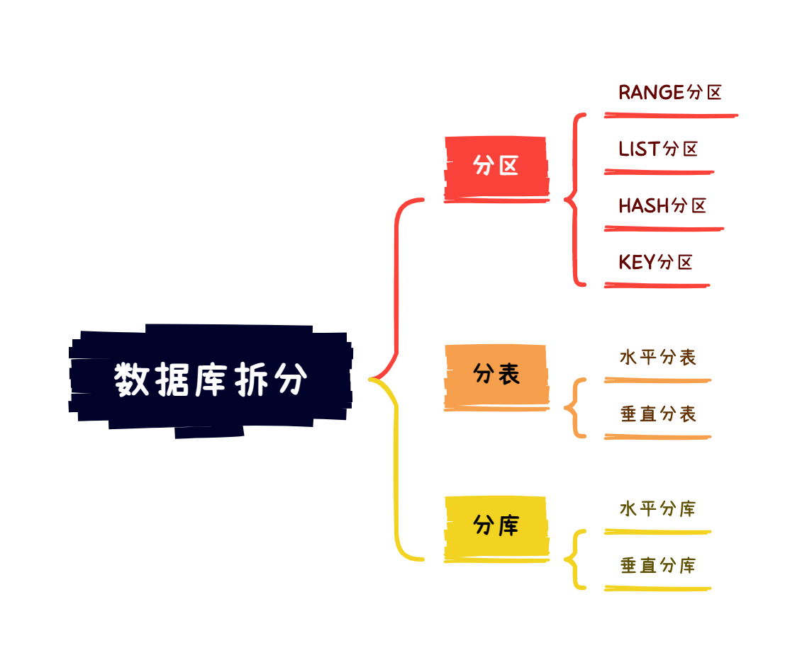

- 分区（Partition）：把一张表的数据分成多个区块，在逻辑上看最终只是一张表，但底层是由多个物理区块组成的；
- 分表：把一张表按一定的规则分解成多个具有独立存储空间的实体表，系统读写时需要根据定义好的规则得到对应的字表明，然后操作它；
- 分库：把一个库拆成多个库，突破库级别的数据库操作 I/O 瓶颈

<p style="background-color: #fff5eb; color: black; border-radius: 5px; border: 1px solid #fed4a4;">🎹目前笔者没有查询到有关分库与<u><i>分片</i></u>（Sharding）之间的区别与联系。分片包括垂直切分（Vertical Sharding）/水平切分（Horizontal Sharding）以及横向扩展（Scale Out）/纵向扩展（Scale Up），更像是一种理论；而分库和分表更像是分片的实现方式。<br/>
<b style="font-size:14px;">Tips：上述都是笔者的个人理解，如有错误请及时指出。</b></p>


# 分区

对一张表分区后，数据还是存储在一张表中，只是<mark>数据和索引的物理存储位置发生改变</mark>。一张表的所有分区都要存在一个数据库下。

<p style="background-color: #fff5eb; color: black; border-radius: 5px; border: 1px solid #fed4a4;">💡不管我们如何进行分区，我们总需要根据一定的方法按行划分。我们将用于数据划分的某一列或者多列称为<i><u>分区键</u></i>。显而易见地，<b>分区键必须是唯一键</b>，即通过分区键可以唯一区分两行记录。</p>

MYSQL 主要支持以下几种类型分区：

- RANGE 分区：基于一个给定区间边界，得到若干个<mark>连续区间</mark>范围，按照分区键的落点，把数据分配到不同的分区；
- LIST 分区：类似 RANGE 分区，区别在于 LIST 是按照<mark>离散</mark>的点进行划分，基于枚举的值进行分区；
- HASH 分区：基于用户自定义的表达式返回值，根据分区数量取模，完成数据记录在分区间的分配
- KEY 分区：类似 HASH 分区，区别在于 KEY 分区只支持计算一列或多列，且使用 MySQL 服务器提供的自身的哈希函数

## RANGE 分区

在实际应用中，RANGE 分区用的更多。行数据基于给定连续区间的列值放入分区，但是当插入的数据不属于某一个分区时则会抛出异常。

RANGE 分区主要用于日期列的分区，也可以用 INT 类型的列来存时间戳作为分区键。如果使用唯一索引中的 DATE 类型，优化器只能对 `YEAR(), TO_DAYS(), TO_SECONDS(), UNIX_TIMESTAMP()` 这类函数进行优化选择。

RANGE 分区通过 `PARTITION BY RANGE(expr)` 实现，其中 “expr” 可以是某个列值，或者基于某个列值返回一个整数的表达式（如 `YEAR(date)`），但是不能返回 NULL。

```mysql
CREATE TABLE employees (...)
PARTITION BY RANGE (YEAR(separated)) (
    PARTITION p0 VALUES LESS THAN (1991),
    PARTITION p1 VALUES LESS THAN (1996),
    PARTITION p2 VALUES LESS THAN (2001),
    PARTITION p3 VALUES LESS THAN MAXVALUE
);
# 或者是以下方式
PARTITION BY RANGE (YEAR(separated))
PARTITIONS 4 (
    PARTITION p0 VALUES LESS THAN (1991),
    PARTITION p1 VALUES LESS THAN (1996),
    PARTITION p2 VALUES LESS THAN (2001),
    PARTITION p3 VALUES LESS THAN MAXVALUE;
);
```

如果查询语句不指定分区，则会串行查询所有分区。mysql 本身不会对单一的 sql 做多线程处理，mysql 8.0 中新加了 innodb_parallel_read_threads 选项，但只对聚集索引有效，不会对分区进行并行处理。

假设我们现在删除员工表中的旧数据，使用 `ALTER TABLE employees DROP PARTITION p0;` 即可，对于具有大量行的表，这比运行 `DELETE FROM employees WHERE YEAR(separated) <= 1990` 要有效得多。

## 其他分区

其他分区方法也类似，这里给出使用方式，不再赘述。

### LIST 分区

```mysql
CREATE TABLE xxx (...)
PARTITION BY LIST(expr)
    PARTITION pNorth VALUES IN (3,5,6,9,17),
    PARTITION pEast VALUES IN (1,2,10,11,19,20),
    PARTITION pWest VALUES IN (4,12,13,14,18),
    PARTITION pCentral VALUES IN (7,8,15,16)
);
```

如果插入的行中的分区键没有在 LIST 枚举的值中出现，则会报错。

### HASH 分区

```mysql
CREATE TABLE xxx (...)
PARTITION BY HASH(expr)
PARTITIONS 4;
```

其中 expr 同样可以是一个返回一个整数的表达式，或者仅仅是字段类型为整型的某个字段。此外，你还需要添加一个 `PARTITIONS num` 子句，表示将要被分割成分区的数量。

### KEY 分区

```mysql
CREATE TABLE xxx (...)
PARTITION BY LINEAR KEY (col)
PARTITIONS 3;
```

MySQLCluster 使用函数 MD5() 来实现 KEY 分区；对于使用其他存储引擎的表，服务器使用其自己内部的哈希函数，这些函数是基于与 PASSWORD() 相同的运算法则。

## 子分区

子分区是分区表中每个分区的再次分割。如：

```mysql
CREATE TABLE xxx (...)
PARTITION BY RANGE(expr1)
SUBPARTITION BY HASH(expr2)
SUBPARTITIONS 2
(
    PARTITION p0 VALUES LESS THAN (1990),
    PARTITION p1 VALUES LESS THAN (2000),
    PARTITION p2 VALUES LESS THAN MAXVALUE
);
```

该表有 3 个 RANGE 分区，每个分区又进一步被分为两个子分区。

<p style="background-color: #fff5eb; color: black; border-radius: 5px; border: 1px solid #fed4a4;">📍对于通过 RANGE 或 LIST 分区的表可以再使用 HASH 或 KEY 子分区，这也被称为<i><u>复合分区</u></i>（composite partitioning）。为了对个别子分区制定选项，可以使用 <code>SUBPARTITION</code> 子句来明确定义。</p>

```mysql
CREATE TABLE xxx (...)
PARTITION BY TANGE(expr1)
SUBPARTITION BY HASH(expr2)
(
  PARTITION p0 VALUES LESS THAN (1990)
  (
    SUBPARTITION s0,
    SUBPARTITION s1
  ),
  PARTITION p1 VALUES LESS THAN (2000)
  (
    SUBPARTITION s2,
    SUBPARTITION s3
  ),
  PARTITION p2 VALUES LESS THAN MAXVALUE
  (
    SUBPARTITION s4,
    SUBPARTITION s5
  )
);
```

但是需要注意语法：

1. 每个分区必须有相同数量的子分区；
2. 如果在一个分区表上的某个分区使用 `SUBPARTITION` 来明确定义子分区，那就必须定义其他分区的子分区。

子分区可以用于非常大的表，在多个磁盘间分配数据和索引。你可以使用 `DATA DIRECTORY` 和 `INDEX DIRECTORY` 表示数据和索引的物理文件的存放目录。

```mysql
CREATE TABLE ts (id INT, purchased DATE)
PARTITION BY RANGE(YEAR(purchased))
SUBPARTITION BY HASH(TO_DAYS(purchased))
(
    PARTITION p0 VALUES LESS THAN (1990)
    (
        SUBPARTITION s0a
            DATA DIRECTORY = '/disk0'
            INDEX DIRECTORY = '/disk1',
        SUBPARTITION s0b
            DATA DIRECTORY = '/disk2' 
            INDEX DIRECTORY = '/disk3'
    ),
    PARTITION p1 VALUES LESS THAN (2000)
    (
        SUBPARTITION s1a
            DATA DIRECTORY = '/disk4/data' 
            INDEX DIRECTORY = '/disk4/idx',
        SUBPARTITION s1b
            DATA DIRECTORY = '/disk5/data' 
            INDEX DIRECTORY = '/disk5/idx'
    ),
    PARTITION p2 VALUES LESS THAN MAXVALUE
    (
        SUBPARTITION s2a,
        SUBPARTITION s2b
    )
);
```

# 分表

在 MYSQL 5.1 分区功能出现以前，想要解决超大表问题，只能采用分表操作。由于该问题十分常见，MYSQL 后来才自带了分区功能以达到相同的效果。

<div style="background-color: #ebf5ff; color: black; border-radius: 5px; border: 1px solid #a4d4fe;">
📌分表与分区的区别：
<ol><li>分区只是一张表中的数据和索引的存储位置发生改变，分表则是将一张表分为多张表，包括表结构都是多份；</li><li>分区和分表均无法突破数据库层面，不论如何划分，都只能分配到同一库中，因此库级别的数据库操作还是有 IO 瓶颈；</li><li>分表重点在于存取数据时提高并发能力，而分区则侧重突破磁盘读写能力；</li><li>分区只能代替水平分表的功能，无法取代垂直分表的功能</li></ol></div>


## 水平分表

针对数据量巨大的单张表，按照某种规则（如 RANGE，HASH 取模等）切分到多张表中。但是这些表还是存储在同一个库中，因此库级别的操作仍然有 IO 瓶颈。

## 垂直分表

基于列属性进行表的拆分。这通常是由于表设计不合理，因此需要拆分。如一张表存储学生、老师、课程、成绩信息，则应该拆分为学生表、课程表、成绩表。

# 分库

分库将原本存储在一个库中的数据存储到多个库中。数据库的数据量不一定是可控的，在未进行分库和分表的情况下，库中的表会越来越多，相应的数据操作 CRUD 开销也会增大；此外，一台服务器上的资源有限，最终数据库能承载的数据量和处理能力都将遭遇瓶颈。

分库可以在物理实现上分成多个服务器，不同的分库在不同服务器上，可以解决单机性能过低的问题。

## 垂直分库

按照业务模块切分，将不同模块的表切分到不同数据库中。

如电商系统可以划分为：用户库、商品库、订单库。这些都可以作为独立数据，可以独立变更，接触耦合。

# 分库分表

分库分表是分库和分表的结合使用。它也分为水平和垂直切分。在实际场景🎬中应该使用哪种切分方式，需要综合项目的业务类型进行考虑。

<div style="background-color: #ebf5ff; color: black; border-radius: 5px; border: 1px solid #a4d4fe;">
🎨如何选择水平和垂直切分？
<p>如果数据库的各项业务逻辑划分清晰，耦合度低，则使用垂直切分必然是首选；如果数据库中的表并不多，但是单表数据量大，或者热度很高，则应该选择水平切分。</p><p>使用水平切分可以实现热点数据与冷数据的分离，由于冷数据很可能在很长一段时间都不再使用，水平切分可以划分热点和冷数据，使得对热点数据的查询性能更高。</p></div>

## 分库分表存在的问题

### 事务问题

执行分库分表后，数据存储到不同的库上，事务管理会出现困难。如果依赖数据库本身的分布式事务管理功能则会付出高昂代价；如果由应用程序协助控制，则形成程序逻辑上的事务，造成编程方面的负担。

### 跨库跨表 JOIN

执行分库分表后，可能会将原本逻辑关联性很强的数据划分到不同的表或库中。这时表的关联会受到限制，我们无法 JOIN 不同分库的表，也无法 JOIN 分表粒度不同的表。这就使得原本一次查询可以完成的业务可能需要多次查询。

### 额外的数据管理负担和数据运算压力

额外的数据管理负担，最显而易见的就是数据的定位问题和数据的增删改查的重复执行问题。这些都可以通过应用程序解决，但必然引起额外的逻辑运算。

例如，对于一个记录用户成绩的用户数据表 userTable，业务要求查出成绩最好的 100 位。在进行分表之前，只需一个 order by 语句就可以搞定；但是在进行分表之后，将需要 n 个 order by 语句，分别查出每一个分表的前 100 名用户数据，然后再对这些数据进行合并计算，才能得出结果。

# 原文

[MySQL的分区/分库/分表总结](https://zhuanlan.zhihu.com/p/342814592)

[Mysql分表和分区的区别、分库和分表区别](https://cloud.tencent.com/developer/news/243312)

[一文搞懂MySQL数据库分库分表](https://juejin.cn/post/6974939567053307918)

[MySql分表、分库、分片和分区](https://learnku.com/articles/58202)

[MySql分表、分库、分片和分区](https://learnku.com/articles/58202)