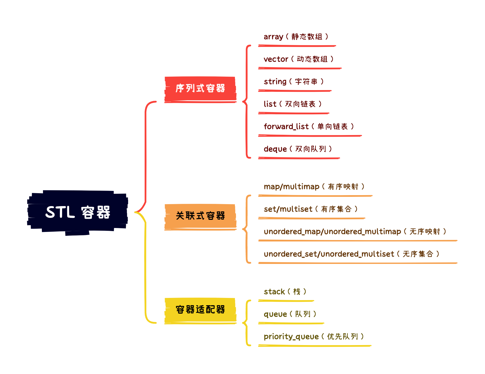
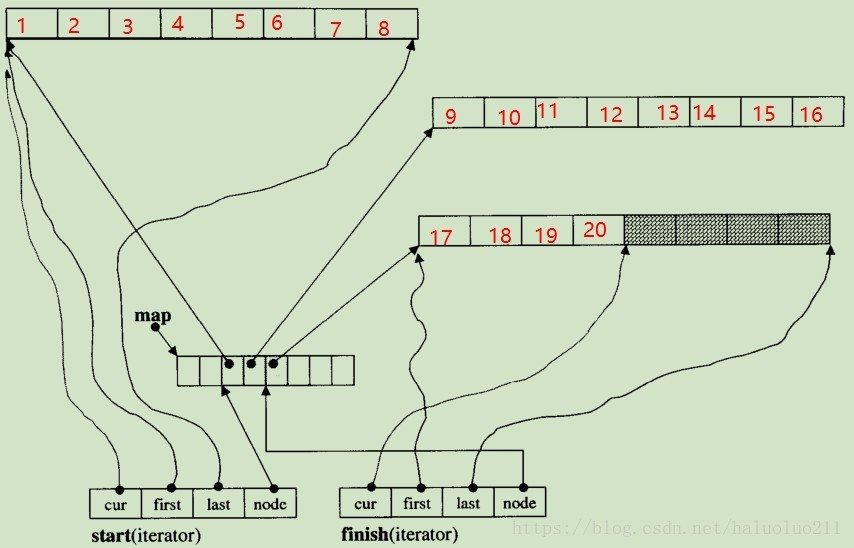

# C++ STL

STL（Standard Template Library）是 C++ 的标准模板库，提供一套功能强大的 C++ 模板。它是 C++ 中开发人员的智慧结晶，免除了大量重复工作，提供模板类和函数。这些模板类和函数可以实现多种流行和常用的算法和数据结构。STL 包括六大组件：

- 容器：包含各种数据结构，用于存放数据；
- 算法：包含各种常用算法；
- 迭代器：扮演容器和算法之间的粘合剂，所有容器都附带有自己专属的迭代器，「原生指针」也是一种迭代器；
- 仿函数：行为类似函数，可以作为算法的执行策略；如果一个类将“()”运算符重载为成员函数，这个类就称为函数对象类，该类的对象就是「仿函数」；
- 适配器：可以使一个类的接口适配成为用户指定的形式，让原本不能协同工作的两个类一起工作，容器、迭代器和函数都有适配器；
- 空间配置器（分配器）：负责空间的配置与管理，实现了动态空间配置、空间管理和空间释放

六大组件可以相互交互：

- 「容器」通过「分配器」获得数据存储空间；
- 「算法」通过「迭代器」处理存储容器中的内容；
- 「仿函数」可以协助「算法」完成不同“策略”的变化；
- 「适配器」可以修饰「仿函数」

## 核心组件

| 组件               | 描述                                                         |
| ------------------ | ------------------------------------------------------------ |
| 容器（Container）  | 用来管理某一类对象的集合，提供了各种不同类型的容器           |
| 算法（Algorithm）  | 算法作用于容器，提供执行各种操作的方式，包括初始化赋值、排序、搜索等 |
| 迭代器（Iterator） | 迭代器用于连接容器和算法，迭代器用于遍历对象集合中的“元素”，集合可能是容器或容器的子集 |

## 容器

容器是一些用于存储数据的集合的实现，采用了运用最广泛的一些数据结构。容器主要包括「序列式容器」、「关联容器」和「容器适配器」。

<div align="center">
  
</div>
*序列式容器* 中的每个元素都有固定位置，取决于插入的时间和位置；*关联式容器* 的元素位置取决于特定的数据结构和排序准则，与插入顺序无关；*容器适配器* 是在原有容器上进行了进一步的封装，使其符合某些接口、使用方式或功能。

### array

*array* 是一种存储相同类型的线性数据结构。它与原生数组十分相似，它的大小是固定的，使用连续的内存块来存储元素。

array 在实际的编程中非常少见，因为它无法进行自动扩容，可以直接使用原生数组代替。

### vector :star2:

*vector* 是动态线性数组，可以随机存取，并自动扩容，是最常用的容器之一。vector 在尾部增加和删除元素非常快速，而在中间位置和头部添加元素则会引起大量元素移动，因此比较费时。

vector 继承于 `struct _Vector_base`。该结构体声明了一个结构体 `struct _Vector_impl`。结构体 `_Vector_impl` 中保存了三个非常重要的成员变量：`_M_start,_M_finish,_M_end_of_storage`，分别保存容器的开始位置、结束位置以及申请内存空间结尾的下一个位置。

在基类中，无参构造并没有申请内存空间，因为 STL 保证性能优先原则；而无参构造如果申请了动态空间但在后面没有使用，那么申请和释放动态内存的行为就增加了时间和空间的浪费。

如果我们一开始调用了无参构造函数，在插入第一个元素时，vector 会先申请 10 个单位的空间（初始空间可能跟 C++ 版本和所处操作系统有关）。在后续再次插入时，如果超出容器申请的空间，则重新申请原来 2/1.5 倍的空间并将原有的数据拷贝到新申请的空间中。

因此，<mark>如果能够确定 vector 必然会被使用时，推荐在声明时制定元素的大致个数，以避免不必要的动态申请内存影响性能</mark>。

**使用注意事项** ⚠️

在使用迭代器遍历 vector 容器的过程中，如果使用 `erase` 函数进行删除，则当前迭代器会失效，应该通过 `erase` 的返回值获得正确迭代器；如果遍历过程中出现了扩容等内存变动，则需要重新获得迭代器；但是在 vector 中插入数据（不导致扩容）并不会使迭代器失效，因为插入完成后 `insert` 函数会将当前的迭代器重新赋值。

当从 vector 中删除元素时，它并不会释放内存。通过 `resize,clear` 等方法删除元素并不会导致内存空间的释放，而只会将之前保存的元素进行析构。

如果你想释放 vector 的内存空间，可以尝试通过 `swap,shrink_to_fit` 函数。如 `vector<int>().swap(v)` 可以将 `v` 与一个空向量进行交换以实现清空的效果，而 `vector<int>()` 是一个右值，在执行完命令后就会被立刻释放，因此会将从 `v` 交换得到的内存空间动态释放；C++11 中提供了 `shrink_to_fit` 函数来释放未使用的内存。

### list

*list* 的底层实现视具体标准而定，使用双向链表/循环双向链表实现，因此它不支持随机访问。如果使用双向链表实现，则会保存两个指针，分别指向头部空白节点和尾部空白节点；如果使用循环双向链表，则会保存一个指针指向头部的空白节点。

### forward_list

在仅需单向遍历的场景中，list 节点中的前向指针会占用大量空间。因此为了减少内存消耗和提高遍历效率，STL 也提供了 forward_list。

*forward_list* 底层使用单向链表实现，因此会消耗更少的内存，遍历也更简单高效。

### deque

*deque* 即双端队列，支持随机访问和首位两端快速插入及删除元素。

deque 由多段定长的连续空间构成，如果有需要则申请一段定长连续空间，“串接”在整个队列的开头或结尾。deque 的任务是在这些分段的定长连续空间上维护其整体连续的假象，并提供随机存取的接口。

它消除了重新配置、复制、释放的代价，但是也引入了复杂的迭代器结构。deque 采用 map（不是 STL map 容器）作为主控。这是一小段连续空间，其中的每个元素都是指针，指向另一段较大的定长连续线性空间，称为「缓冲区」。缓冲区才是 deque 的存储空间主体（此处假设缓冲区定长为 8）：

<div align="center">
  
</div>

在 deque 中插入数据，如果缓冲区不足，则会触发分配新的「缓冲区」。

#### deque 迭代器

deque 迭代器设计的难点在于，当迭代器遇到缓冲区的边缘，应该视前进或后退而定，可能需要调用 `set_node` 函数跳到某个缓冲区。

deque 迭代器的主要变量定义如下：

```c++
template <class T, class Ref, class Ptr, size_t buff_size>
struct __deque_iterator{
    typedef __deque_iterator<T, T&, T*, buff_size>              iterator;
    typedef __deque_iterator<T, const T&, const T*, buff_size>  const_iterator;

    static size_t buffer_size() {return __deque_buf_size(buff_size, sizeof(T)); }

    typedef T                  value_type;
    typedef size_t             size_type;
    typedef ptrdiff_t          difference_type;
    typedef T**                map_pointer;

    typedef __deque_iterator   self;
    // 保持与容器的联结
    T* cur;       // 此迭代器所指之缓冲区中的现行元素
    T* first;     // 此迭代器所指之缓冲区的头
    T* last;      // 此迭代器所指之缓冲区的尾（含备用空间）

    //由于，指针肯会遇到缓冲区边缘，因此需要跳到下一个缓冲区
    //于是需要指向 map 找到下一个缓冲区地址
    map_pointer node;    // 指向管控中心
}
```

缓冲区的大小计算如下：

```c++
/* iterator中需要缓冲区的长度，当n不等于0,return n,表示buffer size使用指定值
 *如果n==0，buffer size使用默认值
 */
inline size_t __deque_buf_size(size_t n, size_t sz) {
    return n != 0 ? n : (sz < 512 ? size_t(512 / sz) : size_t(1));
}
```

`set_node` 函数跳到一个缓冲区：

```c++
void set_node(map_pointer new_node){
    node = new_node;
    first = *new_node;
    last = first + buffer_size();
}
```

重载 * 运算符返回引用

```c++
reference operator*() const {
  return *cur;
}
```

重点是迭代器的加减运算符重载，因为指针的前进后退可能涉及到缓冲区的切换：

- 后置 ++ 直接调用前置 ++；
- 前置 ++ 返回的是引用，后置 ++ 返回的是临时对象

```c++
// prefix forms of increment
self& operator++(){
    ++cur;
    if (cur == last){      //如果已达所在缓冲区的尾端
        set_node(node + 1);//切换至下一个节点(缓冲区)
        cur = first;
    }
    return *this;
}

//上面返回的是引用，下面返回的是临时对象
self operator++(int){ // postfix forms of increment
    self tmp = *this;
    ++*this;//直接调用postfix forms
    return tmp;
}

self& operator--(){
    if(cur == first){      // 已经是缓冲区的头部
        set_node(node - 1);//切换至前一个节点
        cur = last;
    }
    --cur;
    return *this;
}

self operator--(int){
    self tmp = *this;
    --*this;
    return tmp;
}

// 指针的正负方向移动
self& operator+=(difference_type n){ // n 可正可负
    difference_type offset = n + (cur - first);
    if(offset >=0 && offset < difference_type(buffer_size())){
        // 同一个缓冲区内
        cur += n;
    }else{//不在同一个缓冲区
        difference_type node_offset;
        if (offset > 0){
            node_offset = offset / difference_type(buffer_size());
        }else{
            node_offset = -((-offset - 1) / difference_type(buffer_size())) - 1 ;
        }
        // 切换至正确的缓冲区
        set_node(node + node_offset);
        // 切换至正确的元素
        cur = first + (offset - node_offset * buffer_size());
    }

    return *this;
}

// 返回的不是引用，因此const函数
self operator+(difference_type n)const{
    self tmp = *this;
    return tmp+= n; //直接调用operator +=
}

self& operator-=(difference_type n){
    return *this += -n; //直接调用operator +=
}
// 返回的不是引用，因此const函数
self operator-(difference_type n)const{
    self tmp = *this;
    return tmp -= n; //直接调用operator +=
}

// 随机存取，迭代器可以直接跳跃 n 个距离
// 调用上面的 operator + ,以及operator *
reference operator[](difference_type n)const{
    return *(*this + n);
}

bool operator==(const self& rhs)const{
    return cur == rhs.cur;
}

bool operator!=(const self& rhs)const{
    return !(*this == rhs);
}

bool operator<(const self& rhs)const{
    return (node == rhs.node) ? (cur < rhs.cur) : (node < rhs.node);
}
```

#### deque 相关成员函数及类定义

deque 的主要类型定义如下：

```c++
template<typename T, size_t buff_size = 0>
class deque{
    public:
        typedef T             value_type;
        typedef T&            reference;
        typedef T*            pointer;
        typedef __deque_iterator<T, T&, T*, buff_size> iterator;

        typedef size_t        size_type;
        typedef ptrdiff_t     difference_type;

    protected:
        typedef pointer*      map_pointer;

        // 实际的数据存储，分配器
        typedef allocator<value_type> dataAllocator;
        // map指针分配器
        typedef allocator<pointer>    mapAllocator;

    private:  //数据成员
        iterator start;
        iterator finish;

        map_pointer map;
        size_type   map_size;
}
```

其中核心成员包括：

- 两个迭代器：start、finish，一个 map 节点以及 map 的大小；
- map 是一个动态数组，当缓冲区不够时会扩容，因此有 mapAllocator 以及 dataAllocator 缓冲区分配迭代器以及 back/front 函数

```c++
iterator begin(){return start;}
iterator end(){return finish;}

reference front(){
    //调用的是__deque_iterator的 operator*
    // 返回 start的成员 *cur
    return *start;
}

reference back(){
    // 此处不能直接 *finish
    iterator tmp = finish;
    --tmp; //调整使之指为
    return *tmp; //返回的是finish 的 *cur
}

reference operator[](size_type n){
    return start[n];
}
```

构造函数：

```c++
template<typename T, size_t buff_size>
deque<T, buff_size>::deque(size_t n, const value_type& value){
    fill_initialize(n, value);
}

template<typename T, size_t buff_size>
void deque<T, buff_size>::fill_initialize(size_t n, const value_type& value){
    // 分配map以及缓冲区的内存
    // 初始化好对应的指针位置
    create_map_and_nodes(n);

    // 缓冲区每个节点设置初始值
    for (map_pointer cur = start.node; cur < finish.node; ++cur) {
        initialized_fill_n(*cur, buffer_size(), value);
    }

    // 最后一个缓冲区设置有所不同(因为尾端可能有备用空间，不必设置初始值)
    initialized_fill_n(finish.first, finish.cur - finish.first, value);
}

template<typename T, size_t buff_size>
void deque<T, buff_size>::create_map_and_nodes(size_t num_elements){
    // 需要的节点数 = (元素个数 / 缓冲区可以容纳的元素个数) + 1
    // 如果刚好整除，会多配置一个节点
    size_type num_nodes = num_elements / buffer_size() + 1;

    // 一个map要管理的节点的个数。最少是 8 个，最多是"所需节点数 + 2"
    map_size = std::max(initial_map_size(), num_nodes + 2);
    // 申请配置对应的数组
    map = mapAllocator::allocate(map_size);

    // tmp_start，tmp_finish 指向 map的最中央区域
    // 保持在最中央使得两端的开展区域一样
    map_pointer tmp_start  = map + (map_size - num_nodes) / 2;
    map_pointer tmp_finish = tmp_start + num_nodes - 1;

    // 为map每个节点配置缓冲区
    for (map_pointer cur = tmp_start; cur <= tmp_finish; ++cur) {
        *cur = dataAllocator::allocate(buffer_size());
    }

    // 设置 start 和 end 两个迭代器
    start.set_node(tmp_start);
    start.cur = start.first;

    finish.set_node(tmp_finish);
    finish.cur = finish.first + num_elements % buffer_size();
}
```

**最后**，为什么 stack 默认使用 deque 而不是 vector 作为底层容器呢？原因在于，随着容器元素增加，对于 vector 而言可能涉及到申请新的空间、复制原有元素以及释放旧空间，但是 deque 则没有这个问题，因此使用 deque 的效率更高。

### map/multimap/set/multiset

这几类容器的底层数据结构都是红黑树，只是调用的接口不同。

我们首先来了解以下 map/multimap。

```c++
template <class ..._Args>
pair<iterator, bool> emplace(_Args&& ...__args) {
    return __tree_.__emplace_hint_unique(__p.__i_, _VSTD::forward<_Args>(__args)...);
}
```

*map* 的 `emplace` 函数会调用「红黑树」的 `__emplace_unique` 函数，使用 key-value 构造一个节点并<mark>尝试</mark>插入到红黑树中。当该 key 对应的节点已经存在，则不做操作；否则将新构造的节点加入红黑树中。

如源代码所示，`emplace` 函数还会返回一个 `pair<map::iterator, bool>` 类型的返回值，它的 first 是指向新节点 key 对应的节点的迭代器，second 表示参数传入的 key-value 是否被插入红黑树。

```c++
template <class ..._Args>
iterator emplace(_Args&& ...__args) {
    return __tree_.__emplace_multi(_VSTD::forward<_Args>(__args)...);
}
```

而 *multimap* 的 `emplace` 函数则会调用红黑树的 `__emplace_multi` 函数，使用 key-value 构造一个节点并插入红黑树。该函数会找到“第一个大于 key 值的位置”并插入，然后返回该节点对应的迭代器。

set/multiset 与 map/multimap 调用相同的接口，包括 `insert` 函数 最终都会调用到 `__emplace_unique` 或 `__emplace_multi` 函数。他们的区别在于 set/multiset 中保存的 key 和 value 是相同的值。

### unoredered_{map/multimap/set/multiset}

与上述 set/multiset/map/multimap 类似，只是它们采用的数据结构不同。这些数据结构使用哈希表存储，哈希表提供了相同的 `__emplace_unique` 或 `__emplace_multi` 函数接口。哈希表中的 `__emplace_unique` 也是只要发现该 key 存在则插入；`__emplace_multi` 中如果发现 key 值存在，则重新计算哈希值然后放入表中。

### stack/queue

这两个类都是容器适配器，其底层容器是 deque，相关的接口也是对 deque 接口的调用，因此了解 deque 就足够了。

```c++
template <class _Tp, class _Container = deque<_Tp> > class stack;
template <class _Tp, class _Container = deque<_Tp> > class queue;
```

它们的模板定义中，`_Tp` 是值的类型，`_Container` 就是底层容器的类型，它们默认都是使用 deque，当然你也可以选择修改。

### priority_queue

*优先队列* 也是一个容器适配器，底层使用「堆」来进行容器顺序的调整。

```c++
template <class _Tp, class _Container = vector<_Tp>,
          class _Compare = less<typename _Container::value_type> >
class priority_queue
```

「优先队列」的底层容器默认使用 vector 容器，并使用 `less<Tp>` 策略。优先队列默认使用「大根堆」，具体是「大根堆」还是「小根堆」由策略决定，你可以通过将策略改为 `greater<Tp>` 来将其改为「小根堆」的模式。

> 堆其实就是一种树的数据结构，要求满足父节点大于/大于所有子树节点的值。当父节点的值大于所有子树节点的值时就称为「大根堆」；否则称为「小根堆」

接下来我们看一下最重要的添加操作，这里只看 `emplace` 函数，因为 `push` 和 `emplace` 函数的操作相似。它们的区别在于 `emplace` 通常会直接通过接收的参数构造一个实例并加入容器；而 `push` 函数则会将传入的实例加入容器。

```c++
template <class _Tp, class _Container, class _Compare>
template <class... _Args>
inline
void
priority_queue<_Tp, _Container, _Compare>::emplace(_Args&&... __args) {
    c.emplace_back(std::forward<_Args>(__args)...);
    std::push_heap(c.begin(), c.end(), comp);
}
```

它会首先将元素添加到容器的尾部，然后使用 `push_heap` 函数来调整「堆」的结构，使其符合「大根堆」或「小根堆」的特性。其中 `push_heap` 函数最终会调用到 `__sift_up` 函数，即实际调整「堆」结构的函数。

```c++
template <class _AlgPolicy, class _Compare, class _RandomAccessIterator>
void __sift_up(_RandomAccessIterator __first, _RandomAccessIterator __last, _Compare&& __comp,
        typename iterator_traits<_RandomAccessIterator>::difference_type __len) {
  using value_type = typename iterator_traits<_RandomAccessIterator>::value_type;

  // 开始进行结构调整（假设使用默认的 vector 存储数组）
  if (__len > 1) {
    // 得到刚插入节点的父节点的迭代器
    __len = (__len - 2) / 2;
    _RandomAccessIterator __ptr = __first + __len;

    // 查看新插入节点与父节点是否满足「根堆」的性质
    if (__comp(*__ptr, *--__last)) {
      value_type __t(_IterOps<_AlgPolicy>::__iter_move(__last));
      // 如果不满足，则交换父节点和子节点的位置
      // 使当前子树满足「根堆」的性质
      do {
        *__last = _IterOps<_AlgPolicy>::__iter_move(__ptr);
        __last = __ptr;
        if (__len == 0)
          break;
        // 获取父节点的父节点，准备进行更上一层结构的调整
        __len = (__len - 1) / 2;
        __ptr = __first + __len;
      } while (__comp(*__ptr, __t));// 依然不满足性质；
      															// 循环调整直至满足

      *__last = std::move(__t);
    }
  }
}
```

然后，我们继续看 `pop` 函数会做什么操作：

```c++
template <class _Tp, class _Container, class _Compare>
inline
void
priority_queue<_Tp, _Container, _Compare>::pop() {
    std::pop_heap(c.begin(), c.end(), comp);
    c.pop_back();
}
```

首先它会调用 `pop_heap` 函数将元素从堆这一<mark>逻辑结构</mark>中移除，然后再从容器中推出最后一个元素。

```c++
template <class _AlgPolicy, class _Compare, class _RandomAccessIterator>
inline void __pop_heap(_RandomAccessIterator __first, _RandomAccessIterator __last, _Compare& __comp,
    typename iterator_traits<_RandomAccessIterator>::difference_type __len) {
  _LIBCPP_ASSERT(__len > 0, "The heap given to pop_heap must be non-empty");

  using _CompRef = typename __comp_ref_type<_Compare>::type;
  _CompRef __comp_ref = __comp;

  using value_type = typename iterator_traits<_RandomAccessIterator>::value_type;
  
  // 开始准备弹出元素
  if (__len > 1) {
    // 记录堆顶部元素，即 root
    value_type __top = _IterOps<_AlgPolicy>::__iter_move(__first);
    // __floyd_sift_down 将从堆的顶部开始，找到最大的子节点
    // 与父节点进行替换，然后逐层递推来填补父节点的空缺
    // 这样会导致最后一个用于替换父节点的节点出现空缺，
    // 返回该空缺节点
    _RandomAccessIterator __hole = std::__floyd_sift_down<_AlgPolicy>(__first, __comp_ref, __len);
    --__last;

    if (__hole == __last) {
      // 如果是最后的节点出现空缺，则直接使用保存的
      // 顶部元素值进行替换
      *__hole = std::move(__top);
    } else {
      // 否则同样使用最后的节点填补空缺，但是这可能
      // 导致「堆」的结构被破坏，因此使用
      // __sift_up 函数进行结构的调整
      *__hole = _IterOps<_AlgPolicy>::__iter_move(__last);
      ++__hole;
      *__last = std::move(__top);
      std::__sift_up<_AlgPolicy>(__first, __hole, __comp_ref, __hole - __first);
    }
  }
}
```

该函数首先，使用 `__floyd_sift_down` 逐层更新父节点，即从子节点中挑选出最大值替换父节点，然后由下一层的节点填补子节点的空缺；之后将使用最后一个节点来填补最后一层的空缺；如果有必要则使用 `__sift_up` 来调整结构。

整体完成了一件事：<mark>将优先级最高的元素置换到容器的末尾，并保证剩余元素依然保持「根堆」的性质不变</mark>。

## 参考

[超详细STL之基于源码剖析vector实现原理及注意事项](https://segmentfault.com/a/1190000040103598)

[STL deque源码实现及分析](https://cloud.tencent.com/developer/article/1338355)