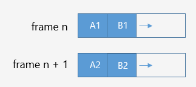
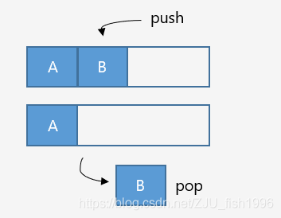

# 深入 C++ 内存管理

:point_right:本文引自[深入C++内存管理](https://blog.csdn.net/zju_fish1996/article/details/108858577)。:point_left:

通常变量的分配位置都是由系统来管理的，调用者只需要考虑变量的**生命周期**等相关内容即可，而无需关心变量的**具体布局**。而对引擎开发而言，开发者必须对内存有更为精细的管理。

## 1. 基础概念

### 1.1. 内存布局


<center>内存分布（可执行映像）（图片引自博客，下同）</center>

如图描述了 C++ 内存分布。

- Code Segment（代码区），也称 Text Segment，存放可执行程序的机器码（汇编中通常为 .text 段）。
- Data Segment（数据区），存放已初始化的全局和静态变量、常量数据（如字符串常量等）。
- BSS（Block started by symbol），存放未初始化的全局和静态变量，默认为 0。
- Heap（堆），从低地址向高地址增长，用于程序动态分配的内存。
- Stack（栈），从高地址向低地址增长，由编译器自动管理分配，用于存储程序中的局部变量、函数参数值、返回值等。

### 1.2. 函数栈

可执行程序载入内存后，系统会保留一些空间，即堆栈。堆主要用于动态分配的内存（默认情况），栈区主要存储函数以及局部变量等（包括 main 函数）。一般而言，栈的空间远小于堆的空间。

当调用函数时，可以<mark>理解为</mark>系统将一块连续内存（栈帧）压入栈中（通过移动栈顶ESP和栈底EBP指针实现）；函数返回时，栈帧弹出。

该连续内存中包含如下数据（按照入栈顺序）：

- 函数参数（规定由主调函数从右向左压入，不同的系统采用的规则不同。如 IOS 在寄存器够用的情况下会通过寄存器传参，否则通过内存压栈传参。:sweat_smile:）
- 函数返回地址（汇编 call 指令完成）
- 压入主调函数栈底指针和一些局部变量、CPU 计数器数据备份（由被调函数完成）


<center>函数压栈</center>

### 1.3. 全局变量

当全局、静态变量未初始化的时候，被记录在 BSS 段。处于 BSS 段的变量默认值为 0，因此 BSS 段内部无需存储大量零值，而只需记录字节数即可。

系统载入可执行程序后，将 BSS 段的数据载入数据段，并将内存初始化为 0，在调用程序入口 main 函数。对于已经初始化了的全局、静态变量而言，则一直存储于数据段。

### 1.4. 内存对齐

对于 int、double 等基本数据类型，它们占用的内存大小是一致的。然而对于结构体而言，如果我们使用 `sizeof` 计算其大小，则会发现可能大于结构体内所有成员大小的总和，这是由于结构体内部成员进行了内存对齐。

#### 为什么需要内存对其

:one: 内存对齐使数据读取更高效

在硬件设计上，数据读取的处理器只能从地址为k的倍数的内存处开始读取数据。这种读取方式相当于将内存分为了多个"块“，假设内存可以从任意位置开始存放的话，数据很可能会被分散到多个“块”中，处理分散在多个块中的数据需要移除首尾不需要的字节，再进行合并，非常耗时。

为了提高数据读取的效率，程序分配的内存并不是连续存储的，而是按首地址为k的倍数的方式存储；这样就可以一次性读取数据，而不需要额外的操作。


<center>读取非对齐内存的过程</center>

:two: 在某些平台下，不进行内存对齐会导致崩溃。

#### 内存对齐的规则

定义有效对齐值为结构体中最宽成员和编译器、用户指定对齐值中较小的那个

1. 结构体起始地址为有效对齐值的整数倍
2. 结构体总大小为有效对齐值的整数倍
3. 结构体第一个成员偏移值为 0，之后成员的偏移值为 min\{ 有效对齐值，自身大小 \}的整数倍，相当于每个成员要进行对齐，整个结构体也需要对齐。

```c++
struct A {
    int i;
    char c1, c2;
};

struct B {
    char c1;
    int i;
    char c2;
};

int main() {
    cout << sizeof(A) << endl;	// 8
    cout << sizeof(B) << endl;	// 12
    return 0;
}
```


<center>内存排布示例</center>

### 1.5. 内存碎片

程序的内存往往不是紧凑连续排布的，而是存在着许多碎片。我们根据碎片产生的原因把碎片分为内部碎片和外部碎片两种类型：

:one: 内部碎片：系统分配的内存大于实际所需的内存（由于对齐机制）
:two: 外部碎片：不断分配回收不同大小的内存，由于内存分布散乱，较大内存无法分配


<center>内部碎片和外部碎片</center>

为了提高内存的利用率，我们有必要减少内存碎片，具体的方案将在后文重点介绍。

### 1.6. 继承类布局

#### 继承

如果一个类继承自另一个类，那么它自身的数据位于父类之后。

#### 含虚函数的类

如果当前类包含虚函数，则会在类的最前端占用4字节以存储虚表指针（vptr），它指向一张虚函数表（vtable）。虚函数表中包含当前类的所有虚函数指针。

### 1.7. 字节序 Endianness

大于一个字节的值被称为多字节量，多字节量存在高位有效字节和低位有效字节 (关于高位和低位，我们以十进制的数字来举例，对于数字 482 来说，4 是高位，2 是低位），微处理器有两种不同的顺序处理高位和低位字节的顺序：

- 小端（little_endian)：低位有效字节存储于较低的内存位置
- 大端（big_endian)：高位有效字节存储于较低的内存位置

我们是用的PC默认是小端方式存储。


<center>大小端排布</center>

一般情况下，多字节量的排列顺序对编码没有影响。但如果要考虑跨平台的一些操作，就有必要考虑到大小端的问题。如下图，ue4 引擎使用了 `PLATFORM_LITTLE_ENDIAN` 宏定义，在不同平台下对数据做特殊处理（内存排布交换，确保存储时的结果一致）。


<center>ue4针对大小端对数据做特殊处理（ByteSwap.h)</center>

### 1.8. POD 类型

在 C++，如果我们的类中包含指针或者容器，由于指针或容器的内存是单独管理的，因此内存一般都不是连续的。

```c++
class A {
    std::vector<int> data;
    bool bValid;
    float* floatData;
};
 
int main() {
    A a[10];
    return 0;
}
```

如上，我们定义的数组 a 内存排布就是不连续的。

我们把那些类型平凡（trivial)，标准布局（standard-layout）的类型，称为 POD 类型。

类型平凡意味着在对象存储定义的时候就已经完成了对象的生存期，无需构造函数；标准布局意味着它的内存是有序排布的。

在编写程序时，一些频繁引用的仅用于记录信息的数据结构，如果能够设计为 POD 类型，能够提高程序的效率。

## 2. 操作系统

### 2.1. SIMD

SIMD (Single Instruction Multiple Data)，用一个指令并行地对多个数据进行运算，是 CPU 基本指令集的扩展。

例 1：处理器的寄存器通常是 32 位或者 64 位的，而图像的一个像素点可能只有 8 bit，如果一次只能处理一个数据比较浪费空间；此时可以将 64 位寄存器拆成 8 个 8 位寄存器，就可以并行完成 8 个操作，提升效率。

例 2：SSE 指令采用 128 位寄存器，我们通常将 4 个 32 位浮点值打包到 128 位寄存器中，单个指令可完成 4 对浮点数的计算，这对于矩阵/向量操作非常友好（除此之外，还有 Neon/FPU 等寄存器）


<center>SIMD并行计算</center>

### 2.2. 高速缓存

一般来说 CPU 以超高速运行，而内存速度慢于 CPU，硬盘速度慢于内存。

当我们把数据加载内存后，要对数据进行一定操作时，会将数据从内存载入 CPU 寄存器。考虑到 CPU 读/写主内存速度较慢，处理器使用了高速的缓存（Cache），作为内存到 CPU 的中介。


引入 L1 和 L2 缓存后，CPU 和内存之间的将无法进行直接的数据交互，而是需要经过两级缓存（目前也已出现 L3 缓存）。

CPU 请求数据：如果数据已经在缓存中，则直接从缓存载入寄存器；如果数据不在缓存中（缓存命中失败），则需要从内存读取，并将内存载入缓存中。

CPU 写入数据：有两种方案，(1) 写入到缓存时同步写入内存（write through cache）(2) 仅写入到缓存中，有必要时再写入内存（write-back）

为了提高程序性能，则需要尽可能避免缓存命中失败。一般而言，遵循尽可能地集中连续访问内存，减少”跳变“访问的原则（locality of reference)。这里其实隐含了两个意思，一个是内存空间上要尽可能连续，另外一个是访问时序上要尽可能连续。像节点式的数据结构的遍历就会差于内存连续性的容器。

### 2.3. 虚拟内存

虚拟内存，也就是把不连续的物理内存块映射到虚拟地址空间（virtual address space)。使内存页对于应用程序来说看起来是连续的。一般而言，出于程序安全性和物理内存可能不足的考虑，我们的程序都运行在虚拟内存上。这意味着，每个程序都有自己的地址空间，我们使用的内存存在一个虚拟地址和一个物理地址，两者之间需要进行地址翻译。

#### 缺页

在虚拟内存中，每个程序的地址空间被划分为多个块，每个内存块被称作页，每个页的包含了连续的地址，并且被映射到物理内存。并非所有页都在物理内存中，当我们访问了不在物理内存中的页时，这一现象称为缺页，操作系统会从磁盘将对应内容装载到物理内存；当内存不足，部分页也会写回磁盘。

在这里，我们将 CPU，高速缓存和内存存视为一个整体，统称为 DRAM。由于 DRAM 与磁盘之间的读写也比较耗时，为了提高程序性能，我们依然需要确保自己的程序具有良好的“局部性”——在任意时刻都在一个较小的活动页面上工作。

#### 分页

当使用虚拟内存时，会通过 MMU 将虚拟地址映射到物理内存，虚拟内存的内存块称为页，而物理内存中的内存块称为页框，两者大小一致，DRAM 和磁盘之间以页为单位进行交换。

简单来说，如果想要从虚拟内存翻译到物理地址，首先会从一个 TLB（Translation Lookaside Buffer) 的设备中查找，如果找不到，在虚拟地址中也记录了虚拟页号和偏移量，可以先通过虚拟页号找到页框号，再通过偏移量在对应页框进行偏移，得到物理地址。为了加速这个翻译过程，有时候还会使用多级页表，倒排页表等结构。

### 2.4. 置换算法

到目前为止，我们已经接触了不少和“置换”有关的内容：例如寄存器和高速缓存之间，DRAM 和磁盘之间，以及 TLB 的缓存等。这个问题的本质是，我们在有限的空间内存储了一些快速查询的结构，但是我们无法存储所有的数据，所以当查询未命中时，就需要花更大的代价，而所谓置换，也就是我们的快速查询结构是在不断更新的，会随着我们的操作，使得一部分数据被装在到快速查询结构中，又有另一部分数据被卸载，相当于完成了数据的置换。

常见的置换有如下几种：
- 最近未使用置换（NRU）：出现未命中现象时，置换最近一个周期未使用的数据。

- 先入先出置换（FIFO)：出现未命中现象时，置换最早进入的数据。
  
- 最近最少使用置换（LRU)：出现未命中现象时，置换未使用时间最长的数据。

## 3. C++语法

### 3.1. 位域（Bit Fields）

表示结构体位域的定义，指定变量所占位数。它通常位于成员变量后，用[声明符：常量表达式]表示。（[参考资料](https://docs.microsoft.com/en-us/cpp/cpp/cpp-bit-fields?view=vs-2019)）声明符是可选的，匿名字段可用于填充（仅适用于微软）。

以下是 ue4 中 Float16 的定义：

```c++
struct
{
#if PLATFORM_LITTLE_ENDIAN
    uint16	Mantissa : 10;
    uint16	Exponent : 5;
    uint16	Sign : 1;
#else
    uint16	Sign : 1;
    uint16	Exponent : 5;
    uint16	Mantissa : 10;			
#endif
} Components;
```

`struct Components`整体只占用两个字节，它将不同的 bit 位分给不同的变量。

### 3.2. new和placement new

new 是 C++ 中用于动态内存分配的运算符，它主要完成了以下两个操作：

a. 调用 operator new() 函数，动态分配内存。

b. 在分配的动态内存块上调用构造函数，以初始化相应类型的对象，并返回首地址。

当我们调用 new 时，会在堆中查找一个足够大的剩余空间，分配并返回；当我们调用 delete 时，则会将该内存标记为不再使用，而指针仍然指向原来的内存。

#### new的语法

```c++
::(optional) new (placement_params)(optional) ( type ) initializer(optional)
```

:small_orange_diamond: 一般表达式

`p_var = new type(initializer); // p_var = new type{initializer};`

:small_blue_diamond: 对象数组表达式

```c++
p_var = new type[size]; // 分配
delete[] p_var; // 释放
```

:small_orange_diamond: 二维数组表达式

```c++
auto p = new double[2][2];
auto p = new double[2][2]{ {1.0,2.0},{3.0,4.0} };
```

:small_blue_diamond: 不抛出异常的表达式

`new (nothrow) Type (optional-initializer-expression-list)`

默认情况下，如果内存分配失败，new 运算符会选择抛出 std::bad_alloc 异常，如果加入 nothrow，则不抛出异常，而是返回 nullptr。

:small_orange_diamond: 占位符类型（自动推导类型）

我们可以使用 placeholder type（auto/decltype）指定类型：

`auto p = new auto('c');`

:small_blue_diamond: 带位置的表达式（placement new）

可以指定在哪块内存上构造类型。

它的意义在于我们可以利用 placement new 将内存**分配**和**构造**这两个模块分离（后续的 allocator 更好地践行了这一概念），这对于编写内存管理的代码非常重要，比如当我们想要编写内存池的代码时，可以预申请一块内存，然后通过 placement new 申请对象，一方面可以避免频繁调用系统new/delete带来的开销，另一方面可以自己控制内存的分配和释放。

预先分配的缓冲区可以是堆或者栈上的，一般按字节 (char) 类型来分配，这主要考虑了以下两个原因：

1. 方便控制分配的内存大小（通过 sizeof 计算即可）
2. 如果使用自定义类型，则会调用对应的构造函数。但是既然要做分配和构造的分离，我们实际上是不期望它做任何构造操作的，而且对于没有默认构造函数的自定义类型，我们是无法预分配缓冲区的。

```c++
// an example
class A {
private:
	int data;
public:
	A(int indata) 
		: data(indata) { }
	void print() {
		cout << data << endl;
	}
};
int main() {
	const int size = 10;
	char buf[size * sizeof(A)]; // 内存分配
	for (size_t i = 0; i < size; i++) {
		new (buf + i * sizeof(A)) A(i); // 对象构造
	}
	A* arr = (A*)buf;
	for (size_t i = 0; i < size; i++) {
		arr[i].print();
		arr[i].~A(); // 对象析构
	}
	// 栈上预分配的内存自动释放
	return 0;
}
```

和数组越界访问不一定崩溃类似，这里如果在未分配的内存上执行 placement new，可能也不会崩溃。

:small_orange_diamond: 自定义参数表达式

当我们调用 new 时，实际上执行了 operator new 运算符表达式，和其它函数一样，operator new 有多种重载，如上文中的 placement new，就是 operator new 以下形式的一个重载：


<center>placement new的定义</center>

 新语法（C++17）还支持带对齐的 operator new，调用示例：

`auto p = new(std::align_val_t{ 32 }) A;`

#### new 的重载

在 C++ 中，我们一般说 new 和 delete 动态分配和释放的对象位于自由存储区 (free store)，这是一个抽象概念。默认情况下，C++ 编译器会使用堆实现自由存储。

前文已经提及了 new 的几种重载，包括数组，placement，align 等。 如果我们想要实现自己的内存分配自定义操作，我们可以有如下两个方式：

- 编写重载的 operator new，这意味着我们的参数需要和全局 operator new 有差异。
- 重写 operator new，根据名字查找规则，会优先在申请内存的数据内部/数据定义处查找 new 运算符，未找到才会调用全局 ::operator new()。

需要注意的是，如果该全局 operator new 已经实现为 inline 函数，则我们不能重写相关函数，否则无法通过编译，如下：

```c++
// Default placement versions of operator new.
inline void* operator new(std::size_t, void* __p) throw() { return __p; }
inline void* operator new[](std::size_t, void* __p) throw() { return __p; }
 
// Default placement versions of operator delete.
inline void  operator delete  (void*, void*) throw() { }
inline void  operator delete[](void*, void*) throw() { }
```

但是，我们可以重写如下 nothrow 的 operator new：

```c++
void* operator new(std::size_t, const std::nothrow_t&) throw();
void* operator new[](std::size_t, const std::nothrow_t&) throw();
void operator delete(void*, const std::nothrow_t&) throw();
void operator delete[](void*, const std::nothrow_t&) throw();
```

#### 为什么说 new 是低效的:question:

- 一般来说，操作越简单，意味着封装了更多的实现细节。new 作为一个通用接口，需要处理任意时间、任意位置申请任意大小内存的请求，它在设计上就无法兼顾一些特殊场景的优化，在管理上也会带来一定开销。
- 系统调用带来的开销。多数操作系统上，申请内存会从用户模式切换到内核模式，当前线程会被 block，上下文切换将会消耗一定时间。
- 分配可能是带锁的。这意味着分配难以并行化。

### 3.3. alignas 和 alignof

不同的编译器一般都会有默认的对齐量，一般都为 2 的幂次。在 C 中，我们可以通过预编译命令修改对齐量：`#pragma pack(n)`。在内存对齐篇已经提及，我们最终的有效对齐量会取「结构体最宽成员」和「编译器默认对齐量」（或我们自己定义的对齐量）中较小的那个。

#### alignas

用于指定对齐量，可以应用于类/结构体/ union /枚举的声明/定义；非位域的成员变量的定义；变量的定义（除了函数参数或异常捕获的参数）；

alignas 会对对齐量做检查，对齐量不能小于默认对齐，如下面的代码，struct U,V,W 的对齐设置是错误的：

```c++
struct alignas(8) S {
    // ...
};
 
struct alignas(1) U {
    S s;
};

struct alignas(2) V {
	int n;
};

struct alignas(3) W { };
```

正确使用例：

```c++
// every object of type sse_t will be aligned to 16-byte boundary
struct alignas(16) sse_t
{
    float sse_data[4];
};
 
// the array "cacheline" will be aligned to 128-byte boundary
alignas(128)
char cacheline[128];
```

#### alignof operator

返回类型的 std::size_t。如果是引用，则返回引用类型的对齐方式，如果是数组，则返回元素类型的对齐方式：

```c++
struct Foo {
    int i;
    float f;
    char c;
};
 
struct Empty { };
 
struct alignas(64) Empty64 { };
 
int main() {
    std::cout << "Alignment of" "\n"
                 "- char          :"    << alignof(char)    << "\n"   // 1
                 "- pointer       :"    << alignof(int*)    << "\n"   // 8
                 "- class Foo     :"    << alignof(Foo)     << "\n"   // 4
                 "- empty class   :"    << alignof(Empty)   << "\n"   // 1
                 "- alignas(64) Empty:" << alignof(Empty64) << "\n";  // 64
}
```

#### std::max_align_t

一般为 16bytes，malloc 返回的内存地址，对齐大小不能小于 max_align_t。

### 3.4. allocator

当我们使用 C++ 的容器时，我们往往需要提供两个参数，一个是容器的类型，另一个是容器的分配器。其中第二个参数有默认参数，即 C++ 自带的分配器（allocator)：

`template < class T, class Alloc = allocator<T> > class vector; // generic template`

我们可以实现自己的 allocator，只需实现分配、构造等相关的操作。在此之前，我们需要先对 allocator 的使用做一定的了解。new 操作将内存分配和对象构造组合在一起，而 allocator 的意义在于将内存分配和构造分离。这样就可以分配大块内存，而只在真正需要时才执行对象创建操作。

假设我们先申请 n 个对象，再根据情况逐一给对象赋值，如果内存分配和对象构造不分离可能带来的弊端如下：

1. 我们可能会创建一些用不到的对象；
2. 对象被赋值两次，一次是默认初始化时，一次是赋值时；
3. 没有默认构造函数的类甚至不能动态分配数组；

使用 allocator 之后，我们便可以解决上述问题。

#### 分配

为 n 个 string 分配内存：

```c++
allocator<string> alloc; // 构造allocator对象
auto const p = alloc.allocate(n); // 分配n个未初始化的string
```

#### 构造

在刚才分配的内存上构造两个 string：

```c++
auto q = p;
alloc.construct(q++, "hello"); // 在分配的内存处创建对象
alloc.construct(q++, 10, 'c');
```

#### 销毁

将已构造的 string 销毁：

```c++
while(q != p)
    alloc.destroy(--q);
```

#### 释放

将分配的 n 个 string 内存空间释放：

```c++
alloc.deallocate(p, n);
```

注意：传递给 deallocate 的指针不能为空，且必须指向由 allocate 分配的内存，并保证大小参数一致。

#### 拷贝和填充

```c++
uninitialized_copy(b, e, b2)
// 从迭代器b, e 中的元素拷贝到b2指定的未构造的原始内存中；
 
uninitialized_copy(b, n, b2)
// 从迭代器b指向的元素开始，拷贝n个元素到b2开始的内存中；
 
uninitialized_fill(b, e, t)
// 从迭代器b和e指定的原始内存范围中创建对象，对象的值均为t的拷贝；
 
uninitialized_fill_n(b, n, t)
// 从迭代器b指向的内存地址开始创建n个对象；
```

#### 为什么 stl 的 allocator 并不好用 :thinking:

如果仔细观察，我们会发现很多商业引擎都没有使用 stl 中的容器和分配器，而是自己实现了相应的功能。这意味着 allocator 无法满足某些引擎开发一些定制化的需求：

:arrow_right: allocator 内存对齐无法控制

:arrow_right: allocator 难以应用内存池之类的优化机制

:arrow_right: 绑定模板签名

### 3.5. 智能指针

智能指针是针对裸指针可能出现的问题封装的指针类，它能够更安全、更方便地使用动态内存。

#### shared_ptr

shared_ptr 的主要应用场景是当我们需要在多个类中共享指针时。多个类共享指针存在这么一个问题：每个类都存储了指针地址的一个拷贝，如果其中一个类删除了这个指针，其它类并不知道这个指针已经失效，此时就会出现野指针的现象。为了解决这一问题，我们可以使用引用指针来计数，仅当检测到引用计数为 0 时，才主动删除这个数据，以上就是 shared_ptr 的工作原理。基本语法如下：

:one: 初始化：`shared_ptr<int> p = make_shared<int>(42);`

:two: 拷贝和赋值

```c++
auto p = make_shared<int>(42);
auto r = make_shared<int>(42);
r = q; // 递增q指向的对象，递减r指向的对象
```

:three: 只支持直接初始化

由于接受指针参数的构造函数是 explicit 的，因此不能将指针隐式转换为 shared_ptr：

```c++
shared_ptr<int> p1 = new int(1024); // err
shared_ptr<int> p2(new int(1024)); // ok
```

:four: 不与普通指针混用

a. 通过 get() 函数可以获取原始指针，但是不应该 delete 该指针，也不应用它赋值或初始化另一个智能指针；

b. 当我们将原生指针传给 shared_ptr 后，就应该让 shared_ptr 接管这一指针，而不再直接操作原生指针。

:five: 重新赋值

```c++
p.reset(new int(1024));
```

:six: 共享自己

shared_ptr 实际上是在裸指针的基础上加了一个封装，使其具备自我管理的能力，并表现得像一个指针。我们可能遇到如下需求：

```c++
class A {
public:
    void run(); 
};
 
void fun(shared_ptr<A> In) {}
 
void A::run() {
    fun(this); // ?
}
 
int main() {
    shared_ptr<A> data = make_shared<A>();
    data->run();
    return 0;
}
```

有一个函数 fun 接受类 A 的 shared_ptr。我们在外层将 A 封装为智能指针，并调用它的 run 函数。在 run 函数内部，我们的本意是将 A 继续作为智能指针调用 fun 函数，但在 run 成员函数内部，类 A 已经脱离了原有智能指针的管理，它无法获取到与智能指针有关的信息，无法知晓被谁托管。因此这个操作在 C++ 中默认情况下是无效的。

为了能够实现这一点，我们需要添加一些辅助信息，让类 A 能够获取到它需要的数据：

```c++
class A : public enable_shared_from_this {
public:
  void run() {
    shared_ptr<A> data = shared_from_this();
  }
};
```

一个是让 A 从 enable_shared_from_this 继承，第二个是调用 shared_from_this 获取自身的智能指针信息。 

#### unique_ptr

有时候我们会在函数域内临时申请指针，或者在类中声明非共享的指针，但我们很有可能忘记删除这个指针，造成内存泄漏。此时我们可以考虑使用 unique_ptr，由名字可见，某一时刻只有一个 unique_ptr 指向给定的对象，且它会在析构的时候自动释放对应指针的内存。基本语法如下：

:one: 初始化

```c++
unique_ptr<string> p = make_unique<string>("test");
```

:two: 不支持直接拷贝/赋值

为确保某一时刻只有一个 unique_ptr 指向对象，unique_ptr 不支持普通的拷贝或赋值。

```c++
unique_ptr<string> p1(new string("test"));
unique_ptr<string> p2(p1); // err
unique_ptr<string> p3;
p3 = p2; // err
```

:three: 所有权转移

可以通过调用 release 或 reset 将指针的所有权在 unique_ptr 之间转移：

```c++
unique_ptr<string> p2(p1.release());
unique_ptr<string> p3(new string("test"));
p2.reset(p3.release());
```

:four: 不能忽视release返回结果

release 返回的指针通常用来初始化/赋值另一个智能指针，如果我们只调用 release，而没有销毁其返回值，会造成内存泄漏：

```c++
p2.release(); // err
auto p = p2.release(); // ok, but remember to delete(p)
```

:five: 支持移动

```c++
unique_ptr<int> clone(int p) {
    return unique_ptr<int>(new int(p));
}
```

#### weak_ptr

weak_ptr 不控制所指向对象的生存期，即不会影响引用计数。它指向一个 shared_ptr 管理的对象。通常而言，它的存在有如下两个作用：

- 解决循环引用的问题
- 作为一个“观察者”

详细来说，和之前提到的多个类共享内存的例子一样，使用普通指针可能会导致一个类删除了数据后其它类无法同步这一信息，导致野指针；之前我们提出了shared_ptr，也就是每个类记录一个引用，释放时引用数减一，直到减为 0 才释放。

但在有些情况下，我们并不希望当前类影响到引用计数，而是希望实现这样的逻辑：假设有两个类引用一个数据，其中有一个类将主动控制类的释放，而无需等待另外一个类也释放才真正销毁指针所指对象。对于另一个类而言，它只需要知道这个指针已经失效即可，此时我们就可以使用 weak_ptr。

我们可以像如下这样检测 weak_ptr 所有对象是否有效，并在有效的情况下做相关操作：

```c++
auto p = make_shared<int>(42);
weak_ptr<int> wp(p);
 
if(shared_ptr<int> np = wp.lock()) {
   // ...
}
```

## 4. 分配与管理机制

到目前为止，我们对内存的概念有了初步的了解，也掌握了一些基本的语法。接下来我们要讨论如何进行有效的内存管理。设计高效的内存分配器通常会考虑一下几点：

:point_right: 尽可能减少内存碎片，提高内存利用率

:point_right: 尽可能提高内存的访问局部性

:point_right: 设计在不同场合上适用的内存分配器

:point_right: 考虑到内存对齐

### 4.1. 含 freelist 的分配器

我们首先来考虑一种能够处理任何请求的通用分配器。一个非常朴素的想法是，对于释放的内存，通过链表将空闲内存链接起来，称为 freelist。

- 分配内存时，先从 freelist 中查找是否存在满足要求的内存块，如果不存在，再从未分配内存中获取；当我们找到合适的内存块后，分配合适的内存，并将多余的部分放回 freelist。
- 释放内存时，将内存插入到空闲链表，可能的话，合并前后内存块。

其中，有一些细节问题值得考虑：

:exclamation: 空闲空间应该如何进行管理？

我们知道 freelist 是用于管理空闲内存的，但是 freelist 本身的存储也需要占用内存。我们可以按如下方式存储 freelist：

- 隐式空闲链表：将空闲链表信息与内存块存储在一起。主要记录大小，已分配位等信息。
- 显式空闲链表：单独维护一块空间来记录所有空闲块信息。
- 分离适配（segregated-freelist）：将不同大小的内存块放在一起容易造成外部碎片，可以设置多个 freelist，并让每个 freelist 存储不同大小的内存块，申请内存时选择满足条件的最小内存块。
- 位图：除了 freelist 之外，还可以考虑用 0，1 表示对应内存区域是否已分配，称为位图。

:exclamation: 分配内存优先分配哪块内存？

一般而言，从策略不同来分，有以下几种常见的分配方式：

- 首次适应（first-fit）：找到的第一个满足大小要求的空闲区
- 最佳适应（best-fit) ：满足大小要求的最小空闲区
- 循环首次适应（next-fit) ：在先前停止搜索的地方开始搜索找到的第一个满足大小要求的空闲区

:exclamation: 释放内存后如何放置到空闲链表中？

- 直接放回链表头部/尾部
- 按照地址顺序放回

这几种策略本质上都是取舍问题：分配/放回时间复杂度如果低，内存碎片就有可能更多，反之亦然。

### 4.2. buddy 分配器

按照一分为二，二分为四的原则，直到分裂出一个满足大小的内存块；合并的时候看 buddy 是否空闲，如果是就合并。可以通过位运算直接算出 buddy，buddy 的 buddy，速度较快。但内存碎片较多。

### 4.3. 含对齐的分配器

一般而言，对于通用分配器来说，都应当传回对齐的内存块，即根据对齐量，分配比请求多的对齐的内存。如下，是 ue4 中计算对齐的方式，它返回和对齐量向上对齐后的值，其中 Alignment 应为 2 的幂次。

```c++
template <typename T>
FORCEINLINE constexpr T Align(T Val, uint64 Alignment) {
	static_assert(TIsIntegral<T>::Value || TIsPointer<T>::Value, "Align expects an integer or pointer type");
 
	return (T)(((uint64)Val + Alignment - 1) & ~(Alignment - 1));
}
```

其中 ~(Alignment - 1) 代表的是高位掩码，类似于 11110000 的格式，它将剔除低位。在对 Val 进行掩码计算时，加上 Alignment - 1 的做法类似于 (x + a) % a，避免 Val 值过小得到 0 的结果。

### 4.4. 单帧分配器模型

用于分配一些临时的每帧生成的数据。分配的内存仅在当前帧适用，每帧开始时会将上一帧的缓冲数据清除，无需手动释放。

<div align="center">
  
</div>

### 4.5. 双帧分配器模型

它的基本特点和单帧分配器相近，区别在于第 i+1 帧使用第 i 帧分配的内存。它适用于处理非同步的一些数据，避免当前缓冲区被重写（同时读写）

<div align="center">
  
</div>

### 4.6. 堆栈分配器模型

堆栈分配器，它的优点是实现简单，并且完全避免了内存碎片，如前文所述，函数栈的设计也使用了堆栈分配器的模型。

<div align="center">
  
</div>

### 4.7. 双端堆栈分配器模型

可以从两端开始分配内存，分别用于处理不同的事务，能够更充分地利用内存。

<div align="center">
  
</div>

### 4.8. 池分配器模型

池分配器可以分配大量同尺寸的小块内存。它的空闲块也是由 freelist 管理的，但由于每个块的尺寸一致，它的操作复杂度更低，且也不存在内存碎片的问题。

### 4.9. tcmalloc 的内存分配

tcmalloc 是一个应用比较广泛的内存分配第三方库。对于大于页结构和小于页结构的内存块申请，tcmalloc 分别做不同的处理。

#### 小于页的内存块分配

使用多个内存块定长的 freelist 进行内存分配，如：8，16，32，……，对实际申请的内存向上“取整”。freelist 采用隐式存储的方式。

<div align="center">
  
</div>

<center>多个定长的 freelist</center>

#### 大于页的内存块分配

可以一次申请多个 page，多个 page 构成一个 span。同样的，我们使用多个定长的 span 链表来管理不同大小的 span。

<div align="center">
  
</div>

<center>多个定长的 spanlist</center>

对于不同大小的对象，都有一个对应的内存分配器，称为 CentralCache。具体的数据都存储在 span 内，每个 CentralCache 维护了对应的 spanlist。如果一个 span 可以存储多个对象，spanlist 内部还会维护对应的 freelist。

### 4.10. 容器访问的局部性

由于操作系统内部存在缓存命中的问题，所以我们需要考虑程序的访问局部性，这个访问局部性实际上有两层意思：

- 时间局部性：如果当前数据被访问，那么它将在不久后很可能在此被访问；
- 空间局部性：如果当前数据被访问，那么它相邻位置的数据很可能也被访问

我们来认识一下常用的几种容器的内存布局：

数组/顺序容器：内存连续，访问局部性良好；

map：内部是树状结构，为节点存储，无法保证内存连续性，访问局部性较差（flat_map 支持顺序存储）；

链表：初始状态下，如果我们连续顺序插入节点，此时我们认为内存连续，访问较快；但通过多次插入、删除、交换等操作，链表结构变得散乱，访问局部性较差；

### 4.11. 碎片整理机制

内存碎片几乎是不可完全避免的，当一个程序运行一定时间后，将会出现越来越多的内存碎片。一个优化的思路就是在引擎底层支持定期地整理内存碎片。简单来说，碎片整理通过不断的移动操作，使所有的内存块“贴合”在一起。为了处理指针可能失效的问题，可以考虑使用智能指针。

由于内存碎片整理会造成卡顿，我们可以考虑将整理操作分摊到多帧完成。
