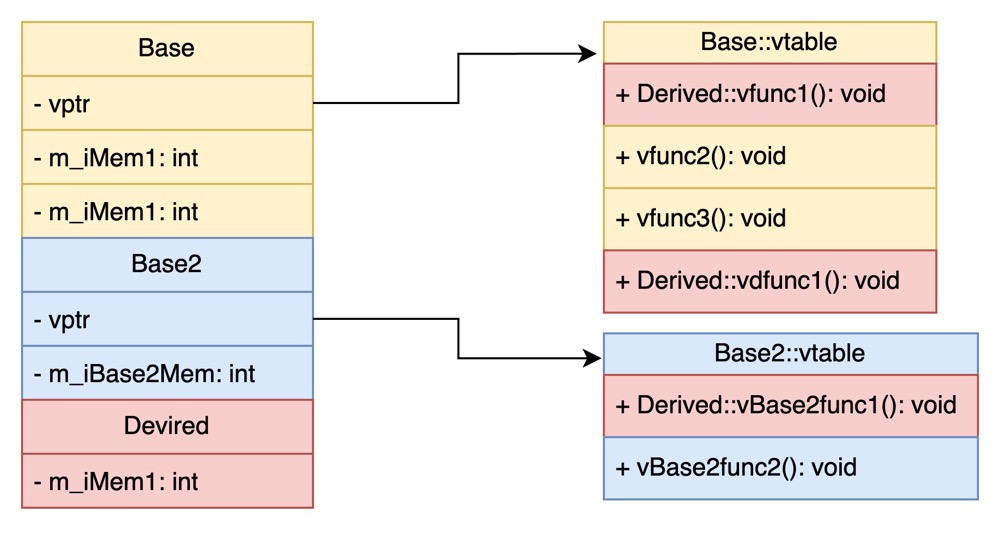

# C++ 基础

C 语言是面向过程的语言；表现能力和处理能力都极强，可以直接访问内存物理地址；C 语言实现了对硬件的编程操作，也适合应用软件的开发；C 语言效率高。

C++ 在 C 语言的基础上扩充和完善，兼容了 C 语言面向过程的特点，也实现了面向对象程序设计。可以使用抽象数据类型进行基于对象的编程；支持多继承、多态；可以使用模板进行泛型化编程。

C++ 与 C 语言本质差别是 C++ 是面向对象的，而 C 语言是面向过程的。

## 1. 指针与引用

引用在 C++ 中通过一个常指针来实现（可以通过反汇编下列代码得知）。

```c++
int a = 10;
int &b = a;
int* const c = &a;	// 等价
```

但是对 b 取地址并不能获得 b 的地址，编译器会将 `&b` 编译为 `&(*b)`，因此获得的还是引用绑定的变量的地址。

因此<mark>引用也是占用内存空间的，并且大小与指针相同</mark>。但是对引用使用 `sizeof` 并不能得到引用的大小，而是引用绑定变量的大小。

指针和引用的区别：

- 引用更安全，但是绑定的对象不能改变；指针指向的对象可以改变，无法保证安全性；
- 引用更方便，引用其实是封装好的指针解引用可以直接使用；指针需要手动解引用和维护指针；
- 引用只能绑定一个变量，且只能有一级；指针可以有多级；
- 引用必须初始化绑定一个对象；指针可以初始化为空

## 2. C++ 多态的实现原理

多态分为「静态多态」和「动态多态」。

静态多态通过函数重载和模板技术实现，在编译的时候确定；动态多态通过虚函数和继承关系来实现，执行动态绑定，在运行时确定。

虚函数通过虚函数表实现，每个类都对应一个一维虚函数表，存放虚函数指针。

派生类如果没有重写基类的虚函数，则指向基类的虚函数，否则将使用重写的虚函数指针替换派生类虚函数表中的基类虚函数。当通过基类的引用或指针进行函数调用时才会发生多态。

### 虚函数表

*虚函数表* 保存了一个函数指针的列表，表示虚函数被调用时实际应该调用的函数的指针。

如果基类中声明了虚函数，则基类将包含一个虚函数表；如果派生类中声明了虚函数，则将会在第一个基类（按照声明的继承顺序）的虚函数表中添加派生类的虚函数；如果派生类中「重写」了虚函数，则覆盖对应基类的虚函数表中的函数指针。

假设我们有如下类的继承关系栈：

```c++
class Base {
public:
    Base(int mem1 = 1, int mem2 = 2) : m_iMem1(mem1), m_iMem2(mem2) {}
    virtual void vfunc1() { std::cout << "In vfunc1()" << std::endl; }
    virtual void vfunc2() { std::cout << "In vfunc2()" << std::endl; }
    virtual void vfunc3() { std::cout << "In vfunc3()" << std::endl; }
private:
    int m_iMem1;
    int m_iMem2;
};

class Base2 {
public:
    Base2(int mem = 3) : m_iBase2Mem(mem) { ; }
    virtual void vBase2func1() { std::cout << "In Base2 vfunc1()" << std::endl; }
    virtual void vBase2func2() { std::cout << "In Base2 vfunc2()" << std::endl; }
private:
    int m_iBase2Mem;
};
class Devired : public Base, public Base2 {
public:
    Devired(int mem = 7) : m_iMem1(mem) { ; }
    void vfunc1() override { std::cout << "In Devired::vfunc1()" << std::endl; }
    void vBase2func1() override { std::cout << "In Devired::vBase2func1()" << std::endl; }
    virtual void vdfunc1() { std::cout << "In Devired vdfunc1()" << std::endl; }
private:
    int m_iMem1;
};
```

那我们可以得到 Devired 的实例结构如下：

<div align="center">
  
</div>

如图，派生类会包含基类的所有数据。此外，需要注意的是：<mark>虚函数表属于一个类，而类实例中会包含指向「虚函数表」的「虚函数表指针」vptr</mark>。

<mark>虚函数表在「编译期间」就被创建出来，并且编译器会为构造函数中增加为 vptr 赋值的代码，这一操作将在构造函数的最开始</mark>。

### 构造函数、析构函数与虚函数

<mark>构造函数不能声明为虚函数，而析构函数常常被声明为虚函数</mark>。

由于「虚函数表指针」的赋值在对象的构造函数中，因此你无法指定构造函数为虚函数。在对象被构造前，虚函数表指针还没有被赋值，此时如果调用“虚构造函数”，程序并不知道应该调用哪个构造函数。

而由于每个派生类中都有可能有内存空间的动态申请，因此需要在析构函数中进行内存释放。如果一个基类的析构函数不是虚函数，那么在多态场景下，只会调用基类的析构函数；如果析构函数是虚函数，由于动态绑定的存在，它会去调用子类的析构函数，子类的析构工作完成后回自动调用父类的析构函数，父类再调用父类的父类，直至所有析构工作完成。

因此，如果在多态场景中，析构函数不使用虚函数，则很有可能出现「内存泄漏」的情况。

## 3. malloc 原理

malloc 函数用于动态分配内存。为了减少内存碎片和系统调用的开销，malloc 采用内存池的方式，先申请大块内存作为堆区，然后将堆区分为多个内存块，以块作为内存管理的基本单位。

当用户申请内存时，直接从堆区分配一块合适的空闲块。malloc 采用隐式链表结构将堆区分成连续的、大小不一的块，包含已分配块和未分配块；同时 malloc 采用显式链表结构来管理所有的空闲块，即使用一个双向链表将空闲块连接起来，每一个空闲块记录了一个连续的、未分配的地址。

当进行内存分配时，malloc 会通过隐式链表遍历所有的空闲块，选择满足要求的块进行分配；当进行内存合并时，malloc 采用边界标记法，根据每个块的前后块是否已经分配来决定是否进行块合并。

## 4. new 和 delete

### new 的作用

:point_right: [C++ new关键字详解_Mr.codeee的博客-CSDN博客](https://blog.csdn.net/wzz953200463/article/details/103586435)

`new/delete` 是 C++ 对 `malloc/free` 的封装，也用来申请内存空间并自动对申请的变量初始化。

:point_right: 二者的区别

- malloc 和 free 是函数，而 new 和 delete 是运算符。
- malloc 和 free 无法满足对象创建的要求。对象要求在创建的同时自动执行构造函数，消亡前要自动执行析构函数。由于 malloc 和 free 不是运算符，因此不在编译器控制权之内，编译器不能将构造和析构的任务交给它们。
- new 操作符分配成功返回的是对象类型的指针，类型严格与对象匹配并无法进行类型转换；malloc 分配成功返回 `void *`，需要通过强制类型转换将其转为需要的类型。
- 内存分配失败时，new 会抛出 `bad_alloc` 异常；`malloc` 则会返回 NULL。
- 使用 `new` 操作符申请内存分配时无须指定内存块的大小，编译器会根据类型信息自行计算；`malloc` 则需要显式地指出所需内存的尺寸。

new 操作符会调用 `operator new`，因此如果类中没有定义则会调用全局的 `operator new`，否则将调用自己的 new。`operator new` 只分配了空间，new 操作符将会在这之后调用构造函数。

有时恰好有一些分配好的原始内存，可能需要在这上面构建对象，此时则使用 `placement new`。

```c++
ClassT *constructClassTInBuffer (void *buffer) {
  	return new (buffer) classTSize();
}
```

如果你希望将对象产生于堆上，请使用new operator。

如果你只打算分配内存，请使用operator new，就不会调用构造函数。

如果你打算在堆对象产生时自己决定内存分配方式，请自己重载operator new。

如果你打算在已分配的内存中构造对象，请使用placement new。

### delete 和 delete[] 的区别

new 分配的单个对象使用 delete 释放，使用 new[] 分配的一组内存空间使用 delete[] 释放。delete[] 会调用每个数组元素的析构函数，而 delete 只能调用第一个元素的析构函数。但是对于基本数据类型，由于没有析构函数，所以使用两者释放内存没有区别。

## 5. inline 的作用

从工程的角度来说，添加 inline 的作用就是允许在头文件中定义函数和变量，而不需要把定义和声明拆开（[C++ inline 有什么用](https://www.zhihu.com/question/24185638)）。这在 header-only 的库中很有用，它对编译速度有很大影响，同时容易产生二进制膨胀的问题。此外也可以参考 [c++ inline的作用](https://www.jianshu.com/p/a57a7884d6e8) 的解释。

总的来说，inline 与宏定义有点相似，都会将相关代码在调用处展开，但是也有一些区别和使用上的不同：

- inline 只是对编译器的建议，如果函数太复杂那么编译器并不会将其作为内联函数在调用点展开；而「宏定义」本质是字符串的替换，它在预处理的过程中就已经完成；
- inline 只适合函数体内代码简单的情况，不能包含 while/switch 等复杂的结构控制语句，更不能是递归函数；宏定义也不能作为递归函数，但是由于他只是字符串替换，所以你可以将其构造为函数的形式（往往比较复杂，不建议这样使用）：

```c++
#define do_something(...) \
	do { \
	step1;\
	step2;\
	...\
} while(0)
```

- inline 具有安全性检查，在编译时完成；而宏定义只是简单的字符串替换，在预处理时完成，因此无法进程语法安全性检查

此外，它们都容易产生二进制膨胀的问题，也容易影响编译速度。

## 6. struct 和 union 的区别

struct 会顺序存储成员变量，所有成员独立存在，union 会开辟成员变量中最大需要的空间，其中一个成员被赋值，将覆盖原有其他成员的值。

## 7. static 关键字的用法

[变量] 局部变量存储于栈空间，使用完就释放，编译器通常也不对其进行初始化；静态变量位于全局数据区（完整的程序内存分为：代码区、全局数据区、堆和栈），编译器自动将未赋初值的变量初始化为 0。

[全局变量] 全局变量也存储在全局数据区，编译器也会对其自动初始化。普通全局变量对整个工程可见，但是静态全局变量仅对当前文件可见，其他文件不可访问。在定义不需要与其他文件共享的全局变量时，加上 static 关键字能够有效地降低程序模块之间的耦合，避免不同文件同名变量的冲突，且不会误使用。

[函数] 与全局变量类似，在返回类型前加 static。静态函数只能在声明它的文件中可见，其他文件不能调用该函数；不同文件可以使用相同名字的静态函数，互不影响。

[静态成员变量] 静态成员变量存储在全局数据区，静态成员在定义时分配存储空间，因此不能在类声明中定义；所有对象只有一份静态成员变量；在没有任何对象时就可以操作静态成员变量。

[静态成员函数] 静态成员函数属于整个类，因此没有 this 指针，也无法访问非静态成员函数，只能调用静态成员函数；出现在类体外的函数定义不能指定 static。

## 8. C++ 中如何避免拷贝

对于对象来说，可以通过 `=delete` 禁用拷贝构造函数；编译器的返回值优化 RVO 也可以避免拷贝；使用引用也可以减少拷贝；如果变量已经完成自己的任务并且不再使用，可以使用 `std::move` 转移其控制权，也可以避免拷贝。

## 9. 避免头文件文件的重复引用

\- 通过宏定义避免重复引入

```c++
#ifndef _NAME_H
#define _NAME_H
// content of header
#endif
```

\- 使用 `#pragma once` 避免重复引入。可以将该命令写在指定头文件的最开始位置，则该文件将植被引入一次。

通常 `ifndef` 通过宏定义判断来避免重复，这意味着每次引入头文件都要判断一次，因此效率不高。但是 C/C++ 都支持宏定义，因此使用宏定义不会影响项目的可移植性。

与 `ifndef` 相比，`#pragma once` 不涉及宏定义，编译器扫描到该指令就知道该文件只引入一次，因而效率较高。但不是每个版本的编译器都能识别该指令，一些老版本编译器不支持则会发出警告，但编译会继续进行，因此可移植性差。此外，该指令只能用于某个具体文件，而不能像宏定义一样指定某一段代码。

## 10. 怎么防止内存泄漏

栈内存是有限的，通常是 8M 左右，取决于运行环境。栈的内存分配和回收由编译器控制，因此不会发生内存泄漏，只会出现栈溢出。而堆上的内存由程序直接控制，可能发生内存泄漏。

\- 尽量避免在堆上分配内存。

在栈上分配空间有一定的局限，比如生命周期等。但堆上分配空间，可能忘记调用 `delete` 触发内存泄漏。C++ 引入的智能指针是一种可行的方法，但是 `shared_ptr` 往往引入了额外的性能开销，效果并不理想。

\- 使用 `Arena` 内存池

使用内存池可以很方便的解决大部分内存相关的问题，如频繁的分配和回收导致的性能损失，内存泄漏。由于直接通过内存池操作对象，无需关心单个对象的释放，由内存池统一释放。

\- 善用 RALL

RALL 可以帮助开发者将管理堆上的内存简化为管理栈上的内存，从而达到自动回收内存的问题。当我们需要在堆上分配内存的时候，我们可以同时在栈上分配一个对象，使用对象对指针进行封装，在栈对象析构时释放内存，从而将对对象的生命周期和堆内存进行绑定。

RALL 不仅可以简化内存管理，还可以简化其他资源管理，如文件资源，锁等。

## 参考

[底层剖析引用实现原理](https://blog.csdn.net/weixin_49199646/article/details/109847691)