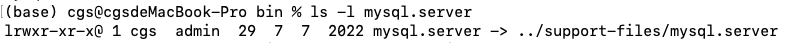
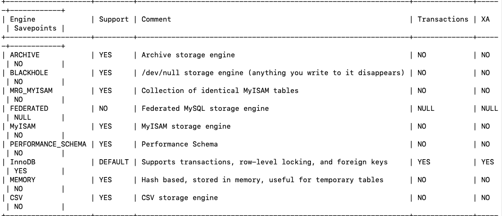
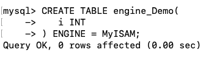
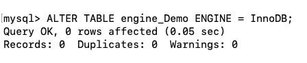
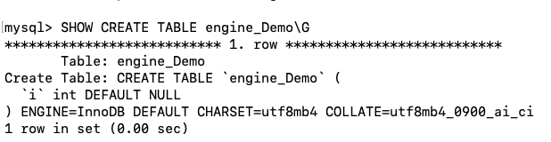

# MySQL是怎样运行的

### 启动MySQL服务器程序

1. #### mysqld

   mysqld 可执行文件表示数据库服务器。

2. #### mysqld_safe

   mysqld_safe是一个启动脚本，间接调用mysqld，并启动监控进程，在服务器进程挂掉时帮助重启，使用mysqld_safe 会将服务器程序出错信息和诊断信息重定向到某个文件，产生出错日志。

3. #### mysql.server

   启动脚本，间接调用mysald_safe，在调用mysql.server 时后边指定 start参。

   ```shell
   mysql.server start
   ```

   mysql.server 是一个链接文件，实际文件为 ../support-files/mysql.server。

   

   ```shell
   mysql.server stop
   ```

   关闭正在运行的服务器程序。

4. #### **mysqld_multi**

   一台计算机可以运行多个mysql服务器进行，mysqld_multi可以对每一个服务器进程的启动或停止进行监控。

### 启动MySQL客户端程序

启动mysql客户端命令

```shell
mysql -h 主机名 -u 用户名 -p 密码
```

如果想要断开客户端和服务器的连接，关闭客户端需要在 mysql> 提示符后输入

```mysql
exit
quit 
\q
```

### 客户端与服务器 连接的过程

客户端和服务器端是两个不同的进程， 客户端进程向服务器进程发送请求并得到回复的过程是 进程间通信的过程。

1. #### TCP/IP

   数据库服务器和客户端进程可能运行在不同的主机上，所以它们之间通信必须通过网络通信来完成，常用TCP作为服务器和客户端之间的网络通信协议。

   每台计算机有唯一的IP地址，MySQL服务端在启动的时候会默认监听3306端口号，客户端通过IP地址+端口号的形式与服务器端进程进行通信。

   如果想要更改服务端的监听端口可以通过以下命令实现

   ```shell
   mysqld -p3307
   ```

   更改监听端口号为3307.

   客户端想要通过TCP连接服务器进程，可以通过以下命令

   ```shell
   msyql -h[IP地址] -u[root] -P[3307] -p
   ```

   -P表示服务器进程的端口号，如果不是默认的3306，需要-P进行指定端口号。

2. #### 命名管道和共享内存

   在windows上，客户端和服务器进程可以通过**命名管道**或**共享内存**进行通信，需要在启动服务器程序和客户端程序时添加参数：

   - 使用**命名管道**进行进程通信

     在启动服务器程序命令加上 `--enable-named-pipe`参数， 启动客户端时在命令中加入 `--pipe`或者`--protocol=pipe` 参数。

   - 使用**共享内存**进行进程通信

     在启动服务器程序命令加上 `--shared-memory`参数，成功启动服务器后，**共享内存**就成了本地客户端程序默认的连接方式，也可以在启动命令中添加`--protocol=memory` 参数来显式的指定共享内存进行通信。

   **PS：** 使用共享内存，需要客户端和服务器在同一台windows主机。

3. #### Unix域套接字文件

   客户端进程和服务端进程在**同一台操作系统为类Unix机器**上，可以使用**Unix域套接字文件**来进行进程间通信。

   客户端程序启动时需要指定`--protocol=socket`参数，服务器和客户端程序就可以通过Unix域套接字文件进行通信，MySQL服务器默认监听Unix套接字文件为 `/tmp/mysql.sock`，客户端程序也默认连接到这个Unix域套接字文件。

   可以通过启动服务器程序时指定socket参数更改默认路径

   ```shell
   mysqld --socket=/tmp/a.txt
   ```

   这样服务器程序就会监听`/tmp/a.txt`， 客户端程序也需要更改连接到的Unix域套接字文件路径。

   ```
   mysql -hlocalhost -uroot --socket=/tmp/a.txt -p
   ```

   客户端和服务端就可以通过路径`/tmp/a.txt` 的Unix 域套接字文件进行通信。


### 服务器处理客户端请求

客户端向服务器进程发送一段MySQL语句，服务器进程处理后再向客户端进程发送一段文本（处理结果）。


1. #### 连接管理

   客户端进程按照上述 `TCP/IP`、 `命名管道和共享内存`、`Unix域套接字文件`等其中一种方式与服务器建立连接。

   服务器会为每一条客户端的连接建立线程进行处理，当客户端断开连接时，服务器端不会立马销毁这个线程，缓存下次直至下一个客户端建立连接时，分配给新的客户端，这样可以**减少频繁的创建和销毁线程**，节省开销。同时为了减少分配过多线程影响系统性能，需要限制同时连接到服务器的客户端的数量。

   客户端程序与服务端程序不在同一台计算机时，可以采用**SSL（安全套接字）**的网络通信进行连接，保证数据传输的安全性。客户端发器连接的时候，会向服务器发送本地主机信息、用户名、密码，服务器会对信息进行认证，认证失败会拒绝连接。

   连接建立后，服务器线程会监听客户端发送的请求， MySQL服务器接收到请求只是**文本信息**。

2. #### 解析与优化

   MySQL服务器获得了文本形式的请求，还需要经过`查询缓存`、`语法解析`、`查询优化`等操作。

   1. ##### 查询缓存

      查询缓存就是MySQL服务器 会将刚刚处理过的查询请求和结果 `缓存`起来。 如果接下来有 **一摸一样**的查询请求，直接从缓存中查找结果， 这个查询缓存可以在不同客户端之间共享。

      <font color=red> 如果两个查询请求在任何字符上有不同（包括但不限于：空格、注释、大小写），都会导致缓存不命中</font>

      <font color=red>如果查询请求中包含某些系统函数、用户自定义变量和函数、一些系统表（包括但不限于：mysql、information_schema、 performance_schema）数据库中的表，那这个请求就不会被缓存。</font>

      **假如** 同样的函数的两次调用会产生不一样的结果，例如**Now**，每次调用都会产生最新的当前时间，如果第二次调用使用第一次调用的缓存，结果就会出现错误。

      对于缓存失效，<font color=red>MySQL的缓存系统会监测 缓存系统中涉及到的每张表， 只要表的结构或数据被修改，（包括但不限于 INSERT\ UPDATE、DROP TABLE、 DELETE、 TRUNCATE TABLE、 ALTER TABLE 、 DROP DATABASE），那使用该表的所有高速缓存查询都将变为无效并从高速缓存中删除。</font>

      > **Tips：** 查询缓存可以提升系统性能，但维护缓存造成一些开销，每次都要去查询缓存中枷锁，查询请求处理完需要更新查询缓存，维护查询缓存对应的内存区域。在MySQL 5.7开始不推荐使用查询缓存，MySQL 8.0中删除。

   2. ##### 语法解析

      查询缓存没有命中，接下来就是查询阶段，客户端程序发送过来的请求是文本信息，MySQL 需要对文本进行分析，判断语法是否正确，将文本中需要查询的表、查询条件提取到MySQL 服务器内部使用的数据结构上。

      > 从文本总提取需要的信息本质属于一个编译过程，涉及词法解析、语法分析、语义分析等阶段

   3. ##### 查询优化

      语法解析后，服务器程序获取需要的信息，但是MySQL语句执行起来效率可能不高，<font color=red>MySQL的优化程序对我们的语句进行优化， 如内连接、表达式简化等</font> ，优化的结果就是生成一个执行计划，可以通过`EXPLAIN`语句来查看语句的执行计划。

3. #### 存储引擎

   MySQL服务器将数据的存储和提取操作都封装到`存储引擎`的模块里， `存储引擎`负责将数据写入具体的物理存储器， 为了实现不同的功能，`MySQL`提供了各式各样的`存储引擎`, 不同`存储引擎`管理的表具体的存储结构不同，采用的存取算法也不同。

   `连接管理` 、`查询缓存`、`语法解析`、`查询优化`等操作不涉及真实数据存储的功能划分为`MySQL server`的功能， 真实存储数据的功能划分为`存储引擎`的功能，`存储引擎`向上为 `MySQL server`层提供统一的API接口，在`MySQL server`完成查询优化后，将生成的执行计划调用底层`存储引擎`提供的API接口，获取数据返回给客户端。

### 常用存储引擎

MySQL 支持很多引擎，主要的有

| 存储引擎  |                 描述                 |
| :-------: | :----------------------------------: |
|  ARCHIVE  | 用于数据存档（行被插入后不能被修改） |
| BLACKHOLE |    丢弃写操作，读操作会返回空内容    |
|    CSV    |  在存储数据时，以逗号分隔各个数据项  |
| FEDERATED |            用来访问远程表            |
|  InnoDB   |    具备外键支持功能的事务存储引擎    |
|  MEMORY   |             置于内存的表             |
|   MERGE   |    用来管理多个MyISAM表构成的集合    |
|  MyISAM   |       主要的非事务处理存储引擎       |
|    NDB    |        MySQL集群专用存储引擎         |

这么多， 我们常用的`InnoDB`和`MyISAM`。

### 存储引擎的相关操作

1. #### 查看当前服务器程序支持的存储引擎

   ```mysql
   SHOW ENGINES;
   ```

   下面为运行结果：

   

   **Support**表示该存储引擎是否可用，**DEFAULT** 显示默认的存储引擎为`InnoDB`， **Transactions**列表示该存储引擎是否支持事务处理。**XA**列代表存储引擎是否支持分布式事务，**Savepoints**表示是否支持部分事务回滚。

   

2. #### 设置表的存储引擎

   <font color=red>存储引擎负责对表中数据进行提取和写入，可以为不同的表设置不同的存储引擎，使不同的表有不同的物理存储结构</font>

   - ##### 创建表时指定存储引擎

     可以在创建表的同时指定存储引擎，默认使用InnoDB存储引擎。

     ```mysql
     CREATE TABLE 表明(
     	建表语句;
     )ENGINE = 存储引擎名称；
     ```

     如果我们想要创建一个MyISAM的表

     

   - ##### 修改表的存储引擎

     可以通过下面的语句修改表的存储引擎

     ```mysql
     ALTER TABLE 表名 ENGINE = 存储引擎名称;
     ```

     修改上述engine_Demo表的存储引擎

     

     查看engine_Demo 的表结构

     

