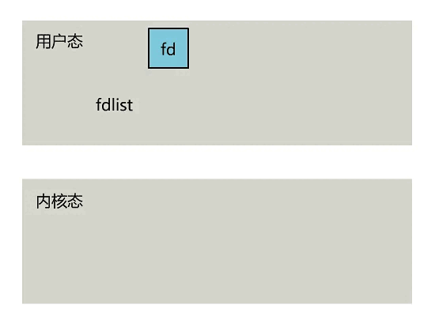
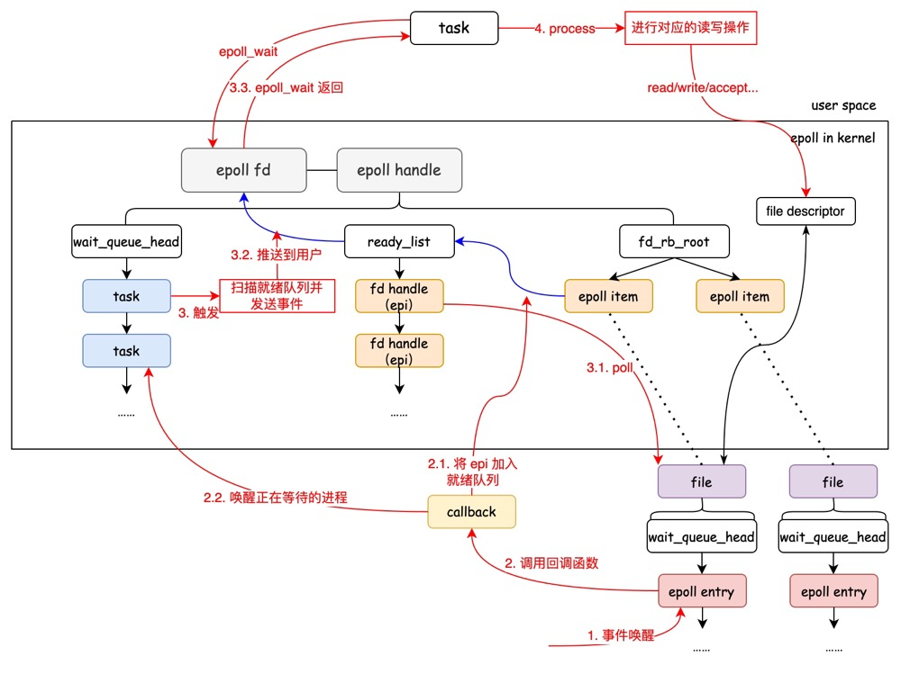

# IO 多路复用

*IO 多路复用* 指的是多个 fd 复用一个进程或线程来处理事件。多路复用主要有三种技术 select/poll/epoll。IO 多路复用通过一种机制使一个进程/线程可以监视多个文件描述符。

select/poll/epoll 本质上都是同步的 IO，因为他们在读写事件就绪后会自己负责读写，整个读写过程是阻塞的；而异步 IO 无需自己负责读写，其实现会负责将数据从内核拷贝到用户空间。

在了解具体技术之前，我们首先需要了解 Linux 内核 poll 机制。

对于被 poll 的「描述符」，必须在实现上支持内核的 poll 技术。假设 fd 是 IO 对象，它必须实现文件结构体中 `file_operations` 中的 poll 操作，给自己分配有一个等待队列头 `wait_queue_head_t`，主动 poll fd 的某个进程 task 必须分配一个等待队列成员，添加到 fd 的等待队列里面去, 并指定资源就绪时的回调函数以在事件到达时通知该 task。

用 socket 做例子, 它必须有实现一个 poll 操作, 这个 poll 是发起轮询的代码必须主动调用的, 该函数中必须调用 `poll_wait()` 将发起者作为等待队列成员加入到 socket 的等待队列中去，这样 socket 发生事件时可以通过队列头逐个通知所有关心它的进程。

## select

select 监视的描述符分为 3 类，分别是：

- readfds：有数据到达的 fd 集合；
- writefds：写数据到达的 fd 集合；
- exceptfds：异常发生 fd 集合

当进程调用 `select` 时，它会将需要监控的 fd 集合拷贝到内核空间（为了方便理解，假设只监控 IO 有数据可读），然后遍历自己监控的 fd，轮询调用 fd 的 poll 方法以检查是否有数据可读。如果没有事件则有关进程进入睡眠；如果在 timeout 时间内有数据到达或等待超时，则相关进程被唤醒并遍历 fd 集合收集相关事件返回给进程。

<mark>由于最开始的需求时朴素的，因此 select 只考虑当前是否有 fd 集合中有数据可读</mark>；当事件通知到达的时候，由于数据的到来是异步的，我们无法确定有多少个被监控的 fd 有数据可读，于是只能遍历 fd 收集可读事件。

此外，select 可以监控的 fd 集合数量是有限的，最大连接数由 `FD_SETSIZE` 宏定义决定，通常为 1024 个，具体受硬件影响。当然，你可以修改这个宏定义并重新编译内核，但是由于该机制使用轮询方式，这意味着你设置的数量越多性能越差。

<div align="center">
  
</div>


因此，select 有 3 个明显的缺陷：

- 每次调用 select 都要把被监控的 fd 集合从用户空间拷贝到内核空间，这在高并发的场景下消耗非常大；
- 被监控的 fd 集合中只要有一个数据可读，select 机制就会遍历整个 fd 集合的 poll 方法来收集事件；
- 被监控的 fd 集合数量有限

## poll

poll 和 select 的实现十分相似，但是表述 fd 集合的方式不同。poll 使用 pollfd 结构而不是 `fd_set`，这就解决了 select 的集合数量有限的问题。

但 poll 同样存在包含大量 fd 的集合被整体复制的性能缺点；它的开销随着 fd 的数量增加而线性增加。这也使得 poll 并不适合高并发场景。

## epoll

epoll 的接口非常简单，只有三个函数：

- epoll_create：创建一个 epoll 句柄；
- epoll_ctl：向 epoll 对象添加/修改/删除要管理的 fd；
- poll_wait：等待监听的 fd 上的 IO 事件

### epoll_create

`int epoll_create(int size)`

这里的 size 向内核说明监听的数目，但是这不是限制，而是对内核的建议。如果函数调用成功则返回一个 epoll 文件描述符（句柄）。epoll 本身也是占用一个 fd，因此 epoll fd 也可以被其他进程 epoll，并且使用完后一定要 <mark>close关闭 epoll fd</mark>。

我们来看一下 epoll 的结构：

```c++
// fs/eventpoll.c
struct eventpoll {
    //sys_epoll_wait用到的等待队列
    wait_queue_head_t wq;
    //接收就绪的描述符都会放到这里
    struct list_head rdllist;
    //每个epoll对象中都有一颗红黑树
    struct rb_root rbr;
    ......
}
```

- wq：等待队列，保存阻塞在 epoll 的进程；
- rbr：红黑树，保存被监听的 fd，每个被监听 fd 可以用一个 epoll item（epi）来标识；使用红黑树可以实现高效的 fd 查找/插入/删除操作；
- rdllist：就绪的 fd 链表，当有 fd IO 事件就绪时，内核就会将相关信息放在就绪列表，因此进程只需要访问就绪链表而无需遍历红黑树的所有节点

由于 epoll 可能同时监听大量 fd，因此在只有少量 fd 有事件就绪时，使用 ready-list 队列可以高效的通知等待队列上的进程，而不需要遍历红黑树上的所有 epi。

### epoll_ctl

```c++
int epoll_ctl(int epfd, int op, int fd, struct epoll_event *event);
```

根据内核 poll 机制（文章开头所述），epoll 需要为每个被监听的 fd 构造一个 epoll entry（设置关心的事件以及注册回调函数）睡眠在 fd 的等待队列，当 fd 的事件就绪就会通过 epoll 注册的回调函数通知 epoll。

- op：表动作，分别为 `EPOLL_CTL_ADD,EPOLL_CTL_MOD,EPOLL_CTL_DEL`，即增加/修改/删除；
- fd：要被监听的文件描述符；
- event：告诉内核要监听什么事件，它可以**包含**一下几个宏的集合：
  - EPOLLIN：表示对应的文件描述符可以读（包括对端 SOCKET 正常关闭）；
  - EPOLLOUT：表示对应的文件描述符可以写；
  - EPOLLPRI：表示对应的文件描述符有紧急的数据可读（这里应该表示有带外数据到来）；
  - EPOLLERR：表示对应的文件描述符发生错误；
  - EPOLLHUP：表示对应的文件描述符被挂断；
  - EPOLLET ：将 EPOLL 设为边缘触发（Edge Trigger）模式，这是相对于水平触发（Level Trigger）来说的；
  - EPOLLONESHOT：只监听一次事件，当监听完这次事件之后，如果还需要继续监听这个 fd 的话，需要再次把这个 fd 加入到 EPOLL 队列里

### epoll_wait

```c++
int epoll_wait(int epfd, struct epoll_event *events, int maxevents, int timeout);
```

- events：分配好的结构体数组，epoll 会将发生的事件拷贝到该数组，它<mark>不能是空指针，内核只负责数据复制而不会进行用户态的内存分配</mark>；
- maxevents：告知内核 events 可以容纳多少事件结构体；
- timeout：超时时间，单位为毫秒；-1 时代表阻塞

首先我们先了解一下 LT/ET：

- LT 水平触发模式：只要有未处理的事件，epoll 就会通知进程，`epoll_wait` 就会立即返回；
- ET 边缘触发模式：只有事件列表发生变化时 epoll 才通知，即使当前进程没有处理完该事件，epoll 也不会再通知（如果没处理完则会出现「事件丢失」）；调用 `epoll_wait` 将会阻塞直到新事件的到来或超时

<div align="center">
  </div>

当一个事件到达 epoll entry 时，它会将 epi 添加到就绪队列，并唤醒一个带有排他性标志 `WQ_FLAG_EXCLUSIVE` 的等待进程；但是这时被唤醒的进程可能过很久才去处理 fd，或者根本不处理，这时如果处于 LT 模式，则应该唤醒其他被阻塞的进程来处理 fd IO 事件。

因此，在扫描「就绪队列」并「收集事件」时，epoll 遍历并清空就绪队列，对于每个 epi 收集其返回的 event，如果没收集到 event，则继续去处理其他 epi，否则将当前 epi 的事件和用户传入的数据都拷贝给用户空间；此时内核会判断，<mark>如果是在LT模式下，则将当前 epi 重新放回就绪队列</mark>。

遍历完成后，如果就绪队列不为空，则继续唤醒 epoll 等待队列上的其他 task。该 task 从 `epoll_wait` 醒来继续前行，重复上面的流程，继续唤醒等待上的其他 task ，这样链式唤醒下去。

因此，LT 会一直唤醒等待队列的进程直到 epi 的事件被处理；ET 则只唤醒一次，从而提高了执行效率，但也有可能由于进程不予处理而导致「事件丢失」。

## 参考

[IO 多路复用——深入牵出理解select/poll/epoll](https://zhuanlan.zhihu.com/p/367591714)

[深入浅出 Linux 惊群：现象、原因和解决方案](https://cloud.tencent.com/developer/article/1842795)