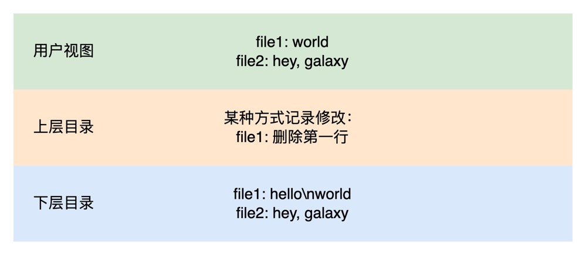
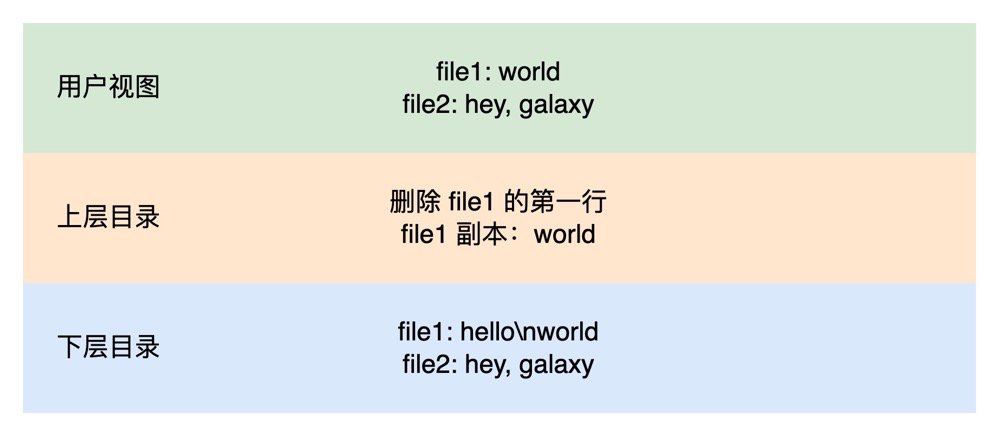
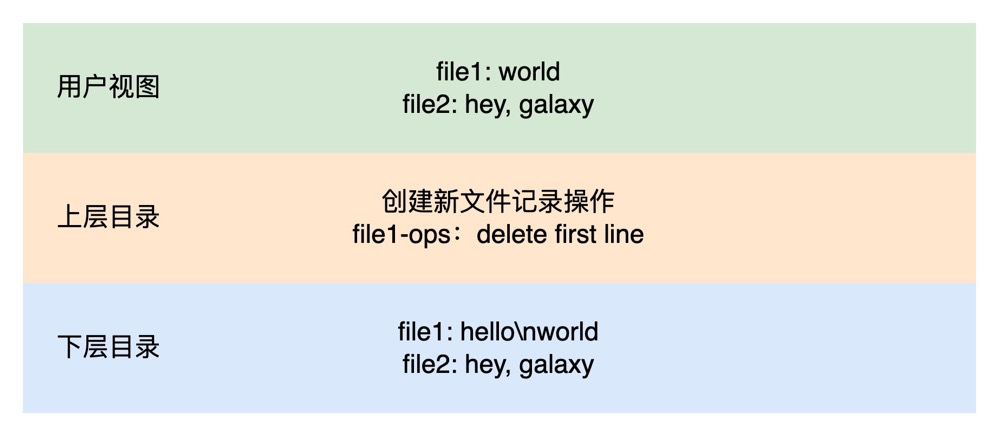

# 写时复制机制

Linux 为了提升系统的性能，减少空间浪费，将写时复制机制用的淋漓尽致。

## COW 机制

COW（Copy On Write，写时复制）机制，是 Linux 文件系统的一种优化机制。它的基本思想是，当有多个进程共享同一块数据时，不立即复制数据,而是等到某个进程真正要修改数据时才进行复制，这样可以延迟数据复制，提高性能。它的主要优点有：

- 避免无谓的复制，提高效率。只有真正要写数据时才复制，读操作可以直接读共享数据。

- 避免重复占用物理内存，节省空间。只需复制真正要修改的页，其它共享的数据页只需一份拷贝。

- 实现轻量级的进程写时复制，fork 新进程性能好。父进程和子进程可以共享未修改的页。

COW 在 Linux 下应用非常广泛，如 fork 创建子进程、memory mapping、docker 等都使用了这种机制。

在 memory mapping 中，多个进程可以映射同一文件到内存，此时就会使用 COW 机制。所有进程共享文件对应的内存页，只有当某个进程写数据时，才会复制一份内存页给该进程，其他进程的内存页不变。这样可以让多个进程高效地共享较大的内存映射文件。

对于 docker，COW 机制是实现容器轻量级的关键：

- 文件系统：多个容器可以共享一份基础镜像层，只有当容器启动并修改文件时，才会创建容器专用的文件系统层，未修改的文件继续共享基础镜像层。
- 内存：父容器和子容器可以共享相同的内存页，只有子容器要修改内存页时，才会复制一份给子容器使用。
- 磁盘块：docker 使用 AUFS 或 OverlayFS 实现容器的文件系统隔离，但共享的底层块存储仍然只有一份。只有容器启动并写入新数据时，才会分配专用的磁盘块。

这里提到了一种层叠式文件系统，Union 文件系统。它将文件系统中的文件分为多层，上层的文件或目录以下层的为基础。你可以理解为下层目录是固定的，类似 docker 中的镜像，上层目录就是在运行时对文件目录做的改动，你可以理解为容器中的文件修改。

你可以简单的按照这个例子来理解。

## AUFS 和 OverlayFS 文件系统

AUFS 和 OverlayFS 都是 Linux 下的文件系统，主要用于实现文件层叠和复制，是 Union 文件系统的不同实现方式，它们都是 docker 容器技术的基石。

AUFS（Advanced Multi Layered Unification Filesystem）是一种日志式文件系统，它将多个目录合并成一个统一的文件系统。AUFS 最常见的应用就是实现 docker 镜像的层叠，不同镜像层可以复用已有层中的文件，实现镜像间的继承。

OverlayFS 是 Linux 内核自带的文件系统，也可以实现文件层叠。它在 AUFS 的基础上做了进一步优化，性能更高，已经成为 docker 的默认文件系统。

AUFS 和 OverlayFS 的主要区别如下：

- 来源：AUFS 是社区项目，OverlayFS 是 Linux 内核的一部分。

- 性能：OverlayFS 性能通常更高，它是一个纯内核文件系统。AUFS 需要在用户空间和内核空间转换，性能略差。

- 实现：AUFS 使用 copy-up 机制，新层中的修改会复制到上层目录。OverlayFS 使用 redirect-on-write，以环回设备的形式将上层目录的文件连接到下层目录。

这里提到了 copy-up 和 redirect-on-write 两种不同的机制，都是写时复制的解决方案。

## copy-up 机制

copy-up 是 AUFS 实现文件层叠的机制。它的基本思想是：当上层目录要修改一个继承自下层的文件时，会先将该文件从下层目录复制到上层目录，然后在上层目录修改文件。copy-up 机制工作流程如下：

- *上层目录*（upperdir）和 *下层目录*（lowerdir）合并后呈现为一个统一目录结构；

- 当进程要修改一个文件时，AUFS 会先将该文件从下层目录复制到上层目录，然后进程可以在上层目录修改该文件，下层目录中的文件保持不变；

- 读取文件时，会先检查上层目录是否有对应的文件，如果有则读取上层文件，否则读取下层文件

这样通过提前复制要修改的文件，AUFS 实现了上下层目录的透明层叠，同时也保证下层文件不被上层修改。Copy-up 机制的主要特点是：

- 简单易实现：通过简单的文件复制就可以实现层叠和隔离。
- 最大程度保留下层元数据：复制文件之后，上下层文件的元数据可以保持一致。

但是，copy-up 机制也有一定缺点：

- 执行效率较低：频繁的文件复制会降低性能。
- 空间效率不高：即使文件没有修改，也需要完整复制，会占用额外空间。
- 可能产生碎片：频繁的文件复制可能会产生文件系统碎片。

## redirect-on-write 机制

redirect-on-write 是 OverlayFS 实现文件层叠的核心机制。它的基本思想是：当一个层要修改一个继承自下层的文件时，不直接修改文件，而是创建一个新的文件，之后将对此文件的所有操作重定向到新文件。具体来说，OverlayFS 是这样工作的：

- 上层目录（upperdir）和下层目录（lowerdir）合并后呈现为一个统一目录结构。

- 当进程要修改一个文件时，OverlayFS 会先在上层目录中创建一个新的文件。

- 然后将此文件重定向到刚创建的新文件，之后对该文件所有的读写请求都重定向到新文件，对上层文件做的任何修改都不会影响下层文件。

- 读取文件时，会先检查上层目录是否有对应的文件，如果有则读取上层文件，否则读取下层文件。

当然，以上图解只是为了便于理解，实际的机制实现是十分复杂的。

这样通过重定向修改的文件，实现了上下层目录的透明层叠，同时也保证了下层文件不会被上层修改。这种机制带来的主要优点是：

- 高性能：无需频繁复制文件，只在修改时创建新文件，性能较 copy-up 机制高。
- 空间效率：只有真正修改的文件才会占用额外空间，磁盘利用率高。
- 一致性：上下层的文件结构和元数据可以保持一致，为合并文件系统视图提供基础。