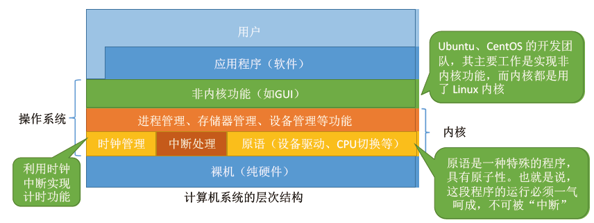

# 操作系统基础

*操作系统*（Operating System，OS）是指控制和**管理**整个计算机系统的**硬件和软件**资源，并合理地组织调度计算机的工作和资源分配；以**提供给用户和其他软件方便的接口和环境**；它是计算机系统中最基本的**系统软件**。

- 系统资源的管理者；
- 向上提供方便易用的服务；
- 最接近底层硬件的一层系统软件

## 操作系统的功能

**资源管理者**

操作系统对文件的管理主要包括**文件管理**、**存储器管理**、**处理器管理**、**设备管理**四大功能。

**向上提供服务**

硬件只能识别二进制指令，而用户难以直接使用二进制指令与计算机交互。操作系统对硬件指令进行封装，把一些难以直接操作的硬件功能封装成简单易用的服务，使用户能更方便地使用计算机，用户无需关心底层硬件的原理，只需要对操作系统发出命令即可。

**对硬件的扩展**

没有任何软件支持的计算机成为 *裸机*。在裸机上安装的操作系统，可以提供资源管理功能和方便用户的服务功能，将裸机改造成功能更强、使用更方便的机器

通常把覆盖了软件的机器成为 *扩充机器*，又称之为 *虚拟机*。

## 操作系统的四个特征

### 1. 并发

*并发*：指两个或多个事件在同一时间间隔内发生。这些事件**宏观上是同时发生**的，但**微观上是交替发生**的；

*并行*：指两个或多个事件在同一时刻内发生（多核 CPU）

**操作系统中的并发性**：指计算机系统中“同时”运行着多个程序，这些程序宏观上看是同时运行的，而微观上是交替运行的。**并发性是操作系统一个最基本的特性。**

### 2. 共享

*共享* 即资源共享，是指系统中的资源可供内存中多个并发执行的进程共同使用

**资源共享的两种方式，互斥和共享：**

**目的**:

互斥是为了保护共享资源不被同时访问，避免竞争条件；同步是为了协调多个进程的执行，确保它们按照正确的时序执行

**资源访问**:

互斥只允许一个进程访问共享资源；同步可能会允许多个进程同时访问共享资源

**进程关系**:

互斥可以在无关的进程之间实现；同步通常需要两个或两个以上的有协作关系的进程。

### 3. 虚拟

*虚拟* 是指把一个物理上的实体变为若干个逻辑上的对应物。物理实体（前者）是实际存在的，而逻辑上对应物（后者）是用户感受到的。比如，单核的计算机可以同时运行多个程序，主要就是将 CPU 资源进行虚拟化，好像每个进程都占有了一个 CPU。

### 4. 异步

*异步* 是指在多道程序环境下，允许多个程序并发执行，但由于资源有限，进程执行并不是一直执行到结束的，而是走走停停，以不可预知的速度向前推进。

## 操作系统内核的设计模式

操作系统的结构分为宏内核和微内核。

*宏内核* 将操作系统的所有服务都放在内核空间。在宏内核中，操作系统的大部分功能都由内核直接提供，包括进程管理、内存管理、文件系统、网络通信等等。宏内核的设计使得它的性能很高，但也非常庞大，因为所有的服务都在内核空间中，这会导致内核的复杂性很高，容易出现安全漏洞。

*微内核* 则将操作系统的服务拆分成多个独立的模块，每个模块运行在用户空间中。在微内核中，内核只提供最基础的服务，如进程调度、内存管理、进程间通信等。其他服务，则由运行在用户空间中的服务程序来提供。这种设计使得微内核的内核部分非常小，因而更加安全可靠，同时也更加灵活，支持定制化的操作系统服务。但是，由于微内核需要频繁地进行内核和用户空间的切换，其性能通常不如宏内核。

Linux 内核采用的就是宏内核的设计模式。在 Linux 内核中，几乎所有的服务都运行在内核空间中。

Linux 内核的设计采用了一些微内核的思想，例如使用模块化的架构，允许动态加载和卸载内核模块，以及使用系统调用来提供用户空间程序与内核的交互等。这些设计使得Linux内核可以在内核运行时动态地扩展和修改，同时也支持用户空间程序的定制化和调试，提高了Linux内核的灵活性和可维护性。

## 参考

[操作系统](https://lfool.gitbook.io/operating-system)