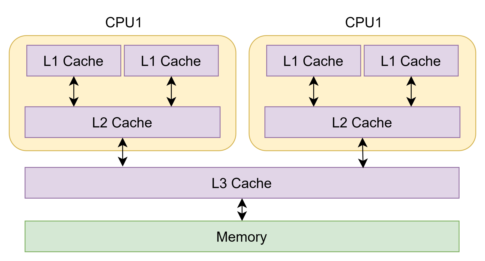
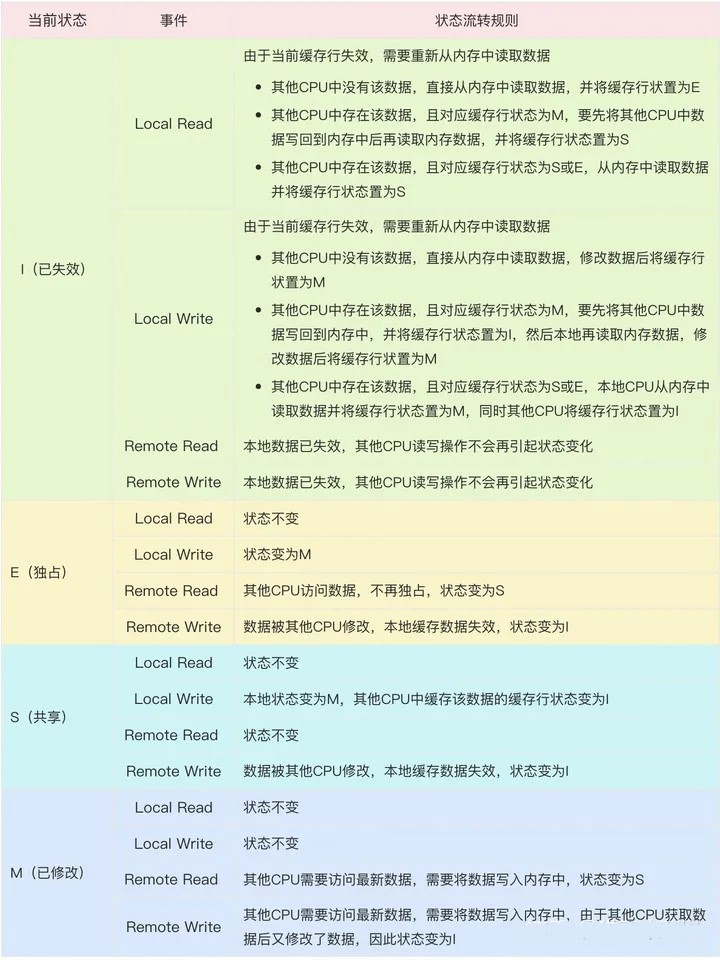
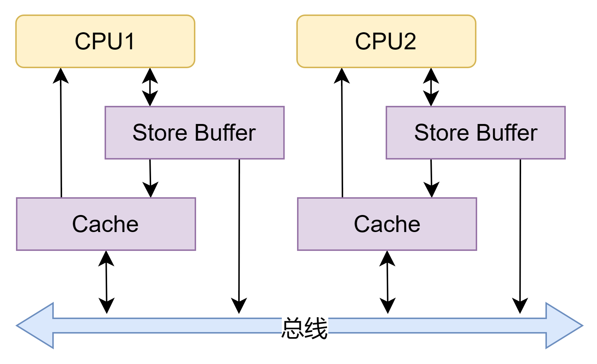
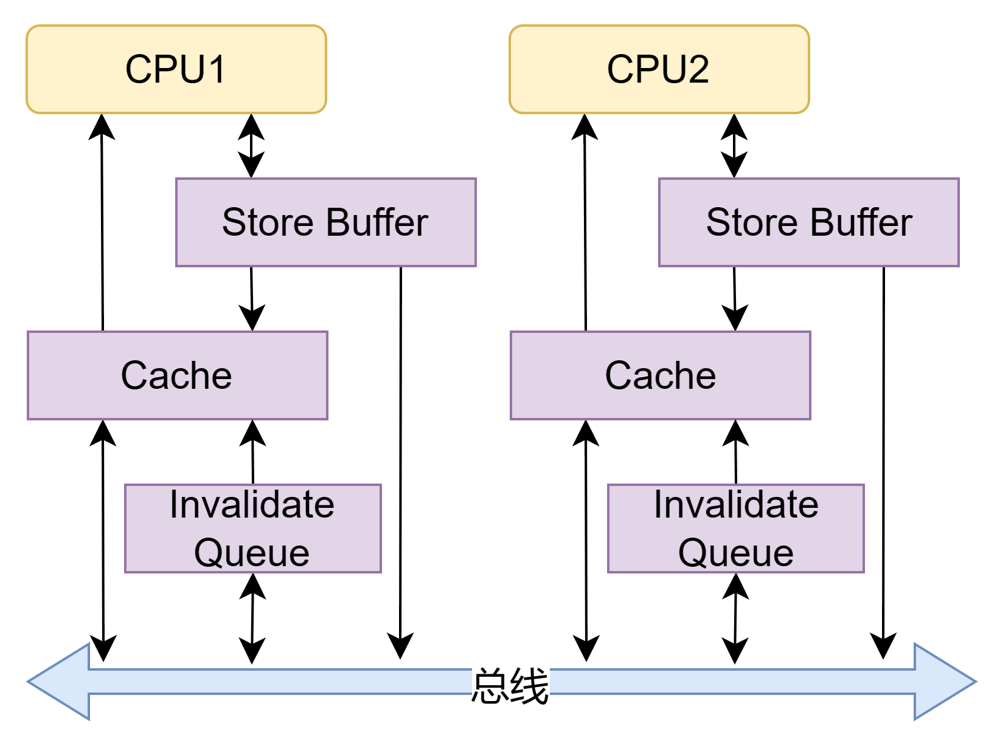

# CPU 缓存



如图，CPU 的缓存结构通常分为 3 级，其中 L1、L2 为每个 CPU 独有，而 L3 为多个 CPU 共享。CPU 访问数据时会依次访问寄存器（Register）、L1 缓存、L2 缓存、L3 缓存、内存。

CPU 缓存被划分为多个 Cache Line，每个 Cache Line 由状态位、组标记、高速缓存块组成。


- 状态位：标记该 Cache Line 中数据状态，每个缓存数据有已修改、独占、共享、已失效四种状态；
- 组标记：由于内存空间较大，所以要将内存数据映射到缓存中需要进行分组，如：直接映射、组相联映射等方式；组标记用于计算内存地址在缓存中的映射位置；
- 高速缓存块：缓存内存的数据副本

# 缓存一致性

缓存策略总是伴随着数据一致性问题，即不同存储节点中对同一数据存储的副本内容不一致的问题。

## 单核 CPU 数据同步

- 写直达：CPU 每次修改数据时，无论数据是否在缓存，都将数据同步到内存中，缓存与内存数据保持强一致性，但是影响写操作的性能；
- 写回：当缓存中的数据即将被置换时，如果 Cache Line 被标记为已修改，则将其同步到内存，保证缓存与内存数据的最终一致性

但是在多核 CPU 中，写回策略可能会导致多个 CPU 缓存内数据不一致。因此，为了解决多 CPU 缓存不一致问题，应该保证：

<div style="background-color: #fff5eb; color: black; border-radius: 5px; border: 1px solid #fed4a4;"><p>📍缓存一致性问题解决的关键</p><ul>
<li><b>写传播</b>：CPU 对缓存数据进行更新时需要告知其他 CPU；</li>
<li><b>串行化</b>：多个 CPU 对同一数据的修改顺序在其他 CPU 看来时一致的；如：CPU1 和 CPU2 同时修改 A，CPU3、CPU4 收到的修改顺序可能为 CPU1 修改后 CPU2 修改，或者 CPU2 修改后 CPU1 修改；要避免这样的问题，对同一数据额修改应该保证串行化</li>
</ul></div>

## 写传播：总线嗅探

CPU 之间是通过总线收发消息的。这种机制下，CPU 需要将每个修改动作都及逆行广播，并实时监听总线上的消息。这不仅非常低效，还无法解决事务的串行化。

## 串行化：MESI 协议

它定义 Cache Line 有 4 种状态：已修改 (M, Modified)、独占 (E, Exclusive)、共享 (S, Shared)、已失效 (I, invalidated)。



其中，Local 代表当前 CPU 的读写行为，Remote 代表其他 CPU 的读写行为。

# Store Buffer 和 Invalidate Queue

MESI 协议可以保证多 CPU 下的缓存一致性。但是现在往往还需要在程序层面保证数据可见性和有序性。这是由于如果 CPU 之间严格遵循 MESI 的话，<mark>一个变量在多个 CPU 共享时，每次写操作都需要广播 invalidate 消息，等其他 CPU 将 Cache Line 设置为无效并返回 Invalidate ACK 后才能修改缓存数据</mark>，这将极大地降低写操作性能。为了提高 CPU 性能，引入了 Store Buffer 和 Invalidate Queue。

## Store Buffer

为了提升写性能，在 CPU 和缓存之间引入了 Store Buffer，写操作无需立即向其他 CPU 发送 Invalidate 消息，而是先写入 Store Buffer，然后返回执行其他操作。由 Store Buffer 异步执行发送广播消息，等收到其他 CPU 响应后再将数据从 Store buffer 同步到 Cache Line。



引入 Store Buffer 后，CPU 对数据进行写操作后会在 Store Buffer 存有修改后的数据，此时 CPU 的 Cache Line 和 Store Buffer 分别存储修改前和修改后的数据备份。当使用该数据时，应该首先查询 Store Buffer，然后查询 Cache Line，这种访问方式为 “Store Forwarding”。

## Invalidate Queue

利用 Store Buffer，CPU 每次写操作都无需发送 Invalidate 并等待 ACK，而是将 Invalidate 消息存储在 Store Buffer 中异步发送。但是 Store Buffer 容量有限，如果接收到消息的 CPU 处于忙碌状态而无法及时响应消息，Store Buffer 很有可能因为消息不断累积而溢出。

因此接收到消息的 CPU 应该尽可能及时响应消息，于是又引进了 Invalidate Queue。CPU 接收到的 Invalidate 消息会存储在 Invalidate Queue 中并立即响应 ACK，之后 Invalidate Queue 再异步执行缓存失效操作。

可以理解为：Store Buffer 相当于 CPU 消息的发送缓冲区，Invalidate Queue 相当于接收缓冲区。



## 顺序性与缓存一致性

Store Buffer 和 Invalidate Queue 的引入提高了 CPU 的执行效率。但是每次写操作从 Store Buffer 到发送广播到 Invalidate Queue 让缓存失效前，会存在各 CPU 缓存不一致的现象，导致 MESI 强一致性被破坏。

```C++
//共享变量
int a, b, c = 0;
//CPU1中执行代码
void CPU1() {
    a = 1;  //1
    b = a;  //2
    c = 1;  //3
}
//CPU2中执行代码
void CPU2() {
    while(c == 0) continue; //4
    assert(b == 1); //5
}
```

### 指令重排

为了一个时钟周期内尽可能完成多个阶段工作，CPU 可能将指令执行顺序进行重排，同时避免具有依赖关系的指令重排。但是这只能保证单 CPU 下数据读写的依赖关系。

上述代码中，由于语句 1、2 存在依赖关系，因此不能被重排；但是语句 3 没有依赖，可能被优化到语句 2 之前，导致 `CPU2` 中的断言条件无法成立。

### Store Buffer 和 Invalidate Queue 导致缓存不一致

由于它们都是异步执行，Store Buffer 异步发送过期消息，Invalidate Queue 异步执行过期操作，因此无法确定当前 CPU 数据修改后，其他 CPU 实际进行数据过期的顺序。

## 内存屏障

为了解决上述指令重排和 Store Buffer、Invalidate Queue 带来的顺序性和缓存一致性问题，内存屏障出现了。

### 写屏障

写屏障能保证写屏障之前的指令不会重排到写屏障之后，执行到写屏障时，屏障前的修改都能及时刷新到内存中，使得其他 CPU 访问时能访问到最新值。

```C
//共享变量
int a, b, c = 0;
//CPU1中执行代码
void CPU1() {
    a = 1;  //1
    b = a;  //2
    smp_wb(); //写屏障
    c = 1;  //3
}
//CPU2中执行代码
void CPU2() {
    while(c == 0) continue; //4
    assert(b == 1); //5
}
```

如上代码，写屏障保证 1、2 语句不会被重排到 3 语句之后；并且执行到写屏障时，1、2 语句的修改将从 Store Buffer 刷进缓存并同步到内存中。

### 读屏障

与写屏障类似，都读屏障能防止屏障后的指令重排到屏障前，并且执行到读屏障时，Invalidate Queue 中的失效消息都将被全部执行完。

```C
//共享变量
int a, b, c = 0;
//CPU1中执行代码
void CPU1() {
    a = 1;  //1
    b = a;  //2
    smp_wb(); //写屏障
    c = 1;  //3
}
//CPU2中执行代码
void CPU2() {
    while(c == 0) continue; //4
    smp_rb();   // 读屏障
    assert(b == 1); //5
}
```

# 原文
[无锁编程——从CPU缓存一致性讲到内存模型](https://zhuanlan.zhihu.com/p/642416997)