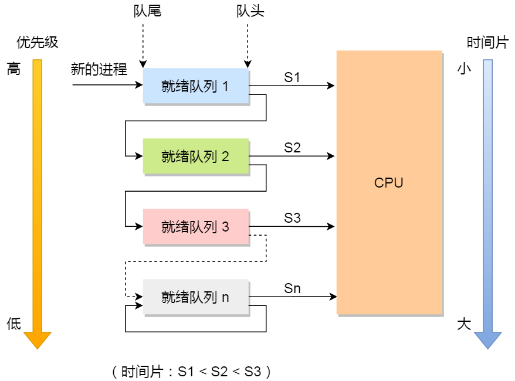
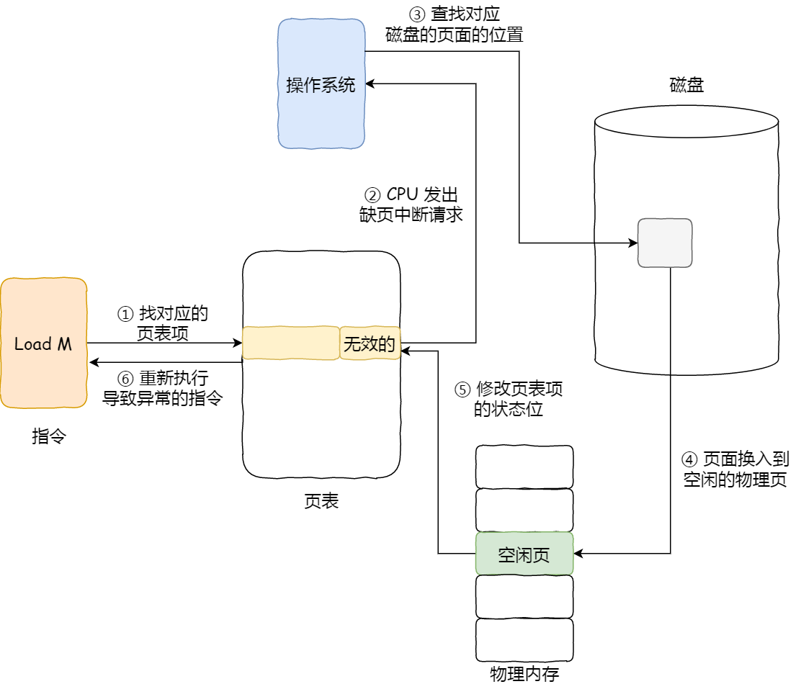
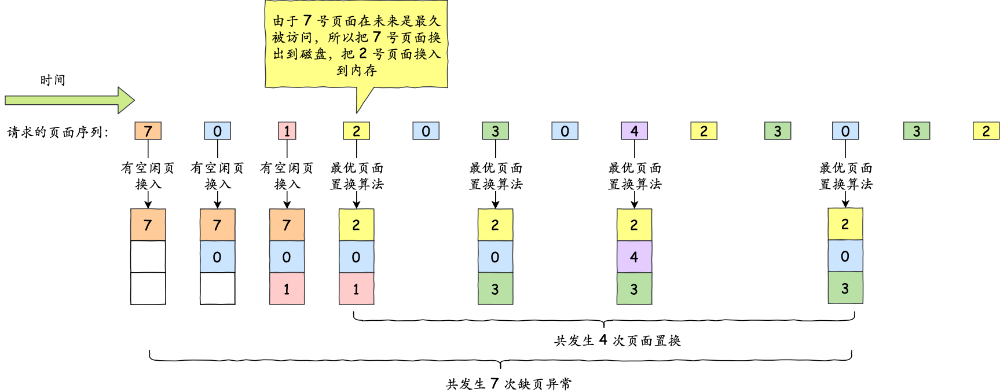
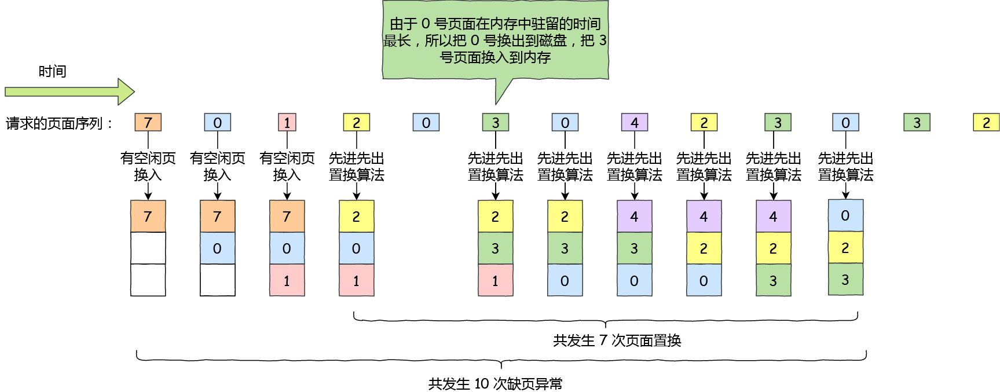
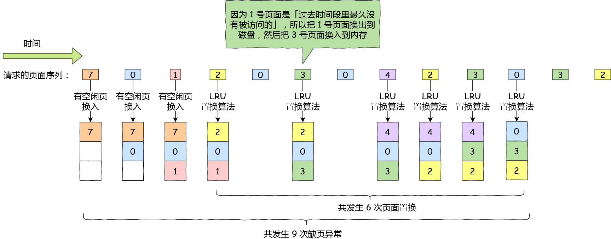
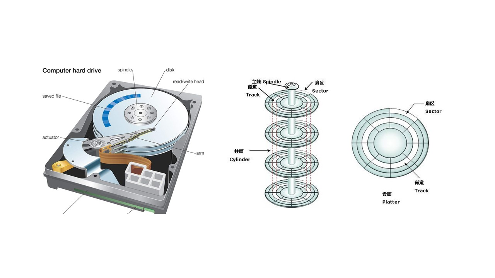

# 调度算法

操作系统的调度算法是十分常问的基础知识，主要分为进程调度、页面置换和磁盘调度算法。

## 1. 进程调度算法

### 调度的概念

一个计算机上运行的进程数往往多于处理器个数，因此会产生对处理器的争用。处理器调度主要是为了对处理器进行分配，即从「就绪队列」中按照一定的算法选择一个进程加载到处理执行。处理器调度是操作系统的基础。

一个作业从提交开始要经历三级调度：

- 高级调度：又称作业调度，主要任务是从「后备作业」中挑选一个或多个，为它们分配内存、IO 设备等资源，并创建对应的进程；多道批处理系统中通常配备作业调度，而其他系统通常不需要；
- 中级调度：又称内存调度，主要目的是**提高内存利用率和系统吞吐率**；它会将暂时不能运行的进程调到外存「挂起」，当挂起的进程具备运行条件并且内存有空闲时，中级调度会将其重新激活并调入内存；
- 低级调度：又称进程调度，其主要任务是按照调度策略和算法从「就绪队列」中选取一个进程并为其分配处理器；进程调度是操作系统中最基本的一种调度

三级调度的频率排序为：高级调度 < 中级调度 < 低级调度。

### 调度的时机

在操作系统中，不能进行进行进程调度的情况有：

- 处理中断过程中：中断处理是系统工作的一部分，不属于某一进程，因此不应被剥夺 CPU 资源；
- 进程在临界区中：进入临界区后，进程通常会独占「临界区」资源以访问和处理共享数据，理论上必须加锁以防止其他进程的进入，因此不应该切换到其他进程以加快共享的释放；
- 在原子过程中：如加锁、解锁、中断现场保护等

应该进行调度的情况有：

- 发生引起调度条件且当前进程无法继续运行，如等待 IO 事件，即非剥夺调度；
- 中断处理结束或自陷处理结束后，被中断进程的用户态程序被置请求调度标志，则可马上进行调度，即剥夺式调度；

### 评价准则

- CPU 利用率：通常是 CPU 处于工作状态的比率；
- 系统吞吐量：单位时间内 CPU 完成的作业数；
- 周转时间：作业提交到作业完成所经历的时间；
- 等待时间：进程处于等待处理器的时间之和；
- 响应时间：用户提交请求到首次产生响应花费的时间

### 调度算法

#### 先来先服务

*先来先服务*（First Come First Served, FCFS）是最简单的调度算法，是非抢占式的调度算法。算法遵从先来后到的原则，每次从就绪队列中选取最先入队的进程，然后执行，直到进程退出或被阻塞；然后再从队列中选择第一个分配 CPU 继续执行。

缺点：当一个长作业先执行，则后面的短作业会等待很长时间。

FCFS 对长作业有利，适用于 CPU 繁忙型作业系统，不适合 IO 繁忙型。

#### 最短作业优先算法

*最短作业优先*（Shortest Job First, SJF）算法会选择运行时间最短的进程来运行，以帮助提升系统的「吞吐量」。

缺点：对长作业不利，有可能导致长作业饿死。

#### 高响应比优先

*高响应比优先*（Highest Response Ratio Next, HRRN）权衡了短作业和长作业，每次进行调度时先计算「响应比优先级」，然后为响应比最高的分配 CPU。
$$
优先权 = {等待时间 + 要求服务时间 \over 要求服务时间}
$$
如上公式：

- 如果进程的「等待时间」相同，则短作业的「响应比」更高且更容易被选中；
- 如果两个进程的「要求服务时间」相同，则「等待时间」越长「响应比」越高，可以兼顾长进程，如果长进程等待时间过长将获得足够高的响应比进而获得执行权

#### 时间片轮转调度

*时间片轮转*（Round Robin, RR）调度算法是较为公平的算法，使用较为普遍。

如果进程的时间片用完，则将「抢占式」的剥夺 CPU 资源；如果进程在时间片结束前阻塞或结束，则立刻执行进程调度和切换。但是时间片轮转调度算法的性能十分依赖「时间片」设置的长短：

- 如果时间片过短，则会导致过多的进程上下文切换，导致 CPU 效率降低；
- 如果时间片过长，有可能退化到 FCFS 算法

通常时间片设置为 <mark>20ms-50ms</mark> 较为合理。

#### 最高优先级调度算法

「时间片轮转」将所有进程都看为平等重要，但是这对于多用户计算机系统可能不太合理。通常它们希望不同用户具有不同的优先级（就像 root 用户永远比其他用户优先级高）。因此 *最高优先级*（Highest Priority First, HPF）调度算法希望从就绪队列中选择优先级最高的进程进行执行。

进程的优先级还可以分为静态优先级或动态优先级：

- 静态优先级：创建进程时就确定了优先级，整个运行时间内优先级都不会变化；
- 动态优先级：根据进程的变化动态调整优先级，如果进程运行时间增加则降低优先级，如果等待时间增加则提高优先级等

该算法也分为抢占式和非抢占式：

- 非抢占式：当就绪队列中出现优先级高的进程，当前进程运行完后执行高优先级的进程；
- 抢占式：就绪队列中出现高优先级的进程时，将当前进程挂起并调度高优先级进程运行

但是这也可能导致低优先级的进程“饿死”。

#### 多级反馈队列调度

*多级反馈队列*（Multilevel Feedback Queue）调度算法是「时间片轮转」和「最高优先级」的综合发展。

- 多级：表示有多个队列，优先级从高到低，<mark>优先级高的时间片短</mark>；
- 反馈：如果有新的进程加入高优先级队列时，停止当前的进程转而去执行高优先级队列

新的进程会被放到第一级队列的末尾，按照 FCFS 的原则等待被调度，如果在第一级队列规定的时间片内没执行完，则转入第二级队列的末尾，以此类推。

当较高优先级队列为空时，才调度较低优先级队列中的进程。如进程运行时，有新进程进入较高优先级的队列，则停止当前进程并移入原队列末尾，让高优先级进程执行。

对于短作业可能可以在第一级队列很快被处理完。对于长作业，如果在第一级队列处理不完，可以移入下次队列等待被执行，虽然等待的时间变长了，但是运行时间也会更长了，所以该算法很好的**兼顾了长短作业，同时有较好的响应时间**。

## 2. 内存页面置换算法

### 缺页异常（缺页中断）

在了解页面置换算法前，首先要了解 *缺页异常*。当 CPU 访问的页面不在物理内存时，便会产生一个缺页中断，请求操作系统将所缺页调入到物理内存。它与一般中断的主要区别在于：

- 缺页中断在指令执行「期间」产生和处理中断信号，而一般中断在一条指令执行「完成」后检查和处理中断信号；
- 缺页中断返回到该指令的开始重新执行「该指令」，而一般中断返回回到该指令的「下一个指令」执行

在第 4 步中，系统需要在物理内存中寻找空闲页，但如果找不到则说明此时内存已满。此时就需要使用「页面置换算法」选择一个物理页，则将其换出到磁盘，然后将预期访问的页面装入该内存页。

### 最佳页面置换算法

*最佳页面置换算法* 基本思路是置换在「未来」最长时间不访问的页面。

这是一个理论上的置换算法，在实际的操作系统中无法实现。因为程序访问页面是动态的，系统无法预知页面下次访问的时间。他的存在只是用于衡量其他算法的效率，一个算法效率越接近该算法越好。

### 先进先出

*先进先出* 置换算法会选择在内存驻留时间最长的页面进行置换。

### 最近最久未使用

*最近最久未使用*（LRU）置换算法在发生缺页时，选择最长时间没有被访问的页面进行置换。算法假设已经很久没有使用的页面很有可能在未来较长的一段时间内仍然不会被使用。「最优置换」通过「未来」的使用情况推测，而 LRU 则通过「历史」使用情况进行推测。

LRU 理论上是可以实现的，但是代价很高。为了完全实现 LRU，需要在内存中维护一个所有页面的链表，最近最多使用的页面在表头，最近最少使用的页面在表尾。

每次访问内存时都必须要更新「整个链表」。在链表中找到一个页面，删除它，然后把它移动到表头是一个非常费时的操作。因此 LRU 虽然看起来不错，但是由于开销太大而在实际应用中较少使用。

### 时钟页面置换

*时钟页面* 置换算法类似 LRU，是对 FIFO 的一种改进。它的思路是将所有页面都保存在一个「环形列表」中，表的指针指向最老的页面。当「缺页中断」发生时，算法首先检查表针指向的页面：

- 如果访问位是 0 则淘汰该页面，并将新页面装载在该位置，指针前移；
- 如果访问位是 1 则清除访问位，指针前移并重复过程，直至找到一个访问位为 0 的页面

### 最不常用算法

*最不常用*（LFU）算法在缺页时，选择访问次数最少的页面将其淘汰。

它对每个页面设置一个「访问计数器」，当每一个页面被访问时，该页面的计数器就累加 1，发生缺页中断时，计数器最小的页面被淘汰。

但在操作系统实现中，需要考虑效率和硬件成本。增加一个计数器的成本较高，此外如果链表很长则非常耗时。

LFU 只考虑了频率问题，但是没考虑时间。如某个页面在过去的时间里访问频率很高，但现在已经不再访问，而刚开始频繁访问的页面访问次数还不高，因此很有可能会被替换掉。

为此，可以定期减少访问次数。如当前发生时间中断时，将过去访问的页面访问次数除以 2，从而加大历史页面被置换的概率。

## 3. 磁盘调度算法

这里的磁盘通常说的是机械硬盘。

### 先来先服务

*先来先服务* 算法简单粗暴，但如果大量进程争抢磁盘，请求访问的磁道可能很分散，这就导致该算法性能上非常差，因为「寻道时间」过长。

### 最短寻道时间优先

*最短寻道时间优先*（Shortest Seek First, SSF）优先选择从当前磁头位置所需寻道时间最短的请求。该算法可能导致某些请求的「饥饿」。由于系统中的请求通常是动态的，因此可能导致磁头在一小块区域来回移动，而其他请求无法响应。

### 扫描算法

*扫描算法* 解决了 SSF 算法的”饥饿“问题。它规定：磁头在一个方向上移动，访问所有未完成的请求，直到磁头到达该方向上的最后磁道才调换方向。

该算法也称「电梯算法」，它的性能较好，不会产生“饥饿”现象。但是这会使得中间部分的磁道更容易被访问到，两侧被访问到的时间更长，因而中间部分相比其他部分响应的频率更高。

### 循环扫描算法

*循环扫描算法*（Circular Scan, CSCAN）希望每个磁道的响应频率基本一致。它规定：磁头只向一个「特定」方向移动时才处理磁道访问请求，而返回时直接快速移动至最靠边缘的磁道，即复位磁头。复位过程不处理任何请求。

### LOOK 和 C-LOOK 算法

「扫描」算法和「循环扫描算法」都需要将磁头已到始端或末端才转换方向，其实这是可以被优化的。*LOOK* 算法的优化思路就是当磁头移动到「最远的请求」位置后立刻反向移动。因此这样会减少很多不必要的寻道时间。

LOOK 和 C-LOOK 算法的区别与扫描和循环扫描算法的区别相同。LOOk 反向途中会响应请求，而 C-LOOK 反向途中不会响应。

## 参考

[大厂面试爱问的「调度算法」，20 张图一举拿下 ](https://www.cnblogs.com/xiaolincoding/p/13631224.html)