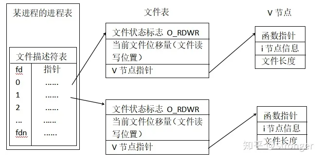
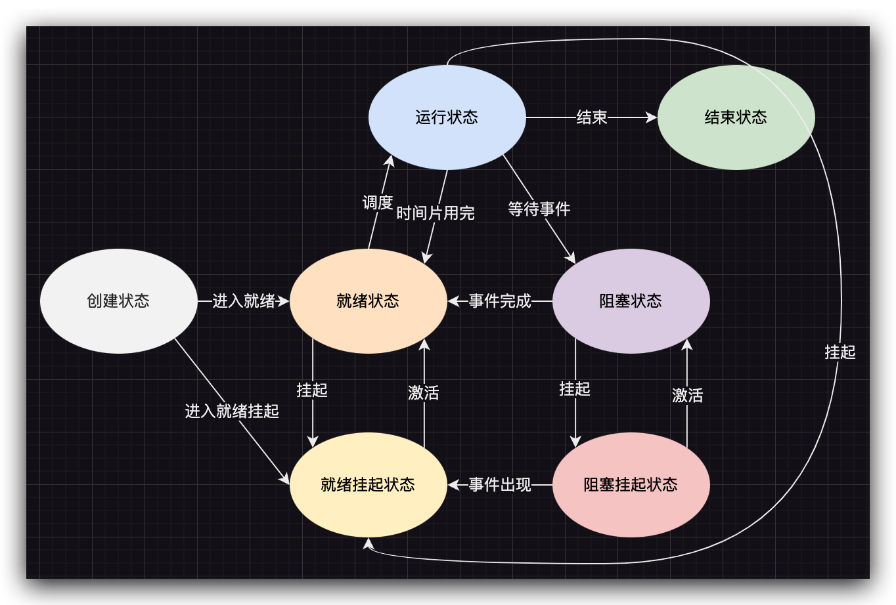

# 进程基础

编译好的可执行文件在运行时被加载到内存，CPU 将依次执行其中的指令，这个运行的程序被称为 *进程*。

狭义定义：进程是正在运行的程序的实例；

广义定义：进程是一个具有一定独立功能的程序关于某个数据集合的一次运行活动。

程序是指令和数据的有序集合，其本身没有任何运行的含义，是一个静态的概念。而进程是程序在处理机上的一次执行过程，它是一个动态的概念，有一定的生命期，是动态产生和消亡的。

## 进程表

为实现进程模式，操作系统会维护进程表，其中包含进程表项，也称进程控制块（Process Control Block, PCB）。代码中的数据结构为 `task_struct`，专门用于存放进程在运行过程中，所涉及到的所有与进程相关的信息。该结构成员项非常多，多达近 300 个。主要包括：

- 进程描述信息：进程标识符、用户标识符等；
- 进程控制和管理信息：进程状态、优先级等；
- 进程资源分配清单：虚拟内存地址空间信息、文件描述符表、IO 设备信息等；
- CPU 相关信息：当进程切换时，CPU 寄存器的值会被保存在 PCB 中，以便恢复执行现场

## 文件描述符

<mark>每一个进程都会维护自己的一套文件描述符表</mark>，用于记录当前进程打开的文件。文件描述符是一个整数，通常范围 0-1024。

进程打开文件返回的文件描述符由系统决定，但通常从 3 开始。因为当进程被创建的时候就会默认创建 3 个文件描述符：

- 0: 标准输入；
- 1: 标准输出；
- 2: 标准错误

但是，在运行的过程中，这都是有可能改变的，程序可能使用 `dup` 系统调用进行文件流的重定向，但这不是本文的重点，不做赘述。

一定要<mark>注意</mark>的是，正如一开始所说，每个进程都会维护这样一张表，因此两个程序即使打开同一个文件，但是它们对应的文件描述符通常是不同的。

系统对于进程打开的文件的管理是非常复杂的，我们会在之后的机制中提到。

进程通过文件描述符可以在文件描述符表中找到指向文件表的指针，文件表中通常会保存文件打开时的标志。进程在进一步找到文件之前会先判断是否有该权限。假设进程以只读方式打开，但是却想写内容，判断就会发现没有这样的权限。此外，文件表中还会记录当前文件读写位置和文件结构指针。

找到文件结构指针后，就可以进行文件读写操作。文件结构中会保存一系列函数指针，会根据底层具体情况的不同，调用不同的函数来实现读写。在文件结构中保存这些函数指针方便调用。

## 进程 7 态模型

某进程在某个时刻所处的状态简单分为以下几种：*运行态、就绪态、阻塞态*。

- 执行态：已经获得 CPU 资源，正在执行；时间片用完时回到就绪态；
- 就绪态：在就绪队列等待获得 CPU 执行；
- 阻塞态：进程需要使用资源，如 IO 请求等；当请求返回或者事件触发时被添加到就绪队列

对于阻塞态，进程会占用内存空间，这是一种浪费行为。于是操作系统会将阻塞的进程置换到磁盘中，此时进程未占用物理内存，这种状态称之为 *挂起态*。

挂起可能不仅仅是内存不足，也有可能是 sleep 系统调用或者用户主动挂起进程。<mark>挂起态描述的是没有实际占用物理内存的状态</mark>。因此，挂起态还分为：

- 阻塞挂起态：进程在磁盘，并等待某个事件的出现；
- 就绪挂起态：进程在磁盘，但进入内存后就会回到就绪队列继续等待执行

## 参考

[进程表和文件描述符](https://zhuanlan.zhihu.com/p/56251739)
