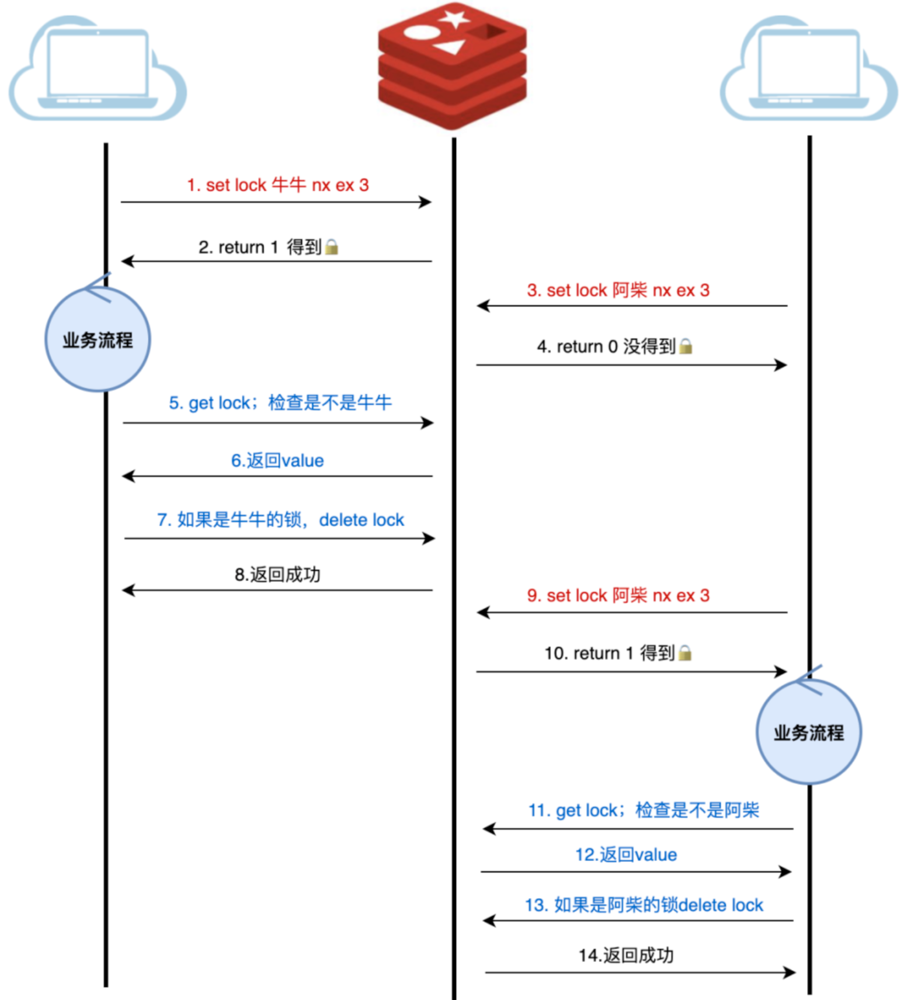
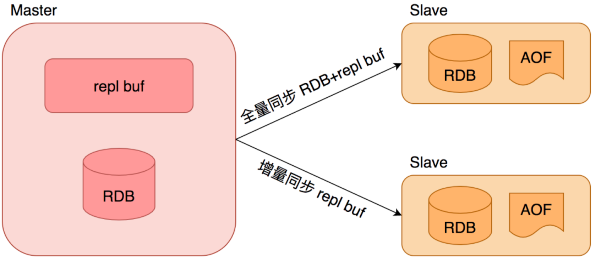
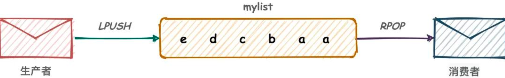

# 场景应用


## 缓存 (重要)

### Redis做缓存

Redis 性能搞笑，通常可以做数据库存储的缓存。通常是将MySQL的热点数据存储在Redis中，满足二八原则，80%的流量在20%的热点数据上。

缓存分为 服务器端缓存 和 客户端缓存， 服务器端缓存即服务端将数据存入Redis，可以在访问DB之后， 将数据缓存，或者 回包时将汇报内容以请求参数为key缓存。

客户端缓存就是IDUI服务端RPC调用后，将结果存储在客户端， 下次请求相同数据时 直接拿结果，不需要远程调用。


### 缓存的几种模式

缓存的模式：

- #### Cache-Aside Pattern

  旁路缓存模式， 应用服务把缓存当作数据库的旁路， 直接和缓存进行交互。

  读操作的流程：

  

  应用服务收到查询请求后， 先查询数据是否在缓存上， 如果在， 就用缓存数据直接打包返回，如果不存在，就访问数据库，从数据库查询，并放到缓存中，入了查库后加载，如果有业务需要，还可以预加载数据到缓存中。

  写操作的流程：

  

  在写操作的时候， Cache Aside 模式一般是先更新数据库， 然后直接删除缓存。 因为更新缓存相比较删除会更容易造成时序性问题。

  （thread1更新mysql -> thread2更新mysql -> thread2更新缓存 -> thread1更新缓存）

  Cache Aside 适用于 **读多写少**的场景，比如 用户信息、新闻报道等， 一旦写入缓存，几乎不会进行修改。

  **缺点：** 可能会出现缓存 和数据库 双写不一致的情况。

  

- #### Read Through Cache Pattern

  读穿透模式， 和Cache Aside 模式的区别主要在于应用服务不再和缓存直接交互，而是直接访问数据服务，数据服务自己来根据情况查询缓存或者数据库。

  和Cache Aside 一样，如果缓存中有， 就用从缓存中获得的数据，没有就查DB， 不过这些由数据服务托管保存，对应用服务是透明的。

  **优势：**缓存对业务透明，业务代码更简洁。

  **缺点：** 缓存命中时性能不如Cache Aside，相比直接访问缓存，会多一次服务间调用。

  

  

  

- #### Write Through Cache Pattern

  写穿透模式，先查询要写入的数据在缓存是否存在，存在则先更新缓存然后再更新数据库最后返回；如果要写入的数据在缓存不存在，有两种对应策略：

  一种是先将数据写入缓存，然后由缓存组建将数据同步更新到数据库；另一种是写入数据库，等到read的时候再加载，这时候跟旁路缓存很像。

  应用程序只有一个单独的访问源， 存储服务自己维护访问逻辑。

  

  当使用Write Through时， 一般都配合使用Read Through 来使用，Write Through的潜在使用场景是银行系统。

  Write Through适应情况：

  - 对更新性能要求较高
  - 不能忍受数据丢失 和数据不一致

  在使用Write Through 时 要特别注意的是缓存的有效性管理， 否则会导致大量的缓存占用内存资源。 甚至有效的缓存数据被无效的缓存数据给清理掉。

  

- #### Write Behind Pattern

  Write Back 异步缓存写入模式，Write Through会把数据立即写入数据库中，Write Behind会在一段时间之后把数据写入到数据库， 这个异步写操作是Write Behind 的最大特点。

  数据库写操作时可以用不同的方式来完成， 其中一个就是收集所有的写操作并在某一时间点批量写入。另一种就是合并几个写操作成为一个小批次操作，接着缓存收集写操作一起批量写入。

  异步写操作极大降低了请求延迟 并减轻了数据库的负担。同时也放大了数据不一致。 比如如果有人直接从数据库中查询数据，但更新的数据还未被写入到数据库，查询的数据就不是最新的数据。


## 缓存常见异常

### 缓存穿透

- #### 问题背景

  缓存穿透是指 **缓存和数据库中都没有的数据**， 用户不断发起请求。 由于缓存是不命中时被动写的， 并且处于容错考虑， 如果从存储层查不到数据则不写入缓存，这将导致不存在的数据每次请求都要到存储层去查询，失去了缓存的意义。

  在流量大的时候，可能DB就挂掉。如果有人利用不存在的key频繁攻击我们的应用，就是漏洞。

  

  如果发起id为"-1"的数据或者id为特别大不存在的数据， 这时的用户可能是攻击者， 攻击会导致数据库压力过大。

- **解决方案**

  1. 接口层增加校验

  2. 从缓存取不到的数据，在数据库中也没有取到，可以将key-value 对写成key-null， 缓存有效时间设置短时间，如30s，可以防止攻击用户反复用同一个id暴力攻击

  3. 布隆过滤器，bloomfilter 类似于hash set， 快速判断某个元素是否在集合中。 典型的应用场景： 快速判断一个key是否存在于容器，不存在就直接返回。布隆过滤器的关键在于hash算法和容器大小。

     布隆过滤器是巧妙的概率型数据结构，特点是高效地插入和查询，用于判断某样东西一定不存在或者可能存在。

     

     **布隆过滤器原理：**

     布隆过滤器 底层是一个64位的整型， 将字符串用多个hash函数映射到不同的二进制位置， 将整型中对应位置设置为1。

     查询时，如果一个字符串所有hash函数映射的值都存在，那么数据可能存在。

     

     **优点：** 空间、时间消耗小

     **缺点：** 结果不完全准确

### 缓存雪崩

- #### 问题背景

  缓存雪崩时指缓存中**数据大批量到过期时间， 而查询数据量巨大， 引起数据库压力过大甚至宕机。**

  和缓存击穿不同的是，缓存击穿指 并发查同一条数据，缓存雪崩 是不同数据都过期， 很多数据都查不到从而查数据库。

- #### 解决方案

  1. 缓存数据的过期时间 设置随机， 防止同一时间大量数据过期现象发生
  2. 如果缓存数据库是分布式部署， 将热点数据均匀分布在不同的缓存数据库中
  3. 设置热点数据永远不过期

  

### 缓存击穿

- #### 问题背景

  缓存击穿是指 **缓存中没有但是数据库中有的数据（一般缓存时间时间到期）**， 由于并发用户多，同时读缓存没读到数据，同时去数据库读取数据，引起数据库压力瞬间增加，造成压力多大。

  缓存击穿是指某一热键， 被超高的并发访问， 在失效的一瞬间，还没来得及重新产生， 就有海量数据，直达数据库

- #### 解决方案

  1. 设置热点数据永远不过期
  2. 接口限流与熔断，降级。 重要的接口一定要做好限流策略。 防止用户恶意刷接口， 同时要降级准备，当接口中的某些服务不可用时，进行熔断，失败快速返回机制。
  3. 加互斥锁

  


## 缓存一致性

### 缓存一致性问题

缓存，是持久化数据的冗余存储， 如果缓存加载了数据源的数据，但是对应数据发生变化该如何？

以最常见的、最实用的旁路缓存模式为基础，主要有三种方式：

1. 更新MySql，不管Redis， 以过期时间兜底
2. 更新MySQL之后操作Redis
3. 异步将MySQL的更新同步到Redis

#### 方向一

使用redis的过期时间， mysql 更新时，redis 不做处理，等待缓存过期失效，再从mysql 拉取缓存。

该方法实现简单， 但不一致的时间会比较明显，应该由具体业务来配置。

**优点：**

- redis原生接口，开发成本低，易于实现
- 管理成本低，出问题概率较小

**不足：**

- 完全依赖过期时间，时间太短容易造成缓存频繁失效，太长容易有较长时间不一致。


#### 方向二

不光通过key的过期时间兜底， 还需要在更新mysql时， 同时尝试操作redis。 这里的操作分两种：1.更新，直接将结果写入Redis， 但实际上很少用更新，直接删除，等下次访问时再加载。因为更新容易造成时序性问题。


**优点：**

- 相对方案一， 达成最终一致性的延迟更小
- 实现成本较低， 在方案一的基础上，增加了删除逻辑

**不足：**

- 如果更新mysql成功，删除redis失败，退化到了方案一
- 在更新时候需要额外操作redis， 带来了损耗


#### 方向三

把消费服务作为mysql的一个slave， 订阅mysql 的binlog 日志，解析日志内容， 再更新到redis。此方案和业务完全解耦，redis的更新对业务方透明，减少心智成本。


**优点：**

- 和业务完全解耦，更新mysql时，不需要做额外操作；
- 无时序性问题，可靠性强

**不足：**

- 引入消息队列组件，还要单独搭建一个同步服务，维护需要额外成本
- 同步服务如果压力较大，或者崩溃，那么在之后的长时间内，redis都是老旧数据


### 方案选择

1. 如果产品对延迟性的要求，如果要求极高，且数据有可能变化，别用缓存
2. 过期时间兜底时行之有效的办法， 根据实时性，可以增加删除逻辑，提升一致性
3. 长期需要存在的数据，用消息队列来更新，是不错的选择


## 事务（知道lua）

多个操作被看作一个整体，即事务， 事务通常具备原子性。

### Multi事务

Redis 原生有Multi命令， 可以开启事务。

原生事务 由 MULTI、EXEC、 DISCARD 或 WATCH 四个命令配合完成。

#### 如何操作

1. 开启事务

   ```shell
   127.0.0.1:6379> multi
   OK
   ```

   

2. 执行命令， 都会到Redis 队列里， 但并不真正执行

   ```shell
   127.0.0.1:6379(TX)> set tx1 1
   QUEUED
   127.0.0.1:6379(TX)> set tx2 2
   QUEUED
   ```

   

3. 实际执行

   ```shell
   127.0.0.1:6379(TX)> exec
   1) OK
   2) OK
   ```

4. discard 是指在multi 之后， exec 之前，都可以放弃。

5. Watch 用来提前来观察数据， 具体来说， 用于监视一个或多个key， 如果在事务 执行之前 这个key被其他命令锁改动，那么事务将被打断。

   watch 命令 可以决定事务时执行还是回滚， 一般的操作是： 在multi 命令之前使用watch命令监控 某些键值对，然后使用 multi 命令开启事务， 执行各类对数据结构进行操作的命令， 这些命令会 先入先出队列中。

   Redis 使用exec 命令执行事务的时候， 首先会 比较对被watch 的键值对有没有发生变化， 如果产生变化回滚事务，没有变化执行事务中的命令，无论事务执行与否，都会取消事务之前的watch命令。


#### 原理

Redis服务存储了一个结构体， 包含了队列里的命令列表，先入先出。

执行的时候顺序执行


#### Multi事务具备原子性么

不具备，只是单线程的特性，让其他操作切不进来。

但是如果中途崩溃，或者自己有问题，还是可能只做一半。

**case**

创造两个value 为string的key

```
127.0.0.1:6379> set tx1 tx1 
OK
127.0.0.1:6379> set tx2 tx2
OK
127.0.0.1:6379> get tx1
"tx1"
127.0.0.1:6379> get tx2
"tx2"

```

开启事务

```
127.0.0.1:6379> multi
OK
127.0.0.1:6379(TX)> set tx1 txone
QUEUED
127.0.0.1:6379(TX)> lpop tx1
QUEUED
127.0.0.1:6379(TX)> set tx2 txtwo
QUEUED
127.0.0.1:6379(TX)> exec
1) OK
2) (error) WRONGTYPE Operation against a key holding the wrong kind of value
3) OK
127.0.0.1:6379> get tx1
"txone"
127.0.0.1:6379> get tx2
"txtwo"
```

中间的失败， 前后依然成功


#### Multi 三宗罪

弱原子

1. 事务开启后， 每个命令其实都是一次调用，浪费资源
2. 这些命令执行之间是有时间的，需要watch提前来观察
3. 通常来说失败了会中断后续流程，而Multi 失败会继续

Multi  无论是 原子性、功能性、易用性都比较差， 所以很少有团队在生成环境使用MULTI

### Lua做事务

Lua 是一种 用 标准C 语言编写的轻量的脚本语言， 设计目的是为了嵌入应用程序中，从而 为应用程序提供灵活的扩展和定制功能。

Lua的目标就是为应用程序提供扩展。

#### Redis 和Lua

Redis 是2.6 版本通过内嵌支持Lua 环境，执行脚本的常用命令为EVAL。

Redis 因为是单线程操作， 处理过程中， 不会被打断并切换到其他处理，所以Redis执行Lua，不出异常的情况下，也不会被打断。


#### 操作lua

EVAL "return {KEYS[1],KEYS[2],KEYS[3], ARGV[1], ARGV[2]}" 2 key1 key2 first second

```shell
127.0.0.1:6379> EVAL "return {KEYS[1], KEYS[2], ARGV[1], ARGV[2]}" 2 key1 key2 first second
1) "key1"
2) "key2"
3) "first"
4) "second"
```


#### Lua事务的优势

相比原生的Multi

- 可以编写 if else 这种选择逻辑
- 事务中间如果失败， 会中断后续执行
- 使用方便，开启Lua就可以执行事务，不像Multi 还需要Watch 保证执行 开始时状态未改变


#### Lua在Redis 中主要做什么

任何事物场景都可以用Lua

常见的就是 分布式锁 和 秒杀场景。


## 分布式锁（很重要）

### 什么是分布式锁

锁 是针对某项资源使用权限的管理，用来控制共享资源。

常见的 一个进程内多个线程竞争一个数据的使用权限，解决方式之一就是加锁

分布式锁，分布式场景下的锁，多台不同机器上的进程竞争同一项资源，就是分布式锁

### 分布式锁有哪些特性

- 互斥性
- 安全性
- 对称性
- 可靠性


### 分布式锁的常用实现方式

分布式锁，一般会依托第三方组件来实现，利用Redis 实现 则是工作中应用最多的。


#### 最简化版本的分布式锁

首先，搭建一个最简单的实现方式，使用Radis的setnx命令， `setnx key value`， 如果key不存在，将key设置为value，返回1； 如果key存在，不会有任何影响，返回0；

通过使用这个特性，可以用setnx 实现加锁的目的；通过setnx 加锁，加锁之后其他服务无法加锁，用完之后， 通过delete解锁。


#### 支持过期时间

**如果 获取锁的服务挂掉，锁就得不到释放，因此需要一个超时来进行兜底**

Redis 中expire命令 用来设置一个key 的超时时间，但setnx 和expire 不具备原子性。

因此使用 set 和expire，`set key value nx ex seconds` nx表示 具备setnx 特性， ex表示增加了过期时间，最后一个参数是过期时间的值


能够支持过期时间， 但是 **会存在服务A释放掉服务B的锁的可能**。

#### 加上owner

服务A 获取了锁， 由于业务流程长，网络延迟，GC卡顿等，导致锁过期，但是业务在继续进行，此时，业务B获取了锁，准备执行，服务A恢复过来并做完了业务，就会释放锁，而B还在继续执行。


真实的分布式场景中，会存在几十个竞争者， 上述情况发生概率就很高，导致同一份资源频繁被不同竞争者同时访问。

针对上述情况， 分布式锁需要满足谁申请谁释放的原则，不能释放别人的锁，分布式锁要有归属




完整的流程是竞争者获取锁执行任务， 执行完毕后检查锁是不是自己的，最后释放。但是这些操作不是原子化的。

**可能锁获取时是自己的，删除时是别人的。** （因为获取owner和删除锁不是原子操作， 所以当你获取owner的时候是自己的，准备删除时，锁过期并且被其他人抢到锁，会造成误删）

#### 引入Lua

针对上述情况，使用Redis 的特性，专门整合原子操作-Lua。 Redis + Lua 可以说是专门为解决原子问题而生。


可以满足分布式锁的三个特性： **对称性**、**安全性**、**互斥性**


### 可靠性如何保证

分布式锁的四大特性 还剩可靠性没有解决

针对一些异常场景， Redis 挂掉了， 业务执行时间过长、网络波动，该如何处理

**容灾考虑**

上述谈及的内容都是基于单机考虑的， 如果Redis 挂了， 锁就不能获取了，解决办法由：**主从容灾**和**多机部署**

#### 主从容灾

为Redis 配置从节点，当主节点挂了，用从节点顶包




主从切换，需要人工参与，提高人力成本。

不过Redis 也有成熟的方案， 哨兵模式。


虽然增加从节点 可以一定程度解决单点的容灾问题，但是由于雨时延，Slave可能会损失掉部分数据，分布式锁可能失效。（数据同步有延迟，A创建的分布式锁，这条数据还没同步到从节点中，B就向从节点申请创建同一把锁，此时就会创建成功，从而造成了AB 同时拥有一把锁）


#### 多机部署

对一致性要求高，可以尝试多机部署，比如Redis的RedLock，多个机器，通常是奇数个，达到一半以上同意加锁才算加锁成功。

假设有5个Redis 主节点， 基本保证不会同时宕掉， 获取锁和释放锁的过程中，客户端会执行的操作：

1. 向5个Redis 申请加锁
2. 只要超过一半，也就是3个Redis 返回成功，就可以获取到锁，如果超过一半失败， 需要向每个Redis 发送解锁命令
3. 由于向5个Redis 发送请求，会有一定时耗，所以锁剩余持有时间，需要减去请求时间。
4. 使用完成之后，向5个Redis 发送解锁请求。


单点Redis的所有手段， 都可以在多机模式使用。每个节点配置哨兵模式，由于加锁是一半同意就行，那么单个节点进行了主从切换，单个节点数据的丢失，就不会让锁失效，增强了可靠性。

##### 可靠性深究

由于分布式系统中有三大困境（NPC），所以没有完全可靠的分布式锁

**N：Network Delay（网络延迟）** 当分布式锁获得返回包的时间过长，此时可能虽然加锁成功，但是锁可能很快过期。 RedLock 中通过 锁剩余持有时间，需要减去请求时间，就可以一定程度解决网络延迟的问题。

**P：Process Pause（进程暂停）** 发生GC，获取锁之后GC了，处于GC执行中，然后锁超时


其他锁获取， GC回来之后，两个进程获取到同一个分布式锁


**C：Clock Drift（时钟漂移）**

如果5台机器都发生了时钟漂移， 锁瞬间过期。这时候竞争者B拿到了锁，此时A和B同时获取了执行权限。


### 总结

PS: RedLock 在生产中 其实用得不多， 本身不能完全可靠，业务由基本上了做了幂等，太复杂。


## 消息队列

消息队列，传递消息的队列，消息队列有着先入先出的特性，用于异步流程、消息分发、流量削锋等问题，通过消息队列可以实现高性能、高可用性、高扩展性的架构。

分布式系统有不少消息队列中间件， 出名的有ActiveMQ、RabbitMQ、ZeroMQ、Kafka、MetaMQ、RocketMQ，这些队列通常有可靠性、高性能等。

### Redis做消息队列

Redis 很适合来做不那么完善的消息队列——轻量级消息队列。

Redis 中， 一般有3种方案来做轻量级消息队列。

#### List做消息队列

数据对象List 本身是一个 双端列表，命令也可以支持先入先出。 可以在一个服务中将数据放进List，另一个服务来进行接收处理，形成一个典型的生产消费模式。




具体过程：

1. 用RPUSH 往队列末尾增加元素

   ```shell
   127.0.0.1:6379> RPUSH listmsg msg1 msg2 msg3
   (integer) 3
   127.0.0.1:6379> RPUSH listmsg msg4
   (integer) 4
   ```

   

2. 另一个客户端用LPOP从队头取出元素，实现先入先出

   ```shell
   127.0.0.1:6379> LPOP listmsg
   "msg1"
   127.0.0.1:6379> LPOP listmsg
   "msg2"
   127.0.0.1:6379> LPOP listmsg
   "msg3"
   127.0.0.1:6379> LPOP listmsg
   "msg4"
   127.0.0.1:6379> LPOP listmsg
   (nil)
   ```

   消费者不知道LPOP的时机， 只能不停按时间间隔轮询，这是一个负担，所以Redis 也提供了阻塞版的POP命令，BRPOP、BLPOP。用BLPOP从队头消费，如果没有消息就回阻塞，直到达到超时时间。

   ```
   127.0.0.1:6379> BLPOP listmsg 10
   (nil)
   (10.01s)
   // 如果等待过程中有消息过来，就会有消费信息
   127.0.0.1:6379> BLPOP listmsg 10
   1) "listmsg"
   2) "msg1"
   (3.77s)
   ```

   但是该消费队列 没有ACK机制，即消费者去消息之后，消息就出队列了， 如果消费失败，消息还得想办法放回去

   可以通过一下几种方式解决：

   1. 先用LRANGE 读队列信息，消费完成之后，再POP， 这样消息可能被多个消费者消费。
   2. POP之后，扔到另一个队列中，消费确认了，删除该信息，如果失败，重新放置回队头，这要用Lua 做原子性。

   

#### Pub/Sub生产订阅模式

除了用List 对象做消息队列， Redis 提供了发布订阅模式来实现消息的传递


当订阅者订阅某个频道， 如果生产者 将消息发送到这个频道， 订阅这就能收到该消息，这种模式支持多个消费者订阅相同的频道，互不干扰。

实际操作

1. 在两个终端订阅chanmsg 这个channel， 语法是`SUBSCRIBE channel [channel...]`，

   ```
   127.0.0.1:6379> SUBSCRIBE chanmsg
   Reading messages... (press Ctrl-C to quit)
   1) "subscribe"
   2) "chanmsg"
   3) (integer) 1
   ```

   

2. 在第三个终端，连发三条消息，语法是`PUBLISH channel message`

   ```
   
   127.0.0.1:6379> PUBLISH chanmsg cat
   (integer) 2
   127.0.0.1:6379> PUBLISH chanmsg dog
   (integer) 2
   127.0.0.1:6379> PUBLISH chanmsg fish
   (integer) 2
   ```

   

3. 在订阅者终端查看消息， 两个终端均收到消息

   ```
   127.0.0.1:6379> SUBSCRIBE chanmsg
   Reading messages... (press Ctrl-C to quit)
   1) "subscribe"
   2) "chanmsg"
   3) (integer) 1
   1) "message"
   2) "chanmsg"
   3) "cat"
   1) "message"
   2) "chanmsg"
   3) "dog"
   1) "message"
   2) "chanmsg"
   3) "fish"
   ```


订阅者 还支持订阅模式， 即一个模式信息，比如 chan*,就能订阅所有chan开头的频道


PUB/SUB 来实现消息队列的不足：

1. 没有ACK功能
2. 不支持持久化， Redis重启后消息会全部丢失


#### Stream做消息队列

Redis5.0 发布了Stream对象， 提供了消息的持久化，消费组等功能。


#### 几种方式对比

|  List   |     不需要ACK，不需要消费组     | 可用 |
| :-----: | :-----------------------------: | :--: |
| PUB/SUB |     不需要ACK，不需要持久化     | 可用 |
| Stream  | 需要ACK，需要消费组，需要持久化 | 可用 |

Stream 功能最全。


## 秒杀

某种活动瞬间产生巨大流量的场景

第一点， 海量请求， 服务要能扛住

第二点，不能超卖

第三点，避免少卖

第四点，保证触达用户不是黄牛


## 限流器

流量限制，用来管控请求的速度。

### 计数器算法

计数器算法 通过技术来记录请求次数。 设定一个阈值， 要求单位时间内的请求不得超过这个阈值。

如果是单机限流，可以用一个证书+ 时间戳记录。 时间戳达到上限，从0开始，计数达到阈值则拒接。

分布式限流， 可以利用Redis 的过期时间，到了设定时间就自动过期，要使用Lua 脚本保证Redis的原子操作


优点：实现简单，不易出错

缺点：有请求突刺，可能会超过我们的单位时间的阈值


### 滑动窗口

滑动窗口算法 就是计数器算法的优化版本。 将一段时间看成一个整体， 以当前物理时间为基点往前看，看基于当前时间的时间窗口是否超过阈值，超过阈值就拒绝请求。


### 漏桶算法

有一个桶入水速度不定，出水速度由于管口较小，都是一滴一滴下来，所以速度恒定。如果桶满了，就不能再往里面加水了。


无法精确判断网络带宽或处理能力， 如果产生一波突发流量，经过漏桶算法，依然会以恒定的目标码率慢慢发送。导致漏桶算法无法充分用满性能资源。

如何解决：

1. 动态调节水滴速度
2. 用另一种痛，令牌桶


### 令牌桶算法


令牌桶算法： 有一个桶，均匀产生令牌， 如果令牌把桶塞满了，就不再生产令牌， 请求过来的时候，需要先拿到桶里的令牌，才能做后续处理，如果桶里没有令牌，就可以放弃或等待。

令牌桶算法能够在请求小的时候，积累令牌， 这种模式在限制数据的平均传输速率的同时 还允许某种程度的突发传输。


### 四种算法对比

复杂度： 令牌桶 >= 漏桶 滑动窗口 计数器

均匀度： 令牌桶和漏桶 都属于流量整形算法，而滑动窗口、计算器算法，只是限制了一段时间的个数，没有流量整形的效率

容忍突发流量： 限流策略允许流量在短时间内突增，且突增结束后不会影响后续流量的正常限流， 这一块只有令牌桶支持。


|            | 复杂度 | 均匀度 | 突发流量处理 |
| ---------- | ------ | ------ | ------------ |
| 计数器     | 低     | 不均匀 | 不支持       |
| 滑动窗口   | 低     | 不均匀 | 不支持       |
| 漏桶算法   | 中     | 强均匀 | 不支持       |
| 令牌桶算法 | 中     | 均匀   | 支持         |

