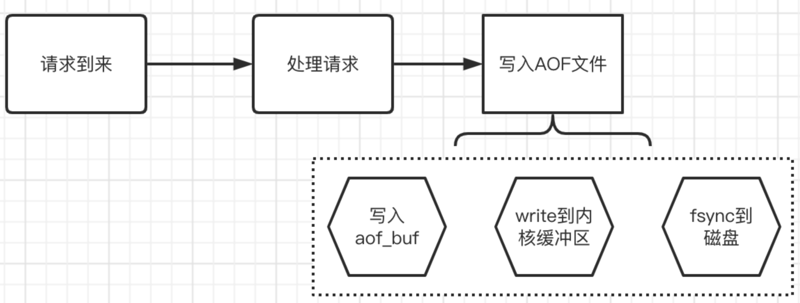
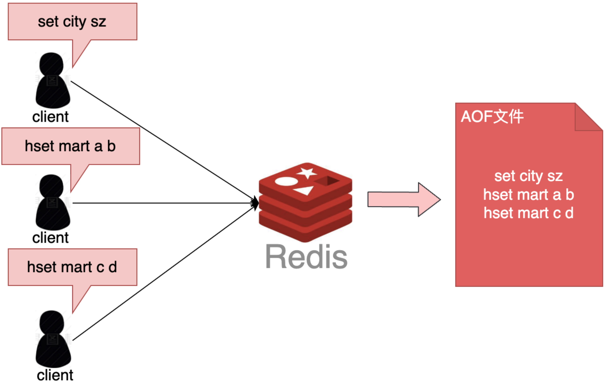
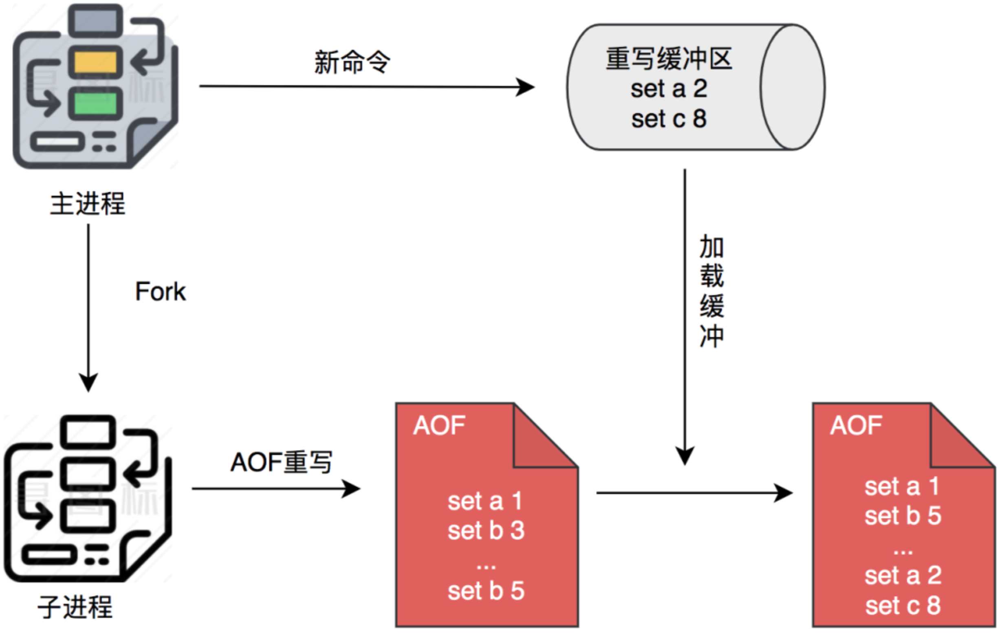
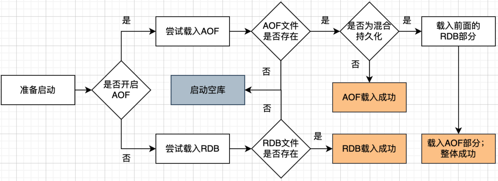
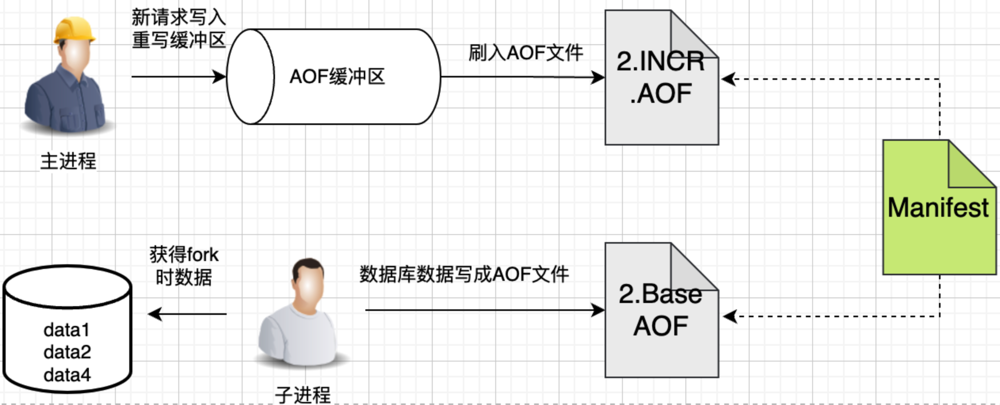

# Redis 数据丢失

## Redis持久化

redis 是在 内存中运行的， 当程序重启或者 服务崩溃， 数据就会丢失， 如果业务场景希望重启之后数据还在，就需要持久化，把数据保存到可永久保存的存储设备中。

## 持久化方式

Redis提供两种方式来持久化：

1. RDB（Redis Database）， 记录Redis 某个时刻的全部数据， 即数据快照， 保存二进制数据到磁盘，通过加载RDB人间恢复数据
2. AOF（Append Only File）， 记录执行的每条命令， 重启之后通过重放来恢复数据， AOF 本质是记录操作日志， 后续通过日志重放恢复数据。

RDB 是快照恢复， AOF是日志恢复，两者的区别：

- **体积方面：** 相同数据量， RDB体积更小，因为 RDB 是记录的二进制紧凑型数据
- **恢复速度：** RDB是数据快照，可以直接恢复，AOF文件恢复相当于重放情况，RDB显然更快
- **数据完整性：** AOF记录每条日志， RDB是间隔一段时间记录一次，用AOF恢复数据通常会更为完整


### RDB详解

#### RDB的触发方式

- ##### 配置文件

  最常见的RDB 持久化方式， 是在配置文件redis.conf中配置 进行快照保存的时机  

  ```
  save [interval] [num]
  ```

  意思是如果interval 秒内如果发生了 num次数据修改， 则进行一次RDB 快照保存。

  Redis 默认开启RDB快照，

  ```
  save 900 1
  save 300 10
  save 60 10000
  ```

  只要满足其中一个条件，就可以达到RDB 持久化的条件。

- ##### 手工触发

  直接使用手工命令的方式触发RDB 生成快照文件

  一种是save命令， save命令是同步方式生成快照， 会造成Redis阻塞， 所有后续到达的命令要等待save 完成后才能执行。

  ```c
  127.0.0.1:6379> save
  OK
  ```

  二是 bgsave 命令， 采用异步方式 生成快照， Redis 会 fork 出一个子进程进行RDB 文件的生成， Redis 只有在fork子进程的时候被阻塞， 子进程完成快照生成的同时， Redis可以正常工作。

  ```c
  127.0.0.1:6379> bgsave
  Background saving started
  ```

- ##### 其他触发方式

  - 主从复制时， 自动生成RDB文件
  - Redis中的debug reload 提供debug 级别的重启， 自动生成RDB文件
  - shurdwown会自动生成RDB文件

- ##### 达到持久化配置阈值

  Redis 可以配置持久化策略， 达到策略就会出发持久化， 这里的持久化使用的方式是后台save（bgsave）， 可以减少对主流程的影响。达到阈值之后， 是由周期函数触发持久化。

- ##### 在程序正常关闭的时候执行

  关闭时， Redis 会启动 一次阻塞时持久化， 记录更全的数据

  正常关闭 数据不会丢失， 崩溃才会（主从同步的话， 主节点 没崩溃， 从节点崩溃就算主节点正常关闭， 也可能丢失数据）


### RDB流程

从整体上：

1. Fork 出一个子进程 专门来做 RDB 持久化
2. 子进程 写数据到临时的RDB 文件
3. 写好之后，用新RDB文件替换旧RDB文件


具体而言：fork 创建子进程之后，通过写时复制技术， 子进程和父进程 共享同一片内存数据， 创建子进程时，会复制父进程的页表，但是页表指向的物理内存还是一个。


只有在发生修改内存数据的情况下， 物理内存才会被复制一份


Redis 使用bgsave 对当前内存中的所有数据做快照，这个操作是由bgsave子进程在后台完成的， 执行时不会阻塞父进程中的主线程， 使得主线程同时可以修改数据。

目的是 为了减少创建子进程是的性能损耗， 从而加快创建子进程的速度，因为创建子进程的过程，会阻塞主线程。

### 总结

Redis中RDB的触发方式有三种：

1. 达到阈值周期函数触发
2. 正常关闭Redis服务触发
3. 主动执行BGSAVE命令触发。


Redis通过fork一个子进程的方式来进行RDB， 配合写时复制技术， 相当于异步执行，和主进程互不干扰， 对执行流程的影响降到最低。


## AOF详解

appendonly 设置位yes， 即可打开AOF。打开之后，Redis 每条更改的操作都会记录到AOF文件中，当你重启，AOF会重建状态,相当于请求全部重放一次，所以AOF 恢复比较慢


### AOF写入流程

执行请求时，每条日志都会写入到AOF。


Redis提供了不同的策略来选择不同的损耗。

Redis 提供了3中刷盘策略：

1. appendfsync always， 每次请求都刷入AOF, 慢，但是安全
2. Appendfsync everysec ， 没秒刷一次盘，但是在崩溃场景下可能丢失1秒的数据
3. appendfsync no 不主动刷盘，让操作系统自己刷，一般linux 30s 刷一次，


### 写入AOF 细节

第一步：将数据写入AOF 缓存中， 缓存名字是aof_buf，是一个sds数据

```c
sds aof_buf;
```

第二步：aof_buf 对应数据刷入磁盘缓存区，Redis 源码中 有4个时机，会调用一个flushAppendOnlyFile 的函数， 这个函数会使用write函数来将数据写入操作系统缓冲区：

1. 处理完事件处理后，等待下一次时间到来之前， 也就是beforeSleep
2. 周期函数serverCron中
3. 服务器退出之前的准备工作中
4. 通过配置指令关闭AOF功能时

如果是appendfsync everysec 策略， 在上一次fsync还没完成之前，并且时长不超过两秒，本次flushAppendOnlyFile 就会放弃， 也就是说本轮放弃aof_buf 里的数据 write 进fd

第三步， 刷盘， 即调用系统的flush函数，（fsync/fdatasync）

 刷盘是在flushAppendOnlyFile函数中，在write 之后， 但不一定调用flushAppendOnlyFile， flush 就一定会被调用，这里其实是支持一个刷盘时机的配置。



#### AOF列子

```shell
127.0.0.1:6379> set city sz
OK
127.0.0.1:6379> hset mart a b
(integer) 1
127.0.0.1:6379> hset mart c d
(integer) 1
```

对应生成AOF文件



#### AOF重写

AOF不断写入， 会不会膨胀？

Redis采用重新的方式解决：

Redis可以在AOF 文件体积变得过大时，自动地在后台Fork 一个子进程， 用于对AOF进行重写，针对相同key的操作，进行合并，比如同一个key的set操作，就是后面覆盖前面。

在重写过程中，Redis 不但将新的操作记录 在原有的AOF 缓冲区， 而且还会记录在AOF重写缓冲区。一旦新AOF文件创建完毕，Redis 就会将重写缓冲区内容，追加到新的AOF文件， 再用新AOF文件替换原来的AOF文件。



AOF达到多大会重写， 实际上，这也是配置决定，默认如下，同时满足两个条件则重写：

```
# 相比上次重写时候数据增长10%
auto-aof-rewrite-percentage 100

# 超过
auto-aof-rewrite-min-size. 64mb
```

超过64M的情况下， 相比上次重写的数据大一倍，则触发重写。


### 总结

AOF 是通过记录日志来进行持久化，Redis 提供了三种刷盘策略以应对不同的性能要求，分别是每次刷、每秒刷、不主动刷三种，其中Redis 是推荐每秒刷的模式。

针对AOF文件 不断膨胀的问题， Redis还提供了重写机制，针对相同的key的操作进行合并，来减小AOF的空间。


## AOF优化--混合持久化

### 混合持久化是什么？

混合部署 实际 发生在AOF 重写阶段， 将当前状态保存为RDB 二进制内容，写入AOF 文件，再将重写缓冲区的内容追加到AOF文件。

此时的AOF文件，不再单纯的是日志数据，而是 二进制数据 + 日志数据的混合体，所以叫混合持久化


### 混合持久化解决什么问题

混合持久化是发生在原有的AOF流程，只是重写的时候使用RDB进行了优化

### 混合持久化开启后，服务启动时，如何加载持久化数据

混合持久化文件开头有Redis这个标记。

如果同时启用AOF 和 RDB， Redis重新启动时，会使用AOF 文件来重建数据集，通常AOF的数据会更完整，所有优先使用混合持久化的数据。



### 总结

混合持久化是对AOF重写的优化，可以大大降低AOF重写的性能损耗， 降低AOF文件的存储空间，付出的代价是降低AOF文件的读写行。


## AOF优化-MP方案


### MP-AOF方案概述

MP-AOF， 全称Multi Part AOF， 多部件AOF， 通俗来说就是一个AOF文件，变成多个AOF文件配合。

MP-AOF 文件核心有两个Part组成：

1. BASE AOF文件， 基础AOF 文件，记录了基本的命令
2. INCR AOF文件，记录了在重写过程中新增的操作命令

原来的AOF文件包含了操作的命令记录 ， MP-AOF 则提出了BASE AOF 和 INCR AOF 两种文件的组合， 一个BASE AOF 结合 INCR AOF， 一起来表示所有的操作命令。

新模型的流程：




重写阶段，主进程写入（aof_buf） AOF缓冲区即可， aof_buf的数据最终写入新打开的INCR AOF文件，子进程根据fork时数据库的数据， 重写并生成新的一个BASE AOF文件。 

写完之后 不会覆盖原有的AOF文件， 只需要更新manifest文件，是一个文件清单，记录当前有效的BASE AOF INCR AOF，

旧的BASE AOF、 INCR AOF 会被标记为history AOF， 会被Redis 异步删除。


