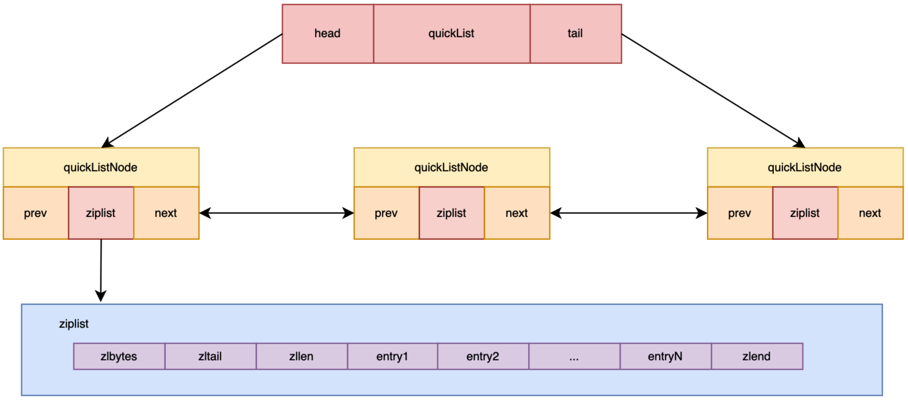
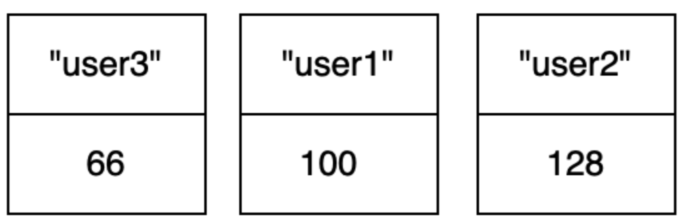
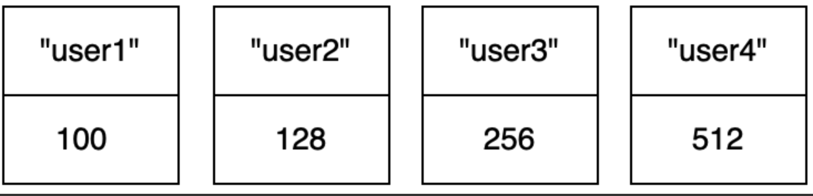
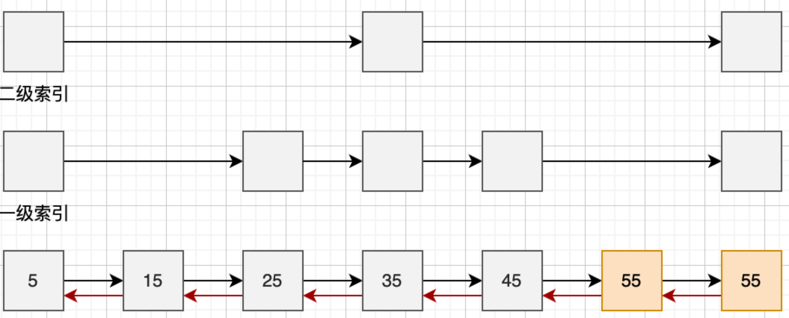

# Redis 对象

## Redis Object

Redis 是 key-value 存储，key 和 value 在 Redis 都被抽象为对象，key 只能是 String 对象，而 value 支持所有 Redis 对象，包括 String、List、Set、Hash、Sorted Set、Stream。

### Object的定义

```c
#define LRU_BITS 24

typedef struct redisObject{
  unsigned type:4; // Redis 对象
  unsigned encoding:4; // 底层编码， 用OBJECT ENCODING[key]  可以看到编码方式
  unsigned lru:LRU_BITS; // 记录对象访问信息， 用于内存淘汰
  int refcount; // 引用 计数， 描述有多少个指针指向该对象
  void *ptr; // 内容指针， 指向实际内容
}robj;
```

### 对象与数据结构

实际操作的有 6 个 Redis 对象，底层依赖字符串、跳表、哈希表、压缩列表、双端列表。

## String

字符串是 Redis 中基本的数据对象最大为 512MB，可以通过 proto-max-bulk-len 进行修改。

### 场景

存字节数据、文本数据、序列化后的对象数据等。

**创建**：即产生一个字符串对象数据，可以用 SET、SETNX 命令；

**查询**：可以用 GET 获取字符串的值，如果想获取多个可以用 MGET；

**更新**：用 SET 更新；

**删除**：针对 String 对象本身的销毁，使用 DEL 命令。


### 写操作

- #### SET

  语法：`SET key value`

  功能：设置一个 key 的值为特定的 value，成功则返回 OK

  ```
  SET strniuniu cat
  ```

  SET 的扩展参数：

  - SET key value EX second：设置键的“过期时间”；
  - SET key value PX millisecond：设置键“过期时间”为多少毫秒；
  - SET key value NX：只有键不存在时，才对键进行设置操作，等同于 SETNX key value；
  - SET key value XX：只有键已经存在时，才对键进行设置操作

- #### SETNX

  语法：`SETNX key value`

  功能：用于当指定的 key 不存在时，为 key 设置指定的值。返回值 0 表示 key 存在，不做操作；1 则表示成功。

  对存在的 key 调用 SETNX：

  ```
  SETNX strniuniu fish
  (integer) 0
  ```

  对不存在的 key 调用 SETNX：

  ```
  SETNX strmart fish
  (integer) 1
  ```

- #### DEL

  语法：`DEL key [key...]`

  功能：删除对象，返回值为删除成功了几行

  ```
  DEL strmart1
  (integer) 1
  ```


### 读操作

- #### GET

  语法：GET key

  功能：查询某个 key，存在就返回对应的 value；如果不存在则返回 nil。

  ```
  get strniuniu
  "fish"
  127.0.0.1:6379> get strmart
  (nil)
  ```

- #### MGET

  语法：MGET key [key...]

  功能：依次查询多个 key，如果某个 key 不存在对应位置返回 nil。

  ```
  127.0.0.1:6379> MGET strmart strniuniu
  1) (nil)
  2) "fish"
  ```

## 底层实现

#### 三种编码方式

String 有三种编码方式：


`INT` 编码：存一个整型，long 类型整数以这种编码存储；

`EMBSTR` 编码：字符串小于阈值字节，使用 EMBSTR 编码

`RAW` 编码：字符串大于阈值字节，则用 RAW 编码

阈值字节，在 3.2 版本之后是 44 字节。

`EMBSTR` 和 `RAW` 都是由 `redisObject` 和 `SDS` 两个结构组成

`EMBSTR` 编码的 `redisObject` 与 `sds` 结构体存放在连续的内存。 


- **优点**

  `redisObject` 和 `sds` 两个结构一次性分配空间

- **缺点**

  如果重新分配空间，整体都需要再分配，所以 `RMBSTR` 编码的字符串设计为只读；任何写操作之后，字符串的编码都会从 `EMBSTR` 变成 `RAW`。

`RAW` 编码的 `redisObject` 和 `SDS` 在内存中分开存储。


编码的转换：

`INT` -> `RAW`：当存的内容不再是整数，或者大小超过了 long；

`EMBSTR` -> `RAW`：任何写操作之后 `EMBSTR` 都会变成 `RAW`

*`sds`(simple Dynamic String)*，简单动态字符串是 Redis 内部作为基石的字符串封装。

#### 为什么要用 sds

在 C 语言中，字符串使用 ‘\0’ 结尾的 char 数组表示。

比如 "hello niuniu" 实际存储 `hello niuniu\0`。

这样会导致：

1. 每次计算字符串长度的复杂度为 O(N)；
2. 对字符串进行追加，需要重新分配内存；
3. 非二进制安全

在 Redis 内部，字符串的追加和长度计算很常见，所以 Rediscover 封装了一个叫 `SDS` 的字符串结构，用于解决上述问题。

Redis 中 `sds` 分为 `sdshdr8, sdshdr16, sdshdr32, sdshdr64`，它们的字段属性都一致，区别是应对不同大小的字符串。

例如 sdshdr8：

```c
struct __attribute__ ((__packed__)) sdshdr8 {
    uint8_t len; /* used 表示使用了多少 */
    uint8_t alloc; /* excluding the header and null terminator  表示一共分配了多少内存 ， alloc - len 就是预留空间的大小 */
    unsigned char flags; /* 3 lsb of type, 5 unused bits 标记是哪个分类 */
    char buf[];
};

//flags 表示分类
#define SDS_TYPE_8 1
```


1. 增加长度字段 len，快速返回长度；
2. 增加空余空间（alloc-len），为后续追加数据留余地；
3. 不再以 '\0' 作为判断标准，二进制安全

SDS 的预留空间的规则：

1. len 小于 1M 的情况，alloc = 2 * len，即预留 len 大小的空间；
2. len 大于 1M 的情况，alloc = 1M + len，即预留 1M 大小的空间

预留空间为 min(len, 1M)。

## List

List 是一组连接起来的字符串集合。

### 有什么限制

List 最大元素个数是 2^32-1（4294967295），新版本是 2^64-1。 

### 使用场景

List 作为一个列表存储，属于底层的数据结构，比如：存储一批”任务数据“，存储一批“信息”等。

### 常用操作

创建、查询、更新和删除。

- 创建：产生一个 List 对象，一般用 LPUSH、RPUSH，分别从头部插入元素和尾部插入元素；
- 查询：使用 LRANG 进行范围查询，用 LLEN 查询元素个数；
- 更新：对列表对象进行追加、删除元素，有 LPUSH、LPOP、RPOP、RPUSH、LREM 等；
- 删除：对 List 对象本身的生成和销毁，使用 DEL 命令进行对象删除，版本 4.0 之后引入 UNLINK 命令进行对象删除

### 写操作

#### LPUSH

语法：`LPUSH key value [value...]`

功能：从头部增加元素，返回值为 List 中元素的总数

```shell
127.0.0.1:6379> LPUSH listniuniu s1 s2 s4
(integer) 3
127.0.0.1:6379> LPUSH listniuniu s4
(integer) 4
```

从 List 头部进行插入。


#### RPUSH

语法：`RPUSH key value [value...]`

功能：从尾部增加元素，返回值为 List 中元素的总数

```shell
127.0.0.1:6379> RPUSH listniuniu s5
(integer) 5
```

从 List 尾部进行插入。


#### LPOP

语法：`LPOP key`

功能：从头部删除元素，返回值为 List 中删除的元素

```shell
127.0.0.1:6379> LPOP listniuniu
"s4"
```

从 List 头部删除元素。


#### RPOP

语法：`RPOP key`

功能：从 List 尾部删除元素，返回值为 List 中删除的元素

```shell
127.0.0.1:6379> RPOP listniuniu
"s5"
```

从 List 的尾部删除元素。


#### LREM

语法：`LREM key count value`

功能：移除等于 value 的元素，当 count=0，则移除所有等于 value 的元素；当 count>0 时，则从头部到尾部开始移除 count 个值为 value 的元素；当 count<0 时，则从尾部到头部移除 count 个；返回值为被移除元素的数量。

```shell
127.0.0.1:6379> LREM listniuniu 0 s1
(integer) 1
```

#### DEL

语法：`DEL key [key...]`

功能：删除对象，返回值为删除成功了几个键

```shell
127.0.0.1:6379> DEL listniuniu
(integer) 1
```

#### UNLINK

语法：`ULINK key [key...]`

功能：删除对象，返回值为删除成功了几个键，和 DEL 的区别：

- del 是同步删除命令，会阻塞客户端，直到删除完成；
- unlink 是异步删除命令，只是取消 key 在键空间的关联，让其不被查到；删除是异步进行，不阻塞客户端。

```shell
127.0.0.1:6379> LPUSH listniuniu s1 s2 s3
(integer) 3
127.0.0.1:6379> UNLINK listniuniu
(integer) 1
```

### 读操作


#### LLEN

语法：`LLEN key`

功能：查看 List 的长度，即 List 中元素的总数

```shell
127.0.0.1:6379> LLEN listniuniu
(integer) 3
```

#### LRANGE

语法：`LRANGE key start stop`

功能：查看 List 下标从 start 到 stop 的元素

```shell
127.0.0.1:6379> LRANGE listniuniu 0 2
1) "s3"
2) "s2"
3) "s1"
```

start、stop 为负数时表示倒数第几个元素

```shell
127.0.0.1:6379> LRANGE listniuniu -2 -1
1) "s2"
2) "s1"
```

### 底层实现

#### 编码方式

3.2 版本前，List 对象有两种编码方式，一种是 ZIPLIST，另一种是 LINKEDLIST。


使用 ZIPLIST 需要满足：

1. 列表对象保存的所有字符串对象长度都小于 64 字节；
2. 列表对象元素个数小于 512 个，这是 List 的限制，不是 ZIPLIST 的限制。

ZIPLIST 编码底层用「压缩列表」实现，ZIPLIST 编码如下：


ZIPLAIST 内存排列得很紧凑，可以有效节约内存空间。

如果不满足 ZIPLIST 编码的条件，则使用 LINKEDLIST 编码。

LINKEDLIST 编码如下：


数据以链表的形式链接，删除更为灵活，但内存不如 ZIPLIST 紧凑，所以只有在列表个数或节点数据长度较大的时候才使用 LINKEDLIST 编码。

#### QUICKLIST

ZIPLIST 在数据较少时节约内存，LINKEDLIST 为了数据多时提高更新效率，ZIPLIST 数据稍微多时插入数据会导致内存重新分配和复制。

3.2 版本之后引入 QUICKLIST，是 ZIPLIST 和 LINKEDLIST 的结合体。


LINKEDLIST 单个节点存一个 ZIPLIST，即多个数据



当数据少时，QUICKLIST 就一个节点；数据多时，则同时利用 ZIPLIST 和 LINKEDLIST 的优势。

7.0 版本之后 LISTPACK 的编码模式取代了 ZIPLIST。

## Set

Redis 的 Set 是一个不重复、无序的字符串集合，适合无序集合场景。Set 还提供了查交集、并集的功能。

### 常规操作

创建、查询、更新、删除等基本操作

创建：产生一个 Set 对象，使用 `SADD` 命令；

查询：`SISMEMBR` 可以查询元素是否存在；`SCARD, SMEMBERS, SSCAN` 可以查询集合元素数据；`SINTER, SUNION、SDIFF` 可以对集合查交集、并集和差集；

更新：使用 `SADD` 增加元素，`SREM` 删除元素；

删除：`DEL` 命令用来删除 Set 对象。


#### 写操作

##### SADD

语法：`SADD key member [member...]`

功能：添加元素，返回值为成功添加了几个元素

```shell
127.0.0.1:6379> SADD setniuniu aa bb cc
(integer) 3
```


```shell
127.0.0.1:6379> SADD setniuniu 11 22  33
(integer) 3
```


##### SREM

语法：`SREM key member [member...]`

功能：删除元素，返回值为成功删除了几个元素

```shell
127.0.0.1:6379> SREM setniuniu 33
(integer) 1
```


#### 读操作


##### SISMEMBER

语法：`SISMEMBER key member`

功能：查询元素是否存在

```shell
127.0.0.1:6379> SISMEMBER setniuniu 11
(integer) 1
```

##### SCARD

语法：`SCARD key`

功能：查看集合的元素个数

```shell
127.0.0.1:6379> SCARD setniuniu
(integer) 4
```

##### SMEMBERS

语法：`SMEMBERS key`

功能：查看集合所有元素

```shell
127.0.0.1:6379> SMEMBERS setniuniu
1) "bb"
2) "cc"
3) "aa"
4) "11"
```

##### SSCAN

语法：`SSCAN key cursor [MATCH pattern] [COUNT count]`

功能：查看集合元素，可以理解为“指定游标”进行查询，可以指定个数，默认为 10。

下标从 0 开始查询，默认 10 个：

```shell
127.0.0.1:6379> SSCAN setniuniu 0
1) "0"
2) 1) "bb"
   2) "cc"
   3) "11"
   4) "aa"
```

例2: 使用 MATCH 模糊查询

```
127.0.0.1:6379> SSCAN setniuniu 0 MATCH 1*
1) "0"
2) 1) "11"
127.0.0.1:6379> SSCAN setniuniu 0 MATCH a*
1) "0"
2) 1) "aa"
```

##### SINTER

语法：`SINTER key [key...]`

功能：返回在第一个集合里，同时在后面所有集合都存在的元素(交集)


```shell
127.0.0.1:6379> SINTER sets setniuniu
1) "33"
2) "22"
3) "11"
4) "44"
```

##### SUNION

语法：`SUNION key [key...]`

功能：返回所有集合的并集，集合个数大于等于 2

```shell
127.0.0.1:6379> SUNION sets setniuniu
 1) "cc"
 2) "bb"
 3) "35"
 4) "34"
 5) "12"
 6) "44"
 7) "33"
 8) "45"
 9) "25"
10) "22"
11) "aa"
12) "23"
13) "14"
14) "11"
15) "24"
16) "13"
```

##### SDIFF

语法：`SDIFF key [key...]`

功能：返回第一个集合有，且在后续集合中不存在的元素，集合个数大于等于 2

```shell
127.0.0.1:6379> SDIFF sets setniuniu
1) "12"
2) "13"
3) "14"
4) "23"
5) "24"
6) "25"
7) "34"
8) "35"
9) "45"
```

### 底层实现

#### 编码方式


Redis 出于性能和内存的考虑，支持两种编码。如果 Set 元素都是整数，且元素数量不超过 512 个，使用 INTSET 编码，排列紧凑，内存占用少，查询时需要二分查询。


不满足 INTSET 编码，使用 HASHTABLE 编码。HASHTABLE 查询一个元素的性能很高，O(1) 就能找到一个元素是否存在。


Set 可以高效的管理无序集合，为多个集合求交并补集，底层编码有 INSTSET 和 HASHTABLE 两种。INTSET 对应少量整数集合节约内存；HASHTABLE 适用于快速定位某个元素。

## Hash

Hash 是一个 field、value 都为 string 的哈希表，存储在 Redis 的内存中，可以存 2^32-1 个键值对。

适用于 O(1) 时间字典查找某个 field 对应数据的场景。

### 常用操作

创建、查询、更新、删除等基本操作。

创建：产生一个 Hash 对象，使用 `HSET, HSETNX` 创建；

查询：支持 `HGET` 查询单个元素，`HGETALL` 查询所有元素，`HLEN` 查询数据总数，`HSCAN` 进行游标迭代查询；

更新，HSET 可用于增加新元素，HDEL 删除元素

DEL 删除Hash对象


#### 写操作

##### HSET

语法：`HSET key field value`

功能：为集合对应 field 设置 value 数据。

```shell
127.0.0.1:6379> HSET hashniuniu v1 f1 v2 f2 v3 f3 v4 f4
(integer) 4
```

##### HSETNX

语法：`HSETNX key field value`

功能：如果 field 不存在，为集合对应 field 设置 value 数据。

```shell
127.0.0.1:6379> HSETNX  hashniuniu v1 newf1
(integer) 0
127.0.0.1:6379> HSETNX  hashniuniu v5 f5
(integer) 1
127.0.0.1:6379> HSETNX  hashniuniu v6 f6
(integer) 1
127.0.0.1:6379> HSETNX  hashniuniu v7 f6
(integer) 1
127.0.0.1:6379> HSETNX  hashniuniu v7 f7
(integer) 0
```

##### HDEL

语法：`HDEL key field`

功能：删除指定 field，可以一次删除多个

```shell
127.0.0.1:6379> HDEL hashniuniu v7 v5
(integer) 2
```

##### DEL

语法：`DEL key [key...]`

功能：删除 Hash 对象

```shell
127.0.0.1:6379> DEL hashniuniu
(integer) 1
```

##### HMSET

语法：`HMSET key field value [field value]`

功能：可以设置多个键值对，4.0 之后 HMSET 弃用

#### 读操作

##### HGETALL

语法：`HGETALL key`

功能：查找全部数据

```shell
127.0.0.1:6379> HGETALL hashniuniu
1) "v1"
2) "f1"
3) "v2"
4) "f2"
5) "v3"
6) "f3"
7) "v4"
8) "f4"
```

##### HGET

语法：`HGETALL key field`

功能：查找某个 key

```shell
127.0.0.1:6379> HGET hashniuniu v1
"f1"
```

##### HLEN

语法：`HLEN key` 

功能：查找 Hash 中元素总数

```shell
127.0.0.1:6379> HLEN hashniuniu
(integer) 4
```

##### HSCAN

语法：`HLEN key cursor [Match pattern] [COUNT count]`

功能：从指定位置查询一定数量的数据，如果小数据量，使用 ZIPLIST 编码，COUNT 不管填多少，都是返回全部，因为 ZIPLIST 本身就用于小集合。

```shell
127.0.0.1:6379> HSCAN hashniuniu 0 COUNT 10
1) "0"
2)  1) "v1"
    2) "f1"
    3) "v2"
    4) "f2"
    5) "v3"
    6) "f3"
    7) "v4"
    8) "f4"
    9) "v8"
   10) "f1"
   11) "v7"
   12) "f2"
   13) "v6"
   14) "f3"
   15) "v5"
   16) "f4"
   17) "v9"
   18) "f1"
   19) "v19"
   20) "f2"
   21) "v11"
   22) "f3"
   23) "v12"
   24) "f4"
```

使用 MATCH 匹配

```
127.0.0.1:6379> HSCAN hashniuniu 0 MATCH *2
1) "0"
2) 1) "v2"
   2) "f2"
   3) "v12"
   4) "f4"
```

### 原理

Hash 底层有两种编码结构，一种是压缩列表；一个是 HASHTABLE。 

使用压缩列表需要同时满足两个条件：

1. Hash 对象保存的所有值和键的长度都小于 64 字节；
2. Hash 对象元素个数少于 512 字节

两个条件任何一个不满足，编码结构就用 HASHTABLE。


ZIPLIST 在数据量较小时将数据紧凑排列，对应到 Hash，将 filed-value 当作 entry 放入 ZIPLIST。


无序集合 Set 也使用 HASHTABLE，在 Set 中 value 始终为 NULL，但在 HSet 中，有对应的值。


## ZSet

ZSet 是有序结合，即 Sorted Set，是一组按关联积分有序的字符串集合，积分相同的按照字典序排序。

场景：游戏排行榜

### 常用操作

#### 写操作

##### ZADD

语法：`ZADD key score member [score member ...]`

功能：向 Sorted Set 增加数据，对于已经存在的 key，则更新对应的数据

```shell
127.0.0.1:6379> ZADD zsetniuniu 100 user1 128 user2 66 user3
(integer) 3
```

扩展参数：

- XX：仅更新 存在的成员，不添加新成员；
- NX：不更新 存在的成员，只添加新成员；
- LT：更新新的分值比当前分值“小”的成员，不存在则新增；
- GT：更新新的分值比当前分值“大”的成员，不存在则新增



```shell
127.0.0.1:6379> ZADD zsetniuniu 128 user3 512 user4
(integer) 1
```



##### ZREM

语法：`ZREM key member [score member ...]`

功能：删除 ZSet 中的元素

```shell
127.0.0.1:6379> ZREM zsetniuniu user4
(integer) 1
```

#### 读操作

##### ZCARD

语法：`ZCARD key`

功能：查看 ZSet 中成员总数

```shell
127.0.0.1:6379> ZCARD zsetniuniu
(integer) 3
```

##### ZRANGE

语法：`ZRANGE key start stop [WITHSCORES]`

功能：查询从 start 到 stop 范围的 ZSET 数据；如果不添加 WITHSCORES 选项，输出就只有 key，没有 score 值。

```shell
127.0.0.1:6379> ZRANGE zsetniuniu 0 -1 WITHSCORES
1) "user1"
2) "100"
3) "user2"
4) "128"
5) "user3"
6) "128"
127.0.0.1:6379> ZRANGE zsetniuniu 0 -1 
1) "user1"
2) "user2"
3) "user3"
```

##### ZREVRANGE

语法：`ZREVRANGE key start stop [WITHSCORES]`

功能：即 reverse range，从大到小遍历，WITHSCORES 选项同上。

```shell
127.0.0.1:6379> ZREVRANGE zsetniuniu 0 -1 WITHSCORES
1) "user3"
2) "128"
3) "user2"
4) "128"
5) "user1"
6) "100"
127.0.0.1:6379> ZREVRANGE zsetniuniu 0 -1
1) "user3"
2) "user2"
3) "user1"
```

##### ZCOUNT

语法：`ZCOUNT key min max`

功能：计算 min 到 max 积分范围的成员个数

```shell
127.0.0.1:6379> ZCOUNT zsetniuniu 50 200
(integer) 3
```

##### ZRANK

语法：`ZRANK key member`

功能：查看 ZSet 中 member 的排名索引，索引是从 0 开始，如果排第一，索引就是 0。

```shell
127.0.0.1:6379> ZRANK zsetniuniu user2
(integer) 1
127.0.0.1:6379> ZRANK zsetniuniu user1
(integer) 0
127.0.0.1:6379> ZRANK zsetniuniu user3
(integer) 2
```

##### ZSCORE

语法：`ZSCORE key member`

功能：查询 ZSet 中成员的分数

```shell
127.0.0.1:6379> ZSCORE zsetniuniu user1
"100"
```

### 底层实现

#### 编码方式

ZSet 底层编码有两种，一种是 ZIPLIST 另一种是 SKIPLIST + HASHTABLE。


ZSet 中 ZIPLIST 用于数据量比较小时候的内存节省。


ZSet 使用 ZIPLIST 编码需要同时满足以下规则：

1. 列表对象保存的所有字符串对象长度都小于 64 字节；
2. 列表对象元素个数小于 128 个

否则使用 SKIPLIST + HASHTABLE，其中 SKIPLIST 是一种可以快速查找的多级链表结构，通过 skiplist 可以快速 定位到数据所在位置。

排名操作、范围查询性能都很高，通过使用 HASHTABLE 配合查询，就可以在 O(1) 时间复杂度查询到成员的分数值。

#### 总结

ZSet 是有序集合，用于保存、查询处理有序的集合，其范围查询、成员分枝查询速度都非常快。

## Stream（不重要）

Stream 是 Redis 5.0 新增的操作对象，可以看作为一个拥有持久化能力的轻量级消息队列，适用于生产消费场景。

### 写操作

#### XADD

语法：`XADD key ID field string [field string ...]`

功能：向 Stream 中添加流数据，如果没有就新建一个 Stream，返回值是一个流 ID；如果输入时是一个自定义流 ID，返回值与之相同；如果用 * 自动生成，返回的就是自动生成的流 ID。

```shell
127.0.0.1:6379> XADD strmniuniu * f1 msg1 f2 msg2
"1688824739946-0"
127.0.0.1:6379> XADD strmniuniu * f3 msg3 f4 msg4
"1688824782508-0"
```

Redis 生成的流 id 由毫秒时间和序列号组成。

自定义流 ID

```shell
127.0.0.1:6379> XADD newstrm 12345 f5 msg5
"12345-0"
```

### 读操作

#### 查询流信息

##### XLEN

语法：`XLEN key`

功能：返回流数目

```shell
127.0.0.1:6379> XLEN strmniuniu
(integer) 2
127.0.0.1:6379> XLEN newstrm
(integer) 1
```

##### XRANGE

语法：`XRANGE key start end [COUNT count]`

功能：范围查询流信息

"+" 代替保存最大 ID

"-" 代替保存最小 ID

```shell
1) 1) "1688824739946-0"
   2) 1) "f1"
      2) "msg1"
      3) "f2"
      4) "msg2"
2) 1) "1688824782508-0"
   2) 1) "f3"
      2) "msg3"
      3) "f4"
      4) "msg4"
```

### 群组操作

Stream 群组具备特性：

1.  群组里可以多个成员，成员名称由消费方自定义，组内唯一即可；
2.  同个群组共享消息，消息被其中一个消费者消费之后，其他消费者不会重复消费；
3.  不在群组内的客户端，也可以通过 XREAD 命令来和群组一起消费，即群组和非群组可以混用

群组核心操作：

- `XGROUP` 用于创建；
- `XREADGROUP` 用于通过消费者组从一个 Stream 中读；
- `XACK` 允许消费者将“待处理”消息标记为“已正确处理”

#### 创建消费者群组

语法： `XGROUP CREATE key groupname id-or-$`

功能： 创建一个新的消费群组，成功返回 OK

```shell
127.0.0.1:6379> XGROUP CREATE strmniuniu group2 0
OK
127.0.0.1:6379> XGROUP CREATE strmniuniu group1 0
OK
```

#### 消费数据（不懂）

语法：`Xreadgroup GROUP ${group_id} ${member_id} COUNT ${num} STREAMS ${stream_id}`

group_id：群组 id；

member_id：群组成员 id；

num：消费几条数据；

stream_id：stream id；

功能：消费流中的数据

```shell
127.0.0.1:6379> XGROUP CREATE strmniuniu group2 0
OK
127.0.0.1:6379> XGROUP CREATE strmniuniu group1 0
OK
```

## Bitmaps

bitmaps 提供二进制位操作，可以设置某一位的值，可以获取某一位的值。

比如：要存一个 uint8 的二进制数据，并支持更改位值

#### SETBIT

语法：`SETBIT key offset value`

功能：设置位图对应位置为 1，返回值为更新前的值

```shell
127.0.0.1:6379> SETBIT data:2023-01-01-00:00 66 1
(integer) 0
```

#### GETBIT

语法：`GETBIT key offset`

功能：返回位图对应位置的值

```shell
127.0.0.1:6379> GETBIT data:2023-01-01-00:00 66 
(integer) 1
```

```shell
127.0.0.1:6379> GETBIT pings:2023-01-01-00:00 456
(integer) 0
```

### HyperLogLog

Redis HyperLogLog 是用来做基数统计的算法。

优点：输入元素的数量或者体积非常大时，计算基数所需的空间总是固定的。

在 Redis 中，每个 HyperLogLog 只需要花费 12KB 内存，就可以估计 2^64 个不同元素的技术。

```
127.0.0.1:6379> PFADD members 123
(integer) 1
127.0.0.1:6379> PFADD members 500
(integer) 1
127.0.0.1:6379> PFADD members 12
(integer) 1
127.0.0.1:6379> PFCOUNT members
(integer) 3
127.0.0.1:6379> PFADD members 12
(integer) 0
127.0.0.1:6379> PFADD members 13
(integer) 1
127.0.0.1:6379> PFCOUNT members
(integer) 4
```

### Geospatial

用于存储地理空间。

GEOADD：增加一个地理位置索引

## 对象过期时间

Redis 的过期时间是指给 key 指定一个时间点，等达到这个时间，数据就被认为是过期数据。

语法：`SET key value EX seconds` 设置多少秒后过期；`SET key value PX milliseconds` 设置多少毫秒之后过期；`TTL key` 查看还有多久过期。

```shell
127.0.0.1:6379> SET tmpkey data EX 5
OK
127.0.0.1:6379> TTL tmpkey
(integer) -2
127.0.0.1:6379> GET tmpkey
(nil)
127.0.0.1:6379> SET tmpkey data EX 10
OK
127.0.0.1:6379> GET tmpkey
"data"
127.0.0.1:6379> GET tmpkey
"data"
127.0.0.1:6379> GET tmpkey
"data"
127.0.0.1:6379> GET tmpkey
"data"
127.0.0.1:6379> GET tmpkey
"data"
127.0.0.1:6379> GET tmpkey
(nil)
127.0.0.1:6379> SET tmpkey data PX 5000
OK
127.0.0.1:6379> GET tmpkey
"data"
127.0.0.1:6379> GET tmpkey
"data"
127.0.0.1:6379> GET tmpkey
"data"
127.0.0.1:6379> GET tmpkey
"data"
127.0.0.1:6379> TTL tmpkey
(integer) -2
```

通用的过期命令是 EXPIRE，对所有数据对象设置过期时间，EXPORE 分秒和毫秒：

1. `EXPIRE key seconds` 设置一个 key 的过期时间，单位为秒；
2. `PEXPIRE key milliseconds` 设置一个 key 的过期时间，单位毫秒

### 键过期删除

过期的键的清楚策略有三种定时删除、定期删除和惰性删除。

- 定时删除：在设置键的过期时间的同时，创建一个定时器，让定时器在键的过期时，立即执行对键的删除操作；

- 惰性删除：使用时发现 Key 过期，此时进行删除；

- 定期删除：每隔一段时间，程序就对数据库进行一次检查，每次删除一部分过期键

**Redis 过期键采用的是“惰性删除+定期删除”二者结合的方式。**


定期删除需要考虑：

1. 定期删除的频率

   取决于 Redis 周期任务的执行频率，周期任务会执行关闭过期客户端、删除过期 key 一系列任务。

   ```shell
   127.0.0.1:6379> info
   # Server
   redis_version:7.0.4
   redis_git_sha1:00000000
   redis_git_dirty:0
   redis_build_id:ef6295796237ef48
   redis_mode:standalone
   os:Darwin 22.1.0 arm64
   arch_bits:64
   monotonic_clock:POSIX clock_gettime
   multiplexing_api:kqueue
   atomicvar_api:c11-builtin
   gcc_version:4.2.1
   process_id:1268
   process_supervised:no
   run_id:e917bf72d07c6024a36b42dae2e65c587fff6e6f
   tcp_port:6379
   server_time_usec:1688955453515034
   uptime_in_seconds:769932
   uptime_in_days:8
   hz:10
   configured_hz:10
   lru_clock:11233853
   executable:/opt/homebrew/opt/redis/bin/redis-server
   config_file:/opt/homebrew/etc/redis.conf
   io_threads_active:0
   
   ```

   hz 就是频率，默认是 10，1s 10 次发出周期任务。

2. 每次删除的数量

   每次检查的数量是 20 个/次，如果检查过期 key 数量占比大于 25%，再抽出 20个 来检查，重复流程。

   Redis 保证定期删除不会出现循环过度，导致线程卡死，增加了定期删除循环流程的时间上限，默认不超过 25ms。

## 对象引用计数

记录某个内存对象被引用的次数，引用计数大于 0，代表这个对象还在被引用，等于 0 说明这个对象已经没有被引用，可对其进行释放。

redisObject 的结构定义中 有个 refcount 字段，表示 Redis 中的引用计数。

```c
typedef struct redisObject{
  unsigned type:4; // Redis 对象
  unsigned encoding:4; // 底层编码， 用OBJECT ENCODING[key]  可以看到编码方式
  unsigned lru:LRU_BITS; // 记录对象访问信息， 用于内存淘汰
  int refcount; // 引用 计数， 描述有多少个指针指向该对象
  void *ptr; // 内容指针， 指向实际内容
}robj;
```

当 refcount 减少到 0，就会出发对象的释放，Redis 的引用计数为整数数据服务的，范围是 0-9999。

Redis 在初始化服务器时，会创建 10000 个数值，当服务器、新创建的键需要用到值 0 到 9999 的字符串对象，服务器就会使用这些共享对象。

### 引用计数验证

`OBJECT REFCOUNT [arguments [arguments ...]]`

```shell
127.0.0.1:6379> SET num 100
OK
127.0.0.1:6379> OBJECT REFCOUNT num
(integer) 2147483647
```

REFCOUNT 的值一直不变

# 底层数据结构

## 压缩列表

排列紧凑的列表，压缩列表在 Redis 中有 LISTPACK 和 ZIPLIST。

### 解决什么问题

压缩列表主要是为了底层数据结构提供紧凑型数据存储方式，节约内存，数据量小时遍历访问性能好。（节省链表指针的开销、连续+缓存命中率高）

## HASHTABLE

HASHTABLE 可以想象成目录，通过目录找到页数。通过 HASHTABLE 可以只用 O(1) 时间复杂度就能快速找到 key 对应的 value。

### HASHTABLE结构

## 跳表

跳表是 Redis 有序集合 ZSet 底层的数据结构。

跳表本质是链表，通过给链接增加了多级的索引，通过索引可以一次实现多个节点的跳跃，提高性能。


标准的跳表有限制：

1. score 值不能重复；
2. 只有向前指针，没有回退指针

#### Redis的跳表实现



```c
typedef struct zskiplistNode {
    sds ele;          //SDS结构， 存储数据
    double score;     //节点的分数， 浮点型数据
    struct zskiplistNode *backward; // 指向上一个节点的回退指针， 支持从表尾向表头遍历， 也就是ZREVRANGE  
    struct zskiplistLevel {
        struct zskiplistNode *forward;      // 指向该层下个能跳到的节点， 
        unsigned long span;                 // span 记录了距离下个节点的部署， 
    } level[];                      // 是 zskiplistLevel 结构体数组，  数组结构 表示每个节点都可能是个多层结构
} zskiplistNode;
```


#### Redis 跳表单个节点有几层？

Redis 使用“概率均衡”的思路来确定新插入节点的层数；

## Redis Object 总结

String、List、Set、HSet、ZSet 5 种对象


