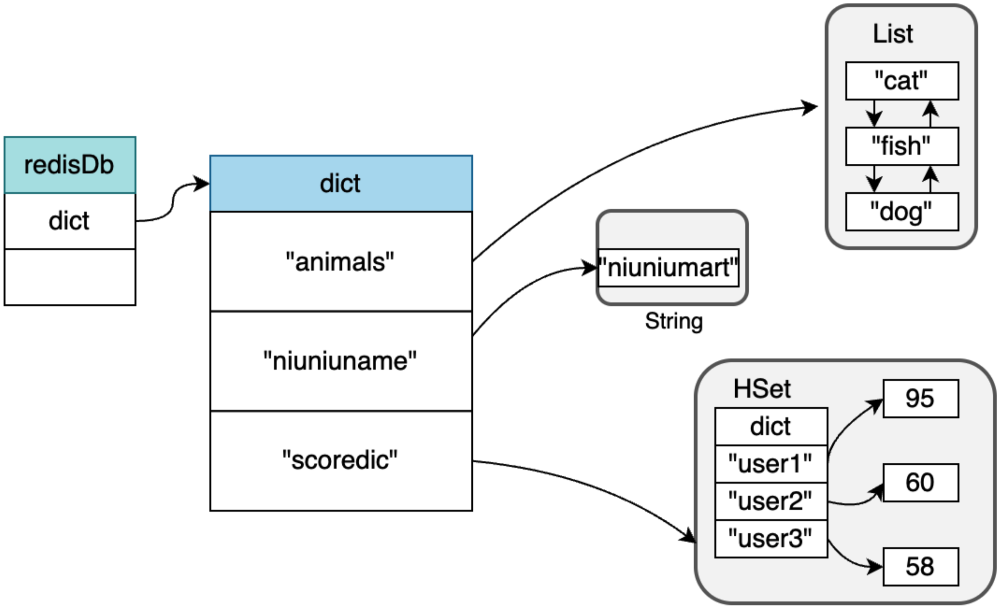
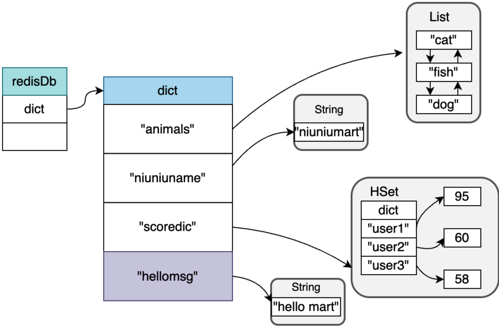
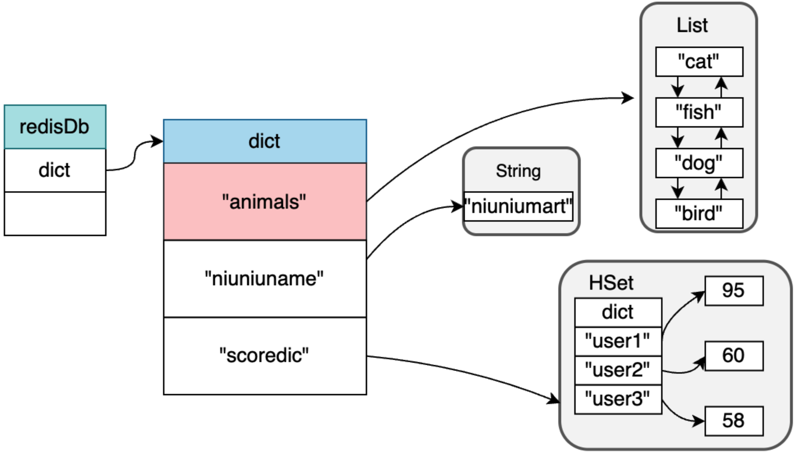
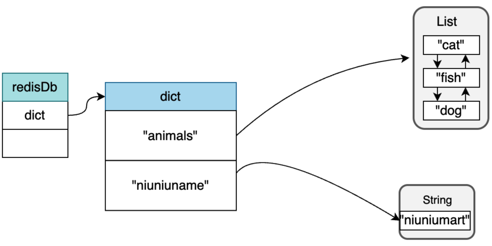
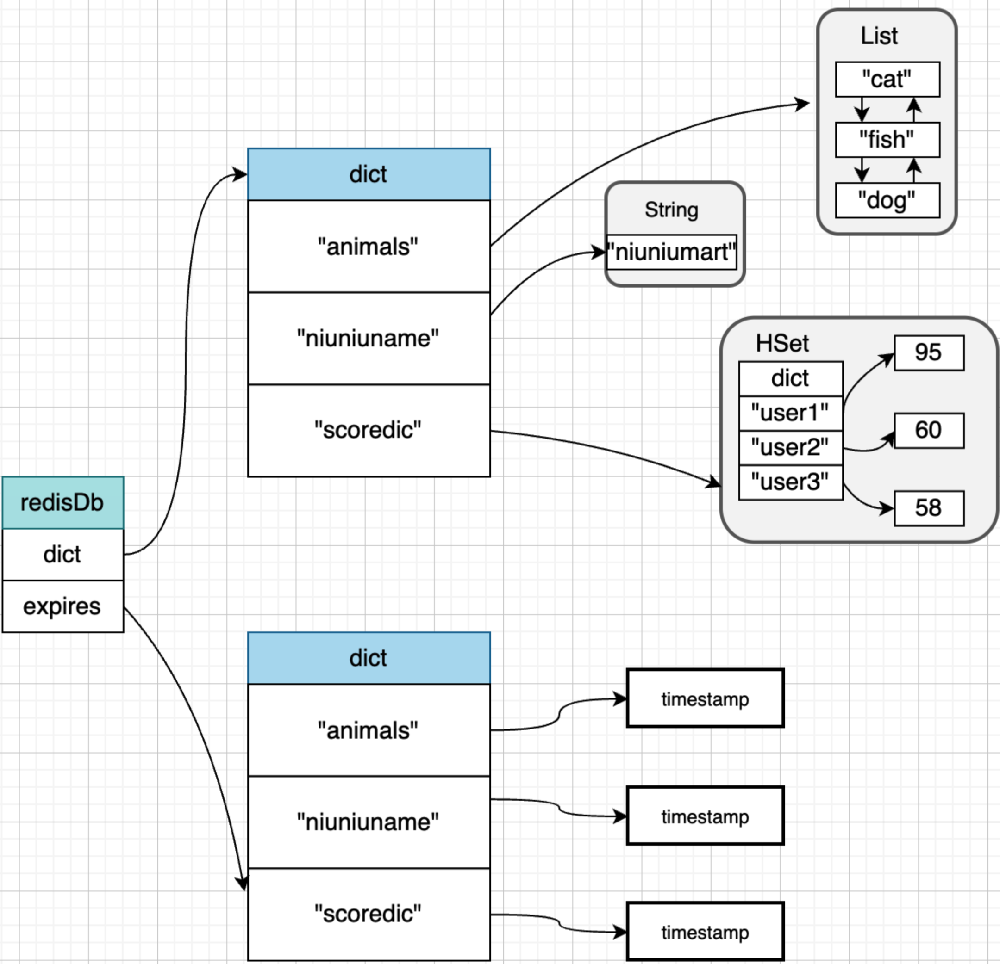
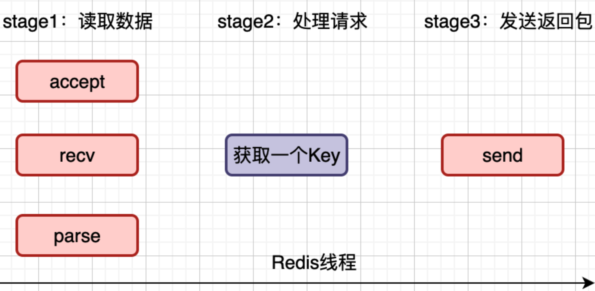
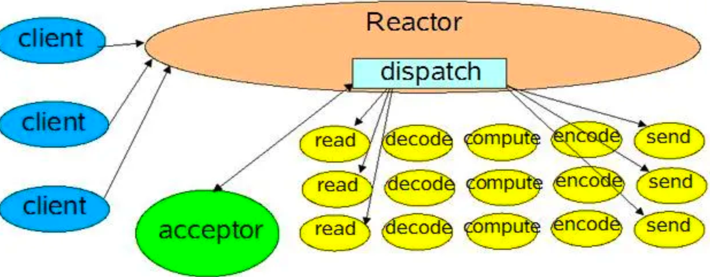
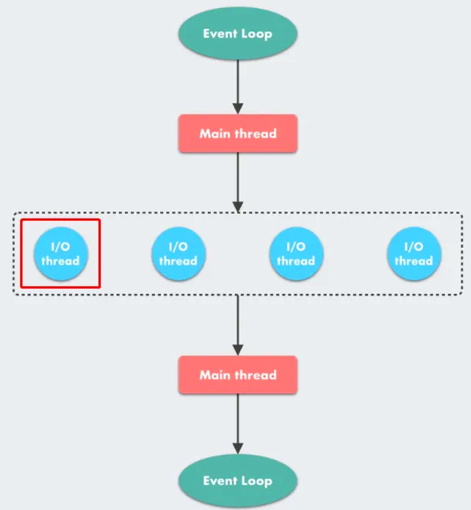
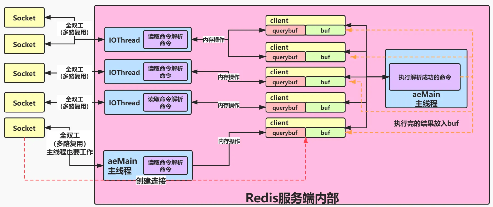
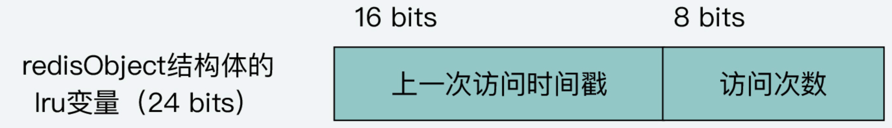

# Redis 是怎样运作的

Redis 两大主题：

- 追求性能的极致
- 追求内存管理的极致

## Redis 在内存中是怎样存储的

reids 是内存存储，其中的数据都以键值对的形式存放。

### 数据结构

```c
typedef struct redisDb {
    dict *dict;                 /* The keyspace for this DB */
    dict *expires;              /* Timeout of keys with a timeout set */
    dict *blocking_keys;        /* Keys with clients waiting for data (BLPOP)*/
    dict *ready_keys;           /* Blocked keys that received a PUSH */
    dict *watched_keys;         /* WATCHED keys for MULTI/EXEC CAS */
    int id;                     /* Database ID */
    long long avg_ttl;          /* Average TTL, just for stats */
    list *defrag_later;         /* List of key names to attempt to defrag one by one, gradually. */
} redisDb;

```

dict 结构代表我们存入的 key-value 键值对数据。

```c
struct dict {
    dictType *type;

    dictEntry **ht_table[2];
    unsigned long ht_used[2];
    long rehashidx; /* rehashing not in progress if rehashidx == -1 */
    /* Keep small vars at end for optimal (minimal) struct padding */
    int16_t pauserehash; /* If >0 rehashing is paused (<0 indicates coding error) */
    signed char ht_size_exp[2]; /* exponent of size. (size = 1<<exp) */

};
```

redisDb 数据库对象，指向数据字典，字典里包含了实际存储的 k-v 数据，k 是字符串对象，v 支持任意 Redis 对象。



#### 添加数据

将键值对添加到 dict 结构字典中，key 必须为 String 对象，value 为任何类型的对象。

比如， `SET hellomsg "hello mart"`



#### 查询数据

在 dict 找到对应的 key，即完成查询。

#### 更新数据

对已有 key 对象的任何变更操作都是更新，例如：针对 String 对象赋予新值，给 List 对象增添元素。

`RPUSH animals bird`



#### 删除数据

删除即把 key 和 value 都从 dict 结构里删除。 

`DEL scoredic` ，删除成功之后的结构：



#### 过期键

Redis 数据都可以设置过期键，这样到了一定时间，这些对象就会自动过期回收。



这里的 dict 中和 expires 中 key 对象，存储 String 对象指针，所以不会重复占用内存。

## Redis 是单线程还是多线程

Redis 的「核心处理逻辑」是单线程，「辅助模块」中的「复制模块」使用多线程。

## 单线程为什么能这么快

Redis 单线程的处理速度快的原因：

1. Redis 的大部分操作都在内存上完成，内存操作快；
2. Redis 追求极致，选择了很多高效的数据结构，并做了非常多的优化，比如 ziplist、hash、跳表；
3. Redis 采用了「多路复用机制」，使其可以在网络 IO 操作中并发处理大量的客户端请求，实现高吞吐量

Redis 处理的流程：

Redis 的服务器启动时，`bind` 端口，`listen` 操作监听客户端请求，客户端发起请求连接。

客户端发起一次处理请求，服务端：

1. 客户端请求处理时，服务端使用 `accept` 建立连接；
2. 调用 `recv` 从套接字中读取请求；
3. 解析客户端发送请求，拿到参数；
4. 处理请求，Get，nameRedis 通过 key 获取对应的数据；
5. 最后将数据通过 `send` 发送给客户端



套接字是默认「阻塞模式」的，如果在 `accept` 和 `recv` 时客户端一直没有发送数据， Redis 会发生阻塞。

「非阻塞调用」下，如果没有数据则不会阻塞在那里，而是通过一个循环来不断轮询来检查是否已经就绪。

I/O 多路复用，就是有 I/O 操作事件触发时就会产生通知。收到通知，再去处理通知对应的事件，Redis 针对 I/O 多路复用进行包装，叫做 Reactor 模型。



## Redis处理过程

### 处理流程：

#### 监听端口，注册事件

main -> initServer 中，使用 `listenToPort` 监听端口，创建监听套接字。

```c
int listenToPort(connListener *sfd)
```

之后调用 `aeCreateFileEvent` 函数绑定对应的接收处理函数 `acceptTcpHandler`， 绑定之后等到客户端连接请求发回来，即可以关联到处理函数。

#### 连接到达处理

当一个连接到达，事件循环就能收到这个信息，监听套接字的 `acceptTcpHandler` 函数会先生成一个客户端套接字，但不会立刻开始读客户端发过来的数据。

#### 客户端数据处理

收到一个客户端发来的数据后，将使用 `readQueryFromClient` 来读取和处理客户端的请求。

## 多线程是怎么回事



详细



Redis 的「多线程模式」默认是关闭的，需要用户在 `redis.config` 配置文件中开启。

## 内存淘汰算法-LRU

### LRU算法

最近最久未使用，记录每个 key 的最近访问时间，维护一个访问时间的数据。

### Redis 近似 LRU 算法

维护一个全局链表，对 Redis 来说开销过大。

#### 算法概述

LRU 中，redisObject 对象中 lru 字段存储的是 key 被访问时 Redis 的时钟 `server.lruclock`，当 key 被访问时，Redis 会更新这个 key 的 redisObject 的 lru 字段。

*近似 LRU 算法* 在现有的数据结构的基础上，采用「随机采样」的方式来淘汰元素，内存不足时，就执行一次「近似 LRU 算法」。

随机采样 n 个 key，根据时间戳淘汰掉最旧的那个 key；如果内存不足，继续随机采样来淘汰。

#### 采样范围

采样范围的选择范围策略有两种：

- allkeys：从所有 key 中随机采样；
- volatile：从有过期时间的 key 中随机采样

#### 淘汰池优化

*近似 LRU*，优点在于节约了内存，但缺点是不是一个完整的 LRU。它是随机采样得到的结果，不是全局真正的最久未访问。

Redis3.0 对「近似 LRU 算法」进行了优化。维护一个待淘汰 key 的 *“候选池”*，里面默认有 16 个 key，按照 idle 时间排好序（idle 从左向右依次增大）。

更新时从 Redis keyspace（存放数据的 dict）中随机选择 N 个 key（为了与池中的 key 进行区别，我们称它们为 samples，即取样），分别计算它们的 idle（空闲时间）。只要「候选池」不满或者池中存在比 sample idle 更小的 key，就可以将 sample 插入「候选池」，然后从「候选池」中选择空闲时间最大的 key 淘汰掉。具体参照 [evictionPoolPopulate](https://github.com/redis/redis/blob/7.2/src/evict.c#L146) 函数：

```c
/* 这是 performEvictions 的辅助函数，用于想要使一个 key 过期时，
 * 将一些项填充到淘汰候选池中。如果一个 sample 的 idle 时间大于当前池
 * 中 keys 的 idle，就可以加入池中。当池中有空位时 sample 总是可以加入。
 *
 * 我们将 keys 按照（idle）升序插入，因此 idle 小的 key 在左侧，
 * 而 idle 大的在右侧。 */
void evictionPoolPopulate(int dbid, dict *sampledict, dict *keydict, struct evictionPoolEntry *pool) {
  // ... 省略部分代码
  /* 将元素插入池中。
   * 首先，找到第一个空的或者更频繁使用的（idle 时间比要 sample
   * 的小的）；这样，如果池中没有空闲位置，你可以将更频繁使用的
   * key 移出（即暂时不考虑不考虑淘汰它），然后将 sample 插入到池中 */
  
  /* 在看下面的代码前，你需要知道，这个池结构，你可以将其想象为一个
   * 数组，如果你要插在中间的某一个位置，则需要将左侧元素左移，或者
   * 右侧元素右移，从而留出一个位置可以存放 sample。
   
   * 这也就是为什么下面的代码总是以 pool[EVPOOL_SIZE-1].key 是
   * 否为空作为判断能否插入的标准。 */
  k = 0;
  while (k < EVPOOL_SIZE &&
    pool[k].key &&
    pool[k].idle < idle) k++;
    if (k == 0 && pool[EVPOOL_SIZE-1].key != NULL) {
    	/* sample 的 idle 比池中所有的都小，并且没办法右移，即
       * 没有空间可以插入，那么直接跳过 */
    	continue;
    } else if (k < EVPOOL_SIZE && pool[k].key == NULL) {
      /* 插入空余位置，插入前无需设置 */
    } else {
      /* 插入到中间，现在 k 指向第一个大于 sample 的 idle 的元素 */
      if (pool[EVPOOL_SIZE-1].key == NULL) {
        /* 右侧有空余位置，将 (k,end) 的元素全部移动到右侧 */
        // ... 省略代码
      } else {
        /* 右侧没有空间，那就插在 k-1 的位置；
         * 注意，k 位置是从左到右第一个比 sample idle 大的 */
        k--;
        /* 此时，[begin,k] 部分的元素都是 idle 比 sample
         * 小的。要保证升序排列，所以将这些元素左移，这会将 idle
         * 小的移出淘汰候选池，即暂时不考虑淘汰它。 */
        // ... 省略部分代码
      }
    }
  // ... 省略部分代码
}
```

## LFU 内存淘汰算法

LFU （Least Frequently Used，最不频繁）淘汰算法，优先淘汰活跃度（使用频率）最低的。

```c
typedef struct redisObject{
  unsigned type:4; // Redis 对象
  unsigned encoding:4; // 底层编码，用OBJECT ENCODING [key] 可以看到编码方式
  unsigned lru:LRU_BITS; // 记录对象访问信息，用于内存淘汰
  
  int refcount; // 引用计数，描述有多少个指针指向该对象
  void *ptr; // 内容指针，指向实际内容
} robj;
```

Redis 在 LFU 策略下复用 lru 字段：



高 16 位保存上次访问时间戳，后 8 位存储的是一个访问次数。

一个 key 是否活跃，由这两个字段决定。距离上一次访问时间很久，访问次数就会衰减；每次访问，会增加访问次数；访问次数默认为 5。

### lfu 数据更新

每次进行数据更新时都要执行以下操作：

1. #### 计算次数衰减

2. #### 一定概率增加访问次数

   - 次数不足 5，一定增加；

   - 次数大于 5 次，小于 255 次，一定概率加 1，次数越大，越困难；

   - 受 lfu-log-factor 参数影响，该参数越大，增加的难度越大

3. #### 更新数据信息

   当前时间更新到高 16 位，次数更新到低 8 位
