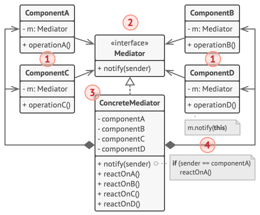

# 中介者模式

*中介者模式*能减少对象之间混乱无序的依赖关系，该模式会限制对象之间的直接交互，迫使它们通过一个中介者对象进行合作。

中介者模式建议你停止组件之间的直接交流并使其相互独立，这些组件必须调用特殊的中介者对象，通过中介者对象重定向调用行为，以间接的方式进行合作。最终，组件仅依赖于一个中介者类，无需与多个其他组件相耦合。

## 中介者模式结构



- 组件 (Component)：是各种包含业务逻辑的类，每个组件都有一个指向中介者的引用，该引用被声明为中介者接口类型。组件不知道中介者实际所属的类，因此你可通过将其连接到不同中介者以使其能在其他程序中复用；
- 中介者 (Mediator)：声明了与组件交流的接口方法，但通常仅包括一个通知方法，组件可将任意上下文(包括自己的对象)作为该方法的参数，只有这样接收组件和发送者类之间才不会耦合；
- 具体中介者 (Concrete Mediator)：封装了多种组件间的关系，具体中介者通常会保存所有组件的引用并对其进行管理，甚至有时会对其生命周期进行管理

组件并不知道其他组件的情况。如果组件内发生了重要事件，它只能通知中介者。中介者收到通知后能轻易地确定发送者，这或许已足以判断接下来需要触发的组件了。

对于组件来说，中介者看上去完全就是一个黑箱。发送者不知道最终会由谁来处理自己的请求，接收者也不知道最初是谁发出了请求。

## 代码

```c++
class BaseComponent;
class Mediator {
 public:
  virtual void Notify(BaseComponent *sender, std::string event) const = 0;
};

class BaseComponent {
 protected:
  Mediator *mediator_;

 public:
  BaseComponent(Mediator *mediator = nullptr) : mediator_(mediator) {
  }
  void set_mediator(Mediator *mediator) {
    this->mediator_ = mediator;
  }
};

class Component1 : public BaseComponent {
 public:
  void DoA() {
    std::cout << "Component 1 does A.\n";
    this->mediator_->Notify(this, "A");
  }
  void DoB() {
    std::cout << "Component 1 does B.\n";
    this->mediator_->Notify(this, "B");
  }
};

class Component2 : public BaseComponent {
 public:
  void DoC() {
    std::cout << "Component 2 does C.\n";
    this->mediator_->Notify(this, "C");
  }
  void DoD() {
    std::cout << "Component 2 does D.\n";
    this->mediator_->Notify(this, "D");
  }
};

class ConcreteMediator : public Mediator {
 private:
  Component1 *component1_;
  Component2 *component2_;

 public:
  ConcreteMediator(Component1 *c1, Component2 *c2) : component1_(c1), component2_(c2) {
    this->component1_->set_mediator(this);
    this->component2_->set_mediator(this);
  }
  void Notify(BaseComponent *sender, std::string event) const override {
    if (event == "A") {
      std::cout << "Mediator reacts on A and triggers following operations:\n";
      this->component2_->DoC();
    }
    if (event == "D") {
      std::cout << "Mediator reacts on D and triggers following operations:\n";
      this->component1_->DoB();
      this->component2_->DoC();
    }
  }
};

void ClientCode() {
  Component1 *c1 = new Component1;
  Component2 *c2 = new Component2;
  ConcreteMediator *mediator = new ConcreteMediator(c1, c2);
  std::cout << "Client triggers operation A.\n";
  c1->DoA();
  std::cout << "\n";
  std::cout << "Client triggers operation D.\n";
  c2->DoD();

  delete c1;
  delete c2;
  delete mediator;
}
```

## 参考

[中介者设计模式](https://refactoringguru.cn/design-patterns/mediator)