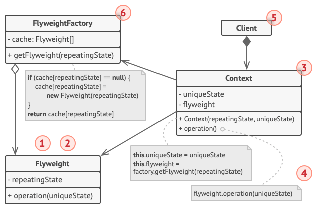

# 享元模式

*享元模式* 摒弃了在每个对象中保存所有数据的方式，通过共享多个对象所共有的相同状态，让你能在有限的内存容量中载入更多对象。

## 背景

假设我们在开发一款游戏，游戏里有大量的场景，场景上会有大量的物体，比如最简单的树。我们可能需要在一片地面渲染百万棵树，但是如果每棵树的信息都独立存储，这将带来巨大的内存消耗。

## 解决方案

你可能会发现，所有的树其实只分为了几个种类，比如桦树、枫树等。相同种类的树的名字、颜色都是固定的，材质也是相同的，也就是说每个树中都要额外存一份相同的东西。这带来了极大的空间浪费。他可能会被种植在不同的地方，但是名字、颜色等都是不会变化的。

对象的常量数据通常被称为 *内在状态*，其位于对象中，其他对象只能读取但不能修改其数值；而对象的其他状态常常能被其他对象**从外部**改变，因此被称为 *外在状态*。

当然，<mark>享元模式只是一种优化</mark>。在应用该模式之前，你要确定程序中存在与大量类似对象同时占用内存相关的内存消耗问题，并且确保该问题无法使用其他更好的方式来解决。

享元模式建议不在对象中存储外在状态，而是将其传递给依赖于它的一个特殊方法。程序只在对象中保存内在状态，以方便在不同情景下重用。这些对象的区别仅在于其内在状态(与外在状态相比，内在状态的变体要少很多)，因此你所需的对象数量会大大削减。这样 ***仅存储*** 内在状态的对象称为享元。

**享元不可变**

由于享元对象可在不同的情景中使用，你必须确保其状态不能被修改。享元类的状态只能由构造函数的参数进行一次性初始化，它不能对其他对象公开其 `setter` 或公有成员变量。

**享元工厂**

为了能更方便地访问各种享元，你可以创建一个工厂方法来管理已有享元对象的缓存池。工厂方法从客户端处接收目标享元对象的内在状态作为参数，如果它能在缓存池中找到所需享元，则将其返回给客户端；如果没有找到，它就会新建一个享元，并将其添加到缓存池中。

## 享元模式结构



- 享元 (Flyweight)：包含原始对象中部分能在多个对象中共享的状态，同一享元对象可在许多不同情景中使用，享元中存储的状态被称为*内在状态*，传递给享元方法的状态被称为*外在状态*；
- 情景 (Context)：包含原始对象中各不相同的外在状态，情景与享元对象组合在一起就能表示原始对象的全部状态；
- 享元工厂 (Flyweight Factory)：对已有享元的缓存池进行管理，根据参数在之前已创建的享元中进行查找，如果找到满足条件的享元就将其返回；如果没有找到就根据参数新建享元

通常情况下，原始对象的行为会保留在享元类中。因此调用享元方法必须提供部分外在状态作为参数。但你也可将行为移动到情景类中，然后将连入的享元作为单纯的数据对象。

## 代码

```c++
#include <iostream>
#include <vector>
#include <tuple>
#include <string>

using namespace std;

class TreeType {	// 享元
    string m_name;
    string m_color;
    string m_texture;
public:
    TreeType(const string& name, const string& color, const string& texture): m_name(name), m_color(color), m_texture(texture) {}
    void getInfo(string& name, string& color, string& texture) {
        name = m_name;
        color = m_color;
        texture = m_texture;
    }
    void draw(int x, int y) {
        cout << "draw a " << m_color << " and " << m_texture << " " << m_name << " at ("
        << x << ", " << y << ")" << endl;
    }
};

class TreeTypeFactory {
public:
    static TreeType *getTreeType(const string& name, const string& color, const string& texture) {
        TreeType *treeType = nullptr;
        static std::vector<TreeType *> m_treeTypes;
        for (auto *t: m_treeTypes) {
            string n, c, tt;
            t->getInfo(n, c, tt);
            if (n == name && c == color && tt == texture) {
                treeType = t;
            }
        }
        if (treeType == nullptr) {
            treeType = new TreeType(name, color, texture);
            m_treeTypes.emplace_back(treeType);
        }
        return treeType;
    }
};

class Tree {
    int m_x, m_y;
    TreeType *m_treeType;
public:
    Tree(int x, int y, TreeType *treeType): m_x(x), m_y(y), m_treeType(treeType) {}
    void draw() { m_treeType->draw(m_x, m_y); }
};

class Forest {
    std::vector<Tree*> m_trees;
public:
    void plantTree(int x, int y, const string& name, const string& color, const string& texture) {
        auto *type = TreeTypeFactory::getTreeType(name, color, texture);
        m_trees.emplace_back(new Tree(x, y, type));
    }
    void draw() {
        for (auto *tree: m_trees) {
            tree->draw();
        }
    }
};

int main() {
    Forest forest;
    forest.plantTree(1, 2, "pine", "yellow", "old");
    forest.plantTree(2, 2, "pine", "yellow", "old");
    forest.plantTree(3, 2, "oak", "yellow", "old");
    forest.plantTree(4, 2, "oak", "yellow", "old");
    forest.plantTree(5, 2, "pine", "yellow", "old");
    forest.draw();
    return 0;
}
```

## 参考

[享元设计模式](https://refactoringguru.cn/design-patterns/flyweight)