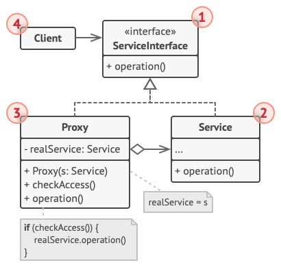

# 代理模式

*代理模式* 让你能够提供对象的替代品或其占位符。代理控制着对于原对象的访问，并允许在将请求提交给对象前后进行一些处理。

代理模式建议新建一个与原服务对象接口相同的代理类，然后更新应用以将代理对象传递给所有原始对象客户端。代理类接收到客户端请求后会创建实际的服务对象，并将所有工作委派给它。

## 代理模式结构



- 服务接口 (Service Interface)：声明服务接口，代理必须遵循该接口才能伪装成服务对象；
- 服务 (Service)：提供一些实用的业务逻辑；
- 代理 (Proxy)：包含一个指向服务对象的引用成员变量，代理完成其任务(例如延迟初始化、记录日志、访问控制和缓存等)后会将请求传递给服务对象；

通常情况下，代理会对其服务对象的整个生命周期进行管理。

## 代码

假设我们当前有一个下载器，当客户端多次请求下载一个文件，则程序库会反复下载，而不会缓存首次下载内容，那么我们考虑实现一个代理代替原下载器，将任务委派给源下载器。如果文件已经缓存则返回缓存；否则下载。

```c++
#include <iostream>
#include <vector>
#include <tuple>
#include <string>
#include <unordered_set>

using namespace std;

class DownloadInterface {
public:
    virtual void download(const string& name) = 0;
};

class Downloader: public DownloadInterface {
public:
    void download(const string &name) override {
        cout << "download " << name << endl;
    }
};
class Proxy: public DownloadInterface {
    DownloadInterface *downloader;
    unordered_set<string> downloaded;
public:
    void setDownloader(DownloadInterface *d) { downloader = d; }
    void download(const string &name) override {
        if (downloaded.count(name)) {
            cout << name << " has been downloaded!" << endl;
        } else {
            downloader->download(name);
            downloaded.emplace(name);
        }
    }
};

int main() {
    Downloader downloader;
    Proxy proxy;
    proxy.setDownloader(&downloader);
    proxy.download("good film");
    proxy.download("good film");
    return 0;
}
```

## 参考

[代理设计模式](https://refactoringguru.cn/design-patterns/proxy)