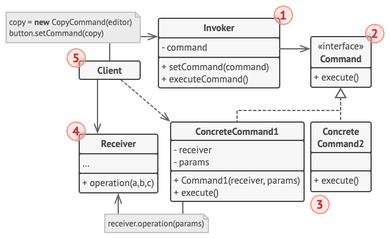

# 命令模式

*命令模式* 可将请求转换为一个包含与请求相关的所有信息的独立对象。该转换让你能根据不同的请求将方法参数化、延迟请求执行或将其放入队列中，且能实现可撤销操作。

## 背景

这里使用最常见的例子：网页开发。通常一个功能会对应一个下拉列表或者按钮等组件；但是为了方便，也会增加快捷键，他们都实现同样的功能。甚至有些功能可能还会在其他地方使用。

如果你在按钮中编写一次代码，然后再为快捷键编写一次代码，那么很快你的程序代码就变得十分庞大。当然，这只是一个简单的例子，有可能一个按钮点击还会导致其他事件。

## 解决方案

优秀的软件设计通常将关注点进行分离，比如网页：一层负责用户图像界面 GUI；另一层负责业务逻辑。GUI 对象传递一些参数来调用业务逻辑对象，这个过程通常被描述为一个对象发送 *请求* 给另一个对象。

命令模式建议将请求的所有细节 (例如调用的对象、方法名称和参数列表)抽取出来组成 *命令* 类，该类中仅包含一个用于触发请求的方法。

命令对象负责连接不同的 GUI 和业务逻辑对象。此后，GUI 对象无需了解业务逻辑对象是否获得了请求，也无需了解其对请求进行处理的方式，GUI 对象触发命令即可，命令对象会自行处理所有细节工作。

所有命令实现相同的接口，该接口通常只有一个没有任何参数的执行方法，让你能在不和具体命令类耦合的情况下使用同一请求发送者执行不同命令。此外还能在运行时切换连接至发送者的命令对象，以此改变发送者的行为。

GUI 对象可以给业务层对象提供一些参数，执行命令方法没有任何参数，因此应使用数据对命令进行预先配置，或者让其能够自行获取数据。你需要为每个可能的操作实现一系列命令类，并根据按钮所需行为将命令和组件接起来。

## 命令模式结构



- 发送者 (Sender)：也叫 *触发者* (Invoker)，负责对请求进行初始化，其中必须包含一个成员变量来存储对于命令对象的引用，发送者触发命令，而不向接收者直接发送请求；注意，发送者并不负责创建命令对象：它通常会通过构造函数从客户端处获得预先生成的命令；

- 命令 (Command)：通常仅声明一个执行命令的接口方法；

- 具体命令 (Concrete Commands)：现各种类型的请求，具体命令自身并不完成工作，而是会将调用委派给一个业务逻辑对象，但为了简化代码，这些类可以进行合并；

  > 接收对象执行方法所需的参数可以声明为具体命令的成员变量。你可以将命令对象设为不可变，仅允许通过构造函数对这些成员变量进行初始化。

- 接收者 (Receiver)：包含部分业务逻辑，几乎任何对象都可以作为接收者；绝大部分命令只处理如何将请求传递到接收者的细节，接收者自己会完成实际的工作

客户端会创建并配置具体命令对象，必须将包括接收者实体在内的所有请求参数传递给命令的构造函数。此后，生成的命令就可以与一个或多个发送者相关联了。

## 代码

```c++
#include <iostream>

class Command {
public:
    virtual ~Command() {}
    virtual void Execute() const = 0;
};

class Receiver {
public:
    void DoSomething(const std::string &a) {
        std::cout << "Receiver: Working on (" << a << ".)\n";
    }
    void DoSomethingElse(const std::string &b) {
        std::cout << "Receiver: Also working on (" << b << ".)\n";
    }
};

class SimpleCommand : public Command {
private:
    std::string pay_load_;
public:
    explicit SimpleCommand(std::string pay_load) : pay_load_(pay_load) {}
    void Execute() const override {
        std::cout << "SimpleCommand: See, I can do simple things like printing (" << this->pay_load_ << ")\n";
    }
};
class ComplexCommand : public Command {
private:
    Receiver *receiver_;
    std::string a_;
    std::string b_;
public:
    ComplexCommand(Receiver *receiver, std::string a, std::string b) : receiver_(receiver), a_(a), b_(b) {}
    void Execute() const override {
        std::cout << "ComplexCommand: Complex stuff should be done by a receiver object.\n";
        this->receiver_->DoSomething(this->a_);
        this->receiver_->DoSomethingElse(this->b_);
    }
};

class Invoker {
private:
    Command *on_start_;
    Command *on_finish_;
public:
    ~Invoker() {
        delete on_start_;
        delete on_finish_;
    }
    void SetOnStart(Command *command) { this->on_start_ = command; }
    void SetOnFinish(Command *command) { this->on_finish_ = command; }
    void DoSomethingImportant() {
        std::cout << "Invoker: Does anybody want something done before I begin?\n";
        if (this->on_start_) { this->on_start_->Execute(); }
        std::cout << "Invoker: ...doing something really important...\n";
        std::cout << "Invoker: Does anybody want something done after I finish?\n";
        if (this->on_finish_) { this->on_finish_->Execute(); }
    }
};

int main() {
    Invoker *invoker = new Invoker;
    invoker->SetOnStart(new SimpleCommand("Say Hi!"));
    Receiver *receiver = new Receiver;
    invoker->SetOnFinish(new ComplexCommand(receiver, "Send email", "Save report"));
    invoker->DoSomethingImportant();

    delete invoker;
    delete receiver;
    return 0;
}
```

## 参考

[命令设计模式](https://refactoringguru.cn/design-patterns/command)