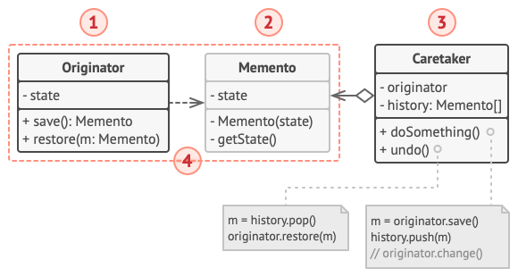

# 备忘录模式

*备忘录模式* 允许在不暴露对象实现细节的情况下保存和恢复对象之前的状态。

## 背景

撤销功能是文本编辑器等应用十分常用的功能。假设我们采用最直接的方式：程序在执行任何操作前会保存所有的对象状态，当用户此后需要撤销某个操作时，程序将从历史记录中获取最近的快照，然后使用它来恢复所有对象的状态。

但是如何生成状态的快照同样是一个问题，因为通常对象会使用私有成员来保存重要数据，这样我们则无法获取其内容。但是如果我们将所需的成员变量都设置为 public 将暴露编辑器的状态。而其他类会对快照类的每个小改动产生依赖，除非这些改动仅存在于私有成员变量或方法中，而不会影响外部类。

## 解决方案

这些问题是由于封装性被破坏造成的。有些对象尝试执行超出其职责的工作，而需要必要的数据，因而入侵了其他对象的私有空间。

备忘录模式将创建状态*快照 (Snapshot)* 的工作委派给状态拥有者—— *原发器 (Originator)* 对象。这样其他对象就不再需要从“外部”复制编辑器状态了，编辑器类拥有其状态的完全访问权，因此可以自行生成快照。

备忘录模式建议将对象状态的副本存储在一个名为 *备忘录 (Memento)* 的特殊对象中。除了创建备忘录的对象外，任何对象都不能访问备忘录的内容。其他对象必须使用受限接口与备忘录进行交互，它们可以获取快照的元数据 (创建时间和操作名称等)，但不能获取快照中原始对象的状态。

这种限制策略允许你将备忘录保存在通常被称为 *负责人 (Caretakers)* 的对象中。 由于负责人仅通过受限接口与备忘录互动，故其无法修改存储在备忘录内部的状态。同时，原发器拥有对备忘录所有成员的访问权限，从而能随时恢复其以前的状态。

## 备忘录模式结构



- 原发器：生成自身状态快照，也可在需要时通过快照恢复自身状态；
- 备忘录：原发器状态快照的值对象，通常做法是将备忘录设为不可变的，并通过构造函数一次性传递数据；
- 负责人：仅知道**何时**和**为何**保存原发器的状态，以及何时恢复状态；

负责人通过保存备忘录栈来记录原发器的历史状态。当原发器需要回溯历史状态时，负责人将从栈中获取最顶部的备忘录，并将其传递给原发器的 *恢复 (restoration)* 方法。

在该实现方法中，备忘录类将被嵌套在原发器中。这样原发器就可访问备忘录的成员变量和方法，即使这些方法被声明为私有；另一方面，负责人对于备忘录的成员变量和方法的访问权限非常有限：它们只能在栈中保存备忘录，而不能修改其状态。

## 代码

[DP-Memento.cpp](../../assets/codes/DP-Memento.cpp)

```C++
#include <iostream>
#include <vector>
#include <string>

using namespace std;

class Originator;
class Memento {
    int state = 0;
    friend class Originator;
public:
    Memento(int state): state(state) {}
};

class Originator {
    int state;
public:
    Memento *save() { return new Memento(state); }
    void restore(Memento *memento) { state = memento->state };
    void up() { state++; }
    void show() { cout << state << endl; }
};

class Caretaker {
    Originator *originator;
    vector<Memento *> history;
public:
    explicit Caretaker(Originator *o): originator(o) {}
    ~Caretaker() {
        for (auto *m: history) {
            delete m;
        }
    }
    void doSomething() {
        history.emplace_back(originator->save());
        originator->up();
    }
    void undo() {
        originator->restore(history.back());
        delete history.back();
        history.pop_back();
    }
};

int main() {
    Originator *originator = new Originator();
    Caretaker caretaker(originator);

    caretaker.doSomething();
    caretaker.doSomething();
    originator->show();
    caretaker.undo();
    originator->show();

    delete originator;
    return 0;
}
```

## 参考

[备忘录设计模式](https://refactoringguru.cn/design-patterns/memento)