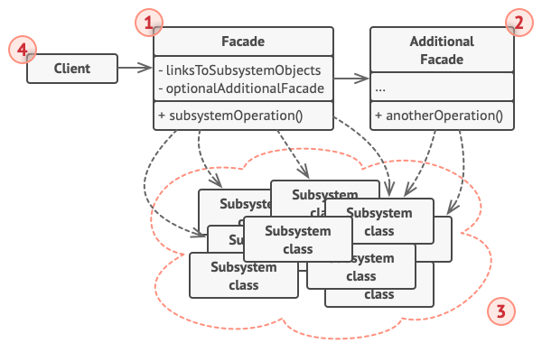

# 外观模式

*外观模式* 能为程序库、框架或其他复杂类提供一个简单的接口。

## 背景

假设你必须在代码中使用某个复杂的库或框架中的众多对象。正常情况下，你需要负责所有对象的初始化工作、管理其依赖关系并按正确的顺序执行方法等，这将使得程序中类的业务逻辑与第三方紧密耦合，难以理解和维护。

## 解决方案

外观类为包含许多活动部件的复杂子系统提供一个简单的接口。与直接调用子系统相比，外观提供的功能可能比较有限，但它却包含了客户端真正关心的功能。如果你的程序需要与包含几十种功能的复杂库整合，但只需使用其中非常少的功能，那么使用外观模式会非常方便。

## 外观模式结构

- 外观 (Facade)：提供一种访问特定子系统功能的便捷方式，其了解如何重定向客户端请求，知晓如何操作一切活动部件；
- 附加外观 (Additional Facade)：该类可以避免多种不相关的功能污染单一外观，使其变成又一个复杂结构，客户端和其他外观都可使用附加外观；
- 复杂子系统 (Complex Subsystem)：由数十个不同对象构成，用于完成有意义的工作，必须深入了解子系统的实现细节，子系统类不会意识到外观的存在，它们在系统内运作并且相互之间可直接进行交互

子系统类不会意识到外观的存在，它们在系统内运作并且相互之间可直接进行交互。客户端使用外观代替对子系统对象的直接调用。

### 参考

[外观设计模式](https://refactoringguru.cn/design-patterns/facade)