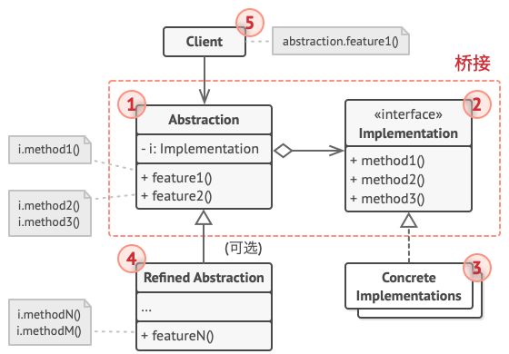

# 桥接模式

*桥接模式* 是一种结构型设计模式，可将一个大类或一系列紧密相关的类拆分为抽象和实现两个独立的层次结构，从而能在开发时分别使用。

## 抽象部分和实现部分

设计模式 *四人组* 的著作 在桥接定义中提出了 *抽象部分* 和 *实现部分* 两个术语。

*抽象部分*（也被称为 *接口*）是一些实体的高阶控制层。该层自身不完成任何具体的工作，它需要将工作委派给 *实现部分* 层（也被称为*平台*）。

<mark>注意</mark>，这里提到的内容与编程语言中的 *接口* 或 *抽象类* 无关，它们并不是一回事。

在实际的程序中，抽象部分是图形用户界面（GUI），而实现部分则是底层操作系统代码（API），GUI 层调用 API 层来对用户的各种操作做出响应。

一般来说，你可以在两个独立方向上扩展这种应用：

- 开发多个不同的 GUI（例如面向普通用户和管理员进行分别配置）；
- 支持多个不同的 API（例如，能够在 Windows、Linux 和 macOS 上运行该程序）

不同的实现只要遵循相同的接口就可以互换。你无需改动与 API 相关的类就可以修改 GUI 类。此外如果想支持一个新的操作系统，只需在实现部分层次中创建一个子类即可。

## 桥接模式结构



- 抽象部分：提供高层控制逻辑，依赖于完成底层实际工作的实现对象；
- 实现部分：为所有具体实现声明通用接口，抽象部分仅能通过在这里声明的方法与实现对象交互；
- 具体实现：包括特定于平台的代码；
- 精确抽象：提供控制逻辑的变体，与其父类一样，它们通过通用实现接口与不同的实现进行交互

抽象部分可以列出和实现部分一样的方法，但是抽象部分通常声明一些复杂行为，这些行为依赖于多种由实现部分声明的原语操作。客户端仅关心如何与抽象部分合作。但是，客户端需要将抽象对象与一个实现对象连接起来。

## 代码

```c++
#include <iostream>
#include <vector>
#include <string>

using namespace std;

class OS {
public:
    virtual void syscall() = 0;
    virtual void syscall1() = 0;
    virtual void syscall2() = 0;
};

class App {
protected:
    OS *os;
public:
    void setOs(OS *o) { os = o; }
    void run() {
        os->syscall();
        os->syscall1();
        os->syscall2();
    }
};

class Mac: public OS {
public:
    void syscall() override { cout << "Mac syscall" << endl; }
    void syscall1() override { cout << "Mac syscall1" << endl; }
    void syscall2() override { cout << "Mac syscall2" << endl; }
};
class Linux: public OS {
public:
    void syscall() override { cout << "Linux syscall" << endl; }
    void syscall1() override { cout << "Linux syscall1" << endl; }
    void syscall2() override { cout << "Linux syscall2" << endl; }
};

int main() {
    Linux linux;
    Mac mac;
    App app;
    app.setOs(&mac);
    app.run();
    app.setOs(&linux);
    app.run();
    return 0;
}
```

## 参考

[桥接设计模式](https://refactoringguru.cn/design-patterns/bridge)