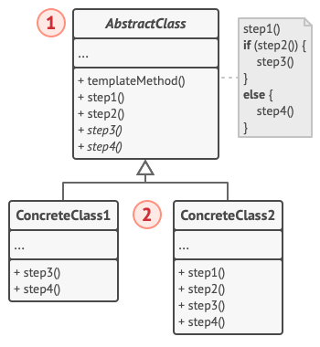

# 模板方法模式

*模板方法模式*会在超类中定义一个算法的框架，允许子类在不修改结构的情况下重写算法的特定步骤。

## 背景

假设我们要开发一个 Office 文档阅读器，我们首先支持 Docx 文件、然后支持 csv 文件，之后又会支持 PDF 文件。但是不久后你就发现，这几类文件的打开和解析代码有大量重复，甚至有些模块是一摸一样的。

我们希望在保证算法结构完整的情况下去除重复代码。

## 解决方案

模板方法模式建议将算法分解为一系列步骤，然后将这些步骤改写为方法，最后在“模板方法”中依次调用这些方法。步骤可以是抽象的，也可以有一些默认的实现。为了能够使用算法，客户端需要自行提供子类并实现所有的抽象步骤。如有必要还需重写一些步骤(但这一步中不包括模板方法自身)。

- *抽象步骤*必须由各个子类来实现；
- *可选步骤*已有一些默认实现，但仍可在需要时进行重写

还有另一种名为*钩子*的步骤。*钩子*是内容为空的可选步骤。即使不重写钩子，模板方法也能工作。钩子通常放置在算法重要步骤的前后，为子类提供额外的算法扩展点。

## 模版方法模式结构



- 抽象类：声明作为算法步骤的方法，以及依次调用它们的实际模板方法，算法步骤可以被声明为“抽象”类型，也可以提供一些默认实现；
- 具体类：可以重写所有步骤，但不能重写模板方法自身

## 代码

[DP-Template-method.cpp](assets/codes/DP-Template-method.cpp)

```c++
#include <iostream>

using namespace std;

class Reader {
protected:
    void openFile() { cout << "open file..." << endl; }
    void closeFile() { cout << "close file..." << endl; }
    virtual void analyse() = 0;
public:
    void read() {
        openFile();
        analyse();
        closeFile();
    }
};

class DocReader: public Reader {
protected:
    void analyse() override { cout << "analyse doc..." << endl; }
};
class PDFReader: public Reader {
protected:
    void analyse() override { cout << "analyse pdf..." << endl; }
};

int main() {
    Reader *reader;
    DocReader docReader;
    PDFReader pdfReader;
    reader = &docReader;
    reader->read();
    reader = &pdfReader;
    reader->read();
    return 0;
}
```

## 参考

[模版方法模式](https://refactoringguru.cn/design-patterns/template-method)