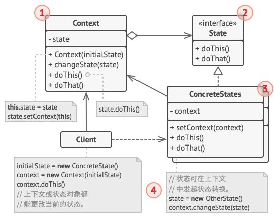

# 状态模式

*状态模式* 让你能在一个对象的内部状态变化时改变其行为，使其看上去就像改变了自身所属的类一样。

## 背景

状态模式与 *有限状态机* 的概念联系比较紧密，有需要请查看[有限状态机](https://refactoring.guru/zh/fsm)。

其主要思想是程序在任意时刻仅可处于几种 *有限* 的 *状态* 中。在任何一个特定状态中，程序的行为都不相同，且可瞬间从一个状态切换到另一个状态。不过，根据当前状态，程序可能会切换到另外一种状态，也可能会保持当前状态不变。这些数量有限且预先定义的状态切换规则被称为 *转移*。

状态机通常由众多条件运算符 (`if` 或 `switch`) 实现，可根据对象的当前状态选择相应的行为。为了能根据当前状态选择完成相应行为的方法，绝大部分方法中会包含复杂的条件语句。修改其转换逻辑可能会涉及到修改所有方法中的状态条件语句，导致代码的维护工作非常艰难。

## 解决方案

状态模式建议为对象的所有可能状态新建一个类，然后将所有状态的对应行为抽取到这些类中。

原始对象被称为 *上下文 (context)*，它并不会自行实现所有行为，而是会保存一个指向表示当前状态的状态对象的引用，且将所有与状态相关的工作委派给该对象。

如需将上下文转换为另外一种状态，则需将当前活动的状态对象替换为另外一个代表新状态的对象。采用这种方式是有前提的：所有状态类都必须遵循同样的接口，而且上下文必须仅通过接口与这些对象进行交互。

在状态模式中，特定状态知道其他所有状态的存在，且能触发从一个状态到另一个状态的转换。

## 状态模式结构



- 上下文：保存对于一个具体状态对象的引用，并会将所有与该状态相关的工作委派给它，上下文通过状态接口与状态对象交互，且会提供一个设置器用于传递新的状态对象；
- 状态：声明特定于状态的接口方法，这些方法应能被其他所有具体状态所理解，因为你不希望某些状态所拥有的方法永远不会被调用；
- 具体状态：自行实现特定于状态的方法，为了避免多个状态中包含相似代码，你可以提供一个封装有部分通用行为的中间抽象类

状态对象可存储对于上下文对象的反向引用，状态可以通过该引用从上下文处获取所需信息，并且能触发状态转移。

上下文和具体状态都可以设置上下文的下个状态，并可通过替换连接到上下文的状态对象来完成实际的状态转换。

## 代码

[DP-State](../../assets/codes/DP-State.cpp)

```c++
#include <iostream>
#include <vector>
#include <string>

using namespace std;

class Document;
class State {
protected:
    Document *document;
public:
    void setDocument(Document *doc) {
        document = doc;
    }
    virtual void commit() = 0;
    virtual void publish() = 0;
};

class Document {
    State *state;
public:
    void setState(State *s) {
        if (state) delete state;
        state = s;
        s->setDocument(this);
    }
    ~Document() {
        if (state) delete state;
    }
    void commit() { state->commit(); }
    void publish() { state->publish(); }
};

class Published: public State {
public:
    void commit() override { cout << "Has been published!" << endl; }
    void publish() override { cout << "Has been published!" << endl; }
};

class Moderation: public State {
public:
    void commit() override { cout << "Has been committed!" << endl; }
    void publish() override {
        document->setState(new Published());
    }
};

class Draft: public State {
    friend class Moderation;
public:
    void publish() override { cout << "Hasn't been committed!" << endl; }
    void commit() override {
        document->setState(new Moderation());
    }
};

int main() {
    State *state = new Draft();
    Document *doc = new Document();
    doc->setState(state);
    doc->publish();
    doc->commit();
    doc->commit();
    doc->publish();
    doc->commit();
    doc->publish();
    return 0;
}
```

## 参考

[状态设计模式](https://refactoringguru.cn/design-patterns/state)