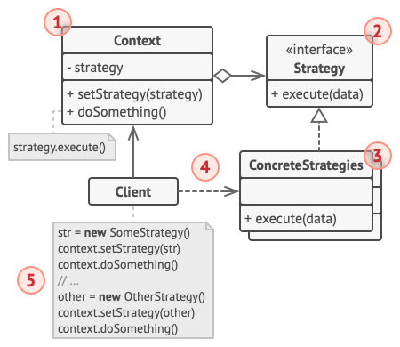

# 策略模式

*策略模式*能让你定义一系列算法，并将每种算法分别放入独立的类中，以使算法的对象能够相互替换。

## 背景

假设我们想要做一个导航系统，它包含自动规划路线的功能。我们的首个版本只能规划公路路线，下次我们将步行规划添加到该功能中，不久后我们还要添加骑行者的路线规划。

你会逐渐发现，每次新特性的增加都会使你的自动规划类的体积增加一倍，很快就难以维护这段代码。在实现新特性的时候有可能还会影响原有的功能。

## 解决方案

策略模式建议找出负责用许多不同方式完成特定任务的类，然后将其中的算法抽取到一组被称为*策略*的独立类中。

名为*上下文*的原始类必须包含一个成员变量来存储对于每种策略的引用。上下文并不执行任务，而是将工作委派给已连接的策略对象。

上下文不负责选择符合任务需要的算法，客户端会选择。上下文只通过策略的接口与对应的策略进行交互。

## 策略模式结构



- 上下文：维护指向具体策略的引用，且仅通过策略接口与该对象进行交流。
- 策略：其接口是所有具体策略的通用接口，它声明了一个上下文用于执行策略的方法。
- 具体策略：实现上下文所用算法的各种不同变体

当上下文需要执行算法时，会调用引用的策略对象的接口，但它并不清楚策略对象会使用什么算法。客户端将选择上下文使用的策略，上下文也将提供一个用于切换策略的接口。

## 代码

[DP-Strategy.cpp](assets/codes/DP-Strategy.cpp)

```c++
#include <iostream>

using namespace std;

class Strategy {
public:
    virtual void plan() = 0;
};

class Navigator {
    Strategy *strategy;
public:
    void setStrategy(Strategy *s) { strategy = s; }
    void plan() { if (strategy) strategy->plan(); }
};

class Walk: public Strategy {
public:
    void plan() override { cout << "A -> B -> C -> D" << endl; }
};
class Drive: public Strategy {
public:
    void plan() override { cout << "A -> E -> F -> D" << endl; }
};

int main() {
    Navigator navigator;
    Walk walk;
    Drive drive;
    navigator.setStrategy(&walk);
    navigator.plan();
    navigator.setStrategy(&drive);
    navigator.plan();
    return 0;
}
```

## 参考

[策略设计模式](https://refactoringguru.cn/design-patterns/strategy)
