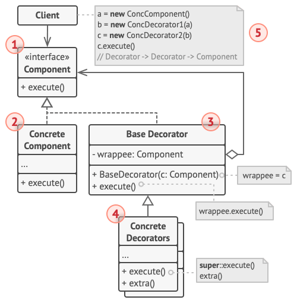

# 装饰模式

*装饰模式* 允许你通过将对象放入包含行为的特殊封装对象中来为原对象绑定新的行为。它本质是对一个对象的功能的增强。

它利用<mark>聚合或组合</mark>而不是继承。两者的工作方式几乎一模一样：一个对象 *包含* 指向另一个对象的引用，并将部分工作委派给引用对象；继承中的对象则继承了父类的行为，它们自己 *能够* 完成这些工作。

> **聚合**：对象 A 包含 B，B 可以独立于 A 存在；
>
> **组合**：对象 A 由 B 构成，A 负责管理 B 的声明周期，B 无法独立于 A 存在

一个对象可以使用多个类的行为，包含多个指向其他对象的引用，并将各种工作委派给引用对象。聚合（或组合）组合是许多设计模式背后的关键原则（包括装饰在内）。

*封装器* 是装饰模式的别称，它是一个能与其他 *目标* 对象连接的对象。封装器包含与目标对象相同的一系列方法，它会将所有接收到的请求委派给目标对象。但是，封装器可以在将请求委派给目标前后对其进行处理，所以可能会改变最终结果。

客户端代码将被装饰对象放入一系列自己所需的装饰中，最后的对象将形成一个栈结构。实际与客户端交互的对象是最后一层装饰对象，由于所有装饰都实现了与被装饰对象的类相同的接口，客户端代码并不在意使用的对象是否经过装饰。

## 装饰模式结构



- 组件：声明封装器和被封装对象的公用接口；
- 具体组件：被封装对象所属的类，它定义了基础行为，但装饰类可以改变这些行为；
- 基础装饰：拥有一个指向被封装对象的引用成员变量，该变量的类型应当被声明为通用部件接口，这样它就可以引用具体的部件和装饰，装饰基类会将所有操作委派给被封装的对象；
- 具体装饰：定义了可动态添加到部件的额外行为，具体装饰类会重写装饰基类的方法，并在调用父类方法之前或之后进行额外的行为

客户端可以使用多层装饰来封装部件，只要它能使用通用接口与所有对象互动即可。

## 代码

```c++
#include <iostream>
using namespace std;

class Person {
public:
    virtual void getInfo() {
        cout << "I'm a person." << endl;
    }
};

class Student: public Person {
public:
    void getInfo() override {
        cout << "I'm a student" << endl;
    }
};

class Decorator: public Person {
    Person *m_person;
public:
    explicit Decorator(Person *person): m_person(person) {}
    void getInfo() override {
        m_person->getInfo();
    }
    virtual ~Decorator() {
        delete m_person;
    }
};

class Music: public Decorator {
public:
    explicit Music(Person *person): Decorator(person) {}
    void getInfo() override {
        Decorator::getInfo();
        cout << "I have learnt music" << endl;
    }
};

class Drawing: public Decorator {
public:
    explicit Drawing(Person *person): Decorator(person) {}
    void getInfo() override {
        Decorator::getInfo();
        cout << "I have learnt drawing" << endl;
    }
};

int main() {
    Person *person = new Student();
    person = new Music(person);
    person = new Drawing(person);
    person->getInfo();
    return 0;
}
```

## 参考

[装饰器模式](https://refactoringguru.cn/design-patterns/decorator)