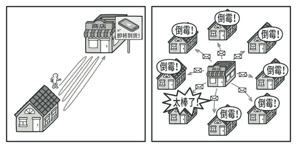

# 观察者模式

*观察者模式*允许你定义一种订阅机制，可在对象事件发生时通知多个“观察”该对象的其他对象。

## 背景



我们考虑这样一个场景，一部分顾客对手机特别感兴趣，每当一个新产品快要发售时，他就会每天来商店查看是否到货。

当然也可以在商店的新款手机到货时，给所有顾客发送邮件，这样感兴趣的顾客就无需反复到商店确认了。但是这也会使其他不感兴趣的顾客十分反感。

## 解决方案

拥有一些值得关注的状态的对象通常被称为*目标*，由于它要将自身的状态改变通知给其他对象，我们也将其称为*发布者 (publisher)*。所有希望关注发布者状态变化的其他对象被称为*订阅者 (subscribers)*。

观察者模式建议你为发布者类添加订阅机制，让每个对象都能订阅或取消订阅发布者事件流。该机制包括：

- 一个用于存储订阅者对象引用的列表成员变量；
- 几个用于添加或删除该列表中订阅者的公有方法

所有订阅者都必须实现同样的接口，发布者仅通过该接口与订阅者交互。接口中必须声明通知方法及其参数，这样发布者在发出通知时还能传递一些上下文数据。

## 观察者结构


- 发布者：向其他对象发送值得关注的事件，事件会在发布者自身状态改变或执行特定行为后发生，发布者中包含一个允许新订阅者加入和当前订阅者离开列表的订阅构架；
- 订阅者：声明了通知接口，在绝大多数情况下，该接口仅包含一个 `update` 更新方法，该方法可以拥有多个参数，使发布者能在更新时传递事件的详细信息

订阅者通常需要一些上下文信息来正确地处理更新。因此，发布者通常会将一些上下文数据作为通知方法的参数进行传递。发布者也可将自身作为参数进行传递，使订阅者直接获取所需的数据。

## 代码

[DP-Observer](assets/codes/DP-Observer.cpp)

```c++
#include <iostream>
#include <vector>
#include <string>

using namespace std;

class EventListener {
public:
    virtual void update(const string& filename) = 0;
};

class EventManager {
    vector<EventListener *> listeners;
public:
    void subscribe(EventListener *listener) {
        listeners.push_back(listener);
    }
    void unsubscribe(EventListener *listener) {
        for (auto l = listeners.begin(); l != listeners.end(); l++) {
            if (*l == listener) {
                listeners.erase(l);
                break;
            }
        }
    }
    void notify(const string& data) {
        for (auto *l: listeners) {
            l->update(data);
        }
    }
};

class EmailListener: public EventListener {
public:
    void update(const string &filename) override {
        cout << filename << " has been received..." << endl;
    }
};

int main() {
    EmailListener el;
    EventManager em;
    em.subscribe(&el);
    em.notify("promoteAD");
    em.unsubscribe(&el);
    em.notify("iphoneAD");
    return 0;
}
```

## 参考

[观察者设计模式](https://refactoringguru.cn/design-patterns/observer)