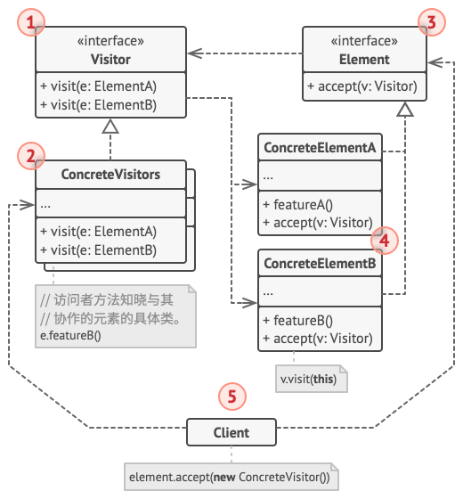

# 访问者模式

*访问者模式*能将算法与其所作用的对象隔离开来。

## 背景

假设现在你的团队开发了一个能使用巨型图像中地理信息的应用，图像中的既能代表复杂实体也能描绘更精细的对象。每个节点都有所属的类表示。

你接到将图像导出到 XML 的任务，这看起来很简单，只要为每个类添加导出函数，然后递归执行即可。但是系统架构师拒绝这样的修改，因为对已有代码产品进行修改可能会引入潜在的缺陷。

此外，这些类的主要工作是处理地理数据，导出 XML 放在这里并不合适。在完成该任务后，你可能又会被要求添加导出其他类型文件的要求，因而可能会被破再次修改这些类。

## 解决方案

访问者模式建议将新行为放入一个名为*访问者*的独立类中，而不是试图将其整合到已有类中。 需要执行操作的原始对象将作为参数被传递给访问者中的方法，让方法能访问对象所包含的一切必要数据。

不同节点导出 XML 的实现可能稍有不同，为此访问者可以定义**一组**方法处理不同类型的参数。这些方法使用的参数各不相同，因此不能使用多态机制，而需要检查节点参数类型来执行对应的方法，但这将使得代码十分冗长。

访问者模式使用*双分派*的技巧，不使用累赘的条件语句也可下执行正确的方法。与其让客户端来选择调用正确版本的方法，不如将选择权委派给作为参数传递给访问者的对象。由于该对象知晓其自身的类，因此能更自然地在访问者中选出正确的方法。它们会“接收”一个访问者并告诉其应执行的访问者方法。

这将对原有的类添加统一的“接受”接口方法，使得我们在后续进一步添加行为时无需再次修改代码。我们抽取出所有访问者的通用接口，所有已有的节点都能与我们在程序中引入的任何访问者交互。如果需要引入与节点相关的某个行为，你只需要实现一个新的访问者类即可。

## 访问者模式结构



- 访问者：声明了一系列以对象结构的具体元素为参数的访问者接口方法，如果编程语言支持重载，这些方法的名称可以是相同的，但是其参数一定是不同的；
- 具体访问者：为不同的具体元素类实现相同行为的几个不同版本；
- 元素：声明了一个接口方法来“接收”访问者，该方法必须有一个参数被声明为访问者接口类型；
- 具体元素：必须实现接收方法，该方法的目的是根据当前元素类将其调用重定向到相应访问者的方法，<mark>即使元素基类实现了该方法，所有子类都必须对其进行重写并调用访问者对象中的合适方法</mark>。

客户端通常作为集合或者其他复杂对象(如组合树)，并且不知道所有具体元素类，因为它通常通过抽象接口与集合中的对象进行交互。

## 代码

[DP-Visitor](assets/codes/DP-Visitor.cpp)

```c++
#include <iostream>

using namespace std;

class Visitor;
class Element {
public:
    virtual void accept(Visitor *visitor) = 0;
};

class ElementA;
class ElementB;
class Visitor {
public:
    virtual void visit(ElementA *elementA) = 0;
    virtual void visit(ElementB *elementB) = 0;
};

class ElementA: public Element {
public:
    void show() { cout << "this is element A" << endl; }
    void accept(Visitor *visitor) override {
        visitor->visit(this);
    }
};
class ElementB: public Element {
public:
    void show() { cout << "this is element B" << endl; }
    void accept(Visitor *visitor) override {
        visitor->visit(this);
    }
};

class Shower: public Visitor {
public:
    void visit(ElementA *elementA) override { elementA->show(); }
    void visit(ElementB *elementB) override { elementB->show(); }
};

int main() {
    ElementA elementA;
    ElementB elementB;
    Shower shower;
    elementA.accept(&shower);
    elementB.accept(&shower);
    return 0;
}
```

## 参考

[访问者设计模式](https://refactoringguru.cn/design-patterns/visitor)