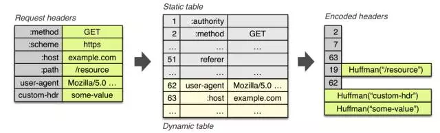
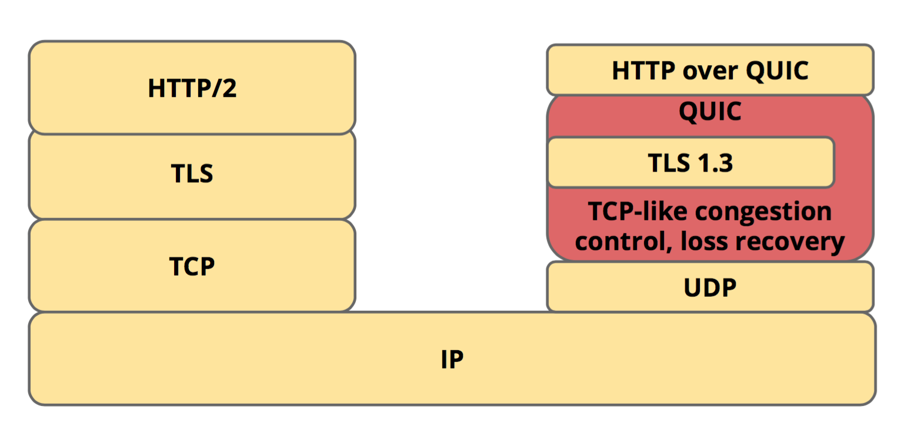
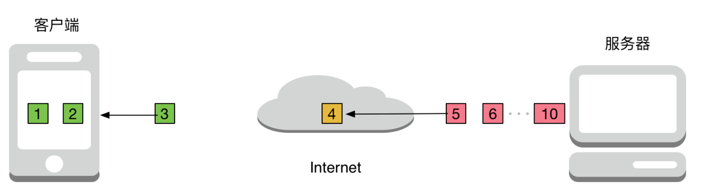
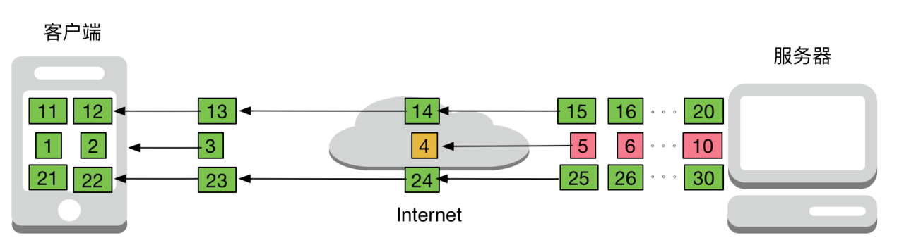
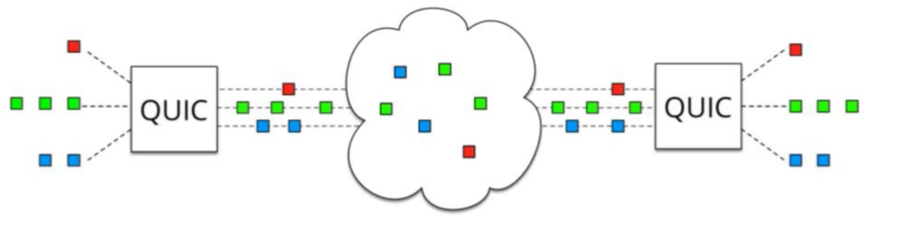

文章主要记录 HTTP 的起源和版本演变，应用层相关细节请参考[应用层](./应用层.md)。<u>***HTTP***</u>（**H**yper **T**ext **T**ransfer **P**rotocol）的设计理念是：借助文档之间的相互关联形成的超文本，链接成可以相互参阅的 <u>***WWW***</u>（**W**orld **W**ide **W**eb）万维网。

# 初始设计

### HTTP/0.9

HTTP/0.9 只有一个 GET 命令，即只能通过 GET 获取服务器资源。该版本规定，服务器只能回应 HTML 格式的字符串，不能回应其他格式，即**图像、视频等多媒体资源在 HTTP/0.9 版本上是无法进行传输的**。

### HTTP/1.0

这是 HTTP 的第一个作为标准正式公布的版本，它增加了 POST 和 HEAD 命令，丰富了浏览器与服务器的交互手段。这个版本的协议可以发送任何格式的内容，包括文本、图像、视频、文件等。

HTTP/1.0 还增加了格式的改变。除了数据部分，每次通信都需要包含头部（Header）用来描述元数据，还增加了**状态码、多字符集支持、多部分发送（Multi-part type）、权限（Authorization）、缓存、内容编码（Content encoding）**等等。

HTTP/1.0 每次发送请求都需要建立一个 TCP 连接（短连接）。一次请求和响应完成后就关闭连接，如果想请求其他资源需要建立新连接。重复不断的连接建立会对服务器产生较大的资源性能损耗。

### HTTP/1.1

这是目前主流的 HTTP 协议版本。最著名的是修订版本 [RFC2616](https://tools.ietf.org/html/rfc2616)。这个版本最大的变化就是将持久化连接加入了 HTTP 标准，即 TCP 连接默认不关闭，可以被多个请求复用（长连接）；此外，还新增了许多方法，例如：PUT、PATCH、OPTIONS、DELETE。

# 安全性与 HTTPS

由于 HTTP 本身以明文形式传输，不具备数据加密、身份校验等机制。下层协议并不对数据安全性、保密性提供保证。所以在网络传输过程中，任意节点的第三方都可以随意劫持流量、篡改数据或窃取信息。

对于安全需求，首先想到的就是数据加密。<u>***SSL***</u>（**S**ecure **S**ockets **L**ayer）安全套接层，在 TCP 上提供安全保证，位于应用层和传输层之间，应用数据不再直接传递给传输层而是传递给 SSL。SSL 会将应用层的数据进行加密，利用**数据加密、身份认证和消息完整性机制**为网络数据传输提供安全性保证。

采用 HTTPS（HTTP over SSL）协议的服务器必须有一套数字证书，可以自己颁发，也可以向组织申请。区别在于自己颁发的证书需要客户端用户确认才能继续访问，受信任的公司颁发的证书则不会导致安全提示。

1996 年 SSL 3.0 协议发布，获得互联网广泛认可和支持。<u>***IETF***</u>（**I**nternet **E**ngineering **T**ask **F**orce）互联网工程任务组接受负责该协议，并将其重命名为 <u>***TLS***</u>（**T**ransport **L**ayer **S**ecurity）传输层安全协议。

# 改进与 HTTP2

互联网爆炸式地发展，从起初网页内容以文本为主，到现在以富媒体为主；而且对页面内容实时性要求高的应用越来越多，如聊天，视频直播。

今年最流行的网站首页资源加载数量在逐渐增加，首页需要下载的数量以超过 2100K，平均每个页面为了完成显示与渲染所需要下载的资源数也超过 100 个。

HTTP/1.1 主要有两个缺点：安全性不足和性能不高。由于 HTTP/1.x 的普遍使用，因此对协议的修改，兼容性是考虑的首要目标，否则互联网上无数资产将被破坏。

### SPDY 协议

2010-2015 年，谷歌提出实验性的 <u>***SPDY***</u>（**SP**ee**DY**）协议。项目启动时预设的目标是：

- <u>***PLT***</u>（**P**age **L**oading **T**ime）页面加载时间减少 50%；
- 无需网站作者修改任何内容（资源兼容性）；
- 将部署复杂性降至最低，无需变更网络基础设施（硬件兼容性）；
- 收集真实性能数据，验证实验性协议有效性

为了降低 PLT，SPDY 引入新的二进制分帧数据层，以实现多向请求响应、优先次序、最小化及消除不必要的网络延迟，目的是更有效的利用 TCP 连接。

SPDY 位于 HTTP 之下、TCP 和 SSL 之上，这样可以在轻松兼容老版本的 HTTP 协议的同时，使用已有的 SSL 功能。SPDY 协议在 Chrome 浏览器上证明可行以后，就被当作 HTTP/2 的基础，并在其中得到继承。

### HTTP/2

HTTP/2 保留了 HTTP/1.1 大部分语义，采用了新的编码方式和数据传输方式。具体特点在于：

- 二进制分帧层：将所有传输的信息分割为更小的消息和帧，并对其采用二进制格式编码，HTTP/1.x 首部信息被封装到 Headers 帧，Request Body 则被封装到 Data 帧中；
- 多路复用：对于 HTTP/1.x 来说，即便开启了长连接，请求的发送也是串行的。在带宽足够的情况下，这对带宽的利用率不够；HTTP/2.0 采用了多路复用方式，可以并行发送多个请求，提高对带宽的利用率；
- 数据流优先级：由于请求可以并发发送，为了根据客户端的请求进行调整发送策略，HTTP/2.0 对数据流可以设置优先值，用来决定客户端和服务端处理不同的流采用不同的优先级策略；
- 服务端推送：服务器可以向客户端发送请求之外的内容，如客户端请求一个页面时，服务端会将相关 Logo、CSS 文件等推送到客户端，而不是等请求到来在发送，因为服务端认为客户端会用到这些东西；这相当于在 HTML 中集合了所有资源；
- 首部压缩：使用首部表跟踪和存储之前发送的**键值对**，对于相同的内容不会再每次请求和响应时发送；下一次发送只需要传输差异的数据，相同的数据直接用索引表示即可

HTTP/2.0 支持明文传输，而 SPDY 强制使用 HTTPS；HTTP/2.0 消息头的压缩算法采用 HPACK，而 SPDY 采用 DEFLATE。

### 缺点

在现代手机端流量较多的场景中，手机的网络环境会遇到封包丢失几率较高、较长 <u>***RTT***</u>（**R**ound **T**rip **T**ime）往返时间和连接迁移等问题。因此，移动网络使得原本为有线网络设计的 HTTP/TCP 遇到瓶颈。HTTP/2 有两个典型的问题：握手消耗与队头阻塞：

#### 握手消耗

握手带来的高消耗：HTTP/2 使用 TCP 协议传输，如果使用 HTTPS，其中 TLS 也需要握手过程：

- 建立 TCP 需要三次握手来确认连接成功，花费 1.5 RTT；
- TLS 建立连接花费与版本有关，大致是 1-2 RTT

即在数据传输前，建立连接需要耗费 3-4 RTT。

#### 队头阻塞

为了实现多路复用，HTTP/2 中的多个请求是传输在一个 TCP 连接中的。但是当出现丢包时，HTTP/2 表现反不如 HTTP/1.x。因为 TCP 为了保证可靠传输，丢失的包需要等待重传确认，导致整个 TCP 都要开始等待重传，进而阻塞该 TCP 连接中的所有请求。

而 HTTP/1.1 会开启多个 TCP 连接，出现丢包现象时只会影响其中一个连接，而剩余其他 TCP 连接可以正常传输。

# QUIC 和 HTTP3

TCP 的重传机制导致 HTTP/2 的性能在移动网络中比较低下。而 TCP 由于应用广泛而难以进行修改。

HTTP/3 基于 [<u>***QUIC***</u>](https://docs.google.com/document/d/1gY9-YNDNAB1eip-RTPbqphgySwSNSDHLq9D5Bty4FSU/edit)（**Q**uick **U**DP **I**nternet **C**onnections） 协议。QUIC 协议是 Google 提出的一套开源协议，基于 UDP 实现。QUIC 性能非常好，某些场景下甚至可以实现 0-RTT 的加密通信。它与 HTTP/2 相比主要有以下优势：

- 减少连接建立时间；
- 改进拥塞控制；
- 没有队头阻塞的多路复用；
- 修复之前的错误；
- 支持网络迁移

## 多路复用

多路复用是非常复杂的任务，要理解 QUIC 如何处理及原因，需要从 HTTP/1.0 开始分析。

### Pipeline

HTTP/1.0 协议中规定了 `Connection` 字段，默认是 close。因此每请求一个资源都需要建立一次 TCP 请求；HTTP/1.1 中将该字段的默认值设置为 `Keep-Alive`，这样同一域名下多个 HTTP 请求可以复用同一 TCP 连接。这种方式称为 Pipeline，优点是显著减少了连接建立次数，大幅减少 RTT。

据谷歌调查，请求一个网页平均涉及到 80 个资源和 30 多个域名。对于 HTTP/1.0 来说，需要建立 80 个 TCP 连接；而采用 HTTP/1.1 Pipeline 则只需要建立 30 个连接。

但是所有管道模型都难以避免队头阻塞问题。

### 队头阻塞

队头阻塞（<u>***HOL Blocking***</u>, **H**ead **O**f **L**ine **Blocking**）是当多个串行的请求执行时，队列首部的第一个请求不执行完，后续请求也会被阻塞。因此 HTTP 协议允许客户端发起多个并发请求：

但是这并没有直接解决队头阻塞的问题，而是减少了队头阻塞造成的影响。

### SPDY 多路复用

SDPY 协议的多路复用（Multiplexing）技术允许多个 HTTP 请求共享同一个 TCP 连接。假设每个资源分多个包传递，则 HTTP/1.1 中只有前一个资源所有数据包传输完毕后才传输后一个资源数据包；但在 SPDY 中大家可以一起传输。

这样的代价是数据会略有冗余，每个资源数据包都要带上标记，来指明属于哪个资源。

TCP 中滑动窗口的概念大幅提升了其数据传输时的抗干扰能力，通常丢失少量 ACK 并不会产生什么影响（因为收到了后一个数据包的 ACK 说明前一个数据包一定到达了）。但是如果发生丢包或出错，窗口就无法向前滑动，从而出现队头阻塞现象。

因此 SPDY 并没有完全解决队头阻塞的问题，因为队头阻塞不仅出现在 HTTP 也出现在 TCP。

### QUIC 多路复用

QUIC 协议也采用了多路复用技术。它基于 UDP 实现，这为 QUIC 提供了多路复用基础，也要求其自身保证数据可达性。

TCP 的丢包重传并不是好方式，因为一旦有了前后顺序，队头阻塞则不可避免。对于无序的数据传输，则可以考虑将要求降低为：最多丢一个或错一个包。

在操作系统中有一种存储方式：独立硬盘冗余阵列 <u>***RAID***</u> (**R**edundant **A**rray of **I**ndependent **D**isks) 5，采用异或运算和数据冗余来实现 <u>***FEC***</u>（**F**orward **E**rror **C**orrecting）前向纠错。QUIC 协议采用类似的思想，基本避免了重发的情况。

QUIC 也支持重传，当某些非常重要的数据或者丢失两个包时会导致重传。

## 低 RTT 连接

一次 HTTPS 请求通常需要 3 次 TCP 握手加 4 次 SSL/TLS 握手，至少 3-RTT，但 QUIC 在某些场景下能做到 0-RTT。

TCP 可以通过开启 [TFO](./运输层.md#TFO-过程) 在后续的连接中实现 0-RTT。但是这通常很困难，因为几乎没人愿意为这点收益对网络协议栈做很大改动。

对 HTTP/2 来说，需要额外一个 RTT 来协商，判断服务器与客户端是否都支持 HTTP/2，但是可以与 SSL 握手合并。这就导致，大多数主流浏览器仅支持 HTTPS/2 而不单独支持 HTTP/2，因为从 HTTP/2 到 HTTPS/2 仅需额外一个 RTT 即可换取数据安全。

### QUIC 0-RTT

如果进行加密通信前通信双方从未通信过，0-RTT 是不可能的，即使 QUIC 也是如此。QUIC 握手过程需要一次数据交互，使用 Diffe-Hellman 协商初试密钥，初始密钥依赖于服务器存储的一组会周期性更新的配置参数。协商成功后，服务器提供一个临时随机数，双方再根据该随机数生成会话密钥。

1. 客户端判断本地是否已有服务器的全部配置参数，如果有则直接跳转到 5，否则继续；
2. 客户端向服务器发送 CHLO (inchoate client hello) 消息，请求服务器传输配置参数；
3. 服务器收到 CHLO，回复 REJ (rejection) 消息，其中包含服务器的部分配置参数；
4. 客户端收到 REJ，提取并存储服务器配置参数，跳回到 1；
5. 客户端向服务器发送 full client hello 消息，开始正式握手，消息中包括客户端选择的公开数，此时客户端根据获取的服务器配置参数和自己选择的公开数，可以计算出初始密钥
6. 服务器收到 full client hello，如果不同意连接就回复 REJ，同 3；如果同意连接，根据客户端的公开数计算出初始密钥，回复 SHLO (server hello) 消息，SHLO 用初始密钥加密，并且其中包含服务器选择的一个临时公开数；
7. 客户端收到服务器的回复，如果是 REJ 则情况同 4；如果是 SHLO，则尝试用初始密钥解密，提取出临时公开数；
8. 客户端和服务器根据临时公开数和初始密钥，各自基于 SHA-256 算法推导出会话密钥
9. 双方更换并使用会话密钥通信，初始密钥失效

之后会话密钥更新的流程与以上过程类似，只是数据包中的某些字段略有不同。

# 原文

[当我谈 HTTP 时，我谈些什么](https://www.upyun.com/tech/article/564/%E5%BD%93%E6%88%91%E8%B0%88%20HTTP%20%E6%97%B6%EF%BC%8C%E6%88%91%E8%B0%88%E4%BA%9B%E4%BB%80%E4%B9%88.html)