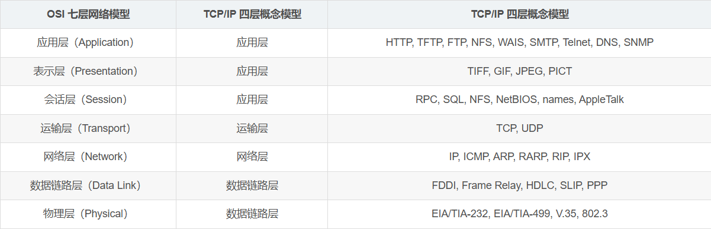

# 协议层次及其服务类型

网络协议层次可以分为OSI七层模型、TCP/IP五层模型和TCP/IP四层模型

## OSI七层模型

### 应用层

**应用层的作用是通过应用程序间的交互来完成特定的网络功能。该层协议定义了应用进程之间的交互规则，通过不同的应用层协议为不同的网络应用提供服务**。例如域名系统 DNS，支持万维网应用的 HTTP 协议，电子邮件系统采用的 SMTP 协议等。在应用层交互的数据单元我们称之为**报文**。

该层主要的协议有：

- **HTTP（超文本传输协议， Hyper Text Transfer Protocol）**

- **FTP（文件传输协议， File Transfer Protocol ）**

- **SMTP（简单邮件传输协议， Simple Mail Transfer Protocol ）**

- **DNS（域名系统， Domain Name System ）**

- **DHCP（动态主机配置协议， Dynamic Host Configuration Protocol ）**

- WAIS（广域信息服务 wide area information service ）
- SNMP（ 简单网络管理协议，Simple Network Management Protocol ）

### 表示层

**表示层的作用是为异种机通信提供一种公共语言，以便能够进行互操作**。其位于 OSI 参考模型的第六层，向上为应用层提供服务，向下接收来自会话层的服务。该层提供的服务主要包括**数据压缩，数据加密以及数据描述**。这使得应用程序不必担心在各台计算机中表示和存储的内部格式差异。

协议：

- TIFF

- GIF

- JPEG

- PICT

### 会话层

会话层就是**负责建立、管理和终止表示层实体之间的通信会话**。该层提供了数据交换的定界和同步功能，包括了建立检查点和恢复方案的方法。

协议：

- **RPC（ 远程过程调用，Remote Procedure Call）**

- **SQL（ 结构化查询语言，Structured Query Language ）**

- NFS（网络文件系统， Network File System ）

- NetBIOS（ 网上基本输入输出系统 ， Network Basic Input/Output System ）

### 运输层

运输层的主要任务是**为运行在不同主机的进程之间提供直接的通信服务，即向高层用户屏蔽通信子网的细节，提供通用的传输接口。**

协议：

- **TCP（传输控制协议， Transmission Control Protocol ）**

- **UDP（用户数据报协议， User Datagram Protocol ）**

### 网络层

**两台计算机之间传送数据时其通信链路往往不止一条，所传输的信息甚至可能经过很多通信子网。网络层的主要任务就是选择合适的网间路由和交换节点，确保数据成功传送**。在发送数据时，网络层把传输层产生的报文或用户数据报封装成分组和包向下传输到数据链路层。在网络层使用的协议是无连接的网际协议（Internet Protocol）和许多路由协议，因此我们通常把该层简单地称为 IP 层。

协议：

- **IP（ 网际互连协议，Internet Protocol ）**

- **ARP（ 地址解析协议 ， Address Resolution Protocol ）**

  根据ip地址获取物理地址

- **RARP（ 逆地址解析协议 ，Reverse Address Resolution Protocal）**

  根据物理地址获取ip

- **ICMP（控制报文协议， Internet Control Message Protocol ）**

   用于在IP主机、路由器之间传递控制消息。控制消息是指网络通不通、主机是否可达、路由是否可用等网络本身的消息。这些控制消息虽然并不传输用户数据，但是对于用户数据的传递起着重要的作用。 

- **IGMP（互联网组管理协议， Internet Group Management Ptotocol）**

- **RIP（ 路由信息协议，Routing Information Protocol  ）**

### 数据链路层

数据链路层在物理层和网络层之间。两台主机之间的数据传输，总是在一段一段的链路上传送的，这就需要使用专门的链路层协议。**在两个相邻节点之间传送数据时，数据链路层将网络层交下来的 IP 数据报组装成帧，在两个相邻节点间的链路上传送帧。每一帧包括数据和必要的控制信息。通过控制信息我们可以知道一个帧的起止比特位置，此外，也能使接收端检测出所收到的帧有无差错，如果发现差错，数据链路层能够简单的丢弃掉这个帧，以避免继续占用网络资源**。

协议：

- **PPP（点对点协议， Point to Point Protocol ）**

- MAC（网桥，交换机）

- **VPN（虚拟专用网络，  Virtual Private Network ）**

   通过在公共网络（比如互联网）建立专用网络来将用户或者站点远程链接起来的工具，可通过服务器、软件、硬件等多种方式实现。 

- HDLC（ 高级数据链路控制 ， High-level Data Link Control ）

### 物理层

物理层的作用是**实现计算机节点之间比特流的透明传送，尽可能屏蔽掉具体传输介质和物理设备的差异。使其上面的数据链路层不必考虑网络的具体传输介质是什么。**该层的主要任务是确定与传输媒体的接口的一些特性（机械特性、电气特性、功能特性，过程特性）。
协议：EIA/TIA-232, EIA/TIA-499, V.35, 802.3

## TCP/IP参考模型

OSI 七层模型在提出时的出发点是基于标准化的考虑，而没有考虑到具体的市场需求，使得该模型结构复杂，部分功能冗余，因而完全实现 OSI 参考模型的系统不多。而 TCP/IP 参考模型直接面向市场需求，实现起来也比较容易，因此在一经提出便得到了广泛的应用。基于 **TCP/IP 的参考模型将协议分成四个层次，如上图所示，它们分别是：网络访问层、网际互联层、传输层、和应用层。**

### 应用层

TCP/IP 模型将 OSI 参考模型中的**会话层、表示层和应用层**的功能合并到一个应用层实现，通过不同的应用层协议为不同的应用提供服务。例如：FTP、Telnet、DNS、SMTP 等。 

### 运输层

该层对应于 OSI 参考模型的运输层，为上层实体提供源端到对端主机的通信功能。传输层定义了两个主要协议：**传输控制协议（TCP）和用户数据报协议（UDP）**。其中面向连接的 TCP 协议保证了数据的传输可靠性，面向无连接的 UDP 协议能够实现数据包简单、快速地传输。 

### 网际互联层

网际互联层对应 OSI 参考模型的网络层，**主要负责相同或不同网络中计算机之间的通信**。在网际互联层， IP 协议提供的是一个不可靠、无连接的数据报传递服务。该协议实现两个基本功能：**寻址和分段**。根据数据报报头中的目的地址将数据传送到目的地址，在这个过程中 IP 负责选择传送路线。除了 IP 协议外，该层另外两个主要协议是互联网组管理协议（IGMP）和互联网控制报文协议（ICMP）。

### 网络接入层

网络接入层的功能对应于 OSI 参考模型中的**物理层和数据链路层**，**它负责监视数据在主机和网络之间的交换**。事实上，TCP/IP 并未真正描述这一层的实现，而由参与互连的各网络使用自己的物理层和数据链路层协议，然后与 TCP/IP 的网络接入层进行连接，因此具体的实现方法将随着网络类型的不同而有所差异。

## TCP/IP五层参考模型

 五层体系的协议结构是综合了 OSI 和 TCP/IP 优点的一种协议，包括**应用层、运输层、网络层、数据链路层和物理层**。其中应用层对应 OSI 的上三层，下四层和 OSI 相同。五层协议的体系结构只是为介绍网络原理而设计的，实际应用还是 TCP/IP 四层体系结构。 

## OSI和TCP/IP协议之间的对应关系

## 数据如何在各层之间传输【数据的封装过程】

- 在发送主机端，一个应用层报文被传送到运输层。

- 运输层收取到报文并附上附加信息，该首部将被接收端的运输层使用。应用层报文和运输层首部信息一道构成了运输层报文段。附加的信息可能包括：允许接收端运输层向上向适当的应用程序交付报文的信息以及差错检测位信息。该信息让接收端能够判断报文中的比特是否在途中已被改变。运输层则向网络层传递该报文段。
- 网络层增加了如源和目的端系统地址等网络层首部信息，生成了网络层数据报。该数据报接下来被传递给链路层。
- 在数据链路层数据包添加发送端 MAC 地址和接收端 MAC 地址后被封装成数据帧。
- 在物理层数据帧被封装成比特流，之后通过传输介质传送到对端。