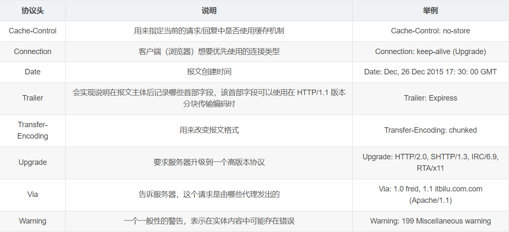
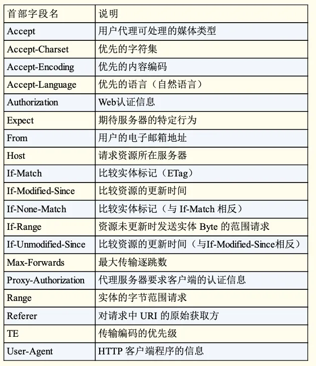
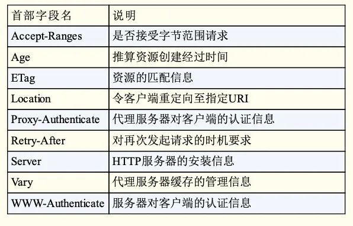
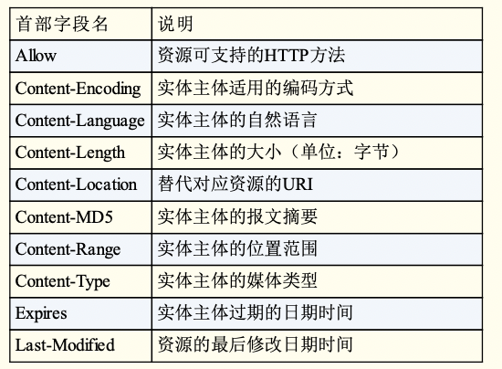
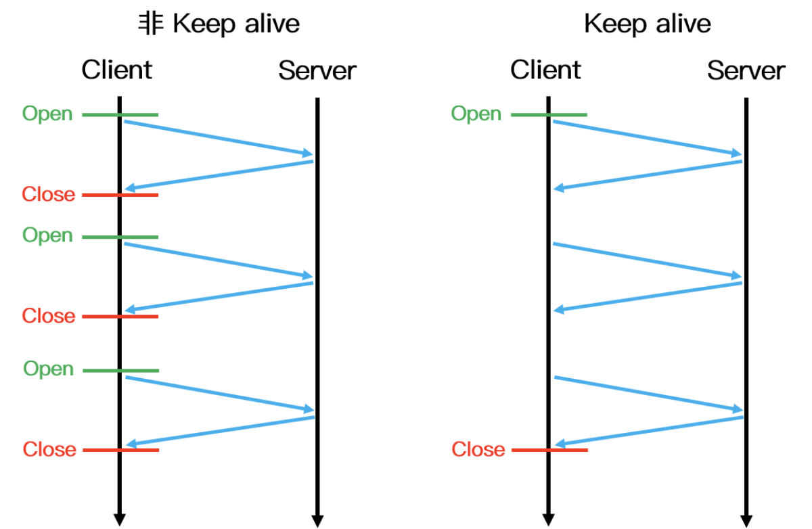
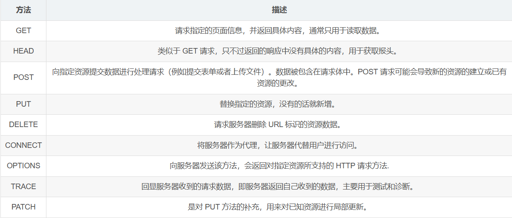
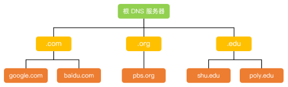
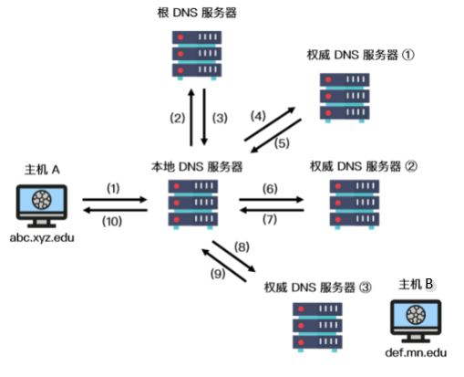
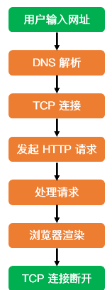

# 应用层

## 1、HTTP头部包含哪些信息？

HTTP 头部本质上是一个传递额外重要信息的键值对。主要分为：通用头部，请求头部，响应头部和实体头部。 

### 通用头部：

### 请求头部

请求首部字段是从客户端往服务器端发送请求报文中所使用的字段，用于补充请求的附加信息、客户端信息、对响应内容相关的优先级等内容。 

### 响应头部

响应首部字段是由服务器端向客户端返回响应报文中所使用的字段，用于补充响应的附加信息、服务器信息，以及对客户端的附加要求等信息 。

### 实体头部

实体首部字段是包含在请求报文和响应报文中的实体部分所使用的首部，用于补充内容的更新时间等与实体相关的信息。 

## 2、Keep-Alive 和非 Keep-Alive 区别，对服务器性能有影响吗

在早期的 HTTP/1.0 中，浏览器每次 发起 HTTP 请求都要与服务器创建一个新的 TCP 连接，服务器完成请求处理后立即断开 TCP 连接，服务器不跟踪每个客户也不记录过去的请求。然而创建和关闭连接的过程需要消耗资源和时间，为了减少资源消耗，缩短响应时间，就需要重用连接。在 HTTP/1.1 版本中默认使用持久连接，在此之前的 HTTP 版本的默认连接都是使用非持久连接，如果想要在旧版本的 HTTP 协议上维持持久连接，则需要指定 connection 的首部字段的值为 Keep-Alive 来告诉对方这个请求响应完成后不要关闭，下一次还用这个请求继续交流，我们用一个示意图来更加生动的表示两者的区别：

对于非 Keep-Alive 来说，必须为每一个请求的对象建立和维护一个全新的连接。对于每一个这样的连接，客户机和服务器都要分配 TCP 的缓冲区和变量，这给服务器带来的严重的负担，因为一台 Web 服务器可能同时服务于数以百计的客户机请求。在 Keep-Alive 方式下，服务器在响应后保持该 TCP 连接打开，在同一个客户机与服务器之间的后续请求和响应报文可通过相同的连接进行传送。甚至位于同一台服务器的多个 Web 页面在从该服务器发送给同一个客户机时，可以在单个持久 TCP 连接上进行。

然而，Keep-Alive 并不是没有缺点的，当长时间的保持 TCP 连接时容易导致系统资源被无效占用，若对 Keep-Alive 模式配置不当，将有可能比非 Keep-Alive 模式带来的损失更大。因此，我们需要正确地设置 keep-alive timeout 参数，当 TCP 连接在传送完最后一个 HTTP 响应，该连接会保持 keepalive_timeout 秒，之后就开始关闭这个链接。

## 3、什么是HTTP长连接和短连接，它们的使用场景分别是什么？

### 长链接

长连接是指浏览器向服务器进行一次HTTP会话之后，不会直接关闭这个连接，而是会默认保持一段时间，下一次浏览器继续访问的时候可以再次利用这个链接。在HTTP/1.1版本中，默认的连接都是长连接，可以通过Connection：keep-alive字段进行指定。实现长连接需要客户端和服务端都支持长连接。 长连接指建立SOCKET连接后无论使用与否都要保持连接，而短连接则是连接->传输数据->关闭连接。在Java中，可以通过轮询或websocket来实现HTTP长连接。

使用场景：

多用于操作频繁，点对点的通讯，而且客户端连接数目较少的情况。例如即时通讯、网络游戏等。

### 短连接

客户端和服务器每进行一次HTTP操作，就建立一次连接，任务结束就中断连接。 当客户端浏览器访问的某个HTML或其他类型的Web页中包含有其他的Web资源（如JavaScript文件、图像文件、CSS文件等），每遇到这样一个Web资源，浏览器就会重新建立一个HTTP会话。 

使用场景：

用户数目较多的Web网站的 HTTP 服务一般用短连接。例如京东，淘宝这样的大型网站一般客户端数量达到千万级甚至上亿，若采用长连接势必会使得服务端大量的资源被无效占用，所以一般使用的是短连接。 

## 4、HTTP1.0和HTTP1.1请求方法

HTTP/1.0 定义了三种请求方法：GET, POST 和 HEAD 方法。

HTTP/1.1 增加了六种请求方法：OPTIONS, PUT, PATCH, DELETE, TRACE 和 CONNECT 方法。

## 5、GET方法和POST方法的区别

- get 提交的数据会放在 URL 之后，并且请求参数会被完整的保留在浏览器的记录里，由于参数直接暴露在 URL中，可能会存在安全问题，因此往往用于获取资源信息。而 post 参数放在请求主体中，并且参数不会被保留，相比 get 方法，post方法更安全，主要用于修改服务器上的资源。
- get 请求只支持 URL 编码，post 请求支持多种编码格式。
- get 只支持 ASCII 字符格式的参数，而 post 方法没有限制。
- get 提交的数据大小有限制（这里所说的限制是针对浏览器而言的），而 post 方法提交的数据没限制.
- get 方式需要使用 Request.QueryString 来取得变量的值，而 post 方式通过 Request.Form 来获取。
- get 方法产生一个 TCP 数据包，post 方法产生两个（并不是所有的浏览器中都产生两个）。

## 6、GET的长度限制为多少，POST方法是否有长度限制？

HTTP 中的 GET 方法是通过 URL 传递数据的，而 URL 本身并没有对数据的长度进行限制，真正限制 GET 长度的是浏览器，例如 IE 浏览器对 URL 的最大限制为 2000多个字符，大概 2KB左右，像 Chrome, FireFox 等浏览器能支持的 URL 字符数更多，其中 FireFox 中 URL 最大长度限制为 65536 个字符，Chrome 浏览器中 URL 最大长度限制为 8182 个字符。并且这个长度不是只针对数据部分，而是针对整个 URL 而言，在这之中，不同的服务器同样影响 URL 的最大长度限制。因此对于特定的浏览器，GET的长度限制不同。

由于 POST 方法请求参数在请求主体中，理论上讲，**post 方法是没有大小限制**的，而真正起限制作用的是服务器处理程序的处理能力。

## 7、HTTP和HTTPs建立连接的过程

### HTTP

HTTP（Hyper Text Transfer Protocol: 超文本传输协议） 是一种简单的请求 - 响应协议，被用于在 Web 浏览器和网站服务器之间传递消息。HTTP 使用 TCP（而不是 UDP）作为它的支撑运输层协议。其默认工作在 TCP 协议 80 端口，HTTP 客户机发起一个与服务器的 TCP 连接，一旦连接建立，浏览器和服务器进程就可以通过套接字接口访问 TCP。客户机从套接字接口发送 HTTP 请求报文和接收 HTTP 响应报文。类似地，服务器也是从套接字接口接收 HTTP 请求报文和发送 HTTP 响应报文。其通信内容**以明文的方式发送**，不通过任何方式的数据加密。当通信结束时，客户端与服务器关闭连接。

### HTTPs

1. 客户端发起连接：客户端（如Web浏览器）向服务器发送连接请求。默认情况下，HTTPS使用TCP作为传输层协议，并在默认端口443上进行通信。
2. 服务器证书：服务器将其数字证书发送给客户端。证书是由可信的第三方机构（称为证书颁发机构或CA）签名的，用于验证服务器身份。证书包含服务器的公钥和相关信息。
3. 客户端验证证书：客户端接收到服务器的证书后，会验证证书的有效性。这包括检查证书是否由受信任的CA签名，证书是否在有效期内，以及证书中包含的域名是否与客户端请求的域名匹配。
4. 生成密钥：如果证书验证成功，客户端会生成用于加密通信的随机对称密钥。这个密钥将被用来加密和解密在客户端和服务器之间传输的数据。
5. 密钥交换：客户端使用服务器的公钥加密生成的随机密钥，并将其发送回服务器。由于服务器是唯一能够解密该密钥的拥有相应私钥的实体，因此可以确保密钥在传输过程中不会被中间人窃取。
6. 建立加密通道：服务器使用其私钥解密客户端发送的随机密钥。现在，客户端和服务器都拥有相同的随机密钥，可以使用对称加密算法来加密和解密在两者之间传输的数据。
7. 安全通信：使用建立的加密通道，客户端和服务器之间的数据传输将使用对称密钥进行加密和解密，以确保数据的保密性和完整性。

## 8、HTTPs和HTTP的区别对比

- HTTP 协议以明文方式发送内容，数据都是未加密的，安全性较差。
- HTTPS 数据传输过程是加密的，安全性较好。
- HTTP 和 HTTPS 使用的是完全不同的连接方式，用的端口也不一样，前者是 80 端口，后者是 443 端口。
- HTTPS 协议需要到数字认证机构（Certificate Authority, CA）申请证书，一般需要一定的费用。
- HTTP 页面响应比 HTTPS 快，主要因为 HTTP 使用 3 次握手建立连接，客户端和服务器需要握手 3 次，而 HTTPS 除了 TCP 的 3 次握手，还需要经历一个 SSL 协商过程。

## 9、HTTPs采用什么加密方式

HTTPS 采用**对称加密和非对称加密相结合**的方式，首先使用 SSL/TLS 协议进行加密传输，为了弥补非对称加密的缺点，HTTPS 采用证书来进一步加强非对称加密的安全性，通过非对称加密，客户端和服务端协商好之后进行通信传输的对称密钥，后续的所有信息都通过该对称秘钥进行加密解密，完成整个 HTTPS 的流程。

## 10、HTTP 是不保存状态的协议,如何保存用户状态

假如某个特定的客户机在短时间内两次请求同一个对象，服务器并不会因为刚刚为该用户提供了该对象就不再做出反应，而是重新发送该对象，就像该服务器已经完全忘记不久之前所做过的是一样。因为一个 HTTP 服务器并不保存关于客户机的任何信息，所以我们说 HTTP 是一个无状态协议。 

### 基于 Session 实现会话保持 

在客户端第一次向服务器发送 HTTP 请求后，服务器会创建一个 Session 对象并将客户端的身份信息以键值对的形式存储下来，然后分配一个会话标识（SessionId）给客户端，这个会话标识一般保存在客户端 Cookie 中，之后每次该浏览器发送 HTTP 请求都会带上 Cookie 中的 SessionId 到服务器，服务器根据会话标识就可以将之前的状态信息与会话联系起来，从而实现会话保持。

**优点**：安全性高，因为状态信息保存在服务器端。

**缺点**：由于大型网站往往采用的是分布式服务器，浏览器发送的 HTTP 请求一般要先通过负载均衡器才能到达具体的后台服务器，倘若同一个浏览器两次 HTTP 请求分别落在不同的服务器上时，基于 Session 的方法就不能实现会话保持了。

**解决方法**：采用中间件，例如 Redis，我们通过将 Session 的信息存储在 Redis 中，使得每个服务器都可以访问到之前的状态信息

### 基于 Cookie 实现的会话保持 

当服务器发送响应消息时，在 HTTP 响应头中设置 Set-Cookie 字段，用来存储客户端的状态信息。客户端解析出 HTTP 响应头中的字段信息，并根据其生命周期创建不同的 Cookie，这样一来每次浏览器发送 HTTP 请求的时候都会带上 Cookie 字段，从而实现状态保持。基于 Cookie 的会话保持与基于 Session 实现的会话保持最主要的区别是前者完全将会话状态信息存储在浏览器 Cookie 中。

优点：服务器不用保存状态信息， 减轻服务器存储压力，同时便于服务端做水平拓展。

缺点：该方式不够安全，因为状态信息存储在客户端，这意味着不能在会话中保存机密数据。除此之外，浏览器每次发起 HTTP 请求时都需要发送额外的 Cookie 到服务器端，会占用更多带宽。

## 11、状态码

| 分类 | 分类描述                                                     |
| ---- | ------------------------------------------------------------ |
| 1XX  | 指示信息–表示请求正在处理                                    |
| 2XX  | 成功–表示请求已被成功处理完毕                                |
| 3XX  | 重定向–要完成的请求需要进行附加操作                          |
| 4XX  | 客户端错误–请求有语法错误或者请求无法实现，服务器无法处理请求 |
| 5XX  | 服务器端错误–服务器处理请求出现错误                          |

## 12、DNS的域名解析原理

DNS主要用于将域名解析为对应的ip地址，使人们能够更方便的访问互联网。 DNS 采用了分布式的设计方案，其域名空间采用一种树形的层次结构： 

上图展示了 DNS 服务器的部分层次结构，从上到下依次为根域名服务器、顶级域名服务器和权威域名服务器。其实根域名服务器在因特网上有13个，大部分位于北美洲。第二层为顶级域服务器，这些服务器负责顶级域名（如 com、org、net、edu）和所有国家的顶级域名（如uk、fr、ca 和 jp）。在第三层为权威 DNS 服务器，因特网上具有公共可访问主机（例如 Web 服务器和邮件服务器）的每个组织机构必须提供公共可访问的 DNS 记录，这些记录由组织机构的权威 DNS 服务器负责保存，这些记录将这些主机的名称映射为 IP 地址。

除此之外，还有一类重要的 DNS 服务器，叫做本地 DNS 服务器。本地 DNS 服务器严格来说不在 DNS 服务器的层次结构中，但它对 DNS 层次结构是很重要的。一般来说，每个网络服务提供商（ISP） 都有一台本地 DNS 服务器。当主机与某个 ISP 相连时，该 ISP 提供一台主机的 IP 地址，该主机具有一台或多台其本地 DNS 服务器的 IP 地址。主机的本地 DNS 服务器通常和主机距离较近，当主机发起 DNS 请求时，该请求被发送到本地 DNS 服务器，它起着代理的作用，并将该请求转发到 DNS 服务器层次结构中。

**工作原理：**

假设主机 A（IP 地址为 abc.xyz.edu） 想知道主机 B 的 IP 地址 （def.mn.edu），如下图所示，主机 A 首先向它的本地 DNS 服务器发送一个 DNS 查询报文。该查询报文含有被转换的主机名 def.mn.edu。本地 DNS 服务器将该报文转发到根 DNS 服务器，根 DNS 服务器注意到查询的 IP 地址前缀为 edu 后向本地 DNS 服务器返回负责 edu 的顶级域名服务器的 IP 地址列表。该本地 DNS 服务器则再次向这些 顶级域名服务器发送查询报文。该顶级域名服务器注意到 mn.edu 的前缀，并用权威域名服务器的 IP 地址进行响应。通常情况下，顶级域名服务器并不总是知道每台主机的权威 DNS 服务器的 IP 地址，而只知道中间的某个服务器，该中间 DNS 服务器依次能找到用于相应主机的 IP 地址，我们假设中间经历了权威服务器 ① 和 ②，最后找到了负责 def.mn.edu 的权威 DNS 服务器 ③，之后，本地 DNS 服务器直接向该服务器发送查询报文从而获得主机 B 的IP 地址。

在上图中，IP 地址的查询其实经历了两种查询方式，分别是递归查询和迭代查询。

**拓展：域名解析查询的两种方式**

**递归查询：**如果主机所询问的本地域名服务器不知道被查询域名的 IP 地址，那么本地域名服务器就以 DNS 客户端的身份，向其他根域名服务器继续发出查询请求报文，即替主机继续查询，而不是让主机自己进行下一步查询，如上图步骤（1）和（10）。

**迭代查询：**当根域名服务器收到本地域名服务器发出的迭代查询请求报文时，要么给出所要查询的 IP 地址，要么告诉本地服务器下一步应该找哪个域名服务器进行查询，然后让本地服务器进行后续的查询，如上图步骤（2）~（9）。

## 13、DNS使用UDP还是TCP

既使用了UDP又使用了TCP

当进行区域传送（主域名服务器向辅助域名服务器传送变化的那部分数据）时会使用 TCP，因为数据同步传送的数据量比一个请求和应答的数据量要多，而 TCP 允许的报文长度更长，因此为了保证数据的正确性，会使用基于可靠连接的 TCP。

当客户端向 DNS 服务器查询域名 ( 域名解析) 的时候，一般返回的内容不会超过 UDP 报文的最大长度，即 512 字节。用 UDP 传输时，不需要经过 TCP 三次握手的过程，从而大大提高了响应速度，但这要求域名解析器和域名服务器都必须自己处理超时和重传从而保证可靠性。

## 14、socket()套接字有哪些

套接字（Socket）是对网络中不同主机上的应用进程之间进行双向通信的端点的抽象，网络进程通信的一端就是一个套接字，不同主机上的进程便是通过套接字发送报文来进行通信。例如 TCP 用主机的 IP 地址 + 端口号作为 TCP 连接的端点，这个端点就叫做套接字。 

套接字主要有以下三种类型：

**流套接字（SOCK_STREAM）**：**流套接字基于 TCP 传输协议，主要用于提供面向连接、可靠的数据传输服务**。由于 TCP 协议的特点，使用流套接字进行通信时能够保证数据无差错、无重复传送，并按顺序接收，通信双方不需要在程序中进行相应的处理。
**数据报套接字（SOCK_DGRAM）**：和流套接字不同，**数据报套接字基于 UDP 传输协议，对应于无连接的 UDP 服务应用**。该服务并不能保证数据传输的可靠性，也无法保证对端能够顺序接收到数据。此外，通信两端不需建立长时间的连接关系，当 UDP 客户端发送一个数据给服务器后，其可以通过同一个套接字给另一个服务器发送数据。当用 UDP 套接字时，丢包等问题需要在程序中进行处理。
**原始套接字（SOCK_RAW）**：由于流套接字和数据报套接字只能读取 TCP 和 UDP 协议的数据，当需要传送非传输层数据包（例如 Ping 命令时用的 ICMP 协议数据包）或者遇到操作系统无法处理的数据包时，此时就需要建立原始套接字来发送。

## 15、URI（统一资源标识符）和URL（统一资源定位符）之间有什么区别

URL，即统一资源定位符 (Uniform Resource Locator )，URL 其实就是我们平时上网时输入的网址，它标识一个互联网资源，并指定对其进行操作或获取该资源的方法。URL标识一个特定资源并表示该资源的某种形式是可以通过 HTTP 协议从相应位置获得。

**URL 是 URI 的一个子集**，两者都定义了资源是什么，而 URL 还定义了如何能访问到该资源。URI 是一种语义上的抽象概念，可以是绝对的，也可以是相对的，而URL则必须提供足够的信息来定位，是绝对的。简单地说，**只要能唯一标识资源的就是 URI**，**在 URI 的基础上给出其资源的访问方式的就是 URL**。

## 16、网页解析全过程

 ① **DNS 解析**：当用户输入一个网址并按下回车键的时候，浏览器获得一个域名，而在实际通信过程中，我们需要的是一个 IP 地址，因此我们需要先把域名转换成相应 IP 地址。 

 ② **TCP 连接**：浏览器通过 DNS 获取到 Web 服务器真正的 IP 地址后，便向 Web 服务器发起 TCP 连接请求，通过 TCP 三次握手建立好连接后，浏览器便可以将 HTTP 请求数据发送给服务器了。 

 ③ **发送 HTTP 请求**：浏览器向 Web 服务器发起一个 HTTP 请求，HTTP 协议是建立在 TCP 协议之上的应用层协议，其本质是在建立起的TCP连接中，按照HTTP协议标准发送一个索要网页的请求。在这一过程中，会涉及到负载均衡等操作。 

**负载均衡：**

负载均衡，英文名为 Load Balance，其含义是指将负载（工作任务）进行平衡、分摊到多个操作单元上进行运行，例如 FTP 服务器、Web 服务器、企业核心服务器和其他主要任务服务器等，从而协同完成工作任务。负载均衡建立在现有的网络之上，它提供了一种透明且廉价有效的方法扩展服务器和网络设备的带宽、增加吞吐量、加强网络处理能力并提高网络的灵活性和可用性。

负载均衡是分布式系统架构设计中必须考虑的因素之一，例如天猫、京东等大型用户网站中为了处理海量用户发起的请求，其往往采用分布式服务器，并通过引入反向代理等方式将用户请求均匀分发到每个服务器上，而这一过程所实现的就是负载均衡。

 ④ **处理请求并返回**：服务器获取到客户端的 HTTP 请求后，会根据 HTTP 请求中的内容来决定如何获取相应的文件，并将文件发送给浏览器。 

 ⑤ **浏览器渲染**：浏览器根据响应开始显示页面，首先解析 HTML 文件构建 DOM 树，然后解析 CSS 文件构建渲染树，等到渲染树构建完成后，浏览器开始布局渲染树并将其绘制到屏幕上。 

 ⑥ **断开连接**：客户端和服务器通过四次挥手终止 TCP 连接。 