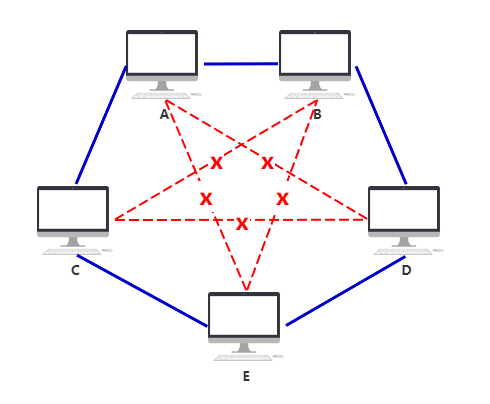

# 数据链路层

## 1、MAC地址和IP地址分别有什么作用

- MAC 地址是数据链路层和物理层使用的地址，是写在网卡上的物理地址。MAC 地址用来定义网络设备的位置。
- IP 地址是网络层和以上各层使用的地址，是一种逻辑地址。IP 地址用来区别网络上的计算机。

## 2、为什么有了MAC地址还要

如果我们只使用 MAC 地址进行寻址的话，我们需要路由器记住每个 MAC地址属于哪一个子网，不然每一次路由器收到数据包时都要满世界寻找目的 MAC 地址。而我们知道 MAC 地址的长度为 48 位，也就是说最多总共有 2 的 48 次方个 MAC 地址，这就意味着每个路由器需要 256 T 的内存，这显然是不现实的。
和 MAC 地址不同，IP 地址是和地域相关的，在一个子网中的设备，我们给其分配的 IP 地址前缀都是一样的，这样路由器就能根据 IP 地址的前缀知道这个设备属于哪个子网，剩下的寻址就交给子网内部实现，从而大大减少了路由器所需要的内存。

## 3、为什么有了 IP 地址还需要 MAC 地址

只有当设备连入网络时，才能根据他进入了哪个子网来为其分配 IP 地址，在设备还没有 IP 地址的时候或者在分配 IP 地址的过程中，我们需要 MAC 地址来区分不同的设备。 

# 物理层

### 1、物理层主要做什么事情

作为 OSI 参考模型最低的一层，物理层是整个开放系统的基础，该层利用传输介质为通信的两端建立、管理和释放物理连接，实现比特流的透明传输。物理层考虑的是怎样才能在连接各种计算机的传输媒体上传输数据比特流，其尽可能地屏蔽掉不同种类传输媒体和通信手段的差异，使物理层上面的数据链路层感觉不到这些差异，这样就可以使数据链路层只考虑完成本层的协议和服务，而不必考虑网络的具体传输媒体和通信手段是什么。

## 2、主机之间的通信方式

- 单工通信：也叫单向通信，发送方和接收方是固定的，消息只能单向传输。例如采集气象数据、家庭电费，网费等数据收集系统，或者打印机等应用主要采用单工通信。
- 半双工通信：也叫双向交替通信，通信双方都可以发送消息，但同一时刻同一信道只允许单方向发送数据。例如传统的对讲机使用的就是半双工通信。
- 全双工通信：也叫双向同时通信，全双工通信允许通信双方同时在两个方向是传输，其要求通信双方都具有独立的发送和接收数据的能力。例如平时我们打电话，自己说话的同时也能听到对面的声音。

# IP 与 MAC 问题汇总

IP（**I**nternet **P**rotocol）地址和 MAC（**M**edia **A**ccess **C**ontrol）地址分别来自网络协议栈的**<u>网络层</u>**和**<u>数据链路层</u>**。围绕这些概念，面试官通常会提出一些用一种取代另一种，或者某种协议或者地址是否可以不使用等类似的问题，甚至，基于我的想法，还可以给出一些误导性的问题。例如：

- 可不可以不要 IP 只用 MAC 地址？（反之亦然）
- 可不可以没有数据链路层？（反之亦然）
- 既然 IP 和 MAC 地址都可以唯一标识一个主机，为什么不能只用 IP/MAC 地址呢？（这显然是误导性的问题，如果真的回答地址标识或者地址不够用就掉到陷阱里了，因为本身他们解决的问题都不一样）

它们其实本质上都是问了一个问题，那就是这两个协议层分别解决了什么问题，这就需要从这些协议设计的角度来理解了。

## 网络层与数据链路层的发展简介

### 数据链路层的出现

最早出现的计算机是不能与其他计算机通信的，因此，为了与其他计算机通信，最简单的方式就是每个计算机开一个网口专门用于连接。

这在互通计算机较少的时候十分高效，但是当计算机数量非常庞大，你就会发现网线混乱不堪，甚至一台计算机根本开不了这么多网口。

为此，人们发明了中间设备**集线器**。你只需要计算机的网线都插到集线器上就可以彼此通信了。但是集线器所做的工作只是将信息转发到所有出口，即使用**广播**的形式。

但是这样又面临很多问题了：

- 如果两个计算机同时想发送消息如何处理？
- 计算机应该如何判断数据包是否是发送给自己的？

为此，人们又提出了**数据链路层协议**和 **MAC 地址**。

数据链路层希望将每次发送的数据信息都封装成一个**帧（封装成帧）**，一个帧包含首部、数据和尾部，这样计算机就可以判断数据包的开始和结束了。我们称首部、尾部为**帧定界符**。

但是有了帧定界符还不够，如果数据部分中也出现了与定界符相同的符号信息怎么办呢？于是，人们又规定了**转义符**用来转义控制字符，来表示它原有的含义。转义符如果想表达原本的意思，通常也需要用自己来转义。当然，为了区分定界符并不止这一种方式，这里只是简单理解，其他方式就不再介绍了。

总而言之，我们可以通过转义符等方式来解决了消息字符与帧定界符的混淆，给用户的感受就好像没有帧定界符一样，我们称之为**透明传输**。

最后，我们还需要进行**差错检测**，以免计算机接收到错误的数据还会进行处理，这会浪费网络和计算机资源。为此，在**帧**的最后还加入了 CRC 校验码，以此判断计算机当前接收到的数据帧是否正确。

所以，数据链路层解决的问题主要是：

- 封装成帧：从接收的比特流中识别帧的开始与结束；
- 透明传输：防止消息符号与帧定界符的混淆；
- 差错检测：防止处理无效数据帧浪费

此外，为了明确数据来源和目标，人们又在帧首部加入了源和目的 MAC 地址。MAC 地址是一个全局唯一的标识。这样计算机在收到广播信息后，就可以判断数据包是否是发给自己的了。

#### 交换机

集线器每次都是广播数据包，而计算机每次都需要丢弃不属于自己的数据包。久而久之，人们再也不能忍受这样低效的转发了，于是**交换机**应运而生。

交换机比集线器更加智能，属于数据链路层，并且可以指定计算机发送数据包。为此，它维护了一张 **MAC 地址表**，记录着每个 MAC 地址对应的设备连接在哪个端口上。

### 网络层的出现

随着设备连接数的不断增多，交换机的端口也不够了。于是，人们尝试将多个交换机连接起来，这个问题就迎刃而解了。

但这时候，人们也意识到，每出现一条红线，MAC 地址表的条目就会成倍增加。因为，你需要将另一个交换机连接的所有设备和对应端口的映射全部记录下来。当入网设备增加到几千台时，这个 MAC 地址表已经难以直视了。

于是，人们希望将那条红色的网线换成一个新的设备，它也有自己的独立的 MAC 地址，并且拥有数据包转发功能。

这个设备就是路由器，它的每个端口都拥有独立的 MAC 地址。因此，我们在之后又想接入一批新设备时，只需要将多个交换机连接到一个路由器上，并且在 MAC 地址表中添加路由器端口的 MAC 地址，然后将数据包转交给路由器进行转发就可以了。

构思是不错，但人们现在又面临了一个新的问题，如何判断这个 MAC 地址应该转发到哪里呢？总之，之前的 MAC 地址表肯定是不可行了，路由器的提出就是为了解决这个问题的。

如果我们每次接入的这批设备都有相同的 MAC 地址前缀就好了，这样路由器看到 MAC 地址就知道该设备属于哪里。

比如：C 的 MAC 地址为 FFFF-FFFF-CCCC；D 的 MAC 地址为 FFFF-FFFF-DDDD。路由器看到 MAC 地址是 FFFF-FFFF-* 的形式，就直接将数据包交给交换机 2 来处理。

但是这完全不可行，因为 MAC 地址是制造厂商生产设备时就烧写在网卡的 EPROM 中的，而且每个硬件制造商都有自己的可分配的 MAC 地址池，而且厂商分配的 MAC 地址通常是不能轻易改变的。

要不然我们再发明一个新地址？这时，**IP 地址**诞生了，我们可以给每个设备分配一个逻辑上的 IP 地址，而需要通过路由器转发的，利用交换机连接的这些设备相当于又构成一个小网络，我们称之为**子网**。这样，我们为子网中的所有设备都分配拥有相同前缀的 IP 地址，并且与 MAC 地址进行绑定，使得可以通过 IP 可以找到对应的设备。

这样一来，不同子网之间的数据包通过路由器路由转发，同一子网内的数据包通过交换机来转发。

最后，我们如何判断子网中的那个地址是路由器的地址呢？于是，每台设备又保存了一个称为**网关**的设备的地址，即设备访问互联网的数据包都通过网关来进行转发。

这样我们就解决了设备的互通问题。

## 为什么有了 MAC 地址还需要 IP？

因为 MAC 地址只解决了物理链路上的联通性问题，但是无法在逻辑上进行组网和拓扑的管理，因此需要使用 IP 这种逻辑地址来划分子网。它在初始设计时是为了解决 MAC 地址表膨胀问题的，提供了一种逻辑上的解决方案。

## 为什么有了 IP 地址还需要 MAC？

因为 IP 地址只是一种逻辑上的地址，它是为了计算机网络的逻辑管理和数据包高效转发而发明的。IP 地址需要与 MAC 地址绑定以通过逻辑地址获取物理地址，最终才能通过交换机转发到目的设备。

## 为什么有了数据链路层还需要网络层？

数据链路层解决了数据包在实际物理链路上传输的一系列问题，而网络层提供了一种高效的组网和网络管理解决方案，是逻辑上数据包传输协议层。它屏蔽了底层数据链路层面对不同物理链路传输场景时的协议差异，解决了网络结构较大时的转发问题，并向上层提供了统一的网络路由转发接口。

## 为什么有了网络层还需要数据链路层？

网络层只实现逻辑上的拓扑规划和网络管理（包括路由转发等），然而它没有解决数据包以何种形式在物理链路上传输的问题。数据链路层提出：封装成帧、透明传输、差错检测，是从物理线路上解决了数据包传输形式和数据包冲突等问题。

## 网络字节序

字节序通常分为**大端**（Big Endian）和**小端**（Little Endian）模式：

大端模式：高字节序存储在低地址，低字节存储在高地址；

小端模式：高字节存储在高地址，低字节存储在低地址；

大部分主机都以小端模式存储，这是因为加减乘除等运算大多都是由低字节开始，低字节存储在低地址方便 CPU 运算；大部分网络序都是大端模式，这样可以方便核对 IP 地址的前缀，从而提高转发效率。

## 参考

[如果让你来设计网络](https://mp.weixin.qq.com/s/jiPMUk6zUdOY6eKxAjNDbQ)