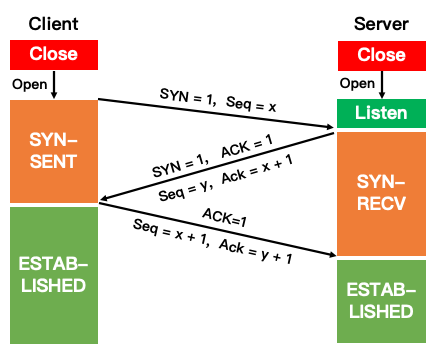
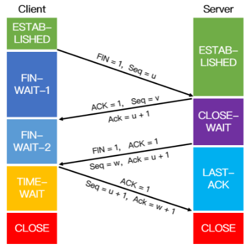
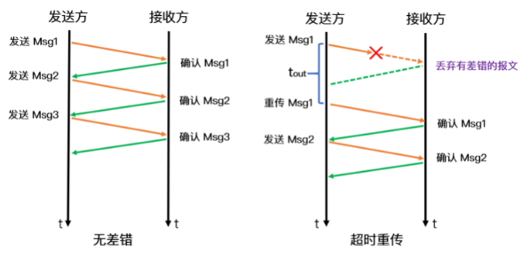
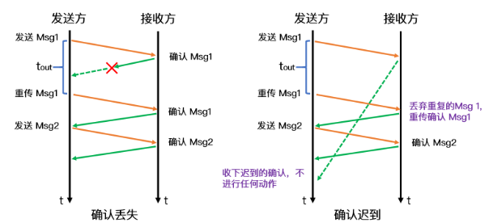
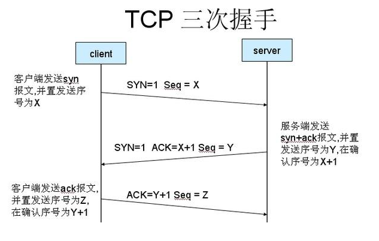

# 运输层

## 1、三次握手和四次挥手

三次握手是 TCP 连接的建立过程。在握手之前，主动打开连接的客户端结束 CLOSE 阶段，被动打开的服务器也结束 CLOSE 阶段，并进入 LISTEN 阶段。随后进入三次握手阶段： 

① 首先客户端向服务器发送一个 SYN 包，并等待服务器确认，其中：

- 标志位为 SYN，表示请求建立连接；
- 序号为 Seq = x（x 一般为 1）；
- 随后客户端进入 SYN-SENT 阶段。 

 ② 服务器接收到客户端发来的 SYN 包后，对该包进行确认后结束 LISTEN 阶段，并返回一段 TCP 报文，其中： 

- 标志位为 SYN 和 ACK，表示确认客户端的报文 Seq 序号有效，服务器能正常接收客户端发送的数据，并同意创建新连接；

- 序号为 Seq = y；

- 确认号为 Ack = x + 1，表示收到客户端的序号 Seq 并将其值加 1 作为自己确认号 Ack 的值，随后服务器端进入 SYN-RECV 阶段。

 ③ 客户端接收到发送的 SYN + ACK 包后，明确了从客户端到服务器的数据传输是正常的，从而结束 SYN-SENT 阶段。并返回最后一段报文。其中： 

- 标志位为 ACK，表示确认收到服务器端同意连接的信号；
- 序号为 Seq = x + 1，表示收到服务器端的确认号 Ack，并将其值作为自己的序号值；
- 确认号为 Ack= y + 1，表示收到服务器端序号 seq，并将其值加 1 作为自己的确认号 Ack 的值。
- 随后客户端进入 ESTABLISHED。

当服务器端收到来自客户端确认收到服务器数据的报文后，得知从服务器到客户端的数据传输是正常的，从而结束 SYN-RECV 阶段，进入 ESTABLISHED 阶段，从而完成三次握手。 

**四次挥手：**

四次挥手即 TCP 连接的释放，这里假设客户端主动释放连接。在挥手之前主动释放连接的客户端结束 ESTABLISHED 阶段，随后开始四次挥手： 

① 首先客户端向服务器发送一段 TCP 报文表明其想要释放 TCP 连接，其中：

- 标记位为 FIN，表示请求释放连接；
- 序号为 Seq = u；
- 随后客户端进入 FIN-WAIT-1 阶段，即半关闭阶段，并且停止向服务端发送通信数据。

② 服务器接收到客户端请求断开连接的 FIN 报文后，结束 ESTABLISHED 阶段，进入 CLOSE-WAIT 阶段并返回一段 TCP 报文，其中：

- 标记位为 ACK，表示接收到客户端释放连接的请求；
- 序号为 Seq = v；
- 确认号为 Ack = u + 1，表示是在收到客户端报文的基础上，将其序号值加 1 作为本段报文确认号 Ack 的值；
- 随后服务器开始准备释放服务器端到客户端方向上的连接。

客户端收到服务器发送过来的 TCP 报文后，确认服务器已经收到了客户端连接释放的请求，随后客户端结束 FIN-WAIT-1 阶段，进入 FIN-WAIT-2 阶段。 

③ 服务器端在发出 ACK 确认报文后，服务器端会将遗留的待传数据传送给客户端，待传输完成后即经过 CLOSE-WAIT 阶段，便做好了释放服务器端到客户端的连接准备，再次向客户端发出一段 TCP 报文，其中：

- 标记位为 FIN 和 ACK，表示已经准备好释放连接了；
- 序号为 Seq = w；
- 确认号 Ack = u + 1，表示是在收到客户端报文的基础上，将其序号 Seq 的值加 1 作为本段报文确认号 Ack 的值。

随后服务器端结束 CLOSE-WAIT 阶段，进入 LAST-ACK 阶段。并且停止向客户端发送数据。

④ 客户端收到从服务器发来的 TCP 报文，确认了服务器已经做好释放连接的准备，于是结束 FIN-WAIT-2 阶段，进入 TIME-WAIT 阶段，并向服务器发送一段报文，其中：

- 标记位为 ACK，表示接收到服务器准备好释放连接的信号；
- 序号为 Seq= u + 1，表示是在已收到服务器报文的基础上，将其确认号 Ack 值作为本段序号的值；
- 确认号为 Ack= w + 1，表示是在收到了服务器报文的基础上，将其序号 Seq 的值作为本段报文确认号的值。

随后客户端开始在 TIME-WAIT 阶段等待 2 MSL。服务器端收到从客户端发出的 TCP 报文之后结束 LAST-ACK 阶段，进入 CLOSED 阶段。由此正式确认关闭服务器端到客户端方向上的连接。客户端等待完 2 MSL 之后，结束 TIME-WAIT 阶段，进入 CLOSED 阶段，由此完成四次挥手。

## 2、如果三次握手的时候每次握手信息对方没有收到会怎么样

- 若第一次握手服务器未接收到客户端请求建立连接的数据包时，服务器不会进行任何相应的动作，而客户端由于在一段时间内没有收到服务器发来的确认报文，因此会等待一段时间后重新发送 SYN 同步报文，若仍然没有回应，则重复上述过程直到发送次数超过最大重传次数限制后，建立连接的系统调用会返回 -1。
- 若第二次握手客户端未接收到服务器回应的 ACK 报文时，客户端会采取第一次握手失败时的动作，这里不再重复，而服务器端此时将阻塞在 accept() 系统调用处等待 client 再次发送 ACK 报文。
- 若第三次握手服务器未接收到客户端发送过来的 ACK 报文，同样会采取类似于客户端的超时重传机制，若重传次数超过限制后仍然没有回应，则 accep() 系统调用返回 -1，服务器端连接建立失败。但此时客户端认为自己已经连接成功了，因此开始向服务器端发送数据，但是服务器端的 accept() 系统调用已返回，此时没有在监听状态。因此服务器端接收到来自客户端发送来的数据时会发送 RST 报文给客户端，消除客户端单方面建立连接的状态。

## 3、为什么要进行三次握手？两次握手可以吗？

三次握手的主要目的是确认自己和对方的发送和接收都是正常的，从而保证了双方能够进行可靠通信。若采用两次握手，当第二次握手后就建立连接的话，此时客户端知道服务器能够正常接收到自己发送的数据，而服务器并不知道客户端是否能够收到自己发送的数据。

网络往往是非理想状态的（存在丢包和延迟），当客户端发起创建连接的请求时，如果服务器直接创建了这个连接并返回包含 SYN、ACK 和 Seq 等内容的数据包给客户端，这个数据包因为网络传输的原因丢失了，丢失之后客户端就一直接收不到返回的数据包。由于客户端可能设置了一个超时时间，一段时间后就关闭了连接建立的请求，再重新发起新的请求，而服务器端是不知道的，如果没有第三次握手告诉服务器客户端能否收到服务器传输的数据的话，服务器端的端口就会一直开着，等到客户端因超时重新发出请求时，服务器就会重新开启一个端口连接。长此以往， 这样的端口越来越多，就会造成服务器开销的浪费。

## 4、为什么要四次挥手？

释放 TCP 连接时之所以需要四次挥手，是因为 FIN 释放连接报文和 ACK 确认接收报文是分别在两次握手中传输的。 当主动方在数据传送结束后发出连接释放的通知，由于被动方可能还有必要的数据要处理，所以会先返回 ACK 确认收到报文。当被动方也没有数据再发送的时候，则发出连接释放通知，对方确认后才完全关闭TCP连接。

**举个例子：**A 和 B 打电话，通话即将结束后，A 说“我没啥要说的了”，B回答“我知道了”，但是 B 可能还会有要说的话，A 不能要求 B 跟着自己的节奏结束通话，于是 B 可能又巴拉巴拉说了一通，最后 B 说“我说完了”，A 回答“知道了”，这样通话才算结束。

## 5、CLOSE-WAIT 和 TIME-WAIT 的状态和意义

在服务器收到客户端关闭连接的请求并告诉客户端自己已经成功收到了该请求之后，服务器进入了 CLOSE-WAIT 状态，然而此时有可能服务端还有一些数据没有传输完成，因此不能立即关闭连接，而 **CLOSE-WAIT 状态就是为了保证服务器在关闭连接之前将待发送的数据发送完成。**

TIME-WAIT 发生在第四次挥手，当客户端向服务端发送 ACK 确认报文后进入该状态，若取消该状态，即客户端在收到服务端的 FIN 报文后立即关闭连接，此时服务端相应的端口并没有关闭，若客户端在相同的端口立即建立新的连接，则**有可能接收到上一次连接中残留的数据包，可能会导致不可预料的异常出现**。除此之外，假设客户端最后一次发送的 ACK 包在传输的时候丢失了，由于 TCP 协议的超时重传机制，服务端将重发 FIN 报文，若客户端并没有维持 TIME-WAIT 状态而直接关闭的话，当收到服务端重新发送的 FIN 包时，客户端就会用 RST 包来响应服务端，这将会使得对方认为是有错误发生，然而其实只是正常的关闭连接过程，并没有出现异常情况。

## 6、TIME_WAIT 状态会导致什么问题，怎么解决

我们考虑高并发短连接的业务场景，在高并发短连接的 TCP 服务器上，当服务器处理完请求后主动请求关闭连接，这样服务器上会有大量的连接处于 TIME_WAIT 状态，服务器维护每一个连接需要一个 socket，也就是每个连接会占用一个文件描述符，而文件描述符的使用是有上限的，如果持续高并发，会导致一些正常的 连接失败。

**解决方案**：修改配置或设置 SO_REUSEADDR 套接字，使得服务器处于 TIME-WAIT 状态下的端口能够快速回收和重用。

## 7、TIME-WAIT 为什么是 2MSL

**MSL（Maximum Segment Lifetime）**，指一段 TCP 报文在传输过程中的最大生命周期。2 MSL 即是服务器端发出 FIN 报文和客户端发出的 ACK 确认报文所能保持有效的最大时长。 

当客户端发出最后的 ACK 确认报文时，并不能确定服务器端能够收到该段报文。所以客户端在发送完 ACK 确认报文之后，会设置一个时长为 2 MSL 的计时器。 

若服务器在 1 MSL 内没有收到客户端发出的 ACK 确认报文，再次向客户端发出 FIN 报文。如果客户端在 2 MSL 内收到了服务器再次发来的 FIN 报文，说明服务器由于一些原因并没有收到客户端第一次发出的 ACK 确认报文。客户端将再次向服务器发出 ACK 确认报文，并重新开始 2 MSL 的计时。

若客户端在 2MSL 内没有再次收到服务器发送的 FIN 报文，则说明服务器正常接收到客户端 ACK 确认报文，客户端可以进入 CLOSE 阶段，即完成四次挥手。

所以客户端要经历 2 MSL 时长的 TIME-WAIT 阶段，**为的是确认服务器能否接收到客户端发出的 ACK 确认报文。**

## 8、TCP 是如何保证可靠性的

- **数据分块：**应用数据被分割成 TCP 认为最适合发送的数据块。
- **序列号和确认应答：**TCP 给发送的每一个包进行编号，在传输的过程中，每次接收方收到数据后，都会对传输方进行确认应答，即发送 ACK 报文，这个 ACK 报文当中带有对应的确认序列号，告诉发送方成功接收了哪些数据以及下一次的数据从哪里开始发。除此之外，接收方可以根据序列号对数据包进行排序，把有序数据传送给应用层，并丢弃重复的数据。
- **校验和：** TCP 将保持它首部和数据部分的检验和。这是一个端到端的检验和，目的是检测数据在传输过程中的任何变化。如果收到报文段的检验和有差错，TCP 将丢弃这个报文段并且不确认收到此报文段。
- **流量控制：** TCP 连接的双方都有一个固定大小的缓冲空间，发送方发送的数据量不能超过接收端缓冲区的大小。当接收方来不及处理发送方的数据，会提示发送方降低发送的速率，防止产生丢包。TCP 通过滑动窗口协议来支持流量控制机制。
- **拥塞控制：** 当网络某个节点发生拥塞时，减少数据的发送。
- **ARQ协议：** 也是为了实现可靠传输的，它的基本原理就是每发完一个分组就停止发送，等待对方确认。在收到确认后再发下一个分组。
- **超时重传：** 当 TCP 发出一个报文段后，它启动一个定时器，等待目的端确认收到这个报文段。如果超过某个时间还没有收到确认，将重发这个报文段。

## 9、TCP流量控制和拥塞控制

- **流量控制**

  所谓流量控制就是让发送方的发送速率不要太快，让接收方来得及接收。如果接收方来不及接收发送方发送的数据，那么就会有分组丢失。在 TCP 中利用可边长的滑动窗口机制可以很方便的在 TCP 连接上实现对发送方的流量控制。主要的方式是接收方返回的 ACK 中会包含自己的接收窗口大小，以控制发送方此次发送的数据量大小（发送窗口大小）。

- **拥塞控制**

  在实际的网络通信系统中，除了发送方和接收方外，还有路由器，交换机等复杂的网络传输线路，此时就需要拥塞控制。拥塞控制是作用于网络的，它是防止过多的数据注入到网络中，避免出现网络负载过大的情况。常用的解决方法有：慢开始和拥塞避免、快重传和快恢复。

- **拥塞控制和流量控制的区别**

  拥塞控制往往是一种全局的，防止过多的数据注入到网络之中，而TCP连接的端点只要不能收到对方的确认信息，猜想在网络中发生了拥塞，但并不知道发生在何处，因此，流量控制往往指点对点通信量的控制，是端到端的问题。

## 10、UDP为什么不可靠，bind和connect对于UDP的作用是什么？

UDP 只有一个 socket 接收缓冲区，没有 socket 发送缓冲区，即只要有数据就发，不管对方是否可以正确接收。而在对方的 socket 接收缓冲区满了之后，新来的数据报无法进入到 socket 接受缓冲区，此数据报就会被丢弃，因此 UDP 不能保证数据能够到达目的地，此外，UDP 也没有流量控制和重传机制，故UDP的数据传输是不可靠的。

和 TCP 建立连接时采用三次握手不同，UDP 中调用 connect 只是把对端的 IP 和 端口号记录下来，并且 UDP 可以多次调用 connect 来指定一个新的 IP 和端口号，或者断开旧的 IP 和端口号。和普通的 UDP 相比，调用 connect 的 UDP 会提升效率，并且在高并发服务中会增加系统稳定性。

当 UDP 的发送端调用 bind 函数时，就会将这个套接字指定一个端口，若不调用 bind 函数，系统内核会随机分配一个端口给该套接字。当手动绑定时，能够避免内核来执行这一操作，从而在一定程度上提高性能。

## 11、TCP超时重传

发送方在发送一次数据后就开启一个定时器，在一定时间内如果没有得到发送数据包的 ACK 报文，那么就重新发送数据，在达到一定次数还没有成功的话就放弃重传并发送一个复位信号。其中超时时间的计算是超时的核心，而定时时间的确定往往需要进行适当的权衡，因为当定时时间过长会造成网络利用率不高，定时太短会造成多次重传，使得网络阻塞。在 TCP 连接过程中，会参考当前的网络状况从而找到一个合适的超时时间。

### 12、TCP 的停止等待协议

停止等待协议是为了实现 TCP 可靠传输而提出的一种相对简单的协议，该协议指的是发送方每发完一组数据后，直到收到接收方的确认信号才继续发送下一组数据。通过四种情形来帮助理解停等协议是如何实现可靠传输的：

① 无差错传输

如上述左图所示，A 发送分组 Msg 1，发完就暂停发送，直到收到接收方确认收到 Msg 1 的报文后，继续发送 Msg 2，以此类推，该情形是通信中的一种理想状态。

② 出现差错

如上述右图所示，发送方发送的报文出现差错导致接收方不能正确接收数据，出现差错的情况主要分为两种：

发送方发送的 Msg 1 在中途丢失了，接收方完全没收到数据。
接收方收到 Msg 1 后检测出现了差错，直接丢弃 Msg 1。
上面两种情形，接收方都不会回任何消息给发送方，此时就会触发超时传输机制，即发送方在等待一段时间后仍然没有收到接收方的确认，就认为刚才发送的数据丢失了，因此重传前面发送过的数据。

③ 确认丢失

当接收方回应的 Msg 1 确认报文在传输过程中丢失，发送方无法接收到确认报文。于是发送方等待一段时间后重传 Msg 1，接收方将收到重复的 Msg1 数据包，此时接收方会丢弃掉这个重复报文并向发送方再次发送 Msg1 的确认报文。

④ 确认迟到

当接收方回应的 Msg 1 确认报文由于网络各种原因导致发送方没有及时收到，此时发送方在超时重传机制的作用下再次发送了 Msg 数据包，接收方此时进行和确认丢失情形下相同的动作（丢弃重复的数据包并再次发送 Msg 1 确认报文）。发送方此时收到了接收方的确认数据包，于是继续进行数据发送。过了一段时间后，发送方收到了迟到的 Msg 1 确认包会直接丢弃。

上述四种情形即停止等待协议中所出现的所有可能情况。

## 13、TCP滑动窗口

滑动窗口作用： 每个TCP/IP主机支持全双工数据传输，因此TCP有两个滑动窗口：一个用于接收数据，另一个用于发送数据。

作用1：流量控制： 发送的字节不能超过窗口的大小。窗口的大小是变动的，应用程序根据自身性能状况(如内存不足)实时通知tcp协议栈要缩小窗口的大小。窗口大小一般为一个16bit位字段。

作用2：保证TCP可靠(确认重传)：tcp是双工的，所以任意一端都维护着一个发送窗口和接收窗口。发送窗口只有收到对端对于本段发送窗口内字节的ACK确认，才会移动发送窗口的左边界；接收窗口只有在前面所有的段都确认的情况下才会移动左边界。当在前面还有字节未接收但收到后面字节的情况下，窗口不会移动，并不对后续字节确认。以此确保发送端会对这些数据重传。

### 14、如果接收方滑动窗口满了，发送方会怎么做

基于 TCP 流量控制中的滑动窗口协议，我们知道接收方返回给发送方的 ACK 包中会包含自己的接收窗口大小，若接收窗口已满，此时接收方返回给发送方的接收窗口大小为 0，此时发送方会等待接收方发送的窗口大小直到变为非 0 为止，然而，接收方回应的 ACK 包是存在丢失的可能的，为了防止双方一直等待而出现死锁情况，此时就需要计时器来辅助发送方周期性地向接收方查询，以便发现窗口是否变大，当发现窗口大小变为非零时，发送方便继续发送数据。

## 15、TCP 拥塞控制采用的四种算法

- **慢开始**
  当发送方开始发送数据时，由于一开始不知道网络负荷情况，如果立即将大量的数据字节传输到网络中，那么就有可能引起网络拥塞。一个较好的方法是在一开始发送少量的数据先探测一下网络状况，即由小到大的增大发送窗口（拥塞窗口 cwnd）。慢开始的慢指的是初始时令 cwnd为 1，即一开始发送一个报文段。如果收到确认，则 cwnd = 2，之后每收到一个确认报文，就令 cwnd = cwnd* 2。

  但是，为了防止拥塞窗口增长过大而引起网络拥塞，另外设置了一个慢开始门限 ssthresh。

  ① 当 cwnd < ssthresh 时，使用上述的慢开始算法；

  ② 当 cwnd > ssthresh 时，停止使用慢开始，转而使用拥塞避免算法；

  ③ 当 cwnd == ssthresh 时，两者均可。

- **拥塞避免**
  拥塞控制是为了让拥塞窗口 cwnd 缓慢地增大，即每经过一个往返时间 RTT （往返时间定义为发送方发送数据到收到确认报文所经历的时间）就把发送方的 cwnd 值加 1，通过让 cwnd 线性增长，防止很快就遇到网络拥塞状态。

  当网络拥塞发生时，让新的慢开始门限值变为发生拥塞时候的值的一半,并将拥塞窗口置为 1 ,然后再次重复两种算法（慢开始和拥塞避免）,这时一瞬间会将网络中的数据量大量降低。

- **快重传**
  快重传算法要求接收方每收到一个失序的报文就立即发送重复确认，而不要等到自己发送数据时才捎带进行确认，假定发送方发送了 Msg 1 ~ Msg 4 这 4 个报文，已知接收方收到了 Msg 1，Msg 3 和 Msg 4 报文，此时因为接收到收到了失序的数据包，按照快重传的约定，接收方应立即向发送方发送 Msg 1 的重复确认。 于是在接收方收到 Msg 4 报文的时候，向发送方发送的仍然是 Msg 1 的重复确认。这样，发送方就收到了 3 次 Msg 1 的重复确认，于是立即重传对方未收到的 Msg 报文。由于发送方尽早重传未被确认的报文段，因此，快重传算法可以提高网络的吞吐量。

- **快恢复**
  快恢复算法是和快重传算法配合使用的，该算法主要有以下两个要点：

  ① 当发送方连续收到三个重复确认，执行乘法减小，慢开始门限 ssthresh 值减半；

  ② 由于发送方可能认为网络现在没有拥塞，因此与慢开始不同，把 cwnd 值设置为 cwnd减半之后的值，然后执行拥塞避免算法，线性增大 cwnd。

## 16、TCP粘包问题

### 为什么会发生TCP粘包合拆包？

① 发送方写入的数据大于套接字缓冲区的大小，此时将发生拆包。

② 发送方写入的数据小于套接字缓冲区大小，由于 TCP 默认使用 Nagle 算法，只有当收到一个确认后，才将分组发送给对端，当发送方收集了多个较小的分组，就会一起发送给对端，这将会发生粘包。

③ 进行 MSS （最大报文长度）大小的 TCP 分段，当 TCP 报文的数据部分大于 MSS 的时候将发生拆包。

④ 发送方发送的数据太快，接收方处理数据的速度赶不上发送端的速度，将发生粘包。

### 解决方法

①**在消息的头部添加消息长度字段**，服务端获取消息头的时候解析消息的长度，然后向后读取相应长度的内容。

②**使用固定长度的消息数据长度**，服务端每次读取固定长度的内容作为一条完整的消息，当消息不够长的时候，空位补上固定的字符。但是这种方法会浪费网络资源。

③**设置消息边界**，也可以理解为分隔符，服务端从数据流中按消息边界分离出消息内容，一般使用换行符。

### 什么时候需要处理粘包问题？

当接收端同时收到多个分组，并且这些分组之间毫无关系时，需要处理粘包；而当多个分组属于同一数据的不同部分时，并不需要处理粘包问题。

### 为什么 UDP 不会出现粘包问题

TCP 为了保证可靠传输并减少额外的开销（每次发包都要验证），采用了基于流的传输，基于流的传输不认为消息是一条一条的，是无保护消息边界的（保护消息边界：指传输协议把数据当做一条独立的消息在网上传输，接收端一次只能接受一条独立的消息）。

UDP 则是面向消息传输的，是有保护消息边界的，接收方一次只接受一条独立的信息，所以不存在粘包问题。

## 17、SYN FLOOD是什么

SYN Flood是一种典型的DoS攻击，其目的是通过消耗服务器所有可用资源使服务器无法用于处理合法请求。通过重复发送初始连接请求（SYN）数据包，攻击者能够导致目标设备不响应合法请求。

## 18、为什么服务端易受到SYN攻击

SYN泛洪攻击，其实这个攻击主要利用的就是TCP三次握手机制的缺陷。

A（攻击者）发送TCP SYN，SYN是TCP三次握手中的第一个数据包，而当这个服务器返回ACK以后，A不再进行确认，那这个连接就处在了一个挂起的状态，也就是半连接的意思，那么服务器收不到再确认的一个消息，还会重复发送ACK给A。这样一来就会更加浪费服务器的资源。A就对服务器发送非法大量的这种TCP连接，由于每一个都没法完成握手的机制，所以它就会消耗服务器的内存最后可能导致服务器死机，就无法正常工作了。更进一步说，如果这些半连接的握手请求是恶意程序发出，并且持续不断，那么就会导致服务端较长时间内丧失服务功能。这种攻击方式就称为SYN泛洪攻击。

**优化方法：**

- 缩短SYN Timeout时间 ,使得主机尽快释放半连接的占用或者采用SYN cookie设置
- 记录IP，若连续受到某个IP的重复SYN报文，从这个IP地址来的包会被一概丢弃。

## 19、TFO 是什么

<u>***TFO***</u>（**T**CP **F**ast **O**pen）是对 TCP 连接的一种简化握手过程的拓展，用于提高两端点间连接的打开速度。

它通过握手时 SYN 包中的 TFO Cookie 来验证之前连接过的客户端。该 Cookie 通常采用一种分组密码，私钥由服务器根据客户端的 IP 地址保存，生成一个消息认证码标签。但是 TFO 并不对产生的 TCP 连接提供任何形式的加密保护或端点身份认证，也不能抵御中间人攻击。<mark>如果有安全方面的需要，需要结合加密协议 TLS 或 IPSec 等</mark>。

### TFO 过程

#### 请求 TFO Cookie

1. 客户端发送包含 Fast Open 选项的 SYN 数据包，该选项的 Cookie 为空，表明客户端正在请求 TFO Cookie；
2. 支持 TFO 的服务器生成 Cookie 并将其置于 SYN-ACK 数据包中的 Fast Open 选项；
3. 客户端收到 SYN-ACK 后，缓存 Fast Open 选项中的 Cookie

#### 执行 TFO

1. 客户端发送 SYN 数据包，包含 TFO Cookie 和通信数据（对于非 TFO 的普通 TCP 握手不包含数据）；
2. 支持 TFO 的服务器对收到的 Cookie 进行校验：如果 Cookie 有效，服务器将在 SYN-ACK 数据包中对 SYN 和数据进行确认；否则服务器将丢弃 SYN 数据包中包含的数据，且其随后发出的 SYN-ACK 数据包将仅确认 SYN 的对应序列号；
3. 客户端将发送 ACK 确认服务器发回的 SYN 以及数据，但如果客户端在初始的 SYN 数据包中发送的数据未被确认，则客户端将重新发送数据；

客户端在请求并存储了 TFO Cookie 后，可以不断重复 TFO 直至 Cookie 过期。

### 问题

1. 可能会导致安全问题：由于 TFO 允许在握手过程中传输数据，这可能会导致安全问题，例如中间人攻击或数据包重放攻击；
2. 与一些网络设备不兼容：TFO 在传输层中使用 TCP 选项字段，而一些网络设备（如防火墙或代理服务器）可能会阻止或删除选项字段，从而使 TFO 无法正常工作；
3. 可能会导致网络拥塞：TFO 允许发送数据，而在建立完整的 TCP 连接之前，接收方无法确定发送方的窗口大小，这在极端情况下可能会导致网络拥塞和传输延迟增加；
4. 对服务端的资源消耗增加：由于 TFO 允许在握手过程中传输数据，这在极端情况下可能会导致服务器的负载增加；

# 原文

[TCP 快速打开-维基百科](https://zh.wikipedia.org/wiki/TCP%E5%BF%AB%E9%80%9F%E6%89%93%E5%BC%80)